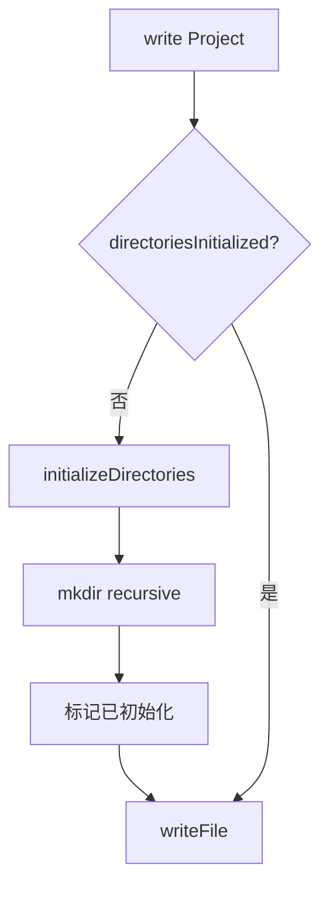

# D03：第一次保存前，目录是怎样出现的

课程助手第一次保存时，`data/`、`projects/` 可能尚不存在。每个业务服务若各自创建目录，会重复 I/O 逻辑并产生不同错误处理。目录初始化因此属于 `JsonStore` 的基础设施责任。

 [ensureInitialized（第 49-53 行）](../../../../packages/core/src/lib/storage/json-store.ts#L49) 用 `directoriesInitialized` 控制首次初始化。 [write（第 100-113 行）](../../../../packages/core/src/lib/storage/json-store.ts#L100) 在写文件前调用它； [initializeDirectories（第 58-75 行）](../../../../packages/core/src/lib/storage/json-store.ts#L58) 对 data root、interviews、ontology、chats、projects 逐一执行 `fs.mkdir(dir, { recursive: true })`。

图中的布尔值只表示当前进程是否已经执行过初始化，不表示磁盘目录永久存在。重启应用后它会回到 `false`；但递归创建目录可安全重复执行。`recursive: true` 允许父目录缺失，不等于吞掉所有错误。目录创建失败会被记录；随后写入若失败，错误仍应交给上层处理。

项目服务还在 [第 96-101 行](../../../../packages/core/src/lib/features/services/project-service.ts#L96) 创建 `projects/{id}/files`。这与 `JsonStore` 的通用目录不同：前者是一个项目的业务工作目录，后者是所有 JSON 分类数据的基础目录。

### 练习与验收

说明为什么 `directoriesInitialized` 不能存进 JSON 文件；再区分基础设施目录与课程助手项目的 `files` 目录。下一章讨论目录存在后，读取缺失文件、损坏 JSON 和 I/O 错误为何必须分开处理。
