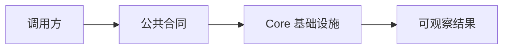

# D11：本体、访谈与解决方案类型

## 核心问题

复杂业务为何先从领域类型读起？

## 现象与原理

领域、概念、实例和关系构成本体数据骨架；访谈和解决方案类型记录生成过程与结果。先读类型可建立名词边界，再读服务可理解状态如何变化。

图从左到右表示责任传递：调用方提出需求，公共合同限定可用形状，Core 实现基础能力，结果回到上层。图刻意不让调用方直接跳进内部细节；这正是可替换性和测试隔离的来源。

## 源码入口

- [本章入口（第 1 行）](../../../../packages/core/src/types/ontology.ts#L1)

阅读时先定位本章的类型、函数或出口，再追它的调用方。不要把同目录文件默认当作同一层 API；是否公开要由对应的 `index.ts` 和导入路径证明。

## 失败路径

若调用方绕过公共合同、把运行时实现塞进共享类型，或把底层错误吞成默认值，系统会在替换运行环境、测试隔离或数据演进时失去边界。先明确“谁负责解释错误、谁负责决定用户体验”。

## 练习与验收

1. 从源码找出本章提到的关键类型或函数。
2. 写出它的一个输入、一个输出和一个不能由它负责的上层决策。
3. 说明若删除这一层边界，哪一个包或测试会被迫依赖不该知道的实现。

验收标准：能够用真实路径说明该机制的责任、调用方向和至少一种失败后果。

