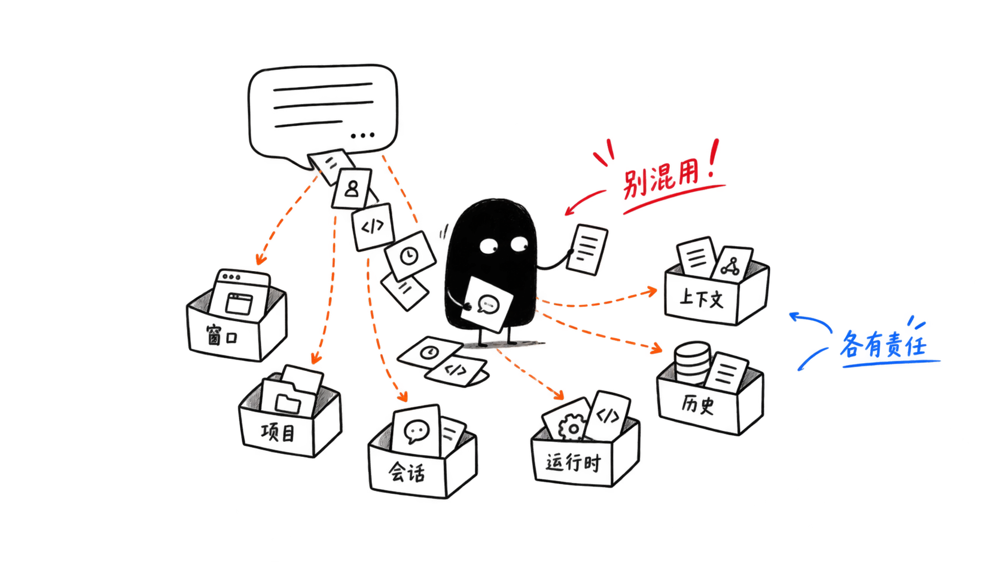
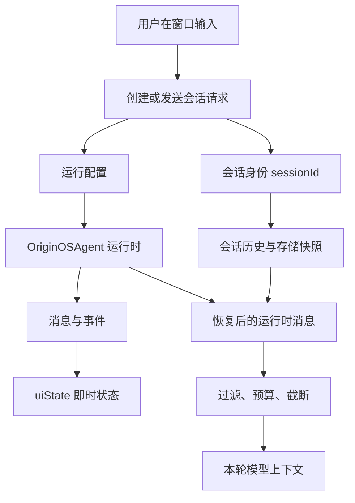
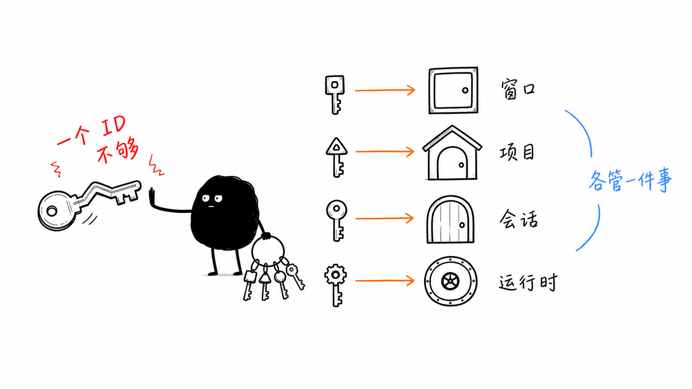
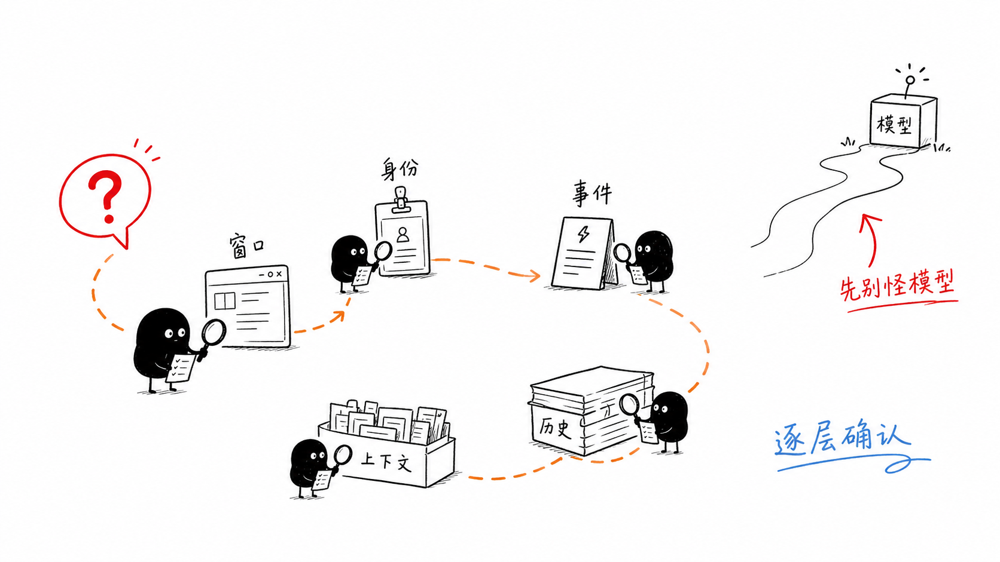
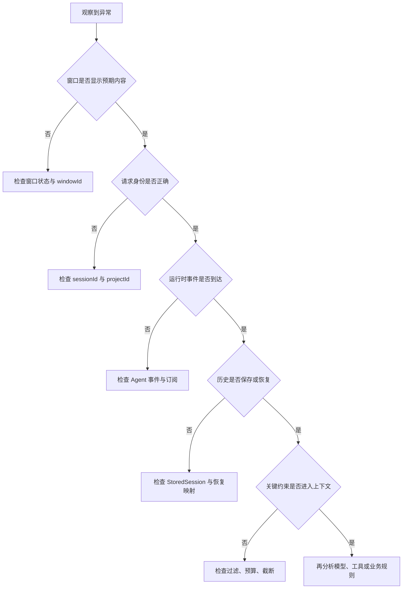

# 单元总览与复盘一：一段 Agent 对话究竟由什么组成（E01—E08）

小林打开旅行助手，输入：“两个同学、五天、预算不超过 8 000 元，第三天不要连续爬山。”几分钟后，窗口里出现了酒店查询、行程建议和一段助手回复。第二天，小林重新打开项目，又问：“把第三天改得轻松一些。”

从用户视角看，这只是一个聊天框。但从系统视角看，它不是一个简单的“问一句、答一句”。它至少同时经过窗口、项目、会话、运行配置、消息轮次、工具事件、持久化历史、恢复映射和模型上下文。

本单元小结要解决一个问题：读者如何把这些对象放进同一张清晰的认知地图，并在出现异常时知道应该从哪一层开始排查。



## 0. 本页先读什么

如果只记住一句话，记住这一句：

> 一段 Agent 对话不是一个聊天气泡，而是一组分层对象共同完成的过程。

这句话拆开看，有三层含义：

1. 文字出现在页面上，不等于模型已经读到。
2. 历史文件中保存过某句话，不等于这一轮上下文一定包含它。
3. 窗口、项目、会话和运行时都有 ID，但它们不是同一种身份。

阅读本页可以按下面的顺序：

| 阅读阶段 | 重点问题 | 对应章节 |
| --- | --- | --- |
| 建立总图 | 一句话从用户输入到模型上下文，中间经过哪些层？ | 第 1、2 节 |
| 分清对象 | 哪些概念最容易混用？ | 第 3 节 |
| 对回课程 | 八节课分别补上链路中的哪一段？ | 第 4 节 |
| 查证源码 | 哪些源码已经在本单元直接讲过，哪些留到后面？ | 第 5 节 |
| 练习排查 | 看到异常时，应按什么顺序判断？ | 第 6—9 节 |

这不是为了让读者背目录，而是为了形成一个稳定的判断顺序：先判断对象，再判断边界，最后才判断模型效果。

## 1. 同一句话会落在不同层

小林说“把第三天改得轻松一些”时，系统里可能同时出现很多事实。初学者最容易犯的错误，是把这些事实都理解成“Agent 已经知道了这句话”。

更准确的说法是：同一句话可能停在不同层，每一层能证明的事情都不同。

| 看到的现象 | 所在层 | 它能证明什么 | 它不能证明什么 |
| --- | --- | --- | --- |
| 输入框或历史区出现这句话 | UI 展示层 | 页面拿到了这段文字 | 服务端已经收到 |
| 请求里带着 `sessionId` | 会话请求层 | 调用方希望把文字归入某段会话 | 会话创建或发送一定成功 |
| `OriginOSAgent` 开始处理 | 运行时层 | 当前进程中有 Agent 在工作 | 历史已经写盘 |
| `isThinking` 变成 `true` | 即时状态层 | 某一轮处理尚未结束 | 模型在展示可解释的思维过程 |
| 历史文件含有旧预算 | 持久化层 | 旧约束有恢复机会 | 旧约束一定进入本轮模型输入 |

这张表的关键不是字段名，而是“能证明什么”和“不能证明什么”的分界。技术排查经常出错，不是因为看不到现象，而是因为从一个现象推出了它无法证明的结论。

例如，历史文件里保存着“预算不超过 8 000 元”，只能说明这句话曾经进入持久化材料。它还需要被恢复成运行时消息，再经过上下文选择，才可能成为本轮模型输入。中间任一环节都可能让它暂时不可见。

## 2. 一段对话的主路径

下面这张图只回答一个问题：从小林输入旅行约束，到模型这一轮真正看见材料，中间经过哪些对象？



可以把它分成四段读。

第一段是入口：用户输入发生在窗口里，但窗口只是可见容器。真正进入 Agent 链路，需要创建或发送会话请求。

第二段是运行：请求里带着 `sessionId` 和运行配置。`sessionId` 用来说明这段话属于哪段连续对话；运行配置决定 Agent 用什么提示词、模型、工具和项目上下文工作。

第三段是过程：`OriginOSAgent` 处理消息时会产生事件。事件会影响 `uiState`，于是窗口可以显示“正在思考”或活动工具。但这些状态是当前进程内的即时状态，不等于持久化事实。

第四段是上下文：历史快照可以保存和恢复，但恢复后的消息还要经过过滤、预算和截断。模型本轮真正读取的是最后的上下文子集，不是全部历史。

这张图建立了本单元最重要的底层判断：页面、请求、运行时、历史、上下文是连续关系，但不是同一个对象。

## 3. 四组最容易混淆的对象

本单元的主要难点，不在于某个 API 名字，而在于几组对象长得相似、都出现在“对话”附近，却承担完全不同的责任。



### 3.1 窗口、项目、会话、运行时

这一组回答“这段对话属于哪里、显示在哪里、由谁处理”。

| 对象 | 负责什么 | 典型字段 | 常见误解 |
| --- | --- | --- | --- |
| 窗口 | 当前显示容器、位置、焦点 | `windowId` | 关闭窗口等于删除会话 |
| 项目 | 长期工作归属和项目路径 | `projectId` | 一个项目只能有一段会话 |
| 会话 | 连续消息历史和当前选择 | `sessionId`、`currentSessionId` | 会话 ID 可以替代窗口 ID |
| 运行时 | 当前进程中正在处理的 Agent 实例 | `OriginOSAgent` 状态 | 运行时存在就表示历史已保存 |

源码中也能看到这种分工。窗口状态在 [appWindowStore.ts](../../../../packages/web/src/store/appWindowStore.ts#L23) 中管理，重点是 `windows`、`windowOrder` 和 `focusedWindowId`。会话快照在 [session-store.ts](../../../../packages/core/src/lib/integrations/pi-agent/session-store.ts#L16) 中管理，重点是 `StoredSession` 和 `currentSessionId`。

这两个文件不在同一层，也不管理同一种身份。把它们混起来，会直接导致“关窗口是否删会话”“切项目是否切会话”“当前会话是否等于当前窗口”这些问题无法判断。

### 3.2 消息、轮次、事件、即时状态

这一组回答“一次请求正在怎样发生”。

| 对象 | 它记录什么 | 重启后是否应原样保留 |
| --- | --- | --- |
| 消息 | 用户、助手或工具结果的内容 | 可以作为历史材料 |
| 轮次 | 围绕一次用户请求的处理过程 | 不应当作持久进度 |
| 事件 | 运行时过程通知，例如工具开始或结束 | 通常不直接当历史 |
| `uiState` | 事件归纳出的当前 UI 状态 | 不应照搬到下一次启动 |

一条消息可能会被保存；一次轮次则是处理过程。事件告诉 UI “现在发生了什么”；`uiState` 是这些事件在当前进程中的归纳结果。

事件到状态的核心处理位于 [agent.ts](../../../../packages/core/src/lib/integrations/pi-agent/core/agent.ts#L947)。`turn_start` 会进入思考状态，工具开始和结束会更新活动工具列表，`turn_end` 和异常路径会清理状态。它们能解释为什么窗口显示“正在思考”，但不能证明业务任务已经完成。

### 3.3 完整历史、恢复材料、本轮上下文

这一组回答“模型这一轮到底看见了什么”。

| 材料 | 用途 | 与完整历史的关系 |
| --- | --- | --- |
| 存储快照 | 用于保存、展示、审计和后续恢复 | 尽量保留历史材料 |
| 恢复后的运行时消息 | 用于让 Agent 继续处理旧材料 | 需要经过映射 |
| 本轮模型上下文 | 用于组成当前模型请求 | 只是被选中的子集 |

“历史里有”不是“模型看见了”。长会话里，`convertToLlm` 会过滤角色、预留输出空间、估算 token、限制超长单条消息，再从最新消息向前保留。对应源码是 [agent.ts](../../../../packages/core/src/lib/integrations/pi-agent/core/agent.ts#L325)。

这里要特别注意：当前实现使用 `chars / 3` 做近似估算。它是实现中的启发式规则，不是供应商模型的精确分词器。教材需要讲清这个事实，不能把估算写成模型层面的精确保证。

### 3.4 公共类型、存储快照、适配器消息

这一组回答“为什么同一段对话有多种数据形状”。

| 结构 | 使用边界 | 不能直接替代什么 |
| --- | --- | --- |
| `CreateSessionRequest` | 请求创建会话 | 已经存在的完整会话 |
| `AgentSession` | 公共业务会话合同 | 当前存储快照 |
| `AgentSessionData` | 文件封装格式 | 运行时实例 |
| `StoredSession` | `SessionStore` 当前快照 | 公共会话的无损副本 |
| `PersistedRuntimeMessage` | 恢复运行时消息的最小材料 | 完整适配器消息 |

这些类型都和“对话”有关，但使用边界不同。`AgentSession` 使用 `sessionId`，`StoredSession` 使用 `id`；恢复历史时， [runtime-history.ts](../../../../packages/core/src/lib/integrations/pi-agent/core/runtime-history.ts#L8) 还会把持久化文本补成适配器需要的运行时消息。

所以，类型名相近不代表可以互相赋值。安全的做法是通过明确转换函数处理字段改名、默认值、丢失语义和兼容测试。

## 4. 八节课连成一条因果链

E01—E08 不是八个孤立知识点。它们按“从可见窗口到模型上下文”的顺序，一层一层补上判断能力。

| 课次 | 本课解决的判断问题 | 核心源码锚点 | 学完后的判断能力 |
| --- | --- | --- | --- |
| E01 | 窗口出现后，何时才跨过客户端到 Agent 的边界 | [client-hooks.ts](../../../../packages/core/src/lib/integrations/pi-agent/client-hooks.ts#L210) | 能区分窗口渲染、会话请求和 Agent 工作 |
| E02 | 启动 Agent 前为什么需要配置包 | [types.ts](../../../../packages/core/src/lib/integrations/pi-agent/types.ts#L203) | 能区分用户输入、提示词、模型、工具和项目上下文 |
| E03 | 一次用户请求为什么不是一个聊天气泡 | [agent.ts](../../../../packages/core/src/lib/integrations/pi-agent/core/agent.ts#L963) | 能区分消息、轮次、工具调用和事件 |
| E04 | “正在思考”由什么事实决定 | [agent.ts](../../../../packages/core/src/lib/integrations/pi-agent/core/agent.ts#L947) | 能判断 `isThinking` 是即时状态，不是持久结论 |
| E05 | 多个 ID 为什么不能混用 | [session-store.ts](../../../../packages/core/src/lib/integrations/pi-agent/session-store.ts#L179) | 能区分窗口、项目、会话和当前会话指针 |
| E06 | 完整历史为什么不会原样进入模型 | [agent.ts](../../../../packages/core/src/lib/integrations/pi-agent/core/agent.ts#L325) | 能解释上下文选择、预算和截断 |
| E07 | 同一段对话为什么有多种类型形状 | [runtime-history.ts](../../../../packages/core/src/lib/integrations/pi-agent/core/runtime-history.ts#L57) | 能识别类型转换边界和字段差异 |
| E08 | 不连接真实模型怎样验证会话骨架 | [session-store.test.ts](../../../../packages/core/src/lib/integrations/pi-agent/__tests__/session-store.test.ts#L83) | 能用测试和纸面推演验证基础会话结构 |

这条链的停止边界也要清楚。E01—E08 还没有详细讲浏览器怎样发送 HTTP 请求、服务端怎样创建 Agent、流式事件怎样回到 UI。那些问题进入后续网络与流式单元再展开。

当前单元先把对象边界打牢。边界清楚以后，再看 API、流、窗口刷新和模型响应，读者才不会把所有问题都混成“Agent 失效”。

## 5. 源码覆盖台账

源码台账的作用，是防止“概念讲过”被误写成“源码已经覆盖”。阅读这张表时，只看三件事：哪个文件已直接精读，证据来自哪里，还有哪些边界没有被证明。

| 课次 | 已直接精读的生产源码 | 配对测试或验证入口 | 本单元只证明什么 |
| --- | --- | --- | --- |
| E01 | [client-hooks.ts](../../../../packages/core/src/lib/integrations/pi-agent/client-hooks.ts)、[hooks.ts](../../../../packages/core/src/lib/integrations/pi-agent/hooks.ts)、[app-window.ts](../../../../packages/core/src/types/app-window.ts) | [client-hooks-session-isolation.test.ts](../../../../packages/core/src/lib/integrations/pi-agent/__tests__/client-hooks-session-isolation.test.ts)；窗口类型暂无配对测试 | Hook 出口、窗口配置、窗口身份 |
| E02 | [types.ts](../../../../packages/core/src/lib/integrations/pi-agent/types.ts)、[llm-config.ts](../../../../packages/core/src/lib/integrations/pi-agent/llm-config.ts)、[config.ts](../../../../packages/core/src/lib/integrations/pi-agent/config.ts) | 配置归一化和真实供应商连通性仍需后续测试 | 运行配置合同、归一化、配置存在性检查 |
| E03 | [agent.ts](../../../../packages/core/src/lib/integrations/pi-agent/core/agent.ts)、[message.ts](../../../../packages/core/src/lib/integrations/pi-agent/message.ts)、[display-content.ts](../../../../packages/core/src/lib/integrations/pi-agent/display-content.ts) | [agent.test.ts](../../../../packages/core/src/lib/integrations/pi-agent/core/__tests__/agent.test.ts)、[message.test.ts](../../../../packages/core/src/lib/integrations/pi-agent/__tests__/message.test.ts) | 一轮处理、协议工具、展示文本边界 |
| E04 | [agent.ts](../../../../packages/core/src/lib/integrations/pi-agent/core/agent.ts) 的事件窗口、[tool-event-status.ts](../../../../packages/core/src/lib/integrations/pi-agent/core/tool-event-status.ts) | [agent.test.ts](../../../../packages/core/src/lib/integrations/pi-agent/core/__tests__/agent.test.ts)、[tool-event-status.test.ts](../../../../packages/core/src/lib/integrations/pi-agent/core/__tests__/tool-event-status.test.ts) | 事件到即时状态、工具失败结果归一化 |
| E05 | [session-store.ts](../../../../packages/core/src/lib/integrations/pi-agent/session-store.ts)、[appWindowStore.ts](../../../../packages/web/src/store/appWindowStore.ts)、[AppWindowManager.ts](../../../../packages/web/src/services/AppWindowManager.ts) | [session-store.test.ts](../../../../packages/core/src/lib/integrations/pi-agent/__tests__/session-store.test.ts)；窗口管理联动暂无配对测试 | 三类 ID、当前会话指针、关闭窗口与运行时销毁边界 |
| E06 | [agent.ts](../../../../packages/core/src/lib/integrations/pi-agent/core/agent.ts) 的上下文窗口 | [agent.test.ts](../../../../packages/core/src/lib/integrations/pi-agent/core/__tests__/agent.test.ts)；上下文裁剪暂无直接断言 | 角色过滤、token 预算、单条截断、尾部保留 |
| E07 | [types/agent.ts](../../../../packages/core/src/types/agent.ts)、[runtime-history.ts](../../../../packages/core/src/lib/integrations/pi-agent/core/runtime-history.ts)、[index.ts](../../../../packages/core/src/lib/integrations/pi-agent/index.ts) | [runtime-history-restore.test.ts](../../../../packages/core/src/lib/integrations/pi-agent/core/__tests__/runtime-history-restore.test.ts)、[session-store.test.ts](../../../../packages/core/src/lib/integrations/pi-agent/__tests__/session-store.test.ts) | 公共类型、恢复映射、公共导出边界 |
| E08 | 不新增生产逻辑；复用上述会话与恢复边界 | [session-store.test.ts](../../../../packages/core/src/lib/integrations/pi-agent/__tests__/session-store.test.ts)、[message.test.ts](../../../../packages/core/src/lib/integrations/pi-agent/__tests__/message.test.ts)、[tool-event-status.test.ts](../../../../packages/core/src/lib/integrations/pi-agent/core/__tests__/tool-event-status.test.ts) | 将已读源码转成可验证的会话骨架 |

本单元相邻但尚未精读的文件也要明说。`session-restore.ts`、`client.ts`、`store.ts` 属于后续会话恢复与客户端请求链路；`server.ts`、`server-config.ts` 属于服务端创建与流式通信；`stream-dedupe.ts`、`stream-render-scheduler.ts` 属于流式稳定性；`core/index.ts` 需要结合 Skills 能力再讲。

这不是遗漏，而是边界管理。一个单元必须知道自己讲到哪里，也必须知道哪里还没有讲。

## 6. 异常排查：先定位层，再判断模型

当小林说“旅行助手不对劲”时，最稳的排查方式不是直接分析模型质量，而是沿着对象层级逐步确认。





这张图可以变成实际排查口诀：

1. 页面没显示，先看窗口和组件。
2. 会话串了，先看 `sessionId` 和 `projectId`。
3. 状态不变，先看事件和订阅。
4. 历史丢了，先看存储和恢复。
5. 历史还在但模型没遵守，先看上下文选择。
6. 前面都成立，再看模型、工具和业务规则。

这套顺序能避免一个常见误判：只要 AI 回复不符合预期，就把问题归到模型。实际上，很多问题在模型之前已经发生。

## 7. 纸面复盘实验

下面这个实验不需要连接真实模型。它的目标是让读者用一组材料，重建一次会话事实链。

```text
projectId        = project-graduation-trip
windowId         = trip-window-1
sessionId        = trip-hotels
currentSessionId = trip-hotels
用户消息          = 第三天不要安排连续爬山
运行事件          = turn_start -> tool_execution_start -> tool_execution_end -> turn_end
历史中的早期约束  = 总预算不超过 8 000 元
```

合格推演应包含下面五个判断：

| 材料 | 应得出的判断 |
| --- | --- |
| `projectId` | 消息属于毕业旅行项目，但它不是会话键 |
| `windowId` | 消息显示在某个窗口中，但窗口不拥有会话历史 |
| `sessionId` | 这段消息属于某段连续会话 |
| `currentSessionId` | 当前选中的会话是 `trip-hotels`，前提是该会话已存在 |
| 运行事件 | `turn_end` 结束即时处理状态，但不等于持久化一定完成 |
| 历史约束 | 预算在历史材料中存在，但仍可能没有进入本轮模型上下文 |

如果能把每一行都说清楚，并且能补一句“它不能证明什么”，就说明本单元的核心框架已经建立。

## 8. 测试证据的读法

本单元的测试证据都只是局部证据。它们很重要，但不能被扩大成端到端承诺。

| 测试入口 | 已经证明 | 没有证明 |
| --- | --- | --- |
| [client-hooks-session-isolation.test.ts](../../../../packages/core/src/lib/integrations/pi-agent/__tests__/client-hooks-session-isolation.test.ts) | 多个 Hook 会话的初始化与流事件可按 session 隔离 | 真实浏览器与远程模型服务一定连通 |
| [agent.test.ts](../../../../packages/core/src/lib/integrations/pi-agent/core/__tests__/agent.test.ts) | Agent 初始状态、基础生命周期和部分事件路径 | 每个事件分支的完整 UI 状态机 |
| [session-store.test.ts](../../../../packages/core/src/lib/integrations/pi-agent/__tests__/session-store.test.ts) | 创建、选择、删除、重命名和基础转换 | 项目删除、窗口关闭、运行中请求之间的跨层协同 |
| [runtime-history-restore.test.ts](../../../../packages/core/src/lib/integrations/pi-agent/core/__tests__/runtime-history-restore.test.ts) | 部分模型下助手历史可补成运行时消息 | 工具角色、异常 API、损坏文件的完整恢复策略 |

读测试时保持三个问题：

1. Given：测试先准备了什么数据？
2. When：测试触发了什么动作？
3. Then：测试最后断言了什么结果？

只要测试没有跨过某条边界，教材就不能替它承诺那条边界已经可靠。

## 9. 口头验收

学完 E01—E08 后，不看正文也应能回答下面八个问题：

1. 为什么窗口出现、会话创建、Agent 处理消息不是同一个动作？
2. `windowId`、`projectId`、`sessionId` 分别标识什么？
3. 为什么用户一句话不能替代系统提示词、模型、工具和项目上下文？
4. 消息、轮次、事件、`uiState` 的区别是什么？
5. 为什么 `isThinking` 不应被当作重启后的历史事实？
6. 为什么历史文件中有预算约束，模型本轮仍可能没有遵守？
7. `AgentSession`、`StoredSession` 和适配器消息为什么不能凭名称相似直接互换？
8. 会话显示异常时，为什么要先定位窗口、身份、事件、历史和上下文，再分析模型？

合格回答不要求背诵源码行号，但必须能说出字段名、对象责任和边界。能说清“不能证明什么”，比只说清“是什么”更重要。

## 10. 进入下一单元

E01—E08 建立的是会话内部对象的基本地图。下一组课程会继续追踪这些对象怎样跨越浏览器与服务端：客户端如何创建或读取会话，消息如何发送，服务端如何组织 Agent 事件流，UI 又如何持续接收并显示结果。

因此，本单元的结论可以压缩成一句话：

> 先分清对象，再追踪数据；先确认边界，再判断模型。

这句话会在后续网络、流式传输、会话恢复、工具系统和 Skills 单元里继续使用。
