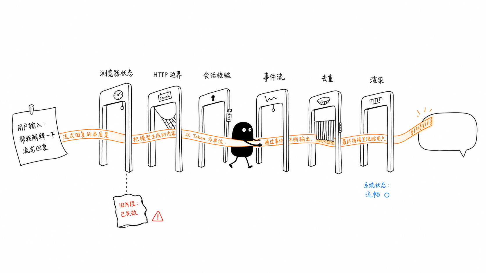
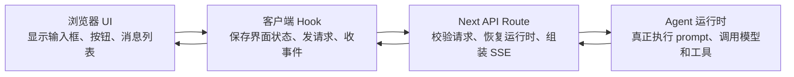
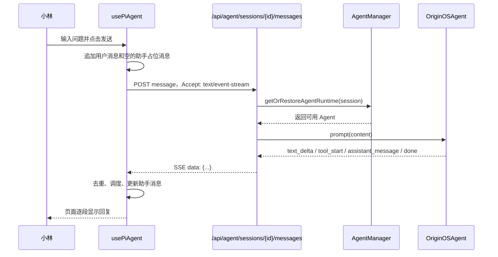

# 单元导读二：客户端、服务端与流式消息（E09-E20）

这一组课回答一个非常具体的问题：小林在旅行规划窗口里输入“帮我做一份三天两晚的路线”，点击发送之后，为什么页面不是等很久才一次性出现完整答案，而是能一段一段地显示？如果她中途点“停止”，为什么旧的片段不会继续追加到新的回复里？如果同时打开两个 Agent 窗口，为什么 A 窗口的回复不会跑到 B 窗口？

本单元的核心判断是：

> 流式对话不是“前端把字符串慢慢打出来”，而是浏览器、传输层、服务端会话、Agent 运行时、事件流、去重器、渲染调度器共同完成的一条跨边界链路。

如果只看聊天框，读者会觉得它只是一个输入框和一串气泡；如果只看服务端，读者又会忽略浏览器里有大量状态保护。本单元要把两边连起来，让读者第一次完整理解“一条回复怎样从请求变成事件，再变成屏幕上的文字”。

## 0. 本单元的阅读路线

E09-E20 分成六个小阶段。每个阶段都只解决一个问题，但合起来就是一轮流式发送的完整链路。

| 阶段 | 课号 | 读者要解决的问题 | 关键源码 |
| --- | --- | --- | --- |
| 边界 | E09-E10 | 浏览器拥有什么，服务端拥有什么？一次会话怎样跨过第一个 HTTP 边界？ | `client-hooks.ts`、`agent-session.ts`、`sessions/route.ts` |
| 发送 | E11-E12 | 为什么发送消息有普通 JSON 和 SSE 流式两条路径？服务端为什么要先恢复运行时再执行 prompt？ | `client-hooks.ts`、`messages/route.ts`、`agent-manager.ts` |
| 事件 | E13-E14 | SSE 事件是什么？Web 两座桥与 Electron IPC 桥为什么能给前端近似一致的事件？ | `messages/route.ts`、桌面 `agent-session-service.ts`、`stream-event-batcher.ts` |
| 前端合并 | E15-E16 | 模型或运行时发来重复片段时如何去重？高频片段为什么不能每次都直接 setState？ | `stream-dedupe.ts`、`stream-render-scheduler.ts` |
| 隔离与停止 | E17-E18 | 多窗口、多会话、旧流、停止生成、关闭窗口之间怎样互不污染？ | `client-hooks.ts`、`agent-session.ts`、`abort/route.ts`、`destroy/route.ts` |
| 故障与验收 | E19-E20 | HTTP 错误、SSE 错误、最终消息缺失、测试覆盖和剩余风险怎样判断？ | `messages/route.ts`、相关测试 |

读这一组时，建议始终带着同一个场景：小林连续问旅行规划 Agent 三个问题。第一问创建会话，第二问进入流式回复，第三问中途停止后重新发送。这样每个概念都不会孤立。

## 1. 先分清四个位置

一轮流式对话至少经过四个位置：

这张图最重要的不是箭头数量，而是边界：

- UI 不直接拥有 Agent 运行时。UI 只知道“现在有没有初始化”“有没有正在流式生成”“消息列表该怎样显示”。
- 客户端 Hook 不直接调用模型。它负责把输入包装成请求，并把服务端返回的事件翻译成前端状态。
- API Route 不负责展示。它负责校验会话归属、找到或恢复 Agent、把运行时事件变成 HTTP/SSE 响应。
- Agent 运行时不关心 React 状态。它只负责执行一轮对话，并不断发出事件。

只要这四个位置混淆，读源码就会立刻走偏。例如，看到 `messages` 这个词时，不能马上断言“这就是磁盘上已经保存的消息”。前端也有 `messages`，服务端会话也有 `messages`，运行时内部也有历史消息。它们相关，但不完全等价。

## 2. 一条流式回复的主路径

小林点击发送后，主路径可以压成这条链：

这里有三个容易被初学者忽略的事实。

第一，前端会先放一个“助手占位消息”。所以用户会立刻看到 Agent 正在回答，而不是等服务端返回完整消息后才新增气泡。

第二，服务端会在真正 prompt 之前恢复运行时。否则一个已经存在的会话重新打开后，下一轮 prompt 可能看不到历史上下文。

第三，SSE 发回来的不是“完整文章”，而是一批带类型的事件。`text_delta` 只代表“这次新出现的一段文字”，`assistant_message` 更接近“最终助手消息”，`done` 才代表这一轮事件流结束。

## 3. 本单元必须区分的对象

| 对象 | 初学者常见误解 | 本单元采用的准确理解 |
| --- | --- | --- |
| `sessionId` | 一个窗口的名字 | 服务端生成并识别一段会话的核心身份，前端后续请求必须带它 |
| `projectId` | 只是项目字段 | 会话归属和数据隔离字段，API 会用它确认请求是不是访问了正确会话 |
| `entryType` / `entryId` | 可有可无的 UI 信息 | 标识这段会话来自 skill、agent 还是 role-agent，恢复和归属校验会依赖它 |
| `streamId` | 前端临时字符串 | 一轮流式生成的身份，防止旧流事件追加到新流 |
| `AbortController` | 停止按钮的 UI 状态 | 浏览器侧真正中断当前 fetch 或当前活动流的机制 |
| `agentId` | 等同于 `sessionId` | 中断运行中 Agent 时使用的运行时定位字段，在不同模式下可能需要映射 |
| `text_delta` | 一条完整回复 | 一次可见增量，可能是纯新增，也可能来自累计帧，需要去重 |
| `assistant_message` | 普通气泡事件 | 服务端或运行时给出的最终助手内容，前端需要用它校准已显示文本 |

本单元的每节课都会回到这些对象。只背名字没有意义；要能说出它们在哪个文件出现、由谁创建、传给谁、错了会造成什么问题。

## 4. 源码覆盖台账

这一组课的源码范围如下。表中的每项都对应后续代码窗口，不能用主题相近或文件名出现代替实际调用链。

| 课号 | 主题 | 主要源码 |
| --- | --- | --- |
| E09 | 浏览器不是 Agent 运行时 | `packages/core/src/lib/integrations/pi-agent/client-hooks.ts`、`packages/core/src/lib/integrations/electron/services/agent-session.ts` |
| E10 | 创建会话跨过第一个 HTTP 边界 | `client-hooks.ts`、`agent-session.ts`、`packages/web/src/app/api/agent/sessions/route.ts` |
| E11 | 普通消息与流式消息两条发送路径 | `client-hooks.ts`、`packages/web/src/app/api/agent/sessions/[sessionId]/messages/route.ts` |
| E12 | 服务端消息 route 的校验、恢复与 prompt | `messages/route.ts`、`agent-manager.ts` |
| E13 | SSE 事件流的格式与事件词汇 | `messages/route.ts`、`client-hooks.ts` |
| E14 | Web Runtime/in-process 桥与 Electron IPC 桥 | `messages/route.ts`、`abort/route.ts`、renderer `agent-session.ts`、桌面 `agent-session-service.ts`、`stream-event-batcher.ts`、`assistant-stream-state.ts` |
| E15 | 流式文本去重与最终消息校准 | `stream-dedupe.ts`、`client-hooks.ts`、`stream-dedupe.test.ts` |
| E16 | 流式渲染调度 | `stream-render-scheduler.ts`、`client-hooks.ts`、`stream-render-scheduler.test.ts` |
| E17 | 会话隔离、流身份与旧事件防护 | `client-hooks.ts`、`agent-session.ts`、`client-hooks-session-isolation.test.ts` |
| E18 | 停止、销毁与保留会话数据 | `client-hooks.ts`、`agent-session.ts`、`abort/route.ts`、`sessions/destroy/route.ts`、`sessions/[sessionId]/destroy/route.ts` |
| E19 | 错误传播与降级边界 | `client-hooks.ts`、`agent-session.ts`、`messages/route.ts` |
| E20 | 综合走读与验收 | 本单元全部源码与测试 |

这张台账同时也说明哪些文件暂时不展开。`session-store.ts`、`session-restore.ts` 的完整恢复流程和更多持久化细节会放到 E21-E30；`tools/` 目录会放到 E41-E55；认知系统会放到后续 Part 或后续专题。但有两个辅助文件会在本单元做局部精读：

- `packages/core/src/lib/integrations/pi-agent/session-restore.ts`：只读它在消息 route 中承担的会话归属校验和错误转换，不展开完整恢复设计。
- `packages/core/src/lib/integrations/pi-agent/display-content.ts`：只读它怎样把模型内容清洗成可展示文本，尤其是隐藏 reasoning 的处理。

## 5. 代码窗口级台账

为了避免“列了文件名但没有真正读源码”，本单元还需要按代码窗口阅读。

| 代码窗口 | 要读的源码位置 | 本单元要掌握的点 |
| --- | --- | --- |
| 客户端状态窗口 | `client-hooks.ts` 的 `SessionState`、全局 Map、`useRef` 状态 | 哪些状态属于 UI，哪些状态属于流式控制 |
| 初始化窗口 | `initializeSession`、`initialize` | `entryType` / `entryId` 怎样推导，服务端返回的 `sessionId` 怎样写回 |
| 传输窗口 | `agent-session.ts` 的 `createAgentSession`、`sendAgentMessage`、`sendAgentMessageStream`、`subscribeAgentEvents`、`abortAgentSession`、`destroyAgentSession` | Web fetch 与 Electron IPC 如何被统一成同一种能力 |
| 消息入口窗口 | `messages/route.ts` 的 POST 前半段 | content 校验、session 查找、归属校验、运行时恢复、用户消息写入 |
| SSE 分派窗口 | `messages/route.ts` 的 `createEventStream` | Runtime 模式与 in-process 模式怎样分派 |
| Runtime 桥接窗口 | `createRuntimeEventStream` | queue、waiter、eventInterceptor、promptSent、done 怎样合作 |
| in-process 桥接窗口 | `createInProcessEventStream` | agent.subscribe、message_update、tool_execution、message_end、agent_end 怎样变成 SSE |
| Electron IPC 桥窗口 | 桌面 `AgentSessionService` 的 MESSAGE_STREAM handler | invoke 启动确认、会话校验、AGENT_EVENT、批处理、最终消息和 done 怎样协作 |
| IPC 批处理窗口 | `stream-event-batcher.ts`、renderer `coalesceAgentEventBatch` | 首字延迟、32ms/16KB 阈值、事件顺序与两级合并 |
| 去重窗口 | `stream-dedupe.ts` | 纯增量、累计帧、重叠片段、最终消息、尾部重复怎样处理 |
| 渲染窗口 | `stream-render-scheduler.ts` | schedule、finish、flush、cancel、UTF-16 安全边界 |
| 停止窗口 | `client-hooks.ts` 的 `abort` / `destroy` 与 API abort/destroy route | 停止当前流、销毁运行时、保留会话数据的差异 |
| 测试窗口 | 三个测试文件 | 测试证明了什么，没有证明什么 |

后续 E09-E20 每节都要至少落到一个这样的代码窗口。读者不需要一次记住所有实现，但必须知道“某个行为应该去哪段代码里找证据”。

## 6. 学完这一组后的判断能力

完成 E09-E20 后，读者应该能回答以下问题：

- 为什么一次发送之前必须先有服务端认可的 `sessionId`？
- 为什么客户端要同时保存 `activeStreamIdRef`、`activeStreamSessionIdRef` 和 `AbortController`？
- 为什么服务端在 `/messages` route 里要做会话归属校验？
- 为什么 Electron 的 `{ started: true }` 不是本轮回答已经完成？
- 为什么 Web SSE 与 Electron IPC 应统一事件语义，却不能假定启动、中断和收尾实现完全相同？
- 为什么 SSE 里的 `data: {...}\n\n` 不是普通 JSON 响应？
- 为什么流式回复需要 `appendStreamDelta` 和 `reconcileFinalStreamContent`？
- 为什么不能每收到一个字符就无节制地更新 React 状态？
- 为什么 `abort`、`destroy`、`delete session` 是三件不同的事？
- 哪些测试已经覆盖了串流、旧事件、重复片段、渲染节流，哪些地方还需要集成验收？

如果读者能带着源码说清这些问题，就不只是“会用聊天框”，而是初步掌握了 Pi Agent 运行时的客户端与服务端协作模型。

## 7. 与下一单元的关系

E09-E20 只证明一轮消息能够可靠地跨边界运行：前端能发出去，服务端能处理，事件能回来，页面能安全显示。下一组 E21-E30 会继续追问：如果刷新页面、关闭窗口、重新打开项目，之前这段会话为什么还能回来？这会进入持久化、恢复和历史重放。
