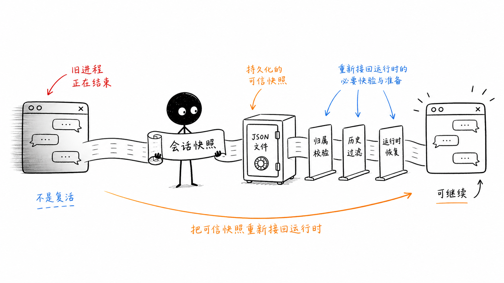
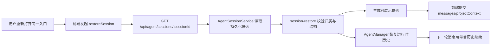
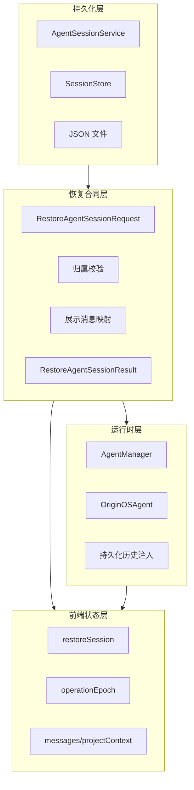

# 单元导读三：会话状态、持久化与恢复（E21-E30）

如果把一次 Agent 对话只理解成“页面上出现了几条消息”，刷新页面之后它就应该消失；如果把它理解成“一个正在运行的进程”，关闭窗口之后它也应该消失。OriginOS 要解决的问题更难：用户关闭窗口、刷新浏览器、甚至服务端 Runtime 缓存被清理之后，再次打开同一个入口时，仍然应该看到可信的历史，并能继续下一轮对话。

本单元的核心判断是：会话恢复不是复活旧进程，而是把一份经过校验的持久化快照重新接回前端状态和 Agent 运行时。

这句话里有四个关键词。

第一，快照。系统不会保存浏览器里的 React state，也不会保存一个活着的 JavaScript 调用栈。它保存的是 `AgentSession` 或 `StoredSession` 这样的数据对象：会话 ID、项目上下文、消息历史、系统提示词、模型配置、更新时间等。

第二，校验。磁盘里有一个 session 文件，不代表任何入口都能恢复它。恢复请求必须携带 `projectId`、`entryType`、`entryId`，服务端要判断这份快照是否属于当前入口，避免把 A 技能的历史恢复进 B 技能。

第三，过滤。磁盘历史不等于页面展示历史。`system` 消息、内部恢复提示、只有 thinking 的 assistant 消息，可能对运行时有意义，但不应该直接显示给用户。恢复结果必须把“可展示消息”从“完整运行历史”里分离出来。

第四，重接。服务端要在返回成功之前把运行时恢复好；前端也要保证只有最新的一次恢复请求能提交状态，不能让一个较晚返回的旧请求覆盖当前会话。

## 1. 本单元要回答的问题

E21-E30 会围绕小林的旅行规划 Agent 继续讲。小林关闭了旅行规划窗口，第二天重新打开，希望继续追问“如果预算再增加 1000 元，路线怎么调整？”这时系统需要同时回答六个问题：

| 问题 | 如果答错会怎样 | 本单元对应课程 |
| --- | --- | --- |
| 关闭窗口是否等于删除会话 | 用户以为历史还在，实际被误删 | E21 |
| 会话到底写到哪里 | 读错目录，列表为空或恢复失败 | E22、E23 |
| 谁有资格恢复这份会话 | A 入口看到 B 入口的历史 | E24 |
| 哪些历史能展示给用户 | 系统提示词、内部消息泄漏到页面 | E25 |
| 恢复结果必须包含什么 | 页面能显示，但下一轮 Agent 失忆 | E26、E27 |
| 多个恢复请求同时发生怎么办 | 旧请求覆盖新会话，消息串台 | E28 |

这张表不是目录摘要，而是学习检查表。读完本单元后，读者应该能拿任意一个“刷新后历史丢失”的 bug，先判断它属于存储、归属、映射、运行时还是前端竞态问题，而不是只说“恢复失败”。

## 2. 从用户动作到运行时恢复的总流程

这条链路有两个并行目标。`F → H` 解决“页面上重新看到历史”；`G → I` 解决“下一轮模型真的知道上文”。只做前者，会得到一个看起来恢复了、实际下一轮失忆的系统；只做后者，运行时能继续，但用户看不到历史，也无法确认自己接在了哪段对话后面。

## 3. 源码阅读窗口

本单元的源码范围按责任划分如下：

| 责任 | 重点源码 | 本单元讲法 |
| --- | --- | --- |
| 公共会话类型 | [packages/core/src/types/agent.ts](../../../../packages/core/src/types/agent.ts) | 解释 `AgentSession`、`CreateSessionRequest`、`UpdateSessionRequest` 的字段责任 |
| 业务会话仓库 | [packages/core/src/lib/features/agent/session-service.ts](../../../../packages/core/src/lib/features/agent/session-service.ts) | 讲创建、保存、读取、更新、列表、摘要、统计 |
| Pi Agent 适配层快照 | [packages/core/src/lib/integrations/pi-agent/session-store.ts](../../../../packages/core/src/lib/integrations/pi-agent/session-store.ts) | 讲 `sessions.json`、`currentSessionId`、缓存与静态映射方法 |
| 恢复合同与校验 | [packages/core/src/lib/integrations/pi-agent/session-restore.ts](../../../../packages/core/src/lib/integrations/pi-agent/session-restore.ts) | 讲归属校验、历史过滤、恢复结果、错误码 |
| 服务端恢复边界 | [packages/web/src/app/api/agent/sessions/[sessionId]/route.ts](<../../../../packages/web/src/app/api/agent/sessions/[sessionId]/route.ts>) | 讲 GET 恢复、PUT 更新、DELETE 删除的边界责任 |
| 摘要与统计接口 | [packages/web/src/app/api/agent/sessions/[sessionId]/summary/route.ts](<../../../../packages/web/src/app/api/agent/sessions/[sessionId]/summary/route.ts>) 、 [packages/web/src/app/api/agent/sessions/[sessionId]/statistics/route.ts](<../../../../packages/web/src/app/api/agent/sessions/[sessionId]/statistics/route.ts>) | 讲管理型读取接口与当前项目路径风险 |
| Electron 会话管理边界 | [packages/desktop/src/main/services/agent-session-service.ts](../../../../packages/desktop/src/main/services/agent-session-service.ts) | 对照 IPC list/create/get/update/delete/destroy/summary/statistics 与 Web Route 的字段、副作用和返回语义 |
| 前端恢复 Hook | [packages/core/src/lib/integrations/pi-agent/client-hooks.ts](../../../../packages/core/src/lib/integrations/pi-agent/client-hooks.ts) | 讲 `restoreSession`、abort、epoch、最新请求提交 |
| 运行时恢复 | [packages/core/src/lib/integrations/pi-agent/agent-manager.ts](../../../../packages/core/src/lib/integrations/pi-agent/agent-manager.ts) | 讲 `restoreAgentRuntime` 与 `replacePersistedMessages` |
| 启动器复用会话 | [packages/core/src/lib/features/services/launcher/base.ts](../../../../packages/core/src/lib/features/services/launcher/base.ts) | 讲有 sessionId 时优先复用已有持久化会话 |
| 测试证据 | `session-restore.test.ts`、`session-store.test.ts`、`client-hooks-session-isolation.test.ts` | 把“应该如此”落到可验证行为 |

读源码时要注意：`session-service.ts` 和 `session-store.ts` 都在“保存会话”，但它们不是同一层。前者是 feature 层的业务会话服务，支持项目目录、列表、摘要与统计；后者是 Pi Agent 适配层的简单快照管理，保存到固定 `data/sessions/sessions.json`，并维护 `currentSessionId`。二者必须分别判断，不能合并成一个万能存储。

## 4. E21-E30 的学习路线

| 课程 | 主题 | 读完应能回答 |
| --- | --- | --- |
| E21 | 关闭窗口不是删除会话 | 内存状态、运行时实例、磁盘快照有什么区别 |
| E22 | `AgentSessionService` 是主会话仓库 | 新会话如何创建，项目会话写到哪个路径 |
| E23 | `SessionStore` 展示简单持久化模型 | `sessions.json`、缓存、当前会话指针怎样协作 |
| E24 | 恢复请求首先是归属范围 | 为什么必须带 `entryType`、`entryId`、`projectId` |
| E25 | 展示快照必须过滤历史 | 哪些消息能展示，哪些消息应丢弃或判 corrupt |
| E26 | 恢复结果是一份有边界的合同 | `RestoreAgentSessionResult` 为什么要同时给 UI 和 Runtime 信息 |
| E27 | 服务端恢复要先校验再 hydrate | 为什么不能先创建运行时再发现 session 不属于当前入口 |
| E28 | 前端只提交最新恢复结果 | abort、epoch、destroy 如何防止串台 |
| E29 | 更新、删除、摘要、统计不是同一类接口 | Web Route 与 Electron IPC 管理接口的能力边界、额外副作用与当前风险点 |
| E30 | 工作坊：从 bug 反推恢复链路 | 如何用源码和测试定位恢复类问题 |

这一组课的重点不是背 API 名称，而是建立恢复系统的判断顺序：先确认快照是否存在，再确认是否属于当前入口，再确认能否映射成安全展示，再确认运行时是否恢复，最后确认前端是否把正确结果提交到了当前页面。

## 5. 读者最后要形成的整体框架

这张图把会话恢复拆成四层。持久化层关心“文件里有什么”；恢复合同层关心“这份文件能否安全恢复”；运行时层关心“下一轮 Agent 是否带着历史继续”；前端状态层关心“当前页面是否展示正确会话”。排查问题时必须按层定位，不能用一个“restore 不行”覆盖所有细节。

## 6. 本单元的验收标准

完成 E21-E30 后，读者应该能做到：

1. 能解释关闭窗口、销毁前端 Hook、移除 Agent 运行时、删除 session 文件之间的区别。
2. 能说清 `AgentSessionService` 的项目路径规则，以及 `SessionStore` 的固定文件模型。
3. 能根据 `RestoreAgentSessionRequest` 判断一次恢复请求是否可能通过归属校验。
4. 能解释为什么 `system`、内部恢复提示、thinking-only 消息不能直接进入展示列表。
5. 能说明服务端为什么要先校验持久化会话，再恢复运行时，再返回响应。
6. 能说明前端为什么要用 abort、operation epoch 和 restore target 防止过期恢复提交。
7. 能依据测试文件，把“恢复后能继续”拆成可验证的断言。

如果读者只能说“session 会保存到 JSON，所以能恢复”，说明本单元还没有真正学会。合格答案必须同时覆盖存储、身份、过滤、运行时和前端竞态。
