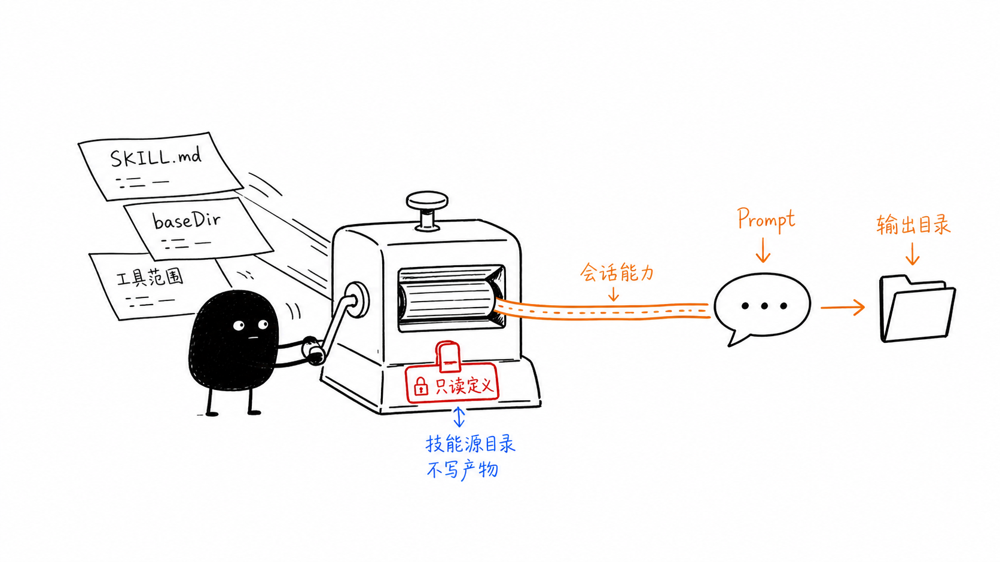
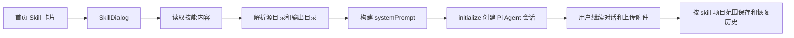

# 单元导读四：Skill 怎样从文件变成 Agent 能力

前面三个单元已经讲清楚：一次 Pi Agent 会话怎样创建、怎样发送消息、怎样流式返回、怎样保存和恢复。现在进入第四个单元：Skills。

很多初学者会把 Skill 理解成“一个按钮”或者“一个独立小程序”。这个理解不够准确。在 OriginOS 里，一个 Skill 首先是一份可读取的定义文件，通常是 `SKILL.md`；系统会找到它、解析它、决定它的来源、确定它的只读源目录和可写输出目录，然后把它拼进 Agent 会话的系统提示词中。只有完成这些步骤后，用户在窗口里看到的“毕业旅行策划 Skill”，才真正变成一个可以继续对话、可以使用工具、可以保存产物的 Agent 会话。

这张图里的小黑把左侧的 `SKILL.md`、`baseDir`、工具范围压成右侧的 Prompt 和输出目录，表达的就是本单元的核心：Skill 不是模型本身，也不是 UI 本身，而是“被加载进会话运行时的一组能力说明和目录约束”。

## 1. 本单元要解决的问题

本单元围绕小林打开“毕业旅行策划 Skill”的过程展开。读者需要学会回答以下问题：

| 问题 | 对应课程 |
| --- | --- |
| 首页卡片怎样知道自己要打开哪个 Skill？ | E31 |
| 技能列表是怎样从磁盘和 API 读出来的？ | E32 |
| `SKILL.md` 的 frontmatter 怎样变成 `Skill` 对象？ | E33 |
| 为什么 Skill 要被格式化进 Prompt，而不是直接执行？ | E34 |
| 技能源目录和输出目录为什么必须分开？SkillDialog 的 Agent fallback 在 Web 与 Electron 中怎样取内容？ | E35 |
| SkillDialog 初始化会话时具体传了哪些字段？ | E36 |
| Skill 的历史会话为什么用 `skill-${name}` 作为项目范围？ | E37 |
| `skill-tools.ts` 里的 Skill 调用和 SkillDialog 有什么不同？ | E38 |
| legacy execution API 为什么不能和会话式 Skill 混为一谈？ | E39 |
| 怎样验收一个 Skill 单元是否真的学会了？ | E40 |

## 2. 本单元的源码覆盖清单

本单元直接精读以下源码。这里先列清单，是为了避免读者在 UI、服务、加载器、运行时之间迷路。

| 层级 | 文件 | 本单元责任 |
| --- | --- | --- |
| 首页入口 | [packages/web/src/config/homeApps.ts](../../../../packages/web/src/config/homeApps.ts) | 解释 `type: 'skill'` 和 `skillName` 如何把卡片连接到 SkillDialog |
| 前端弹窗 | [packages/web/src/components/skills/SkillDialog.tsx](../../../../packages/web/src/components/skills/SkillDialog.tsx) | 解释技能内容加载、系统提示词构建、会话初始化、历史恢复和上传目录 |
| 浏览器/Electron 适配 | [packages/core/src/lib/integrations/electron/services/skill.ts](../../../../packages/core/src/lib/integrations/electron/services/skill.ts) | 解释 Web fetch 与 Electron IPC 的同一调用口 |
| Agent 内容 fallback | [packages/core/src/lib/integrations/electron/services/agent-session.ts](../../../../packages/core/src/lib/integrations/electron/services/agent-session.ts)、[packages/web/src/app/api/agents/[id]/route.ts](<../../../../packages/web/src/app/api/agents/[id]/route.ts>)、[packages/desktop/src/main/services/agent-session-service.ts](../../../../packages/desktop/src/main/services/agent-session-service.ts) | 解释普通 Skill 内容失败后，Role Agent/Agent.md 怎样经 Web Route 或 Electron IPC 返回 |
| Web API | [packages/web/src/app/api/skills/route.ts](../../../../packages/web/src/app/api/skills/route.ts) 、 [packages/web/src/app/api/skills/[name]/content/route.ts](<../../../../packages/web/src/app/api/skills/[name]/content/route.ts>) 、 [packages/web/src/app/api/skill-sessions/route.ts](../../../../packages/web/src/app/api/skill-sessions/route.ts) | 解释列表、内容、历史会话入口 |
| Core 服务 | [packages/core/src/lib/features/skills/service.ts](../../../../packages/core/src/lib/features/skills/service.ts) | 解释列表、内容、目录解析、历史会话、legacy execution |
| 核心加载器 | [packages/core/src/lib/integrations/pi-agent/core/skills.ts](../../../../packages/core/src/lib/integrations/pi-agent/core/skills.ts) | 解释 `SKILL.md` 查找、frontmatter、默认目录、冲突诊断、Prompt 格式化 |
| Launcher | [packages/core/src/lib/features/services/launcher/skill.ts](../../../../packages/core/src/lib/features/services/launcher/skill.ts) | 解释系统内置 Skill materialize、依赖注入、目录替换、会话创建 |
| 工具调用 | [packages/core/src/lib/integrations/pi-agent/tools/skill-tools.ts](../../../../packages/core/src/lib/integrations/pi-agent/tools/skill-tools.ts) | 解释 Agent 在运行中加载另一个 Skill 的工具路径 |
| 测试 | `skills.test.ts`、`skill-output-dir.test.ts`、`service.test.ts`、`skill-launcher.test.ts` | 解释已有测试证明什么、没有证明什么 |

这张清单只列“本单元直接精读”的主干文件。Skills 相关文件较多，不能因为文件名里有 `skill` 就全部塞进 E31-E40；也不能不说明去向。下面这张台账用于划清覆盖范围：

| 文件组 | 本单元处理方式 | 原因 |
| --- | --- | --- |
| [packages/web/src/app/page.tsx](../../../../packages/web/src/app/page.tsx) 与 [packages/web/src/services/AppWindowManager.ts](../../../../packages/web/src/services/AppWindowManager.ts) | E31 补充精读 | 它们证明首页点击如何真正打开 SkillDialog |
| [packages/core/src/lib/features/services/skill-service.ts](../../../../packages/core/src/lib/features/services/skill-service.ts) | E32 背景补充 | 它是对 core/skills 加载器的缓存封装，不是 SkillDialog 主线的内容接口 |
| [packages/core/src/types/skill.ts](../../../../packages/core/src/types/skill.ts) | 作为类型背景引用 | 本单元重点是会话式 Skill 运行链，不逐个展开所有通用 Skill 类型 |
| [packages/core/src/lib/features/skills/index.ts](../../../../packages/core/src/lib/features/skills/index.ts) 与 [packages/web/src/components/skills/index.ts](../../../../packages/web/src/components/skills/index.ts) | 公共导出背景 | 只说明模块出口，不承载运行逻辑 |
| [packages/core/src/lib/features/skills/registry.ts](../../../../packages/core/src/lib/features/skills/registry.ts)、[packages/core/src/lib/features/skills/decision.ts](../../../../packages/core/src/lib/features/skills/decision.ts)、[packages/core/src/lib/features/skills/executor.ts](../../../../packages/core/src/lib/features/skills/executor.ts) | 背景引用，不作为本单元主线 | 它们更偏功能型 Skill 路由、决策和执行抽象，和 SkillDialog 主线不同 |
| [packages/web/src/components/skills/SkillBrowser.tsx](../../../../packages/web/src/components/skills/SkillBrowser.tsx)、[packages/web/src/components/skills/SkillExecution.tsx](../../../../packages/web/src/components/skills/SkillExecution.tsx)、[packages/web/src/components/skills/skill-export-policy.ts](../../../../packages/web/src/components/skills/skill-export-policy.ts) | 背景引用或后续补充课处理 | 它们偏技能浏览、execution UI、导出策略，不是 E31-E40 的主线 |
| [packages/web/src/components/interview/SkillInterview.tsx](../../../../packages/web/src/components/interview/SkillInterview.tsx) | 后续访谈/项目初始化单元处理 | 它属于访谈 UI，不属于 SkillDialog 运行链 |
| [packages/web/src/app/api/user-skills/route.ts](../../../../packages/web/src/app/api/user-skills/route.ts)、[packages/web/src/app/api/user-skills/[id]/route.ts](<../../../../packages/web/src/app/api/user-skills/[id]/route.ts>) | 后续用户技能管理单元处理 | 用户技能增删改查属于技能管理产品能力，不属于本单元“Skill 进入 Agent 会话”的主线 |
| [packages/web/src/app/api/skills/[name]/route.ts](<../../../../packages/web/src/app/api/skills/[name]/route.ts>)、[packages/web/src/app/api/skills/refresh/route.ts](../../../../packages/web/src/app/api/skills/refresh/route.ts)、[packages/web/src/app/api/skills/_test/route.ts](../../../../packages/web/src/app/api/skills/_test/route.ts) | E32/E40 背景补充 | 它们支撑列表、详情、刷新和诊断，但不是 SkillDialog 初始化的必经主链 |
| [packages/web/src/app/api/skills/executions/route.ts](../../../../packages/web/src/app/api/skills/executions/route.ts) | E39 精读 | legacy execution 是必须讲清的边界路径 |
| [packages/core/src/lib/integrations/pi-agent/core/skills.types.ts](../../../../packages/core/src/lib/integrations/pi-agent/core/skills.types.ts)、[packages/core/src/lib/integrations/pi-agent/core/skills.README.md](../../../../packages/core/src/lib/integrations/pi-agent/core/skills.README.md)、[packages/core/src/lib/integrations/pi-agent/core/skills.quickstart.md](../../../../packages/core/src/lib/integrations/pi-agent/core/skills.quickstart.md) | 类型和说明材料，按需引用 | 正文以生产代码为主，不用说明文档替代源码 |
| [packages/core/src/lib/integrations/pi-agent/skill-evolution.ts](../../../../packages/core/src/lib/integrations/pi-agent/skill-evolution.ts) 与 [packages/web/src/app/api/agent/skill-evolution/route.ts](../../../../packages/web/src/app/api/agent/skill-evolution/route.ts) | 后续技能演化单元处理 | 它关注技能生成/演化，不是本单元的会话运行链 |
| [packages/core/src/lib/integrations/pi-agent/project-agent/project-skill-provisioning.ts](../../../../packages/core/src/lib/integrations/pi-agent/project-agent/project-skill-provisioning.ts)、[packages/core/src/lib/integrations/pi-agent/role-agent/skill-resolver.ts](../../../../packages/core/src/lib/integrations/pi-agent/role-agent/skill-resolver.ts) | 后续 Part 处理 | RoleAgent、ProjectAgent 不在 Part E 当前主线内抢跑 |
| [packages/core/src/lib/features/skills/project-initialization/loader.ts](../../../../packages/core/src/lib/features/skills/project-initialization/loader.ts)、[packages/core/src/lib/features/skills/project-initialization/index.ts](../../../../packages/core/src/lib/features/skills/project-initialization/index.ts) | 后续项目初始化单元处理 | 它讲项目访谈初始化，不讲普通 Skill 会话运行链 |
| bundled handler 与内置 `SKILL.md`： [packages/core/src/lib/features/skills/bundled/task-manager/handler.ts](../../../../packages/core/src/lib/features/skills/bundled/task-manager/handler.ts)、[packages/core/src/lib/features/skills/bundled/task-manager/SKILL.md](../../../../packages/core/src/lib/features/skills/bundled/task-manager/SKILL.md)、[packages/core/src/lib/features/skills/bundled/info-query/handler.ts](../../../../packages/core/src/lib/features/skills/bundled/info-query/handler.ts)、[packages/core/src/lib/features/skills/bundled/info-query/SKILL.md](../../../../packages/core/src/lib/features/skills/bundled/info-query/SKILL.md)、[packages/core/src/lib/features/skills/bundled/ontology-editor/handler.ts](../../../../packages/core/src/lib/features/skills/bundled/ontology-editor/handler.ts)、[packages/core/src/lib/features/skills/bundled/ontology-editor/SKILL.md](../../../../packages/core/src/lib/features/skills/bundled/ontology-editor/SKILL.md)、[packages/core/src/lib/features/skills/bundled/project-initialization/SKILL.md](../../../../packages/core/src/lib/features/skills/bundled/project-initialization/SKILL.md) | E39 背景引用，后续内置 Skill 案例展开 | E39 只讲 legacy execution 为什么要求 handler，不逐个讲每个内置 Skill 的业务逻辑 |
| 测试文件： [packages/core/src/lib/integrations/pi-agent/__tests__/skills.test.ts](../../../../packages/core/src/lib/integrations/pi-agent/__tests__/skills.test.ts)、[packages/core/src/lib/integrations/pi-agent/__tests__/skill-output-dir.test.ts](../../../../packages/core/src/lib/integrations/pi-agent/__tests__/skill-output-dir.test.ts)、[packages/core/src/lib/features/skills/__tests__/service.test.ts](../../../../packages/core/src/lib/features/skills/__tests__/service.test.ts)、[packages/core/src/lib/features/services/launcher/__tests__/skill-launcher.test.ts](../../../../packages/core/src/lib/features/services/launcher/__tests__/skill-launcher.test.ts)、[packages/web/src/components/skills/__tests__/skill-export-policy.test.ts](../../../../packages/web/src/components/skills/__tests__/skill-export-policy.test.ts)、[packages/core/src/lib/integrations/pi-agent/project-agent/__tests__/project-skill-provisioning.test.ts](../../../../packages/core/src/lib/integrations/pi-agent/project-agent/__tests__/project-skill-provisioning.test.ts) | 测试证据或后续测试背景 | 本单元只引用与基础主链相关的断言；ProjectAgent/export policy 测试不作为本单元主链证据 |
| 测试 fixtures： [packages/core/src/lib/integrations/pi-agent/__tests__/fixtures/skills/test-skill/SKILL.md](../../../../packages/core/src/lib/integrations/pi-agent/__tests__/fixtures/skills/test-skill/SKILL.md)、[packages/core/src/lib/integrations/pi-agent/__tests__/fixtures/skills/another-skill/SKILL.md](../../../../packages/core/src/lib/integrations/pi-agent/__tests__/fixtures/skills/another-skill/SKILL.md) | 测试材料 | 用于测试，不作为正式课程源码展开 |

## 3. 两条路径必须分开

本单元最容易混淆的地方，是 OriginOS 里同时存在两种 Skill 相关路径。

| 路径 | 入口 | 本质 | 本单元讲法 |
| --- | --- | --- | --- |
| 会话式 Skill | 首页卡片或 SkillDialog | 把 `SKILL.md` 注入 Pi Agent 会话，后续消息走 `usePiAgent` | 主线 |
| legacy execution | `/api/skills/executions` 或 Electron IPC execution | 直接调用内置 handler 或让 Agent 处理一次 execution message | 边界说明 |

小林在首页点开“毕业旅行策划 Skill”时，主线是会话式 Skill。系统并不是立即调用某个 `handle()` 函数完成任务，而是创建一个带 Skill 指令、工作目录和输出目录的 Agent 会话。后续小林继续追问、上传文件、恢复历史，都沿着会话系统运行。

legacy execution 仍需单独说明，因为源码里存在，而且会影响调用链判断；但它不能取代 SkillDialog 主线。若把两者合并，读者会误以为“Skill 就是 handler 函数”，并进一步混淆 Prompt、目录和会话恢复责任。

## 4. 本单元的学习终点

学完 E31-E40 后，读者应该能不看正文，独立画出这条链路：

这张图不是完整调用图，而是学习地图。后续每节会把其中一个节点拆开，读源码、讲边界、看失败路径、做纸面验收。

## 5. 读本单元时要保持的三个判断

第一，Skill 定义目录不等于产物目录。`SKILL.md` 和参考材料属于源定义，很多情况下应该只读；小林让 Agent 生成的旅行计划、预算表、路线文档，应该写入可写工作目录或输出目录。

第二，Skill 名称不只是展示文案。`skillName` 会进入内容查询、项目范围、会话 ID 绑定、恢复归属判断和历史列表。写错一个名字，可能表现为“列表看得到，但内容读不到”或“历史会话恢复失败”。

第三，测试结论要克制。某个测试证明了 bundled skill 能 materialize，不等于证明所有 Skill 在浏览器里都能端到端执行；某个测试证明 outputDir 替换正确，也不等于证明文件工具一定写到了正确文件。正文会明确每个测试覆盖的边界。
