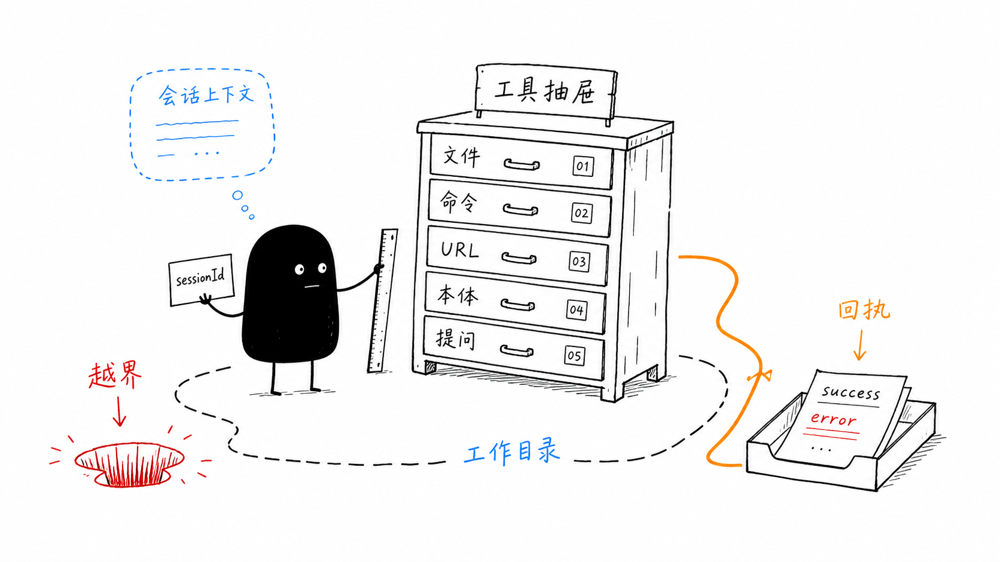

# 单元导读五：Agent 为什么能行动，又为何不能随意行动（E41-E55）

小林让毕业旅行 Agent 做一件更具体的事：读取旅行预算表、整理行程文件、运行一个检查命令、把生成的图片变成可打开的链接，并在不确定时向她确认选择。表面看，这像是模型“自己会操作电脑”。源码里的真实机制完全不同：模型只能发起工具调用；能不能调用、在哪里调用、调用结果如何回到模型，都由工具注册表、会话上下文、路径边界和事件系统共同决定。

本单元学习 E41-E55。它的核心问题不是“有哪些工具”，而是“工具能力怎样被安全地交给 Agent”。

## 1. 本单元要建立的心智模型

工具可以理解成一组带锁的抽屉。Agent 只能从运行时提供的工具列表里选一个工具，填入符合 schema 的参数，然后等待工具返回结构化结果。但“有锁”不等于所有安全边界已经完备；本单元会如实区分词法路径检查、真实文件系统边界和 shell 工作目录选择。

这张图有三个关键点。第一，工具不是天然存在于模型里，而是会话创建时注册和过滤后交给 Agent。第二，工具执行前必须有会话上下文，尤其是 `workingDirectory`。第三，工具返回的不是“副作用本身”，而是可被模型继续阅读的结果对象。

## 2. 本单元源码覆盖清单

| 类别 | 直接精读文件 | 学习重点 |
| --- | --- | --- |
| 注册与作用域 | [packages/core/src/lib/integrations/pi-agent/tools/index.ts](../../../../packages/core/src/lib/integrations/pi-agent/tools/index.ts)、[packages/core/src/lib/integrations/pi-agent/tools/registry.ts](../../../../packages/core/src/lib/integrations/pi-agent/tools/registry.ts)、[packages/core/src/lib/integrations/pi-agent/agent-manager.ts](../../../../packages/core/src/lib/integrations/pi-agent/agent-manager.ts) | 工具如何注册、按类型过滤、绑定到 Agent |
| 上下文与路径 | [packages/core/src/lib/integrations/pi-agent/tools/context.ts](../../../../packages/core/src/lib/integrations/pi-agent/tools/context.ts)、[packages/core/src/lib/integrations/pi-agent/tools/bind-session.ts](../../../../packages/core/src/lib/integrations/pi-agent/tools/bind-session.ts)、[packages/core/src/lib/integrations/pi-agent/tools/path-utils.ts](../../../../packages/core/src/lib/integrations/pi-agent/tools/path-utils.ts) | `sessionId`、`workingDirectory`、越界保护 |
| 文件工具 | [packages/core/src/lib/integrations/pi-agent/tools/file-tools.ts](../../../../packages/core/src/lib/integrations/pi-agent/tools/file-tools.ts) | 读、写、改、列、删的参数、结果和失败边界 |
| 命令工具 | [packages/core/src/lib/integrations/pi-agent/tools/bash-tools.ts](../../../../packages/core/src/lib/integrations/pi-agent/tools/bash-tools.ts) | shell 选择、安全检查、超时、输出截断 |
| URL 与系统工具 | [packages/core/src/lib/integrations/pi-agent/tools/url-tools.ts](../../../../packages/core/src/lib/integrations/pi-agent/tools/url-tools.ts)、[packages/core/src/lib/integrations/pi-agent/tools/system-tools.ts](../../../../packages/core/src/lib/integrations/pi-agent/tools/system-tools.ts) | 文件 URL 生成、当前时间工具 |
| 文档工具 | [packages/core/src/lib/integrations/pi-agent/tools/document-tools.ts](../../../../packages/core/src/lib/integrations/pi-agent/tools/document-tools.ts) | 文档结构探测、分页读取、表格抽取 |
| 本体工具 | [packages/core/src/lib/integrations/pi-agent/tools/ontology-tools.ts](../../../../packages/core/src/lib/integrations/pi-agent/tools/ontology-tools.ts)、[packages/core/src/lib/integrations/pi-agent/tools/ontology-data-tools.ts](../../../../packages/core/src/lib/integrations/pi-agent/tools/ontology-data-tools.ts) | 结构层与实例层不能混淆 |
| Skill 工具 | [packages/core/src/lib/integrations/pi-agent/tools/skill-tools.ts](../../../../packages/core/src/lib/integrations/pi-agent/tools/skill-tools.ts) | 已在 E38 精读，本单元只在覆盖台账中说明，不重复展开 |
| 交互与调度 | [packages/core/src/lib/integrations/pi-agent/tools/ask-user-question-tools.ts](../../../../packages/core/src/lib/integrations/pi-agent/tools/ask-user-question-tools.ts)、[packages/core/src/lib/integrations/pi-agent/tools/schedule-tools.ts](../../../../packages/core/src/lib/integrations/pi-agent/tools/schedule-tools.ts) | 向用户确认、创建安全调度任务 |
| 保护与观测 | [packages/core/src/lib/integrations/pi-agent/tools/retry.ts](../../../../packages/core/src/lib/integrations/pi-agent/tools/retry.ts)、[packages/core/src/lib/integrations/pi-agent/tools/loop-detector.ts](../../../../packages/core/src/lib/integrations/pi-agent/tools/loop-detector.ts)、[packages/core/src/lib/integrations/pi-agent/core/tool-event-status.ts](../../../../packages/core/src/lib/integrations/pi-agent/core/tool-event-status.ts)、[packages/core/src/lib/integrations/pi-agent/core/agent.ts](../../../../packages/core/src/lib/integrations/pi-agent/core/agent.ts) | 重试、循环保护、工具事件状态 |
| 代码搜索工具 | [packages/core/src/lib/integrations/pi-agent/tools/coding-tools.ts](../../../../packages/core/src/lib/integrations/pi-agent/tools/coding-tools.ts) | 文件存在，但当前 [packages/core/src/lib/integrations/pi-agent/tools/index.ts](../../../../packages/core/src/lib/integrations/pi-agent/tools/index.ts) 未注册 `codingTools`，本单元不把它讲成当前内置可用工具 |
| 测试证据 | [packages/core/src/lib/integrations/pi-agent/tools/__tests__/registry.test.ts](../../../../packages/core/src/lib/integrations/pi-agent/tools/__tests__/registry.test.ts)、[packages/core/src/lib/integrations/pi-agent/tools/__tests__/working-directory.test.ts](../../../../packages/core/src/lib/integrations/pi-agent/tools/__tests__/working-directory.test.ts)、[packages/core/src/lib/integrations/pi-agent/tools/__tests__/bash-tools-shell.test.ts](../../../../packages/core/src/lib/integrations/pi-agent/tools/__tests__/bash-tools-shell.test.ts)、[packages/core/src/lib/integrations/pi-agent/tools/__tests__/url-tools.test.ts](../../../../packages/core/src/lib/integrations/pi-agent/tools/__tests__/url-tools.test.ts)、[packages/core/src/lib/integrations/pi-agent/tools/__tests__/document-tools.test.ts](../../../../packages/core/src/lib/integrations/pi-agent/tools/__tests__/document-tools.test.ts)、[packages/core/src/lib/integrations/pi-agent/tools/__tests__/loop-detector.test.ts](../../../../packages/core/src/lib/integrations/pi-agent/tools/__tests__/loop-detector.test.ts)、[packages/core/src/lib/integrations/pi-agent/core/__tests__/tool-event-status.test.ts](../../../../packages/core/src/lib/integrations/pi-agent/core/__tests__/tool-event-status.test.ts) | 哪些行为有测试，哪些仍是源码推导 |

## 3. E41-E55 的学习路线

| 课号 | 主题 | 读者应能回答的问题 |
| --- | --- | --- |
| E41 | 工具注册表 | 为什么 Agent 不是自动拥有所有工具？ |
| E42 | 作用域过滤 | 为什么 worker/skill 看不到 `ask_user_question`？ |
| E43 | 会话上下文 | 为什么工具必须先知道当前会话和工作目录？ |
| E44 | 路径边界 | 为什么 `../` 和 Windows 绝对路径不能随便用？ |
| E45 | 文件读取 | 为什么 `read_file` 返回行号和分页信息？ |
| E46 | 文件写入与编辑 | 为什么编辑工具要求唯一匹配？ |
| E47 | 列目录与删除 | 为什么递归列目录要检查 symlink 越界？ |
| E48 | 命令执行 | 命令工具如何选 shell、拦危险命令、截断输出？ |
| E49 | URL 与系统工具 | 为什么生成 URL 仍要检查 data 目录边界？ |
| E50 | 文档工具 | 为什么大文档要先看结构再分页读取？ |
| E51 | 本体工具 | 结构层工具和实例层工具有什么边界？ |
| E52 | 用户提问工具 | Agent 如何把“需要用户选择”变成可渲染卡片？ |
| E53 | 调度工具 | 为什么定时任务不能接受原始 shell 命令？ |
| E54 | 保护与观测 | 重试、循环检测、工具状态如何避免失控？ |
| E55 | Tools 工作坊 | 如何从源码验收一次完整工具调用？ |

## 4. 读本单元时最容易混淆的四组概念

| 容易混淆 | 正确区分 |
| --- | --- |
| 工具注册 vs 工具调用 | 注册决定“可见工具集合”，调用才是某次执行 |
| `workingDirectory` vs 文件参数 | 工作目录应当成为边界根，文件参数在其内部解析；当前文件工具主要是词法边界，仍需检查 symlink 的真实目标 |
| 命令成功 vs 任务成功 | `exitCode === 0` 只说明命令进程成功，不自动代表业务目标完成 |
| 工具错误 vs 模型错误 | 工具错误来自执行结果；模型错误来自生成或流式过程，定位方法不同 |

还要牢记两个当前实现边界。第一，`path.resolve` 加前缀判断只能拦截 `../` 等词法越界，不能自动证明 symlink 的最终目标仍在工作目录内；涉及读取、写入、编辑和删除时，需要分别检查工具有没有使用 `realpath`。第二，命令工具的 CWD 解析在缺少会话上下文时可能接受调用参数中的绝对目录，因此“选出了一个 CWD”不等于“完成了 sandbox 授权”。E44-E48 会逐项解释，正文不会把尚未实现的防护写成现有能力。

## 5. 学完后的口头验收

读者应能不看笔记说清楚下面这句话：一次工具调用，是模型提交“工具名 + 参数”，运行时按会话和作用域找到工具，工具在受限工作目录内执行，返回 `success/error`、结果内容、进度或错误原因，Agent 再把这个结果用于下一步推理。

下一单元会进入稳定性与可观测性。工具已经能行动后，新的问题变成：当工具失败、流重复、会话变长或用户中止时，系统怎样不悄悄失控。
