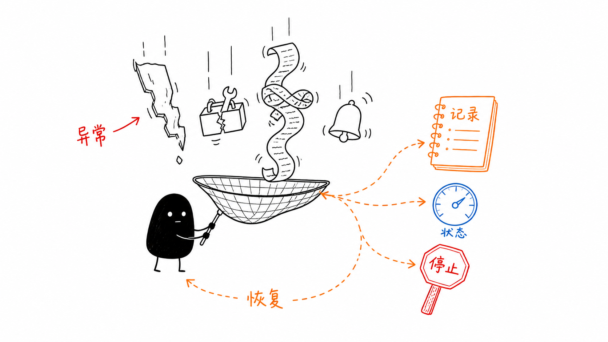
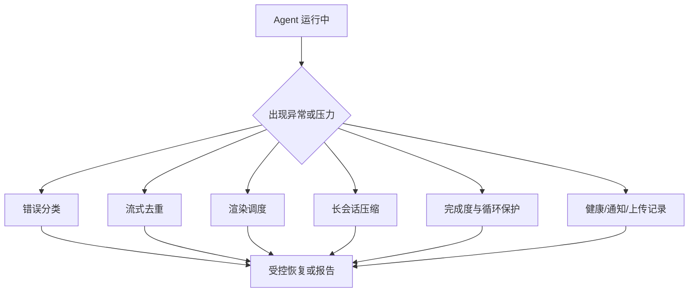
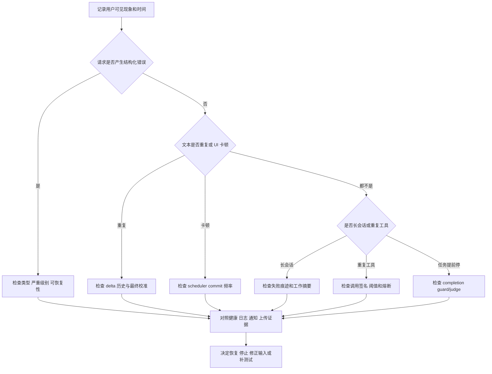

# 单元导读六：系统出问题时，怎样不悄悄失控（E56-E63）

## 0. 这一组课解决什么问题

真实 Agent 会遇到网络中断、模型报错、重复流片段、超长历史、工具失败和用户中止。E56-E63 不把它们当边角料，而是学习运行时怎样发现、报告、恢复或安全停止。

## 1. 先建立直觉

稳定性是“出了意外仍能知道发生了什么，并做出受控反应”；可观测性是“系统留下足够证据，让人能定位这次反应为何发生”。两者都不是多打几行日志，也不是让系统永远不报错。

以小林的毕业旅行策划为例，下面五个现象看起来都像“Agent 出问题”，但处理机制完全不同：

| 用户看到的现象 | 可能的系统问题 | 首先应查的机制 |
| --- | --- | --- |
| 点击发送后立刻提示网络失败 | 请求无法到达或连接中断 | 错误分类与恢复建议 |
| 同一句酒店建议重复出现两遍 | 流片段是累计帧或存在重叠 | 流式去重 |
| 回复内容正确，但页面持续卡顿 | 高频增量触发过多 UI 提交 | 渲染调度 |
| 长对话后 Agent 又重复读取不存在的文件 | 失败痕迹被压缩或遗忘 | 最近轨迹压缩与工作摘要 |
| Agent 连续承诺“马上生成”，却没有产物 | 提前停止或完成判断错误 | 完成度保护 |
| 同一个工具参数反复执行 | 运行时进入工具循环 | 循环检测与熔断 |

这张表建立了本单元最重要的排查习惯：先描述可观察现象，再识别故障模型，最后寻找负责该故障的机制。不能看到任何错误都统一“重试”，也不能看到任何重复都统一“去重”。

## 2. 你会依次学到什么

- 错误分类、用户可见提示与内部诊断如何分层。
- 流式去重和渲染调度为何保护阅读体验与页面性能。
- 长会话的压缩、工作摘要与内存使用如何保持上下文可用。
- 健康监控、通知、上传进度与偏好配置如何反映运行状态。
- 完成度保护和循环保护何时介入，何时不该误伤正常追问。
- 怎样用测试把“看起来稳定”变成可验证的行为。

## 3. 本单元的整体认知框架

稳定性与可观测性可以分成四层：

| 层级 | 关心的问题 | 对应课程 |
| --- | --- | --- |
| 错误层 | 失败属于哪一类，能不能恢复 | E56 |
| 流式层 | 输出是否重复，渲染是否过载 | E57-E58 |
| 上下文层 | 长会话是否保留最近失败和纠正 | E59 |
| 保护层 | 是否提前停止、重复工具、状态不可见 | E60-E62 |

这张图的重点是：每个机制只处理一类风险。网络错误不能靠流式去重解决；重复工具调用不能靠健康检查解决；长会话丢失失败原因也不能靠多打日志解决。

图中的箭头也不表示所有机制按顺序执行。去重和渲染调度位于流式显示路径；压缩位于长上下文准备路径；完成度判断和循环检测位于运行时控制路径；健康、通知和上传记录提供观察面。它们可能在同一轮中交错发生，但不会自动互相替代。

## 4. 八节课的因果路线

| 课次 | 从什么问题进入 | 读完后应能判断 |
| --- | --- | --- |
| E56 | 一个异常对象怎样变成可恢复或不可恢复的错误 | 基于消息文本的分类能做什么，误分类风险在哪里 |
| E57 | 增量流为什么会重复 | 纯增量、累计帧、重叠片段和最终消息怎样合并 |
| E58 | 为什么不能为每个字符都刷新 UI | 缓冲、帧预算、完成冲刷、取消和 Unicode 边界 |
| E59 | 历史太长时应该丢掉什么 | 为什么最近失败、用户纠正和下一步不能被摘要抹掉 |
| E60 | “我将为你生成”为什么不是完成 | 规则 guard、语义 judge、恢复次数和误伤边界 |
| E61 | 重复工具怎样从感觉变成证据 | 调用签名、阈值、warning、circuit breaker 与失败归一化 |
| E62 | 运行时内部状态怎样被人和界面看见 | Agent 健康、Electron 进程健康、通知、上传记录分别能证明什么 |
| E63 | 多种机制怎样组合成一次故障演练 | 用时间线、状态快照和测试证据复盘旅行任务 |

E57 与 E58 会再次出现 E15、E16 的源码，但教学问题不同。前面的单元关注流式传输主链；本单元把相同实现放进“故障与压力”视角，检查重复、突发输入、完成冲刷和性能证据。重复引用必须增加新的推理责任，不能只是重复定义。

## 5. 源码覆盖台账

| 责任 | 生产源码 | 配对证据 | 本单元不扩大声称的边界 |
| --- | --- | --- | --- |
| 错误分类 | [packages/core/src/lib/integrations/pi-agent/error-handler.ts 第 1 行](../../../../packages/core/src/lib/integrations/pi-agent/error-handler.ts#L1) | [packages/core/src/lib/integrations/pi-agent/__tests__/error-handler.test.ts 第 1 行](../../../../packages/core/src/lib/integrations/pi-agent/__tests__/error-handler.test.ts#L1) | 文本分类不能证明真实网络已恢复 |
| 流式去重 | [packages/core/src/lib/integrations/pi-agent/stream-dedupe.ts 第 1 行](../../../../packages/core/src/lib/integrations/pi-agent/stream-dedupe.ts#L1) 与核心调用点 | [packages/core/src/lib/integrations/pi-agent/__tests__/stream-dedupe.test.ts 第 1 行](../../../../packages/core/src/lib/integrations/pi-agent/__tests__/stream-dedupe.test.ts#L1) | 字符串去重不能判断语义重复 |
| 渲染调度 | [packages/core/src/lib/integrations/pi-agent/stream-render-scheduler.ts 第 1 行](../../../../packages/core/src/lib/integrations/pi-agent/stream-render-scheduler.ts#L1) | [packages/core/src/lib/integrations/pi-agent/__tests__/stream-render-scheduler.test.ts 第 1 行](../../../../packages/core/src/lib/integrations/pi-agent/__tests__/stream-render-scheduler.test.ts#L1) | fake timer 调用次数不能证明浏览器帧率 |
| 最近轨迹 | [packages/core/src/lib/integrations/pi-agent/recent-trace-compression.ts 第 1 行](../../../../packages/core/src/lib/integrations/pi-agent/recent-trace-compression.ts#L1)、[packages/core/src/lib/integrations/pi-agent/runtime-working-summary.ts 第 1 行](../../../../packages/core/src/lib/integrations/pi-agent/runtime-working-summary.ts#L1) | [packages/core/src/lib/integrations/pi-agent/__tests__/recent-trace-compression.test.ts 第 1 行](../../../../packages/core/src/lib/integrations/pi-agent/__tests__/recent-trace-compression.test.ts#L1)、[packages/core/src/lib/integrations/pi-agent/__tests__/long-session-stability.test.ts 第 1 行](../../../../packages/core/src/lib/integrations/pi-agent/__tests__/long-session-stability.test.ts#L1) | 保留关键词不能证明模型一定正确利用 |
| 完成度保护 | [packages/core/src/lib/integrations/pi-agent/core/completion-guard.ts 第 1 行](../../../../packages/core/src/lib/integrations/pi-agent/core/completion-guard.ts#L1)、[packages/core/src/lib/integrations/pi-agent/core/completion-judge.ts 第 1 行](../../../../packages/core/src/lib/integrations/pi-agent/core/completion-judge.ts#L1) | 两个对应测试文件 | judge 返回 JSON 不能证明任务产物真实存在 |
| 循环与工具状态 | [packages/core/src/lib/integrations/pi-agent/tools/loop-detector.ts 第 1 行](../../../../packages/core/src/lib/integrations/pi-agent/tools/loop-detector.ts#L1)、[packages/core/src/lib/integrations/pi-agent/core/tool-event-status.ts 第 1 行](../../../../packages/core/src/lib/integrations/pi-agent/core/tool-event-status.ts#L1) | loop detector 与 tool event status 测试 | 达到阈值只证明重复模式，不证明用户意图错误 |
| 观察面 | [packages/core/src/lib/integrations/pi-agent/health.ts 第 1 行](../../../../packages/core/src/lib/integrations/pi-agent/health.ts#L1)、[packages/desktop/src/main/services/process-health-monitor.ts 第 3—200 行](../../../../packages/desktop/src/main/services/process-health-monitor.ts#L3)、[packages/core/src/lib/integrations/pi-agent/notification-system.ts 第 1 行](../../../../packages/core/src/lib/integrations/pi-agent/notification-system.ts#L1)、[packages/core/src/lib/integrations/pi-agent/upload-tracker.ts 第 1 行](../../../../packages/core/src/lib/integrations/pi-agent/upload-tracker.ts#L1) | core health 与 desktop process health 测试；通知与上传仍需补直接测试 | Agent 逻辑健康、宿主进程响应和 UI 展示不能互相替代 |

## 6. 四组最容易混淆的概念

### 6.1 错误、严重级别、可恢复性

错误类型回答“发生了哪类问题”；严重级别回答“影响有多大”；可恢复性回答“当前策略是否允许继续尝试”。网络错误可能是可恢复的，但不代表应无限重试；校验错误可能严重度不高，却通常需要先改变输入而不是原样重发。

### 6.2 去重、调度、最终校准

去重决定“这段文字是否已经出现”；调度决定“什么时候把缓冲内容交给 UI”；最终校准决定“流结束时以哪份完整内容收口”。三者分别处理内容正确性、更新频率和结束一致性。

### 6.3 压缩、摘要、删除

压缩是用更短表示保留重要事实；工作摘要是显式记录当前目标、进度和下一步；删除是信息彻底离开可用上下文。只有前两者保留了可追踪语义。若摘要没有包含“小林已经否定旧路线”，从系统角度看这条纠正仍可能等同于被删除。

### 6.4 健康状态、通知、上传进度

core 健康状态服务于 Agent 逻辑生命周期诊断，desktop process health 服务于主事件循环、renderer 和任务阶段诊断，通知服务于用户可见提醒，上传记录服务于输入材料追踪。它们都带“状态”，但主键、生命周期和消费者不同。一个上传记录存在，不能证明 Agent 健康；Agent 显示 RUNNING，也不能证明 renderer 正常响应。

## 7. 一条可复用的故障排查路径

这条路径先固定现象和时间，避免事后只留下“Agent 好像坏了”的描述；然后按故障模型分流；最后再把内部状态与用户可见证据对齐。若某一步没有可观察数据，正确结论是“证据不足”，而不是跳到下一个猜测。

## 8. 配图怎样帮助理解

上方配图里，小黑用网接住掉下来的异常、坏工具箱、长卷轴和提醒铃。右侧的“记录、状态、停止、恢复”表示本单元的核心判断：系统不是追求永远不失败，而是失败时不能掉进黑洞。只要异常能被接住、记录、判断和处理，运行时就仍然处在可控状态。

## 9. 学完后的能力

完成本单元后，读者应能：

1. 把一次异常定位为模型、流、工具、会话或 UI 的哪一层；
2. 解释每个保护机制的输入、内部状态、触发条件、输出和停止边界；
3. 区分源码事实、自动化断言、日志观察和真实用户验收；
4. 设计至少一个正常路径、一个失败路径和一个重复或竞态路径；
5. 说明该层应留下什么证据、由谁决定恢复、停止或提示用户。

## 10. 与下一单元的关系

最后一组不再增加新能力，而是把整条用户链路用测试和端到端验收真正证明出来。
