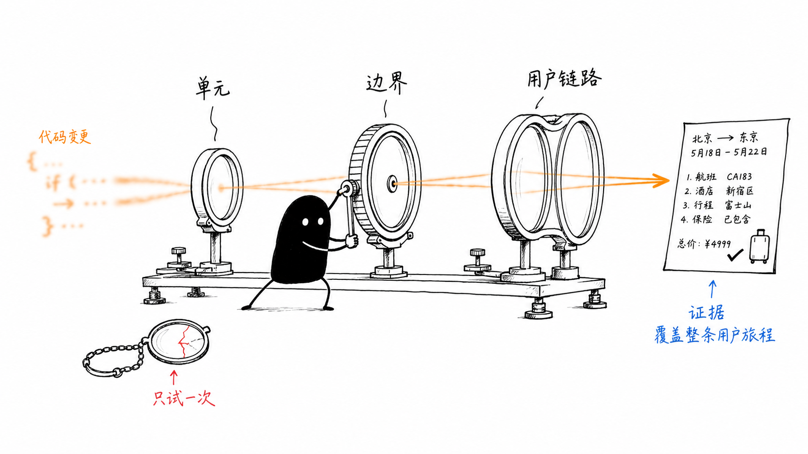
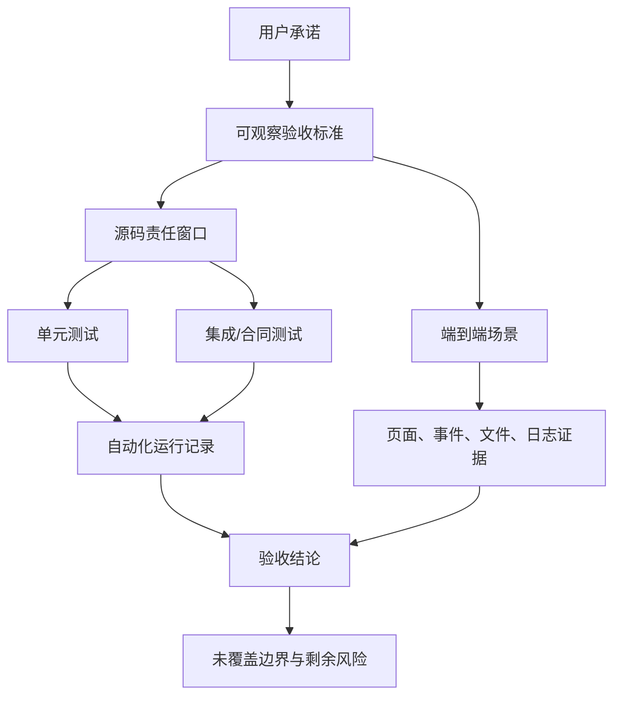

# 单元导读七：怎样证明 Agent 会话真的可靠（E64-E70）

小林已经能够让旅行 Agent 建立会话、流式回答、调用工具、保存文件并恢复历史。现在需要回答一个更严格的问题：这些能力是“曾经看起来能用”，还是已经有足够证据支持它们在规定边界内可靠？

E64-E70 不把测试当作课程末尾的一串命令，而是把前六个单元的技术承诺重新组织为证据链。读者将学习怎样从真实用户行为写出验收标准，怎样读取测试的 Given、When、Then，怎样识别 mock 的证明上限，以及怎样把自动化结果、人工端到端观察和剩余风险写成可复现报告。

## 1. 先读懂上方配图

图中左侧进入光学台的是模糊的代码变化。它先经过“单元”镜片，观察单个函数或类；再经过“边界”镜片，观察模块之间是否按合同协作；最后经过“用户链路”镜片，才在右侧形成一份可核验的旅行结果。

小黑正在亲自调节中间镜片，表示证据不会自动对焦：测试必须选择正确输入、触发真实边界并断言可观察结果。地上的破裂单片镜写着“只试一次”，表示一次手动成功只能提供很窄的观察角度，不能替代分层证据。

三片镜片也不能互相冒充。单元测试通过不能直接证明端到端流程；端到端成功一次也难以精确定位所有分支。可靠结论来自不同证据在各自范围内相互补足。

## 2. 本单元的总问题

本单元围绕一条主线推进：**小林怎样确认“毕业旅行策划会话”在创建、并发、恢复、工具执行和异常情况下仍满足用户承诺？**

这个问题会被拆成七课：

| 课程 | 核心问题 | 主要证据对象 |
| --- | --- | --- |
| E64 | 一条测试究竟证明到哪里 | Vitest 配置、setup、mock、证据边界 |
| E65 | 核心 Agent 与 UI Store 是否各自守住生命周期 | Agent、Store、模型配置测试 |
| E66 | 恢复是否按安全顺序完成 | schema、ownership、hydration、显示投影 |
| E67 | 并发流和乱序请求会不会覆盖当前会话 | session、stream、operation epoch |
| E68 | 输入、展示与 Prompt 的责任是否被正确理解 | 消息、Hook、thinking、意图、TASTE |
| E69 | 跨包公共合同是否拒绝越权和陈旧提交 | task bridge、分支、幂等、证据门 |
| E70 | 怎样形成一份可重复的完整验收 | 承诺矩阵、自动化、人工 E2E、风险报告 |

## 3. 一张证据地图

图中的第一条路径把“可靠”翻译成可观察标准，再绑定到生产源码。源码分成单元与集成证据，是为了分别定位局部分支和跨模块合同。端到端场景直接从用户标准出发，防止测试只围绕实现细节自我证明。最后一定保留“剩余风险”，因为任何测试结果都有环境、输入和边界。

## 4. 本单元必须直接阅读的源码与测试

| 责任组 | 直接精读文件 | 本单元承担的讲解责任 |
| --- | --- | --- |
| 测试装配 | [packages/core/vitest.config.ts 第 1 行](../../../../packages/core/vitest.config.ts#L1)、[packages/core/src/lib/integrations/pi-agent/__tests__/setup.ts 第 1 行](../../../../packages/core/src/lib/integrations/pi-agent/__tests__/setup.ts#L1)、[packages/core/src/lib/integrations/pi-agent/__tests__/mocks.ts 第 1 行](../../../../packages/core/src/lib/integrations/pi-agent/__tests__/mocks.ts#L1)、[packages/core/src/lib/integrations/pi-agent/__tests__/README.md 第 1 行](../../../../packages/core/src/lib/integrations/pi-agent/__tests__/README.md#L1) | 环境、全局替身、测试收集和文档时效边界 |
| 核心生命周期与真实配置诊断 | [packages/core/src/lib/integrations/pi-agent/core/__tests__/agent.test.ts 第 1 行](../../../../packages/core/src/lib/integrations/pi-agent/core/__tests__/agent.test.ts#L1)、[packages/core/src/lib/integrations/pi-agent/store.test.ts 第 1 行](../../../../packages/core/src/lib/integrations/pi-agent/store.test.ts#L1)、[packages/core/src/lib/integrations/pi-agent/__tests__/server-config.test.ts 第 1 行](../../../../packages/core/src/lib/integrations/pi-agent/__tests__/server-config.test.ts#L1)、[packages/web/src/app/api/agent/test-llm/route.ts 第 14—334 行](../../../../packages/web/src/app/api/agent/test-llm/route.ts#L14) | 核心状态、UI 状态、凭证映射与真实外部诊断的不同合同；说明 GET 副作用、超时和敏感诊断边界 |
| 恢复 | [packages/core/src/lib/integrations/pi-agent/__tests__/session-restore.test.ts 第 1 行](../../../../packages/core/src/lib/integrations/pi-agent/__tests__/session-restore.test.ts#L1)、[packages/core/src/lib/integrations/pi-agent/core/__tests__/runtime-history-restore.test.ts 第 1 行](../../../../packages/core/src/lib/integrations/pi-agent/core/__tests__/runtime-history-restore.test.ts#L1) | schema、所有权、hydration 顺序、显示投影和性能预算 |
| Hook | [packages/core/src/lib/integrations/pi-agent/hooks/__tests__/use-pi-agent.test.ts 第 1 行](../../../../packages/core/src/lib/integrations/pi-agent/hooks/__tests__/use-pi-agent.test.ts#L1)、[packages/core/src/lib/integrations/pi-agent/hooks/__tests__/events-integration.test.ts 第 1 行](../../../../packages/core/src/lib/integrations/pi-agent/hooks/__tests__/events-integration.test.ts#L1)、[packages/core/src/lib/integrations/pi-agent/hooks/__tests__/exceptions.test.ts 第 1 行](../../../../packages/core/src/lib/integrations/pi-agent/hooks/__tests__/exceptions.test.ts#L1)、[packages/core/src/lib/integrations/pi-agent/__tests__/client-hooks-session-isolation.test.ts 第 1 行](../../../../packages/core/src/lib/integrations/pi-agent/__tests__/client-hooks-session-isolation.test.ts#L1) | 事件组合、订阅清理、并发流、乱序恢复 |
| 输入与展示 | [packages/core/src/lib/integrations/pi-agent/__tests__/message.test.ts 第 1 行](../../../../packages/core/src/lib/integrations/pi-agent/__tests__/message.test.ts#L1)、[packages/core/src/lib/integrations/pi-agent/hooks/__tests__/security.test.ts 第 1 行](../../../../packages/core/src/lib/integrations/pi-agent/hooks/__tests__/security.test.ts#L1)、[packages/core/src/lib/integrations/pi-agent/__tests__/display-content.test.ts 第 1 行](../../../../packages/core/src/lib/integrations/pi-agent/__tests__/display-content.test.ts#L1)、[packages/core/src/lib/integrations/pi-agent/__tests__/intent-understanding.test.ts 第 1 行](../../../../packages/core/src/lib/integrations/pi-agent/__tests__/intent-understanding.test.ts#L1)、[packages/core/src/lib/integrations/pi-agent/__tests__/taste-context.test.ts 第 1 行](../../../../packages/core/src/lib/integrations/pi-agent/__tests__/taste-context.test.ts#L1) | 格式、传输、安全责任、thinking 可见性和 prompt 结构 |
| 跨入口合同 | [packages/core/src/lib/integrations/pi-agent/__tests__/pi-task-runtime-boundary/pi-task-runtime-boundary.contract.test.ts 第 1 行](../../../../packages/core/src/lib/integrations/pi-agent/__tests__/pi-task-runtime-boundary/pi-task-runtime-boundary.contract.test.ts#L1)、[packages/core/src/lib/integrations/pi-agent/__tests__/pi-task-runtime-boundary/public-extension-harness.ts 第 1 行](../../../../packages/core/src/lib/integrations/pi-agent/__tests__/pi-task-runtime-boundary/public-extension-harness.ts#L1)、[packages/core/src/lib/integrations/pi-agent/__tests__/cross-entry-loop-protection.test.ts 第 1 行](../../../../packages/core/src/lib/integrations/pi-agent/__tests__/cross-entry-loop-protection.test.ts#L1) | 公共导入、schema、权限、分支、幂等、证据门和兼容性 |

RoleAgent、ProjectAgent 与 cognitive 目录下的专用测试不在本单元展开。它们属于后续 Part 的主体；E69 只把少量跨入口样本用于验证基础运行时规则，不借机讲解专用 Agent 内部架构。

## 5. 学习时始终保留的四个问题

读每条测试时，都写下四句：

1. Given：测试准备了什么真实对象，替换了什么依赖？
2. When：它调用哪个公开入口，怎样制造成功、失败或竞态？
3. Then：它实际断言了哪些状态、调用、顺序和负面副作用？
4. 未证明：哪些网络、进程、磁盘、真实模型或 UI 边界没有经过？

只要第四句写不出来，就很容易把局部绿色结果夸大成系统可靠。

## 6. 学完后的能力

完成本单元后，读者应能够：

- 把宽泛用户故事拆成可观察验收标准；
- 判断测试是单元、集成、合同还是端到端证据；
- 从 mock 和断言反推测试的真实证明范围；
- 为会话隔离、恢复顺序和工具边界设计正向与负向断言；
- 主动制造乱序、超时、中止和所有权错误，而非只走成功路径；
- 运行分层测试并如实记录 Passed、Failed、Blocked、Not covered；
- 组织一次从首页入口到重启恢复的旅行会话验收，并保留页面、事件和文件证据。

从 E64 开始，先把“绿色测试”拆成有边界的证据，再逐层把镜头推向完整用户链路。
