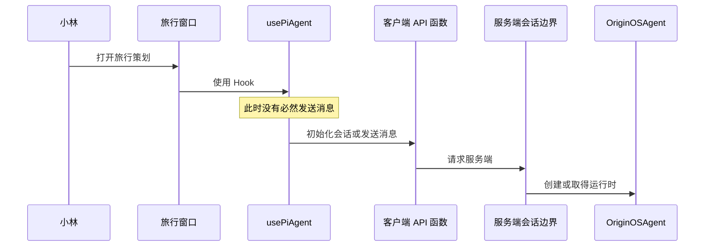

# E01：旅行窗口打开以后，为什么还不能说“Agent 已经开始工作”

## 小林真正看见的事情

小林准备和同学去杭州毕业旅行。她点击“旅行策划”，窗口出现，里面有输入框和发送按钮。她还没有输入“预算 6000 元、五天、两个人”。这时说“旅行 Agent 已经工作”并不准确：窗口出现、会话建立、Agent 处理一轮消息，是三件先后发生、也可能分别失败的事。

本章讨论窗口出现到服务端会话初始化之间的边界：**浏览器中的组件怎样与 Agent 运行时建立联系？**

## 窗口、会话与 Agent 运行时

| 对象 | 可把它想成 | 小林旅行案例 | 不能证明什么 |
| --- | --- | --- | --- |
| 窗口 | 旅行社柜台 | 旅行策划界面 | 后台已经在规划路线。 |
| 会话 | 一张业务号码牌及档案 | “住宿讨论”这段连续对话 | 模型已经回复。 |
| Agent 运行时 | 正在办事的旅行顾问 | 当前处理小林请求的程序 | 行程文件已经保存。 |



图中的关键停顿是 `Hook`：窗口组件能拿到操作和状态，但浏览器不能直接持有 Node.js 侧运行时。只有 API 请求跨过服务端边界后，才可能创建或取得 `OriginOSAgent`。

## 第一段源码：窗口为什么使用 Hook

[usePiAgent 的注释和最小示例（第 276-300 行）](../../../../packages/core/src/lib/integrations/pi-agent/client-hooks.ts#L276) 给出了客户端 Hook 的最小使用形态：

```tsx
const { sendMessage, isThinking, uiState } = usePiAgent();

const handleSend = async (text: string) => {
  await sendMessage(text);
};
```

逐行看：`usePiAgent()` 返回的是一组能力，不是一次模型调用；`sendMessage` 只是函数引用，只有用户提交后 `handleSend` 才调用它；`await` 表示请求仍可能等待或失败；`isThinking` 是 UI 读到的即时状态，不是“旅行计划已成功生成”的证明。

小林只打开窗口、没有按发送时，`handleSend` 不会执行。因此，“组件已渲染”不能推出“消息已送达”。

## 第二段源码：初始化请求带着哪些旅行资料

[创建会话请求（第 210-248 行）](../../../../packages/core/src/lib/integrations/pi-agent/client-hooks.ts#L210) 整理 `projectContext`，调用 `createAgentSession`，并传入 `sessionId`、`projectId`、`projectName`、`systemPrompt`、`llmConfig`、`agentBaseDir` 与 `outputDir`。

| 请求字段 | 小林的例子 | 它的责任 |
| --- | --- | --- |
| `sessionId` | “酒店讨论”这段会话 | 区分连续对话。 |
| `projectId` | 毕业旅行策划项目 | 标记长期归属。 |
| `systemPrompt` | 先确认日期和预算 | 规定工作方式。 |
| `projectContext` | 当前项目路径与入口信息 | 提供工作范围。 |
| `outputDir` | 行程草案产物位置 | 指定本次结果应写去哪里。 |

`entryType` 若未在项目上下文中提供，代码才依据 `agentType` 推导 `skill`、`role-agent` 或 `agent`。这不是“随便给 Agent 起名”，而是产品入口到运行时归属的翻译。

## 窗口类型与 Hook 出口：两个边界各自限制什么

前面的 `usePiAgent` 示例只说明组件怎样取得客户端能力；它不等于窗口本身的类型定义。 [hooks.ts 第 1—23 行](../../../../packages/core/src/lib/integrations/pi-agent/hooks.ts#L1) 是客户端安全的导出边界：它重新导出 `usePiAgent`、事件和状态 Hook，并只导出恢复所需的类型。该文件没有创建 `OriginOSAgent`，也没有携带 Node.js 侧实现；它的责任是限制浏览器可安全导入的 API 面。

窗口的正式数据模型则在 [app-window.ts 第 102—157 行](../../../../packages/core/src/types/app-window.ts#L102)。`AppWindowConfig.id` 是可选的配置输入，`AppWindowData.id` 是已经建立窗口的必填身份；`AppWindowStoreState.windows` 以 `Record<string, AppWindowData>` 保存窗口，`focusedWindowId` 只表示当前聚焦的 UI 容器。下面两行特别容易混淆：

```ts
interface AppWindowConfig { id?: string; /* 其余配置 */ }
interface AppWindowData { id: string; /* 已创建窗口的数据 */ }
```

小林尚未打开旅行窗口时，调用者可以不提供 `AppWindowConfig.id`，由窗口层生成；窗口一旦创建，`AppWindowData.id` 才能用于关闭、聚焦、最小化和移动。这个 ID 不能替代 `sessionId`：前者用于定位 UI 容器，后者用于定位连续对话。E05 将沿着真实窗口管理服务继续分析二者何时会同时出现在 `metadata` 中。

## 第三段源码：成功、失败、等待是三种状态

[响应判断（第 241-248 行）](../../../../packages/core/src/lib/integrations/pi-agent/client-hooks.ts#L241) 区分会话初始化的成功、失败与等待状态：

```ts
if (!response.success) {
  throw new Error(response.error?.message || 'Failed to initialize session');
}
return { sessionId: response.data.sessionId, projectContext: scopedProjectContext };
```

| 发生什么 | 代码结果 | 小林此时能确定什么 |
| --- | --- | --- |
| 服务端成功 | 返回会话 ID 和上下文 | 可以继续下一步逻辑。 |
| 服务端失败 | 抛出错误 | 不能假装会话已建立。 |
| 请求还在等待 | `await` 未返回 | 仍不能判断成功或失败。 |

`throw` 只把失败交给上层；哪一个组件显示错误提示，需要沿调用链继续找，不能凭这段代码编造界面行为。

## 三种 ID 为什么不能合并

窗口 ID 属于 UI 容器；`projectId` 属于毕业旅行这个长期项目；`sessionId` 属于“预算讨论”或“酒店讨论”某一段连续对话。小林可以在同一项目内有多段会话，也可以关闭并重新打开窗口而仍关联同一会话。把三者混为一个 ID，会导致历史覆盖、关闭误删或请求串到错误对话。

## 测试证据与边界

[client-hooks 会话隔离测试](../../../../packages/core/src/lib/integrations/pi-agent/__tests__/client-hooks-session-isolation.test.ts) 用 mock API 检查不同会话的初始化和流标识不会互相覆盖；[Agent 初始化测试（第 72-117 行）](../../../../packages/core/src/lib/integrations/pi-agent/core/__tests__/agent.test.ts#L72) 验证有效配置的 state 含正确会话 ID、项目上下文，且初始不在思考。当前小节未找到 `AppWindowManager` 或 `appWindowStore` 的配对自动化测试；窗口 ID 的类型约束来自 `app-window.ts`，窗口生命周期与会话生命周期的联动需要以 E05 的源码路径和后续集成测试继续验证。

这些证据不证明真实模型一定连通、旅行 Skill 已加载或行程文件已落盘。每个测试只证明自己的边界。

## 小实验与口头验收

1. 在创建请求中圈出 `sessionId`、`projectId`、`systemPrompt`、`outputDir`，为小林杭州五日游各填一个值。
2. 假设服务端返回 `success: false`，从 `if (!response.success)` 解释控制流和仍未发生的事。
3. 不看正文，回答：为什么 `usePiAgent` 不等于 `OriginOSAgent`？为什么窗口出现不等于会话已经持久化？

下一章将专门拆开运行配置包：系统提示词、模型、工具和项目上下文如何共同决定小林的旅行 Agent。
