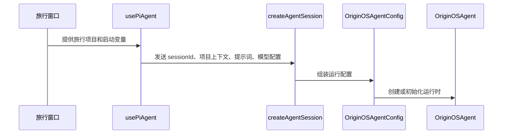

# E02：小林按下发送前，旅行 Agent 的“出发包”是怎样准备好的

## 小林提交的旅行需求

小林在毕业旅行策划窗口输入：“两个人，预算六千元，想在杭州玩五天。”如果系统只把这句话原样交给一个模型，模型仍然不知道四件关键事情：

1. 它应扮演怎样的旅行助手，先追问还是直接写路线？
2. 它使用哪一个模型，模型可容纳多少上下文？
3. 它是否允许读取项目中的酒店清单或创建行程草案？
4. 它正在为哪个旅行项目工作，结果应写到哪里？

因此，用户消息不是 Agent 的全部输入。运行时在开始前要接收一份**配置包**。本章讨论配置包的组成、字段责任、缺失边界及其进入 `OriginOSAgent` 的过程。网络请求和流式回复属于后续章节的范围。

## 配置包的形成路径



这张图说明配置从何处形成，而不描述模型生成回复的过程。窗口提供用户可见的启动入口；Hook 负责客户端准备；API 是浏览器与服务端之间的边界；配置把启动材料整理成合同；运行时随后使用这些材料处理一轮消息。

## 概念阶梯：四样东西分别是什么

把旅行 Agent 想成出发前的旅行工作台：

| 名称 | 通俗解释 | 小林的例子 | 不能把它误认为 |
| --- | --- | --- | --- |
| 系统提示词 | 给旅行顾问的工作说明 | “先确认日期、预算、同行人和偏好” | 小林刚输入的那句话。 |
| 模型 | 负责理解和生成的引擎配置 | 当前 provider、模型 ID、上下文窗口 | 一套产品业务规则。 |
| 工具 | 顾问获准使用的操作按钮 | 之后可读资料、写行程、访问 URL | 已经完成的操作结果。 |
| 项目上下文 | 这次工作所属的旅行档案 | 项目 ID、路径、入口、输出位置 | 浏览器窗口的视觉状态。 |

四者不是可任选的“附加信息”。没有提示词，Agent 不知道应怎样工作；没有模型，它不能生成；没有明确项目上下文，运行时无法可靠判断工作归属；没有工具，模型最多只能建议，不能执行外部动作。

## 第一段源码：配置合同先规定什么可以进入运行时

[OriginOSAgentConfig（第 203-239 行）](../../../../packages/core/src/lib/integrations/pi-agent/types.ts#L203) 将运行配置划分为必填字段、可选字段和行为开关：

```ts
export interface OriginOSAgentConfig {
  systemPrompt: string;
  model: Model<any>;
  sessionId?: string;
  tools?: AgentTool<any>[];
  projectContext?: ProjectContext;
  thinkingLevel?: 'off' | 'minimal' | 'low' | 'medium' | 'high';
  completionGuardEnabled?: boolean;
}
```

### 必填字段：`systemPrompt` 与 `model`

`systemPrompt` 是运行时给模型的长期工作规则。它可以说“你是毕业旅行策划助手，先澄清条件”，却不应该替代小林本轮真实需求。将两者混在一起会使后续历史、角色和提示词更新变得不可解释。

`model` 的类型来自 adapter。它不只是一个字符串名称；运行时后面会读取模型的 `contextWindow`、`maxTokens` 等能力数据，决定历史能装下多少。因为这个字段是必填，`OriginOSAgentConfig` 在 TypeScript 层不允许调用方忘记提供模型。

### 可选字段：不是“不重要”

`sessionId` 可选，说明低层运行时允许不同创建路径；它不表示产品界面可以不区分会话。`tools` 可选，说明某些 Agent 可以只聊天；它不表示旅行 Skill 已经自动拥有所有工具。`projectContext` 可选，说明运行时可在非项目场景被复用；但小林的旅行策划是项目工作，因此调用链应明确传入归属。

`thinkingLevel` 是联合类型，不允许随便写 `'very-smart'`。`completionGuardEnabled` 默认语义在注释中说明：一般开启，但项目访谈可显式关闭，避免把正常追问错判为任务未完成。它是行为策略开关，不是“模型能力等级”。

## 配置进入运行时前：为什么需要归一化，而不是原样透传

`OriginOSAgentConfig.model` 描述的是已可用的运行时模型；而页面、用户偏好或恢复数据带来的 `llmConfig` 仍可能含有别名、空白字符串、旧字段或不同凭证写法。 [llm-config.ts 第 1—151 行](../../../../packages/core/src/lib/integrations/pi-agent/llm-config.ts#L1) 的 `normalizeRuntimeLLMConfig` 正是这层输入整理器。

| 原始情况 | 归一化行为 | 小林旅行案例中的意义 |
| --- | --- | --- |
| `provider: "openai"` | 改写为 `openai-compatible` | 运行时使用统一 provider 名称，而不是让下游猜测别名 |
| `enabled: false` 或空配置 | 返回 `undefined` | 不能把禁用配置伪装成可用模型配置 |
| `model`、`baseUrl`、凭证含空白 | `trim()` 后保留有效值 | 避免“看起来配置了模型、实际是空字符串” |
| `maxTokens` 非有限数 | 丢弃该字段 | 后续预算逻辑不应接收 `NaN` 或无穷大 |
| 凭证带 `Bearer ` 或 JSON 包装 | 提取并清理凭证值 | 配置输入形状不同，不应改变下游认证字段的语义 |

这个函数不创建模型实例，也不向供应商发送请求；它只返回标准化的 `RuntimeLLMConfig`。因此，“归一化成功”不能证明 API Key 有效或模型可连通。

另一层 [config.ts 第 412—441 行](../../../../packages/core/src/lib/integrations/pi-agent/config.ts#L412) 的 `validateConfig` 和 `injectBrowserConfig` 则处理配置存在性与浏览器注入。它检查当前状态中是否存在 Anthropic 或 Google 凭证，并对自定义 Base URL 给出警告；它不会替代服务端实际建模，也不会验证代理一定可用。E02 的配置链因而有三个不可互换的阶段：输入归一化、配置存在性检查、运行时模型创建。

## 第二段源码：项目上下文里最容易混淆的三个字段

[ProjectContext（第 243-280 行）](../../../../packages/core/src/lib/integrations/pi-agent/types.ts#L243) 中的字段可用下列旅行案例说明：

```ts
const travelContext = {
  projectId: 'project-graduation-trip',
  projectName: '杭州毕业旅行',
  currentPath: '/data/projects/project-graduation-trip',
  outputDir: '/data/projects/project-graduation-trip/files/itinerary-draft',
  entryType: 'skill',
  entryId: 'travel-planner',
};
```

这是教学例子，不是从仓库读取的真实数据。它用来区分：

| 字段 | 回答的问题 | 若错用会怎样 |
| --- | --- | --- |
| `projectId` | 这段对话属于哪个长期项目？ | 两个旅行项目的资料可能串到一起。 |
| `currentPath` | 当前项目的工作根在哪里？ | 工具不知道相对路径应从哪里解释。 |
| `outputDir` | 本次会话产物应放去哪里？ | 草案可能写到不该写的目录。 |
| `entryType` / `entryId` | 它由哪个产品入口启动？ | 恢复与权限策略难以判断来源。 |

特别注意：`currentPath` 与 `outputDir` 都像路径，但生命周期不同。项目工作根可被多个会话共享；“住宿草案”和“路线草案”可以各有自己的输出目录。把两者合并为一个变量，会在产物隔离和恢复时失去信息。

## 第三段源码：客户端怎样把材料交给会话创建边界

[client-hooks 的初始化请求（第 210-248 行）](../../../../packages/core/src/lib/integrations/pi-agent/client-hooks.ts#L210) 对 `entryType` 与 `entryId` 采用已有上下文优先的规则；缺失时才根据 `agentType` 和项目 ID 补齐。随后构造请求：

```ts
const response = await createAgentSession({
  sessionId,
  projectId: scopedProjectContext.projectId,
  projectName: scopedProjectContext.projectName || 'Agent Session',
  agentType,
  systemPrompt: variables?.['systemPrompt'],
  projectContext: scopedProjectContext as unknown as Record<string, unknown>,
  llmConfig,
  agentBaseDir: variables?.['agentBaseDir'],
  outputDir: variables?.['outputDir'],
});
```

这里发生的是**边界适配**：Hook 的 `ProjectContext` 被整理成 API 所需请求字段。`projectName || 'Agent Session'` 是名称缺失时的默认值；它不补造 `projectId`，因为没有项目身份不能可靠地猜一个。

`as unknown as Record<string, unknown>` 是类型适配，不是运行时校验。它使当前请求接口可以用通用对象承载上下文，却不确认每个字段真实有效。编译器允许与运行时已验证属于不同层次。

## 第四段源码：配置怎样进入运行时

[OriginOSAgent 构造与初始化（第 291-320 行）](../../../../packages/core/src/lib/integrations/pi-agent/core/agent.ts#L291) 先把配置保存到实例，取出 `sessionId` 与 `projectContext`，同步写入公开 `state`，建立健康监控器，再调用 `initialize`。

这段顺序意味着：运行时必须先知道“我是谁、为谁工作”，才进入模型和工具准备。初始化前有两个明确错误分支：

- `isDestroyed` 为真：抛出“Agent 已销毁，无法初始化”；旧实例不能被假装重新使用。
- 没有 `config`：抛出“Agent 未配置，无法初始化”；不能带着空旅行包继续。

这两个错误没有在这里显示为弹窗。运行时只表达自己的失败；UI 负责决定小林看到的文案、重试方式或空状态。

## 测试证据：它究竟证明什么

[Agent 初始化测试（第 72-117 行）](../../../../packages/core/src/lib/integrations/pi-agent/core/__tests__/agent.test.ts#L72) 提供 `basicConfig`，创建 `OriginOSAgent`，并断言 state 已初始化、保存会话 ID 和项目上下文，初始 `isThinking` 为 `false` 且活动工具为空。

它证明配置进入运行时后的初始状态；没有证明真实模型能给杭州行程、工具能写文件、API 路由可达，或用户会看到正确界面。把测试的证明范围说小，才是严谨的技术教学。

`llm-config.ts` 的归一化分支与 `config.ts` 的浏览器配置注入在当前目录中没有发现一一对应的直接单元测试入口；它们在本课以源码事实讲解，而非宣称已被测试固定。后续服务端配置与客户端请求单元需要分别补足 provider 别名、无效 `maxTokens`、JSON 形式凭证和缺少 API Key 的验证用例。

可在依赖完整时运行：

```bash
pnpm --filter @originos/core exec vitest run src/lib/integrations/pi-agent/core/__tests__/agent.test.ts
```

## 小实验与口头验收

1. 用表格为小林的“五日杭州旅行”填写提示词、模型、工具、项目上下文，并写出每项不负责的事。
2. 比较 `currentPath` 与 `outputDir`：如果它们相同，系统仍能运行；为什么教材仍要求把含义分开？
3. 假设 `projectName` 缺失，指出代码怎样处理；再假设 `projectId` 缺失，解释为什么不能用同样方式兜底。
4. 从 `createAgentSession` 请求开始，画出配置进入 `OriginOSAgent` 的控制流；在每根箭头上写一个真实字段名。

合上本页后，能准确回答“配置包不是一条消息”“类型适配不是运行时验证”“运行时抛错不等于 UI 已提示”三句话，并用代码位置说明原因，才算完成 E02。

下一课将跟随小林的第一条旅行需求，区分一轮工作中的用户消息、助手消息、工具调用、工具结果与运行时事件。
