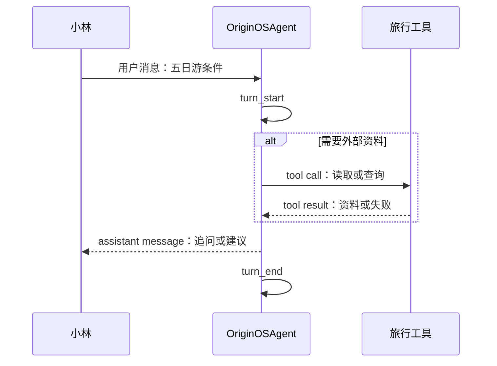

# E03：小林的一句旅行需求，为什么不是一个聊天气泡那么简单

## 从一个会让人误判的画面开始

小林在旅行窗口输入：“两个人，预算六千元，杭州五日游，想住西湖附近。”她按下发送后，自己的文字先出现在历史区；过一会儿，Agent 可能追问日期，也可能先查询资料；最后出现一段建议。

如果只从界面看，这像“一个气泡进去，一个气泡出来”。但运行时面对的是一段有开始、有中间动作、有结束的工作过程：它接收用户意图，可能调用工具，得到工具结果，再形成回答。这个过程叫作 **turn（轮次）**。

本章讨论一轮工作中的消息数据与运行过程事件的边界，并解释 `turn_end` 为什么不等于“旅行任务完成”。

## 一轮工作中的四类对象

| 名词 | 通俗解释 | 小林案例 | 不能误认为 |
| --- | --- | --- | --- |
| 消息 | 一条可保存的发言或结果 | 小林的预算、Agent 的追问 | 整个处理过程。 |
| 轮次 | 围绕一次用户请求的处理单位 | 处理“杭州五日游”这次请求 | 整个旅行项目。 |
| 工具调用 | Agent 请求外部能力 | 请求读取酒店清单 | 工具已经成功。 |
| 事件 | 运行时广播的过程通知 | `turn_start`、`tool_execution_end` | 会话历史中的普通文本。 |

**消息保存内容；事件报告过程。** 如果把事件当作消息持久化，重启后会出现假进度；如果把消息当作过程事件，UI 又无法正确显示正在执行什么。

## 一轮工作怎样展开

图中的实线箭头表示数据或控制交接，`alt` 区域表示按条件发生的工具分支。



逐箭头解释：

1. 用户消息给出本轮目标，并不要求系统一定立即产出完整路线。
2. `turn_start` 让运行时记录“正在处理第几轮”，也让 UI 可以开始显示忙碌状态。
3. `alt` 表示工具不是每轮必经；只聊天的追问可以没有工具调用。
4. 工具返回的是结果，不是最终用户回复。失败结果同样是 Agent 下一步判断的材料。
5. 助手消息可以是最终建议，也可以只是一个必要追问。
6. `turn_end` 只表示这一轮停下；小林仍可能继续补充日期、重新发起下一轮。

## 源码窗口一：事件是怎样进入运行时状态的

[packages/core/src/lib/integrations/pi-agent/core/agent.ts 第 947-1024 行](../../../../packages/core/src/lib/integrations/pi-agent/core/agent.ts#L947) 以 `switch` 分发图中的过程事件；每个 `case` 对应一种状态转换。

```ts
case 'turn_start':
  this.activeTurnSequence = ++this.turnSequence;
  this.state.uiState.isThinking = true;
  this.healthMonitor.markProcessingStart();
  break;

case 'turn_end': {
  const turnEnd = event as any;
  const msg = turnEnd.message;
  const toolCount = turnEnd.toolResults?.length ?? 0;
  this.state.uiState.isThinking = false;
  this.healthMonitor.markProcessingEnd();
  break;
}
```

逐行解释：

- `++this.turnSequence` 先加一再赋值，因此第一轮会得到序号 1；它不是 `sessionId`，同一会话可有很多轮。
- `isThinking = true` 是 UI 可读取的即时状态；它表示运行时开始处理，不表示模型必定会成功。
- `event.message` 是本轮结束时带回的消息；`toolResults?.length ?? 0` 使用可选链和空值合并，表示没有工具结果时安全地按 0 处理。
- `turn_end` 将思考状态设回 false，却没有调用会话存储。由此可证明：轮次结束不是“历史已保存”。

## 源码窗口二：一条助手消息内部也可能不只含文本

[packages/core/src/lib/integrations/pi-agent/core/agent.ts 第 983-1021 行](../../../../packages/core/src/lib/integrations/pi-agent/core/agent.ts#L983) 检查 `msg.content` 是否为数组，再区分 `text`、`toolCall`、`thinking` 和其他 block。一个助手消息可能同时携带文本、工具调用与推理资料；用户界面显示哪部分，取决于后续的显示内容规则。

这解释了为什么不能只写 `message.content.toString()`：复杂消息不是一段普通字符串。也解释了为什么小林看到一段回复，不代表运行时只处理了这一种内容块。

## 协议工具文件：消息结构为什么还要单独验证与转换

[packages/core/src/lib/integrations/pi-agent/message.ts 第 1—238 行](../../../../packages/core/src/lib/integrations/pi-agent/message.ts#L1) 还定义了一套 `UserMessage` 与 `AgentResponse` 协议工具。它要求用户消息具有非空 `content`、长度不超过 128 的 `sessionId` 与时间；`validateUserMessage`、`validateAgentResponse`、`createUserMessage`、`agentMessageToAgentResponse` 分别承担验证、构造与适配器消息转展示协议的责任。

其中 `agentMessageToAgentResponse` 不直接把复杂内容块转成字符串，而调用 [packages/core/src/lib/integrations/pi-agent/display-content.ts 第 1—104 行](../../../../packages/core/src/lib/integrations/pi-agent/display-content.ts#L1) 的 `extractDisplayContent`：优先拼接 `text` 内容块，移除 `<think>` 或 `<thinking>` 包裹的隐藏推理；只有显式允许时才会回退到唯一的 `thinking` 块。这是“运行时消息可包含更多内容”与“用户界面只应显示可展示文本”之间的转换边界。

必须同时说明当前调用事实：在现有生产源码检索中，`message.ts` 的验证与构造函数没有被当前发送主链调用；其直接消费者主要是 [packages/core/src/lib/integrations/pi-agent/__tests__/message.test.ts](../../../../packages/core/src/lib/integrations/pi-agent/__tests__/message.test.ts)。因此，它是仓库保留的协议工具，不应被叙述为 `usePiAgent → OriginOSAgent` 的已证实生产调用步骤。它仍值得精读，因为未来若复用这套协议，`sessionId` 长度、空消息和展示内容的边界会立即生效。

## 源码窗口三：工具开始和结束各自改变什么

[packages/core/src/lib/integrations/pi-agent/core/agent.ts 第 1026-1055 行](../../../../packages/core/src/lib/integrations/pi-agent/core/agent.ts#L1026) 在工具开始时向 `activeTools` 放入 `{ toolName, startTime }`；结束时按 `toolName` 过滤掉对应项，再读取结果、退出码和失败原因。

| 事件 | state 变化 | 小林可看到的正确含义 | 不可推出的结论 |
| --- | --- | --- | --- |
| `tool_execution_start` | 工具加入活动列表 | 正在尝试某项外部操作 | 资料已找到。 |
| `tool_execution_end` | 工具从活动列表移除 | 此工具已结束 | 整轮或任务已结束。 |
| `turn_end` | `uiState.isThinking = false` | 本轮停止处理 | 行程文件已落盘。 |

如果工具失败，代码通过 `getToolEventStatus` 取得失败状态并记录原因；它没有在这里决定是否重试或显示怎样的提示。错误解释必须留在拥有产品语义的上层。

## 测试证据与缺口

[packages/core/src/lib/integrations/pi-agent/core/__tests__/agent.test.ts 第 120—135 行](../../../../packages/core/src/lib/integrations/pi-agent/core/__tests__/agent.test.ts#L120) 至少证明 `prompt`、`continue`、`abort`、`waitForIdle` 的基础调用不会抛出；[packages/core/src/lib/integrations/pi-agent/core/__tests__/agent.test.ts 第 665—704 行](../../../../packages/core/src/lib/integrations/pi-agent/core/__tests__/agent.test.ts#L665) 会模拟一组正常生命周期事件并断言它们走日志路径而非错误日志。它们没有直接断言每个事件后的 `uiState` 转换，也不证明真实杭州酒店资料正确或页面动画正确；这些是本课应明确保留的测试缺口。

[packages/core/src/lib/integrations/pi-agent/__tests__/message.test.ts](../../../../packages/core/src/lib/integrations/pi-agent/__tests__/message.test.ts) 则覆盖协议工具的字段验证与转换。它证明这套独立工具如何处理输入，并不证明生产发送链正在使用它；测试对象和生产调用对象必须分别确认。

## 小实验与口头验收

1. 为“小林要求比较三家西湖附近酒店”画出一轮：用户消息、一次工具调用、工具结果、助手追问或建议、`turn_end`。
2. 在源码中找到 `turnSequence` 与 `sessionId`，说明为什么一个会话可以有许多轮。
3. 假设工具结束但 `toolResults` 是空数组，解释 `?? 0` 的结果和 UI 不应擅自显示的内容。
4. 不看正文回答：为什么“助手已经输出文字”仍不保证旅行任务完成？

下一章只研究图中另一条线：这些事件怎样变成小林界面上的“正在思考”和工具进度，而不会被误存为旅行历史。
