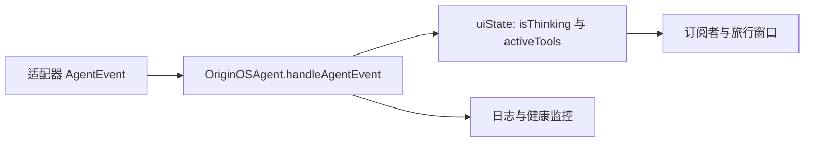
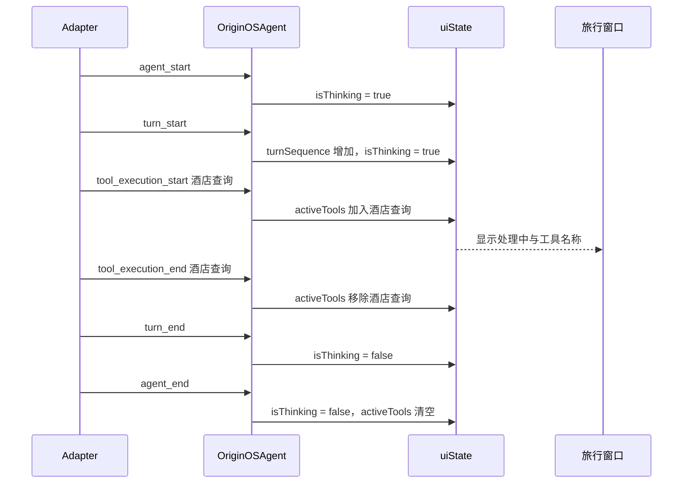

# E04：旅行窗口里的“正在思考”，究竟由什么事实决定

> 本课的问题：小林提交杭州五日游条件后，页面显示“正在思考”；助手查询酒店时，页面还显示工具名称。这些文字是模型的自我描述、会话已经保存的标志，还是别的东西？

它们都不是。当前源码能够直接证明的链路是：底层适配器发出事件，`OriginOSAgent` 接收事件并改写 `uiState`，订阅 Agent 的上层再据此更新界面。`isThinking` 和 `activeTools` 描述的是**当前进程中正在发生的执行状态**；它们不等于模型的内部推理内容，也不等于已写入磁盘的会话历史。

本课只讨论事件到运行时状态的映射。会话快照与恢复将在 E07、E08 讨论；看到 `turn_end` 更不能推断“旅行方案已保存”。

## 1. 事件、状态和界面是三个不同层次

小林发送“第三天不要连续爬山”后，至少发生三类事情：

| 层次 | 例子 | 生命周期 | 与可恢复历史的关系 |
| --- | --- | --- | --- |
| 事件 | `turn_start`、`tool_execution_end` | 发生一次便过去 | 它是过程通知；是否另行记录由事件消费者决定 |
| 运行时状态 | `uiState.isThinking = true`、`activeTools` 中有工具 | 随事件改变 | 当前字段用于进程内进度，不宜原样作为重启后的事实 |
| 用户界面 | 加载动画、“正在查询酒店”标签 | 组件根据状态渲染 | 它是状态的呈现结果，不是会话历史本身 |



同一事件既可能更新 `uiState`，也可能写日志、更新健康监控；图中这些箭头不能被简化为“事件直接改变某个 React 组件”。`OriginOSAgent` 是中间的运行时包装层。若旅行窗口没有订阅或没有根据状态重渲染，状态变化也不会自动变成可见动画。

## 2. 事件从哪里进入 `OriginOSAgent`

[packages/core/src/lib/integrations/pi-agent/core/agent.ts 第 513—517 行](../../../../packages/core/src/lib/integrations/pi-agent/core/agent.ts#L513) 在内部 Agent 上注册订阅：每收到一个事件，先调用 `handleAgentEvent(event)`，再调用 `routeAgentEvent(event)`。前者维护本课的运行时状态，后者继续完成事件路由。这个调用顺序说明，界面能订阅到事件并不意味着它必须自己维护所有状态；`OriginOSAgent` 已经先记录了部分共同事实。

事件处理器位于 [packages/core/src/lib/integrations/pi-agent/core/agent.ts 第 947—1055 行](../../../../packages/core/src/lib/integrations/pi-agent/core/agent.ts#L947)，核心形式是一个 `switch ((event as any).type)`。`as any` 让实现可以读取不同事件携带的专有字段，但也削弱了编译器对事件形状的保护。因此，阅读每个分支时必须看它实际访问了哪些字段，不能假定所有事件都有相同结构。

## 3. 一次旅行请求的事件时间线

以“查询西湖附近适合长辈的酒店”为例，常见的事件顺序可以写成：



该图表达的是一个正常完成路径，不是所有事件都必然出现的协议承诺。例如，若本轮不需要工具，就不会有两条 `tool_execution_*` 事件；若异常在请求过程中抛出，错误处理路径会主动把思考状态关闭。时间线中的 `agent_end` 与 `turn_end` 也不能被视为同义词：一个 Agent 处理过程可以包含轮次语义，而本类状态字段必须按照实际事件更新。

## 4. `agent_start`、`turn_start` 与两个序号

处理器的开头包含：

```ts
case "agent_start":
  this.state.uiState.isThinking = true;
  this.healthMonitor.markProcessingStart();
  break;

case "turn_start":
  this.activeTurnSequence = ++this.turnSequence;
  this.state.uiState.isThinking = true;
  this.healthMonitor.markProcessingStart();
  break;
```

`agent_start` 表达 Agent 处理开始；`turn_start` 表达一轮处理开始。二者都让 `isThinking` 为 `true`，但不能因此推导二者代表同一件事。`turn_start` 还执行 `++this.turnSequence`：先将私有计数器加一，再赋给 `activeTurnSequence`。在一个新实例里第一次收到该事件后，当前轮次序号为 1。

这个轮次序号只用于当前 `OriginOSAgent` 实例内的运行观测和日志；它不是 E05 中的 `sessionId`。关闭并重新创建实例后，私有计数器会重新开始，而会话 ID 的用途是跨一次连续对话稳定标识历史。将 `turnSequence` 写进 URL 或当作持久化主键，会把短暂执行编号误作长期身份。

## 5. `turn_end`：停止思考，不等于完成所有业务动作

[packages/core/src/lib/integrations/pi-agent/core/agent.ts 第 969—1023 行](../../../../packages/core/src/lib/integrations/pi-agent/core/agent.ts#L969) 处理 `turn_end`。它读取事件中的 `message`、`toolResults`，计算工具调用与结果数量，然后执行：

```ts
this.state.uiState.isThinking = false;
this.healthMonitor.markProcessingEnd();
this.healthMonitor.recordMessageHandled();
```

这里有三个层面的信息。

1. `isThinking = false` 只证明这个状态字段已从忙碌切回空闲。
2. `toolResults?.length ?? 0` 在工具结果缺失时按 0 处理，避免对 `undefined.length` 取值。
3. 代码会从助手消息内容块中计数 `type === "toolCall"`，并记录模型、provider、API、停止原因与文本哈希等日志信息。

这些日志有助于诊断“本轮是否调用工具、是否与上一轮助手文本重复”，但日志输出也不等于页面展示。更关键的是，这个分支没有调用 `SessionStore.saveSession`。因此，加载动画消失只能说明该轮事件结束，不能单独证明：旅行方案被写入文件、所有工具成功、用户已经接受方案，或整个项目完成。

## 6. 工具活动列表：它记录正在运行什么，而不是工具历史

工具开始和结束分支如下：

```ts
case "tool_execution_start":
  this.applyLoopProtection(event as any);
  this.state.uiState.activeTools.push({
    toolName: (event as any).toolName,
    startTime: Date.now(),
  });
  break;

case "tool_execution_end":
  this.state.uiState.activeTools = this.state.uiState.activeTools.filter(
    (tool) => tool.toolName !== (event as any).toolName
  );
  break;
```

`activeTools` 中的每一项只有工具名与本地记录的开始时间。它可以支持界面显示“正在查询酒店”，也可帮助观察某个工具持续时间；它并不保存工具参数、完整结果、是否可重放的调用状态或用户最终是否采纳结果。

结束时采用“按 `toolName` 过滤”的方式删除。由此可以得出一个细节：若同名工具在同一时刻出现多个未结束记录，一个结束事件会移除同名的全部项，而不是通过 `toolCallId` 精确移除其中一个。这里不应凭空断定系统一定支持或一定不支持同名并发调用；更严谨的结论是，当前 `uiState.activeTools` 的清理键是 `toolName`，需要并发精确追踪时应审查或调整这个数据模型。

`tool_execution_end` 还调用 `getToolEventStatus`，从结果中提取失败状态、退出码和原因，并写入日志。即使工具失败，清理分支仍会移除活动项：界面不能因为一次已结束的失败调用而永远显示“执行中”。是否展示失败提示、是否允许重试，属于上层 UI 与业务流程的责任。

### 工具结束事件中的失败判定来自哪里

[packages/core/src/lib/integrations/pi-agent/core/tool-event-status.ts 第 1—119 行](../../../../packages/core/src/lib/integrations/pi-agent/core/tool-event-status.ts#L1) 将工具事件的多种结果形状压缩为 `ToolEventStatus`：`failed`、可选 `exitCode` 与可选 `reason`。它依次检查 `result.details`、结果对象本身、文本内容中可解析的 JSON；若发现 `success: false`、非零 `exitCode` 或非空 `error`，便返回失败。若结构化结果没有失败信号，但事件的 `isError` 为真，则回退为 SDK 报告的失败。

这解释了为什么 `tool_execution_end` 不能只看一个布尔字段。小林的酒店查询工具可能把失败写在 `details.exitCode`，也可能把 JSON 放在文本内容块；状态解析器负责统一读取，`handleAgentEvent` 负责从 `activeTools` 移除已结束项并记录日志，UI 负责决定如何呈现。三层责任不应合并。

## 7. `agent_end` 与异常路径是最后的状态兜底

`agent_end` 会执行：

```ts
this.state.uiState.isThinking = false;
this.state.uiState.activeTools = [];
this.healthMonitor.markProcessingEnd();
this.healthMonitor.recordMessageHandled();
```

这比 `turn_end` 多了一步：清空全部活动工具。它防止某些路径遗漏工具结束事件时，Agent 已结束却仍残留“正在查询”的界面状态。另一个兜底位于请求异常处理处：[packages/core/src/lib/integrations/pi-agent/core/agent.ts 第 1286—1290 行](../../../../packages/core/src/lib/integrations/pi-agent/core/agent.ts#L1286) 也会把 `isThinking` 设为 `false`、清空 `activeTools` 并记录错误。

这类清理是运行时一致性策略，不是持久化策略。重启应用后不能原样恢复旧 `activeTools`：旧进程已经不存在，旧的“正在查询”既不能代表当前网络连接，也不能代表工具仍在执行。把短时状态错误地保存并恢复，反而会向用户显示过期进度。

## 8. 初始状态、可验证证据与测试缺口

`OriginOSAgent` 的初始 `state` 在 [packages/core/src/lib/integrations/pi-agent/core/agent.ts 第 280—288 行](../../../../packages/core/src/lib/integrations/pi-agent/core/agent.ts#L280) 中设置为 `isThinking: false` 与 `activeTools: []`。对应的 [packages/core/src/lib/integrations/pi-agent/core/__tests__/agent.test.ts 第 72—117 行](../../../../packages/core/src/lib/integrations/pi-agent/core/__tests__/agent.test.ts#L72) 会创建实例并断言这两个初值，以及 `sessionId`、`projectContext`。

这些测试能够支持“新建 Agent 初始不是思考中、没有活动工具”的结论，却没有逐分支模拟 `agent_start`、`tool_execution_start`、`turn_end`、`agent_end` 后的状态变化，也没有对同名并发工具的清理语义建立断言。因此，事件映射本身主要以源代码为证据；若未来改动事件处理器，应补充状态机式单元测试，至少覆盖：

1. 依次收到正常事件时 `isThinking` 与 `activeTools` 的完整序列。
2. 工具结束失败时活动项被清理、错误状态被记录。
3. `agent_end` 与异常路径都能清空遗留工具。
4. 同名工具的并发或重复事件对列表的影响。
5. 订阅者收到事件的顺序与 UI 实际渲染的集成验证。

[packages/core/src/lib/integrations/pi-agent/core/__tests__/tool-event-status.test.ts](../../../../packages/core/src/lib/integrations/pi-agent/core/__tests__/tool-event-status.test.ts) 是工具失败归一化的配对测试入口。它只能证明不同结果形状怎样生成 `ToolEventStatus`，不能证明旅行窗口一定会把该失败渲染成用户可理解的提示。

## 9. 小实验：手工演算酒店查询的一次状态变化

在纸上维护下表，按事件顺序填入状态。假设开始时 `turnSequence = 0`、`isThinking = false`、`activeTools = []`。

| 收到的事件 | `activeTurnSequence` | `isThinking` | `activeTools` | 不能由此推出的结论 |
| --- | ---: | --- | --- | --- |
| `agent_start` | 0 | true | `[]` | 已有助手回复 |
| `turn_start` | 1 | true | `[]` | 已调用酒店工具 |
| `tool_execution_start("hotel_search")` | 1 | true | `[{ toolName: "hotel_search", startTime }]` | 查询已成功 |
| `tool_execution_end("hotel_search")` | 1 | true | `[]` | 整轮对话结束 |
| `turn_end` | 1 | false | `[]` | 会话已经写入磁盘 |
| `agent_end` | 1 | false | `[]` | 旅行项目已经完成 |

如果能够解释每行中的“不能推出”，就已经避免了界面状态、工具结果、持久化与业务完成四类常见混淆。

## 10. 本课结论与口头验收

`isThinking` 与 `activeTools` 是 `OriginOSAgent` 依据 Adapter 事件维护的进程内 UI 状态。`agent_start`、`turn_start` 使其进入忙碌；工具开始与结束增删活动记录；`turn_end` 结束当前轮次的忙碌；`agent_end` 和异常路径清除残留状态。它们提供用户可见进度的事实基础，却不等于模型内部思维、文件持久化成功或旅行计划已完成。

在不查看源码时，应能够说明：

1. `agent_start` 与 `turn_start` 为什么都可能使 `isThinking` 为真，却不能互相替代。
2. `turnSequence` 为什么不能充当 `sessionId`。
3. `tool_execution_end` 为什么不代表整个 turn 已结束。
4. 为什么重启后不能照搬旧的 `activeTools`。
5. 当前按 `toolName` 清理活动工具会带来什么并发观察边界。
