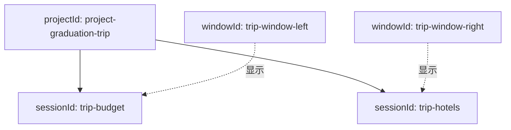

# E05：旅行窗口、旅行项目与旅行会话，为什么不能共用一个 ID

> 本课的问题：小林在“毕业旅行”项目中先讨论预算，再新开一段对话比较酒店；她还可以同时打开两个旅行窗口。系统为什么不能只用一个“旅行编号”处理这些对象？

因为三类对象回答的是三类完全不同的问题：窗口回答“此刻显示在哪个界面容器中”；项目回答“长期资料属于哪项工作”；会话回答“哪几条消息是一段连续对话”。它们偶尔在同一张页面上出现，并不意味着寿命、所有权或删除后果相同。

## 1. 一个真实场景中同时存在的三类身份

设小林的毕业旅行项目 ID 为 `project-graduation-trip`。她在这个项目中有两段独立对话：一段讨论预算，另一段比较酒店。同时，桌面上可以出现两个窗口。



实线表示项目对会话的长期归属；虚线表示窗口在某一时刻展示哪段会话。图中没有“窗口拥有会话文件”的箭头，也没有“会话等于项目”的箭头。这两条缺失的箭头正是防止误设计的关键。

| 身份 | 它标识的对象 | 典型产生和消失时机 | 应承担的责任 |
| --- | --- | --- | --- |
| `windowId` | 一个 UI 窗口或视图容器 | 打开窗口时产生，关闭窗口后可消失 | 前置、最小化、尺寸、位置和组件实例 |
| `projectId` | 一项长期工作，例如毕业旅行项目 | 创建项目到删除项目期间 | 项目目录、资料、长期归属与项目级上下文 |
| `sessionId` | 一段连续 Agent 对话 | 创建会话到归档或删除会话期间 | 消息历史、会话恢复、当前会话选择与请求隔离 |

窗口侧的真实状态可在 [packages/web/src/store/appWindowStore.ts 第 23—124 行](../../../../packages/web/src/store/appWindowStore.ts#L23) 复查：它以 `windows`、`windowOrder`、`focusedWindowId` 管理窗口，创建的 `AppWindowData` 含位置、尺寸、焦点与关闭回调。本课重点源码 `SessionStore` 不保存这些字段；因此，不能因为它管理“当前会话”就把它称作窗口管理器。

## 2. `projectId`：长期归属，不是当前聊天标签

公共创建请求 [packages/core/src/types/agent.ts 第 216 行](../../../../packages/core/src/types/agent.ts#L216) 要求 `projectId` 与 `projectName`。运行时项目上下文 `ProjectContext` 也以 `projectId` 作为必填信息（见 [packages/core/src/lib/integrations/pi-agent/types.ts 第 243 行附近](../../../../packages/core/src/lib/integrations/pi-agent/types.ts#L243)）。这说明在创建和运行边界，项目身份都不是可有可无的展示文本。

对于小林而言，`projectId` 可以把“预算讨论”“酒店比较”“行程草案”等多段会话关联到同一个毕业旅行工作目录。项目名“毕业旅行”可以重名、可以修改、可以本地化；稳定 ID 才适合成为关联键。

项目 ID 不负责区分同一项目中的两段聊天。若把 `projectId` 误传给所有会话 API 或存储查找，第二次会话可能覆盖第一段的历史，或让“当前会话”永远只能指向项目而非某段对话。项目归属是多对一关系，会话身份才负责一对一定位。

## 3. `sessionId`：连续对话的稳定锚点

在 [packages/core/src/lib/integrations/pi-agent/session-store.ts 第 16—39 行](../../../../packages/core/src/lib/integrations/pi-agent/session-store.ts#L16)，当前持久化模型包含两个相关接口：

```ts
export interface SessionsListData {
  currentSessionId: string | null;
  sessions: StoredSession[];
}

export interface StoredSession {
  id: string;
  name: string;
  messages: AgentMessage[];
  systemPrompt: string;
  model: { provider: string; id: string };
  projectContext?: ProjectContext;
  // 创建与更新时间字段省略
}
```

这里储存对象的字段叫 `id`，列表指针叫 `currentSessionId`。两者通过相同字符串关联；E07 将进一步讨论它与公共 `AgentSession.sessionId` 的字段命名差异。本课只需要把握：`currentSessionId` 表示会话列表中当前选中的对象，而不是当前打开的窗口。

例如：

```text
currentSessionId = "trip-hotels"
sessions = [
  { id: "trip-budget", name: "预算讨论", ... },
  { id: "trip-hotels", name: "酒店比较", ... },
]
```

上述数据表示酒店比较是当前会话。它没有给出任何窗口坐标、窗口标题栏状态或 React 组件引用；因此它不足以判断“小林当前看见的是哪扇窗口”。反过来，一个窗口 ID 也不足以找到消息历史，除非某个 UI 层额外建立了窗口到会话的关联。

## 4. `currentSessionId` 是受约束的引用

`SessionStore.setCurrentSession(sessionId)` 位于 [packages/core/src/lib/integrations/pi-agent/session-store.ts 第 179—195 行](../../../../packages/core/src/lib/integrations/pi-agent/session-store.ts#L179)：

```ts
const session = this.sessionsCache!.sessions.find((s) => s.id === sessionId);
if (!session) {
  return false;
}

this.sessionsCache!.currentSessionId = sessionId;
await jsonStore.write(SessionStore.SESSIONS_FILE, this.sessionsCache!);
return true;
```

这段短代码规定了完整的控制流：先在 `sessions` 中确认目标存在；不存在则返回 `false`，不写入；存在才更新指针并持久化。因此，`currentSessionId` 不是可随意赋值的标签，而是对当前列表对象的引用。

将返回值与读取结果分开理解：

| 情况 | `setCurrentSession` 的结果 | `loadCurrentSession` 的可能结果 | 语义 |
| --- | --- | --- | --- |
| 选择一个存在 ID | `true` | 对应 `StoredSession` | 当前选择已切换 |
| 选择不存在 ID | `false` | 仍是原来的当前会话或 `null` | 请求被拒绝，不代表模型报错 |
| 列表中没有当前 ID | 不适用 | `null` | 没有当前选择 |
| 删除当前会话 | 删除成功 | `null` | 指针被清空，避免悬空引用 |

`false` 是一次设置请求未完成的布尔结果；`null` 是读取“当前会话不存在”的数据结果。两者都不等同于网络错误、模型拒答或旅行项目被删除。

## 5. 为什么窗口 ID 不能替代会话 ID

假设 UI 层把同一会话展示在窗口 `window-A`，随后用户关闭窗口。若用 `window-A` 当作历史文件的键，关闭窗口会使恢复路径失去稳定标识；再次打开窗口时也无法知道应连接旧历史还是创建新历史。

相反，若把 `sessionId` 当作窗口 ID：小林在两个窗口同时查看“酒店比较”时，这两个容器会被强行压成同一个 UI 实例，前置顺序、尺寸和局部输入状态都难以独立维护。是否允许同一会话多窗口显示是 UI 产品决策，但无论是否允许，窗口身份与会话身份都不能天然视为同一字段。

当前 `SessionStore` 的源码只能直接证明会话身份与持久化关系，不能证明实际 Web 窗口如何绑定 session。前文的窗口关联图用于解释对象边界；具体绑定实现必须到窗口管理模块和组件调用点另行验证。区分“能从源码确认的事实”与“架构上的合理推断”，可以避免把解释模型误写成已实现调用链。

### 关闭窗口时，`sessionId` 与 `projectId` 如何进入同一份元数据

[packages/web/src/services/AppWindowManager.ts 第 27—53 行](../../../../packages/web/src/services/AppWindowManager.ts#L27) 说明某些窗口关闭路径比“从 UI store 删除一个窗口”更复杂。`openWindow(config)` 会读取 `config.metadata` 中的 `entryType`、`entryId`、`sessionId`、`projectId`；当入口属于特定 Agent、项目或 Skill 类型时，它包装原有 `onClose`，并在回调中调用 `destroyAgentSession({ sessionId, projectId })` 与记忆整理。

这一事实需要精确解读：

| 观察到的源码行为 | 可以确认 | 不能确认 |
| --- | --- | --- |
| 窗口 `metadata` 可同时携带 `sessionId` 与 `projectId` | 窗口关闭边界能够把两种身份交给 Agent 销毁服务 | 两个 ID 因而是同一个 ID |
| `onClose` 调用 `destroyAgentSession` | 特定入口类型的关闭会尝试销毁 Agent 运行时 | `SessionStore` 中的历史快照一定被删除 |
| `closeWindow(windowId)` 调用 `appWindowStore.closeWindow` | UI 窗口以 `windowId` 被关闭 | 所有窗口路径都会注入 Agent 销毁回调 |

因此，E01 中“关闭窗口不等于删除会话”的结论仍成立，但应补上限定：关闭窗口**可能**触发运行时 Agent 的销毁；是否触发取决于入口元数据和 `MEMORY_ENTRY_TYPES` 条件。运行时销毁、存储快照删除和项目删除仍是三件不同的动作。

## 6. 三种常见错配与可观察后果

| 错误替换 | 场景 | 可能后果 | 应使用的正确身份 |
| --- | --- | --- | --- |
| 用 `projectId` 查找单段消息 | 在毕业旅行项目中切换“预算”与“酒店” | 多段对话混到同一历史，或覆盖彼此 | `sessionId` |
| 用 `windowId` 保存会话快照 | 关闭一个聊天窗口 | 视图生命周期意外影响长期历史 | `sessionId` 保存会话，`projectId` 管归属 |
| 用 `sessionId` 管窗口位置 | 同一会话需要两个独立视图 | 两个窗口争用同一 UI 状态 | `windowId` |
| 用项目名作为项目键 | 两个用户都创建“毕业旅行” | 重名导致关联不确定 | `projectId` |

这些后果是对象责任不匹配的风险，并非当前代码已经逐项发生的缺陷。源码直接证据在于：`SessionStore` 以会话 ID 查找和持久化会话，而窗口状态字段不在其类型中；项目关联则通过项目上下文保留在会话快照中。

## 7. 创建、切换、删除：三条控制流不能混为一谈

| 动作 | `SessionStore` 的主要方法 | 对 `sessions` 的影响 | 对 `currentSessionId` 的影响 |
| --- | --- | --- | --- |
| 创建 | `createSession(name?)` | 新增一个 `StoredSession` | `saveSession` 将新 ID 设为当前 |
| 切换 | `setCurrentSession(id)` | 不新增、不删除 | 目标存在时改为该 ID |
| 删除 | `deleteSession(id)` | 移除目标项 | 删除当前项时清为 `null` |

`createSession` 的实现见 [packages/core/src/lib/integrations/pi-agent/session-store.ts 第 198—217 行](../../../../packages/core/src/lib/integrations/pi-agent/session-store.ts#L198)：它为新会话生成 ID、初始化空消息、默认 system prompt 和模型，然后保存。`deleteSession` 位于 [packages/core/src/lib/integrations/pi-agent/session-store.ts 第 125—148 行](../../../../packages/core/src/lib/integrations/pi-agent/session-store.ts#L125)，并在删掉当前项时将指针清空。

这三条流的共同点是都围绕会话列表操作；它们没有直接管理窗口是否显示，也没有删除项目目录。因而，“关闭窗口”“删除会话”“删除项目”必须在产品交互和调用链中分别处理，不能因为按钮都可能标为“关闭”或“删除”就合并实现。

## 8. 测试证据与待补的跨层验证

[packages/core/src/lib/integrations/pi-agent/__tests__/session-store.test.ts 第 191—248 行](../../../../packages/core/src/lib/integrations/pi-agent/__tests__/session-store.test.ts#L191) 验证了无当前会话时读取 `null`、创建后可读取当前会话、以及切换存在 ID 的行为；[packages/core/src/lib/integrations/pi-agent/__tests__/session-store.test.ts 第 283—330 行](../../../../packages/core/src/lib/integrations/pi-agent/__tests__/session-store.test.ts#L283) 还验证删除当前会话会使 `loadCurrentSession()` 返回 `null`，删除非当前会话不影响当前选择。

这些测试为 `SessionStore` 内的会话指针语义提供证据，但没有验证：

1. Web 窗口 ID 与 `sessionId` 的实际绑定和解绑。
2. 同一项目下多个会话的 API 过滤是否正确。
3. 删除会话时是否需要中止正在运行的 Agent。
4. 删除项目时会话文件、窗口和运行时实例的协同清理。

当前未发现 `AppWindowManager` 的配对单元测试文件；本节关于关闭回调的证据来自实际实现。后续若修改该联动，应补充至少三类测试：普通窗口不注入销毁回调、带合法元数据的 Agent 窗口调用销毁、`destroyAgentSession` 失败不会阻止窗口状态清理。

因此，应准确表述为“会话存储层的 ID 行为已有单元测试”，而不是“整个 UI 到项目的身份体系已经被端到端证明”。

## 9. 小实验：为小林画一张身份卡

在纸上写下如下三个对象，并分别回答“关闭它会失去什么”“再次打开能否恢复”“与哪一个 ID 关联”：

```text
窗口：右侧酒店比较面板
项目：毕业旅行
会话：酒店比较
```

正确的分析应类似于：关闭窗口影响当前可见容器与局部 UI；项目仍可存在；会话是否仍可恢复取决于是否删除了以 `sessionId` 标识的快照。若随后切换到预算讨论，应调用的概念是“选择另一个 `sessionId`”，不是“把项目 ID 改成预算”。

## 10. 本课结论与口头验收

窗口 ID、`projectId`、`sessionId` 都是身份，但它们的对象边界和生命周期不同。`projectId` 归属长期工作，`sessionId` 锚定连续历史，窗口 ID 管理当前视图容器；`currentSessionId` 是会话列表中经过存在性验证的引用，既不是窗口 ID，也不是项目 ID。

在不查看源码时，应能够说明：

1. `false` 与 `null` 在当前会话选择中分别表示什么。
2. 为什么同一项目允许多段会话，却不应使用 `projectId` 代替 `sessionId` 查找消息。
3. 为什么关闭窗口不能天然推导为删除历史。
4. `setCurrentSession` 为什么要先验证目标会话存在。
5. 当前测试已经证明的会话层行为，与尚未证明的窗口层行为分别是什么。
