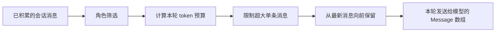

# E06：一段对话的全部历史，为什么不会原样交给模型

> 本课的问题：小林已经和旅行助手讨论了十天行程。页面与磁盘中都还保存着第一天的约定；第十天继续提问时，模型是否一定能“看见”那条约定？

小林在第一天说过：“全程预算不超过 8 000 元，且爸爸膝盖不好，不能安排连续爬山。”之后，他们依次讨论了城市、日期、酒店、火车、景点和雨天备选方案。第十天，小林只问：“把第三天改成轻松一点的安排。”

人很容易把“这段对话还保存在应用里”理解为“模型会逐字读取整段对话”。这两个判断并不等价。保存下来的材料用于恢复会话和展示历史；每次向模型发起请求时，运行时还必须依据模型允许的上下文容量，构造一份可发送的输入。早期内容可能仍然存在，却未被放进当前这一轮的模型上下文。

本课研究 `OriginOSAgent` 中这份输入是怎样形成的。这里讨论的是当前代码的上下文裁剪策略，不是通用大语言模型理论，也不是持久化恢复流程；会话怎样保存、怎样恢复将在后续单元展开。

## 1. 三份“对话”材料，承担三种不同职责

同一段旅行对话在系统中至少会以三种视角出现。名称相近时，最容易把它们混为一谈。

| 材料 | 可以包含什么 | 主要用途 | 是否保证完整 |
| --- | --- | --- | --- |
| 会话历史 | 用户消息、助手回复、工具结果以及可恢复所需信息 | 页面回显、会话恢复、审计和后续处理 | 目标是保存已发生的材料 |
| 运行时消息集合 | Agent 当前持有、可供运行时处理的消息对象 | 继续会话、派发事件、组织模型调用 | 受具体运行时状态影响 |
| 本轮模型上下文 | 从运行时消息中筛选、估算并裁剪后的 `Message[]` | 本轮向模型发送的输入 | 不保证等于完整历史 |

可以把它理解为旅行资料夹与导游手上的当日简报：资料夹可以保存十天的全部材料；出发前，导游只能把与当日决策最相关、且装得进背包的内容带上。资料夹没有丢失，并不意味着每张纸都进入了当天的背包。



图中的箭头表示一次模型调用之前的转换顺序。它不表示把消息写入磁盘的顺序，也不表示用户界面的渲染顺序。这个区分很重要：若小林发现助手忘记了第一天的预算，首先应检查“那条消息是否进入本轮上下文”，而不是立刻判断“会话数据丢失”。

## 2. 源码入口：`convertToLlm` 在请求前构造上下文

这项逻辑定义在 [packages/core/src/lib/integrations/pi-agent/core/agent.ts 第 325—412 行](../../../../packages/core/src/lib/integrations/pi-agent/core/agent.ts#L325)。`initialize()` 内部定义了局部函数 `convertToLlm(messages)`；它接收 `AgentMessage[]`，返回适配器所需的 `Message[]`。

函数的职责可压缩为一句话：**从可处理的消息中留下可发送给模型、且尽量靠近当前时刻的一段消息序列。**

下面的代码窗口保留了决定行为的主干。为了阅读方便，省略了数组内容截断的循环细节；省略处不改变本节的结论。

```ts
const convertToLlm = (messages: AgentMessage[]): Message[] => {
  const validMessages = messages.filter((m) => {
    const role: string = m.role;
    return role === "user" || role === "assistant" || role === "toolResult";
  }) as Message[];

  const contextWindow: number = modelAny?.contextWindow ?? 128000;
  const maxOutputTokens: number = modelAny?.maxTokens ?? 16384;
  const tokenBudget = contextWindow - maxOutputTokens - 4000;

  // 单条消息超过预算的 40% 时，先截断该条消息。
  // 然后从 validMessages 的末尾向前累加，最后再恢复原有时间顺序。
};
```

这段代码包含四个需要准确理解的事实。

1. **过滤发生在预算计算之前。** 当前实现仅允许角色为 `user`、`assistant`、`toolResult` 的消息继续进入 `validMessages`。其他角色即使存在于输入数组中，也不会成为这次模型调用的上下文。
2. **模型上下文窗口不全都留给输入。** `contextWindow` 是模型总容量；`maxOutputTokens` 是预留给模型输出的上限；代码还额外保留 4 000 个 token，用于 system prompt 与缓冲空间。
3. **长历史并非随机删除。** 遍历从数组最后一项开始，因而优先保留时间上较新的消息；最后使用 `unshift` 插回数组开头，所以交给模型时的消息顺序仍是从早到晚。
4. **单条异常大的消息也会被限制。** 一条消息最多可占预算的 40%，避免一整段粘贴文本挤掉几乎所有最近对话。

这里的 `as Message[]` 是 TypeScript 的类型断言，不是运行时转换器。它告诉编译器“过滤后的对象按 `Message` 对待”，但不会自动修补字段、更不会验证内容块是否合法。因此，消息的实际形状仍必须由上游创建处和适配器协议共同保证。

## 3. token 预算不是“模型容量减去一点点”

假设当前模型对象提供如下参数：

```ts
const model = {
  contextWindow: 32_000,
  maxTokens: 4_000,
};
```

按当前实现，输入消息可以使用的预算为：

```text
tokenBudget
= contextWindow - maxOutputTokens - 4000
= 32000 - 4000 - 4000
= 24000
```

这 24 000 不是“精确计算后一定能发送的 token 数”，而是运行时用来决定保留范围的上限。它体现了一个完整请求要同时容纳三类内容：

| 容量部分 | 例子 | 为什么不能全部拿来装历史 |
| --- | --- | --- |
| 系统提示词与缓冲 | 运行环境约束、技能说明、安全规则 | 它们也会进入请求，且长度不固定 |
| 输入上下文 | 小林与旅行助手的消息、工具执行结果 | 这是 `convertToLlm` 正在裁剪的对象 |
| 模型输出 | 助手生成的行程修改说明 | 若没有预留输出空间，模型可能无法完成回复 |

默认值也需要辨认清楚：若运行时模型对象没有提供 `contextWindow`，代码暂用 `128000`；若没有提供 `maxTokens`，暂用 `16384`。这是当前实现的兜底数值，不是所有模型都天然具有相同窗口，也不能据此推断供应商实际接口一定接受这些数值。

## 4. 当前实现如何估算一条消息的大小

源代码没有在此处调用分词器逐 token 计数，而是使用 `estimateTokens(content)` 进行近似估算。

```ts
const estimateTokens = (content: unknown): number => {
  if (typeof content === "string") {
    return Math.ceil(content.length / 3);
  }
  if (Array.isArray(content)) {
    return content.reduce((sum, c) => {
      if (c && typeof c === "object" && "text" in c) {
        return sum + Math.ceil((c.text as string).length / 3);
      }
      return sum;
    }, 0);
  }
  return 0;
};
```

这个函数处理两种常见内容形状：

- 字符串内容：按 `字符数 / 3` 向上取整。例如 10 个字符会估算为 4 个 token。
- 内容块数组：只累加带有 `text` 字段的对象块；没有 `text` 的块在这个估算器中贡献 0。

因此它是**用于裁剪决策的启发式估算**，并非与任意模型分词器完全一致的计数器。源码注释同时写有“chars/4 启发式，中文约 2 chars/token”，而实际表达式是 `length / 3`；理解行为时应以实际执行的 `/ 3` 为准。不同语言、标点、JSON、工具参数和不同模型的分词规则都可能使真实 token 数与该估计产生偏差。

这也解释了为什么不能把“估计值低于预算”理解成“请求在供应商侧绝不会超限”。供应商适配层、system prompt、工具定义和模型自己的分词规则都可能改变最终请求大小。当前函数解决的是本地的近似裁剪，而不是完整的精确配额证明。

## 5. 先限制一条巨型消息，再选择最近历史

假设小林把一份很长的旅行攻略粘贴进聊天框。若这一条消息占用了输入预算的绝大部分，后面刚刚确认的“第三天不要走太多路”反而可能无法进入上下文。为避免这种情况，代码规定：

```text
maxSingleMessageTokens = floor(tokenBudget × 0.4)
```

在前面的 24 000 token 示例中，单条消息的估算上限是：

```text
floor(24000 × 0.4) = 9600
```

字符串内容超过这个上限时，代码保留开头的 `9600 × 3` 个字符，并在结尾追加“内容已截断，超出 token 限制”的标记。数组内容则按内容块顺序累加文本，放不下时截断当前文本块并停止继续加入后续块。两种处理都意味着：**消息对象仍会被保留，但其中的内容可能已经不是原文全文。**

随后才是历史范围选择。下面用一个刻意缩小的数字演示实际循环。

| 时间顺序 | 消息 | 估算大小 | 相对于更早消息的保留优先级 |
| --- | --- | ---: | --- |
| 第 1 条 | 用户：总预算 8 000 元 | 30 | 最低；预算不足时最先落在截断边界之外 |
| 第 2 条 | 助手：确认预算与舒适要求 | 50 | 较低 |
| 第 3 条 | 用户：酒店偏好 | 200 | 中等 |
| 第 4 条 | 助手：酒店建议 | 300 | 较高 |
| 第 5 条 | 用户：第三天改轻松 | 40 | 更高 |
| 第 6 条 | 工具结果：景点开放时间 | 120 | 很高 |
| 第 7 条 | 助手：正在调整 | 50 | 最高；循环首先检查这一条 |

这里的表格只表达“从数组末尾向前检查”的顺序，不能单独决定最终保留结果。实际结果还取决于 `tokenBudget`、每条消息的估算大小、单条截断以及“至少保留最近两条”的例外；第 9 节用给定预算完成可计算的实例。

循环从第 7 条向第 1 条移动。假如预算在第 4 条处即将超出，而此时已经保留了至少两条消息，循环立即 `break`，第 1 至第 4 条都不会进入本轮输入。之所以不是随机删除，是因为当前意图通常由最近提问、最近工具结果和最近回复决定；保留时间连续的尾部也比抽取若干互不相邻的片段更容易维持上下文连贯性。

“至少保留最近两条”来自条件 `keptMessages.length >= 2`。如果还不足两条，即使加上下一条后超过预算，代码仍会把该条加入。这个下限是为了避免上下文被裁剪成过于孤立的一条消息；它不是严格的总大小上限保证。极端情况下，最近两条经过单条截断后仍可能使估计总量超过 `tokenBudget`。

## 6. 被过滤、被截断和未被选中，是三种不同结果

排查“模型没记住”的问题时，必须分辨消息处于哪一种状态。

| 结果 | 发生位置 | 消息是否仍可能留在会话历史中 | 对模型本轮可见性的影响 |
| --- | --- | --- | --- |
| 被角色过滤 | `validMessages` 的 `filter` | 可能仍在 | 完全不会进入这次 `Message[]` |
| 内容被截断 | `truncateMessage` | 原始材料是否保留取决于上游存储；该函数只返回一个截断副本 | 会进入，但模型只看到前段内容及截断标记 |
| 因总预算未选中 | 从后向前累加时 `break` | 可能仍在 | 不会进入这次 `Message[]` |

这张表也划清了本节的边界。`convertToLlm` 不负责删除持久化文件；它仅在初始化阶段构造交给适配器的消息数组。若要确认原始历史是否保存、恢复时如何映射不同消息形状，应查看后续会话持久化单元的 `SessionStore` 与运行时历史恢复逻辑。

## 7. 与前几课的连接：内容、事件与上下文各在不同层工作

E03 讨论了一轮交互中用户消息、助手消息和工具结果如何形成；E04 讨论这些运行事件怎样更新界面的思考状态；E05 区分了窗口、项目和会话的身份。E06 再补上一层：同一个 `sessionId` 下的历史消息，并不会自动逐条成为本轮模型输入。

可以用下面的链条概括旅行助手处理“小林修改第三天”的一次请求：

```text
会话身份 sessionId
  → 关联的历史与运行时消息
  → convertToLlm 过滤、估算、截断、选取
  → 本轮模型上下文
  → 模型流式事件
  → E04 中的界面状态与消息显示
```

链条中的箭头不是“数据复制必然成功”的承诺，而是阅读源码时应逐段验证的责任边界。页面还能显示第一天的预算，只能证明展示层或保存层持有那条信息；它不能单独证明该信息进入了当前模型请求。

## 8. 测试证据与尚未覆盖的边界

当前 [agent.test.ts](../../../../packages/core/src/lib/integrations/pi-agent/core/__tests__/agent.test.ts) 覆盖了 `OriginOSAgent` 的创建、初始化状态与基础生命周期，例如 [第 72—117 行](../../../../packages/core/src/lib/integrations/pi-agent/core/__tests__/agent.test.ts#L72) 断言 `sessionId`、`projectContext`、初始 `isThinking` 和空的 `activeTools`。这些测试说明 Agent 可使用有效配置创建，但**没有直接断言** `convertToLlm` 在预算耗尽时保留哪些消息，也没有为单条超长数组内容建立断言。

因此，本课关于裁剪顺序和 40% 单条上限的依据是 `agent.ts` 的实际实现，而不是现有自动化测试的行为证明。一个更完整的测试集至少应补充以下案例：

1. 输入中混有不支持角色时，断言它不会进入模型消息数组。
2. 预算不足且已有两条保留消息时，断言更早的消息被舍弃、较新的消息保留，且输出顺序仍从早到晚。
3. 最近两条合计仍超预算时，断言“至少两条”的例外行为被明确记录。
4. 超长字符串与超长内容块数组分别断言截断文本和截断标记。
5. 使用真实模型分词器或适配器集成测试，评估 `/ 3` 估算与实际请求限制的差异。

这些不是当前仓库已经通过的结论，而是由当前实现暴露出的测试缺口。技术教材必须把“代码存在”与“行为已被测试固定”区分开来。

## 9. 小实验：用纸面预算模拟一次裁剪

不需要运行代码，也可以验证自己是否理解算法。设定一个教学用预算：`tokenBudget = 100`，每条消息已经按当前估算器换算为如下大小。

| 编号 | 角色 | 内容含义 | 估算 token |
| --- | --- | --- | ---: |
| 1 | user | 第一日预算上限 | 30 |
| 2 | assistant | 确认预算 | 25 |
| 3 | user | 酒店偏好 | 35 |
| 4 | assistant | 酒店建议 | 20 |
| 5 | user | 第三天改轻松 | 25 |
| 6 | toolResult | 景点开放结果 | 30 |

按 6、5、4、3、2、1 的方向依次累加：先保留第 6 条和第 5 条，得到 55；再保留第 4 条，得到 75；第 3 条会使总数变成 110，并且此时已经有三条保留消息，所以循环停止。最终交给模型的是第 4、5、6 条，且顺序为 4、5、6，不是 6、5、4。

将第 6 条改为一个估算 80 token 的巨型字符串，再计算其单条上限。若 `maxSingleMessageTokens = 40`，它会先被截断为约 40 token，再与第 5、4 条一起参与总预算计算。这个变化说明单条截断和历史裁剪是连续的两步，而不是二选一。

## 10. 本课结论

小林的十天旅行历史可以完整保存，但当前模型调用只会收到 `convertToLlm` 选出的消息子集。当前实现依次执行角色过滤、预算计算、单条内容限制和从新到旧的尾部保留；返回数组则保持从早到晚的时间顺序。它优先保证最近上下文的连续性，却不保证早期约定必然可见，也不提供精确 token 计数。

下一课将把这些材料的不同形状摆在同一张类型地图中：页面使用的消息、会话存储的消息、适配器运行的消息分别有哪些字段，又为什么不能不经转换就相互替换。

## 11. 口头验收

在不查看源码的情况下，应能够准确说明：

1. 为什么“历史文件仍存在”不能推出“模型本轮看到了全部历史”。
2. `tokenBudget` 如何由 `contextWindow`、`maxTokens` 和 4 000 token 缓冲共同计算。
3. 当前实现为什么优先保留较新的消息，以及为什么最终消息顺序仍然是从早到晚。
4. “角色过滤”“单条内容截断”“因总预算未选中”三者分别意味着什么。
5. 为什么 `/ 3` 只能称为估算，而不能称为精确 token 计数。
