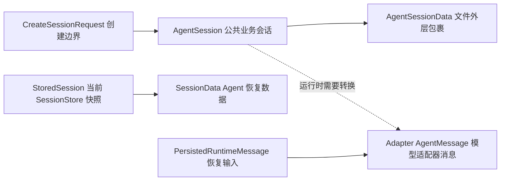

# E07：同一段对话跨越边界时，为什么不能只用一个对象

> 本课的问题：小林的旅行对话在创建、运行、保存和恢复时，看起来都叫“会话消息”。为什么项目中仍然出现多套类型？它们究竟分别保护了什么？

小林创建“毕业旅行规划”会话时，浏览器需要提交项目名、项目 ID 和可选的模型配置；旅行助手运行时，底层适配器需要能识别用户、助手和工具执行结果的消息；关闭应用后，系统要把可序列化的内容写入文件；下次恢复时，又必须依照当前模型的 API 形式补齐助手消息的运行时字段。若用一个对象同时承担这四件事，就会让网络边界、存储格式和底层适配器强耦合在一起。

本课不把“多种类型”当作抽象概念背诵，而是沿着这条真实的旅行会话链路，看清每一种形状存在的理由、字段的去向和不能直接赋值的边界。

## 1. 先区分业务事实与数据结构

“小林在某个项目中进行一段旅行对话”是一个业务事实。它至少包含会话身份、所属项目、消息内容、模型选择、状态和时间等信息。但不同边界只需要其中的一部分：

| 边界 | 接收方真正需要的内容 | 不应被迫携带的内容 |
| --- | --- | --- |
| 创建请求 | 项目身份、项目名称、可选会话 ID 与启动配置 | 还未产生的消息、服务端运行状态 |
| 业务会话合同 | 会话状态、消息、项目上下文、配置、摘要 | 适配器专有的运行时字段不必对前端公开 |
| 文件存储 | 能被 JSON 可靠保存并在下次读取的快照 | 不可序列化实例、临时订阅器 |
| 底层 Agent 运行时 | 与模型 API 相匹配的消息内容与元数据 | 页面展示专用的标题和状态标签 |

因此，类型数量不是“重复建模”的证据。它更像海关申报单、旅行档案、登机牌和航空公司内部调度单：都描述同一趟旅行的部分事实，却面对不同接收方，字段和约束自然不同。



图中实线表示类型之间存在明显的包含或转换关系；虚线表示概念上相关、但当前源码并没有把 `AgentSession` 自动原样转换成适配器消息。尤其要注意：`StoredSession` 与公共 `AgentSession` 并不是同一个接口的不同名称，它们来自不同模块，字段也不相同。

## 2. 创建边界：`CreateSessionRequest` 表达“想创建什么”，不是完整会话

[packages/core/src/types/agent.ts 第 216—239 行](../../../../packages/core/src/types/agent.ts#L216) 定义了公共创建请求 `CreateSessionRequest`：

```ts
export interface CreateSessionRequest {
  projectId: string;
  projectName: string;
  systemPrompt?: string;
  agentType?: string;
  projectContext?: Partial<SessionProjectContext>;
  sessionId?: string;
  llmConfig?: {
    provider?: string;
    baseUrl?: string;
    apiKey?: string;
    // 其余模型认证与 maxTokens 字段省略
  };
}
```

它可以对应小林点击“新建毕业旅行规划”时发出的意图：

```ts
const request: CreateSessionRequest = {
  projectId: "project-graduation-trip",
  projectName: "毕业旅行",
  agentType: "travel-planner",
  sessionId: "trip-2026-xiaolin",
  projectContext: { currentPath: "/data/projects/graduation-trip" },
  llmConfig: { provider: "openai", model: "example-model", maxTokens: 4096 },
};
```

这里有三个容易混淆的点。第一，`projectId` 和 `projectName` 都是必填字段：前者用于稳定关联项目，后者通常用于展示或启动语义；名称可以被人读懂，却不适合作为唯一身份。第二，`sessionId` 是可选的，注释明确说明它可以由客户端提供；可选不表示系统中没有会话身份，而是创建边界允许调用方不提供。第三，`projectContext` 的类型是 `Partial<SessionProjectContext>`，意味着请求阶段只提交已有的上下文字段，而不要求一次填满完整上下文。

请求对象没有 `createdAt`、`updatedAt`、`messages` 或 `status`。这不是缺字段，而是时间上的事实：创建请求发生在会话尚未完整存在之前。把“尚未发生的历史”和“服务端决定的生命周期状态”要求客户端传入，会模糊责任归属，也容易被伪造或误用。

## 3. 公共会话合同：`AgentSession` 描述一个已经存在的业务会话

同一文件的 [packages/core/src/types/agent.ts 第 180—213 行](../../../../packages/core/src/types/agent.ts#L180) 定义 `AgentSession`。与创建请求相比，它描述的是已经形成的会话整体：

```ts
export interface AgentSession {
  sessionId: string;
  createdAt: number;
  updatedAt: number;
  status: "active" | "completed" | "archived" | "cancelled";
  messages: AgentMessage[];
  projectContext: SessionProjectContext;
  systemPrompt: string;
  agentType: string;
  config: AgentSessionConfig;
  summary?: string;
  llmConfig?: { /* 模型与认证配置 */ };
}
```

这里的 `status` 不是界面上“正在思考”的临时指示灯。它描述会话生命周期，例如 `active`、`archived`；而 E04 中的 `isThinking` 描述一轮运行期间的即时 UI 状态。两者都可能在页面上显示，却不能互相替代。

`messages` 的元素类型是这个公共文件中的 `AgentMessage`，其结构见 [packages/core/src/types/agent.ts 第 142—161 行](../../../../packages/core/src/types/agent.ts#L142)：它有 `id`、字符串 `content`、`timestamp`，并可包含 `toolResults`、`metadata` 和仅助手消息使用的 `thinking`。这个形状对业务层和前端协议很友好：文本内容可以直接展示，消息有稳定 ID，思考信息有明确的可选位置。

然而，`AgentSession` 也不等同于磁盘文件。文件系统中的顶层数据需要版本与 ISO 日期字符串，项目的统一数据封装由 `AgentSessionData` 表示：

```ts
export interface AgentSessionData {
  version: string;
  createdAt: string;
  updatedAt: string;
  data: AgentSession;
}
```

这里存在两层时间字段：外层 `createdAt`、`updatedAt` 是文件封装元数据，内层 `data.createdAt`、`data.updatedAt` 是会话业务时间，且两者类型分别是字符串和数字。名称相同不能成为省略转换与验证的理由；读取 JSON 时必须知道自己正在处理哪一层。

## 4. 当前 `SessionStore` 的快照：`StoredSession` 是另一份合同

现在转向 [packages/core/src/lib/integrations/pi-agent/session-store.ts 第 16—39 行](../../../../packages/core/src/lib/integrations/pi-agent/session-store.ts#L16)。这里的 `StoredSession` 是当前 `SessionStore` 使用的可序列化会话快照：

```ts
export interface StoredSession {
  id: string;
  name: string;
  createdAt: number;
  updatedAt: number;
  messages: AgentMessage[];
  systemPrompt: string;
  model: { provider: string; id: string };
  projectContext?: ProjectContext;
}
```

这段代码中的 `AgentMessage` 并非前一节公共 `types/agent.ts` 的类型，而是从 `@originos/pi-agent-adapter` 导入。仅凭同名就把二者视为同一结构，是 TypeScript 项目中很危险的阅读方式。适配器消息需要服务模型运行；公共消息则服务于产品层的会话协议。若要确认它们是否在某一个具体版本中结构兼容，应查看类型定义、赋值点与编译结果，不能依据名称猜测。

将 `AgentSession` 与 `StoredSession` 放在一起，差异更加清楚：

| 维度 | `AgentSession`（公共业务会话） | `StoredSession`（当前存储快照） | 设计含义 |
| --- | --- | --- | --- |
| 会话主键 | `sessionId` | `id` | 同一概念使用不同字段名，转换时必须显式映射 |
| 显示名称 | 无 `name` | 必填 `name` | 会话列表需要标题，公共合同未把它作为核心字段 |
| 生命周期 | 必填 `status` | 无此字段 | 当前快照未直接保存公共会话状态 |
| Agent 配置 | `agentType`、`config` | 无此字段 | 存储快照的职责更窄 |
| 模型信息 | 可选、字段较丰富的 `llmConfig` | 必填的 `provider`、`id` | 当前恢复至少需要识别模型来源与 ID |
| 项目上下文 | 必填 `SessionProjectContext` | 可选 `ProjectContext` | 两个上下文类型也来自不同模块 |
| 消息类型 | 公共 `AgentMessage` | 适配器 `AgentMessage` | 名称相同，导入来源不同 |

这不是对代码优劣的评价，而是当前源码事实。它直接带来一个工程结论：不能用 `as StoredSession` 把 `AgentSession` 强行伪装成存储快照，也不应期待两者能无损相互赋值。需要明确的转换函数、版本策略和测试，才能让字段差异变得可追踪。

## 5. 存储列表外层：当前会话是指针，不是第二份会话

`SessionStore` 还定义了：

```ts
export interface SessionsListData {
  currentSessionId: string | null;
  sessions: StoredSession[];
}
```

它保存到 `data/sessions/sessions.json`。`currentSessionId` 只记录“当前选中哪一个会话”，它不复制一份 `StoredSession`。因此，若 `currentSessionId` 为 `"trip-2026-xiaolin"`，正确的读取过程是：先用该 ID 在 `sessions` 中查找对应快照；如果 ID 为 `null`，当前没有选中的会话；如果 ID 指向不存在的项，则数据不一致，需要由读取与修复策略处理。

`setCurrentSession(sessionId)` 的实现见 [packages/core/src/lib/integrations/pi-agent/session-store.ts 第 179—195 行](../../../../packages/core/src/lib/integrations/pi-agent/session-store.ts#L179)：先在 `sessions` 中验证目标存在，找不到则返回 `false` 且不写入；找到后才更新 `currentSessionId` 并调用 `jsonStore.write`。这说明“当前会话”是一个受存在性约束的引用，而不是任意字符串标签。

## 6. 适配器运行时消息：为什么恢复时不能直接把字符串塞回去

`StoredSession.messages` 使用的是适配器的 `AgentMessage[]`。但另一条恢复路径更清楚地展示了“存储形状”到“运行时形状”的转换：

- [packages/core/src/lib/integrations/pi-agent/core/runtime-history.ts 第 8—12 行](../../../../packages/core/src/lib/integrations/pi-agent/core/runtime-history.ts#L8) 定义 `PersistedRuntimeMessage`，仅保存 `role`、字符串 `content` 和 `timestamp`。
- [packages/core/src/lib/integrations/pi-agent/core/runtime-history.ts 第 57—91 行](../../../../packages/core/src/lib/integrations/pi-agent/core/runtime-history.ts#L57) 的 `mapPersistedMessagesForRuntime` 将它映射为适配器 `AgentMessage[]`。
- [packages/core/src/lib/integrations/pi-agent/core/agent.ts 第 1416—1426 行](../../../../packages/core/src/lib/integrations/pi-agent/core/agent.ts#L1416) 的 `replacePersistedMessages` 使用当前运行模型完成映射，并替换内部 `state.messages`。

映射规则值得逐项阅读：

| 持久化角色 | 映射后的运行时消息 | 原因与限制 |
| --- | --- | --- |
| `system` | 被丢弃 | 当前恢复函数不把已保存 system 消息放入运行时历史 |
| `user` | 原样成为 `role: "user"`，保留字符串内容与时间 | 用户文本无需补充模型专有字段 |
| `assistant` | 内容变为文本内容块数组，并补入 `api`、`provider`、`model`、`usage`、`stopReason` | 适配器助手消息需要符合当前模型 API 的运行时结构 |
| `tool` / `toolResult` | 转成一条带标签的用户消息 | 当前实现保留可读文本，但不恢复为原始工具调用状态机 |

例如，持久化的助手回复可能只是：

```ts
{ role: "assistant", content: "第三天改为博物馆和河边散步。", timestamp: 1_700_000_000_000 }
```

恢复后，它会成为类似下列的运行时对象：

```ts
{
  role: "assistant",
  content: [{ type: "text", text: "第三天改为博物馆和河边散步。" }],
  api: currentModel.api,
  provider: currentModel.provider,
  model: currentModel.id,
  usage: { input: 0, output: 0, /* 其余字段为 0 */ },
  stopReason: "stop",
  timestamp: 1_700_000_000_000,
}
```

`usage` 被恢复为 0 并不意味着历史调用实际没有消耗 token；它表示这条持久化文本在恢复时没有携带原始用量数据，函数创建了满足适配器结构的零值占位。将“恢复所需字段”误读为“历史真实计费记录”会造成错误的统计结论。

此外，`toRestorableRuntimeModel` 只接受 `anthropic-messages`、`openai-completions`、`google`、`azure-openai-responses` 四种 API；其他 API 会抛出“不支持恢复消息的 Runtime API”错误。因此，“任何已保存会话都能对任何模型恢复”并不是当前代码提供的承诺。

## 7. `SessionStore` 的显式映射：字段改名发生在哪里

`SessionStore` 没有把持久化对象直接暴露为 `SessionData`。它在 [packages/core/src/lib/integrations/pi-agent/session-store.ts 第 241—288 行](../../../../packages/core/src/lib/integrations/pi-agent/session-store.ts#L241) 提供三个静态方法：

| 方法 | 输入 → 输出 | 关键映射 |
| --- | --- | --- |
| `fromAgentSession` | 参数集合 → `StoredSession` | 生成 `name`，组织 `id`、消息、提示词、模型和项目上下文 |
| `toAgentSession` | `StoredSession` → `Partial<SessionData>` | `id → sessionId`，保留消息、提示词、模型、时间和项目上下文 |
| `toSessionData` | `StoredSession` → `SessionData` | 与前者字段相近，但返回完整 `SessionData` |

例如 `toSessionData` 中的核心映射是：

```ts
return {
  sessionId: session.id,
  messages: session.messages,
  systemPrompt: session.systemPrompt,
  model: session.model,
  createdAt: session.createdAt,
  updatedAt: session.updatedAt,
  projectContext: session.projectContext,
};
```

这段映射比类型断言更有价值，因为它把字段名变化写成可阅读、可测试、可修改的代码。若未来将 `StoredSession.id` 改为 `sessionId`，或为公共会话增加旅行开始日期，审查者可以从这些转换函数出发，明确追踪哪些边界会受影响。

## 公共导出边界：类型存在于文件中，不等于调用方一定能导入

[packages/core/src/lib/integrations/pi-agent/index.ts 第 1—110 行](../../../../packages/core/src/lib/integrations/pi-agent/index.ts#L1) 是集成模块的公共出口之一。它重新导出 `session-store`、公共会话类型、消息协议、健康检查、`llm-config`、Skill 框架与恢复能力，同时用注释标出哪些内容仅适用于服务端或客户端安全路径。这个文件没有创建新会话，也没有改变任何字段；它决定的是“其他模块从哪里合法获得这些能力”。

因此，阅读类型边界时必须区分两件事：

| 问题 | 应检查的位置 | 示例 |
| --- | --- | --- |
| 数据本身有哪些字段、怎样转换 | 类型文件与转换函数 | `AgentSession`、`StoredSession`、`toSessionData` |
| 调用方能否通过公共 API 获得它 | `index.ts`、`hooks.ts` 等导出文件 | 浏览器应使用客户端安全 Hook，而非直接导入 Node 依赖实现 |

将内部文件直接导入到不合适的层，即使 TypeScript 暂时能编译，也会破坏模块边界。导出 barrel 是源码地图中的独立文件，应作为公共 API 合同阅读，而不是被“只有 export”这一表象跳过。

## 8. 测试证据与尚未覆盖的边界

当前 [packages/core/src/lib/integrations/pi-agent/__tests__/session-store.test.ts 第 424—454 行](../../../../packages/core/src/lib/integrations/pi-agent/__tests__/session-store.test.ts#L424) 对 `fromAgentSession` 和 `toSessionData` 做了基础断言：ID、消息、system prompt 和 project context 能从输入映射到结果。这些测试为最基本的字段去向提供了证据。

[packages/core/src/lib/integrations/pi-agent/core/__tests__/runtime-history-restore.test.ts 第 52—70 行](../../../../packages/core/src/lib/integrations/pi-agent/core/__tests__/runtime-history-restore.test.ts#L52) 则分别以 OpenAI 与 Anthropic 运行时模型验证：恢复后的助手消息会使用当前模型的 `api`、`provider`、`model`，并把文本转换成内容块数组。它证明恢复不是单纯的字符串复制。

但下列风险尚未由这些测试直接覆盖：

1. `system`、`tool`、`toolResult` 三类持久化消息的映射结果及顺序。
2. 不受支持的 Runtime API 抛错后的上层处理与用户可见反馈。
3. 公共 `AgentSession` 与 `StoredSession` 之间完整的兼容或迁移策略。
4. JSON 文件的版本升级、字段缺失和损坏数据恢复。
5. 将 `SessionStore` 的适配器消息写入、读出后，是否能在真实模型请求中继续工作。

因此，测试不能被概括为“会话类型已经完全可靠”。现有测试验证了几个关键转换片段；完整的跨边界兼容性仍需要更多集成与迁移测试。

## 9. 小实验：为“旅行开始日期”设计一次安全的字段扩展

假设产品需要保存小林的 `departureDate`（出发日期）。不要立刻在某一个接口里加字段。先按边界回答四个问题：

1. 创建会话时用户是否需要提交它？若需要，它可能进入 `CreateSessionRequest` 或 `projectContext`。
2. 它是会话本身的长期属性，还是项目属性？若属于会话，公共 `AgentSession` 的字段设计需要讨论；若属于项目，应避免复制到每条消息。
3. 重启后必须保留吗？若必须，`StoredSession`、其读写逻辑和历史数据兼容策略都需要变化。
4. Agent 运行时是否需要它来回答问题？若需要，转换到 `SessionData`、system prompt 或模型上下文的路径也要明确。

随后至少补三类测试：创建请求的验证测试、`StoredSession ↔ SessionData` 的转换测试、已有旧文件缺少该字段时的恢复测试。这样做的目的不是让字段“到处都有”，而是保证每一条边界都有明确的拥有者。

## 10. 本课结论

一段旅行对话不是一个能无条件通行所有层的对象。`CreateSessionRequest` 表达创建意图，`AgentSession` 是公共业务会话合同，`AgentSessionData` 为文件封装增加版本与字符串时间，`StoredSession` 是当前 `SessionStore` 的快照，适配器 `AgentMessage` 则服务于模型运行，而 `PersistedRuntimeMessage` 只保留恢复所需的最小文本形状。

字段名相同不代表类型相同，字段名不同也不代表业务事实不同。可靠的系统依赖显式映射、清楚的丢失语义和相应测试，而不是用类型断言绕过边界。

下一课将以一次不连接模型的会话工作坊收束 E01—E08：从创建身份、写入消息、选择当前会话到观察恢复转换，逐项验证本单元的概念。

## 11. 口头验收

在不查看源码的情况下，应能够说明：

1. 为什么 `CreateSessionRequest` 不应包含已经发生的 `messages` 与服务端决定的 `status`。
2. `AgentSessionData` 外层与 `AgentSession` 内层为什么各自有时间字段，且类型不同。
3. `StoredSession.id` 与 `AgentSession.sessionId` 为什么必须通过显式映射处理。
4. 为什么 `StoredSession` 的 `AgentMessage` 不能仅因同名就被当作公共消息类型。
5. 恢复持久化助手消息时，哪些模型专有字段由当前运行模型补入；工具结果又为何没有恢复成原始工具状态机。
