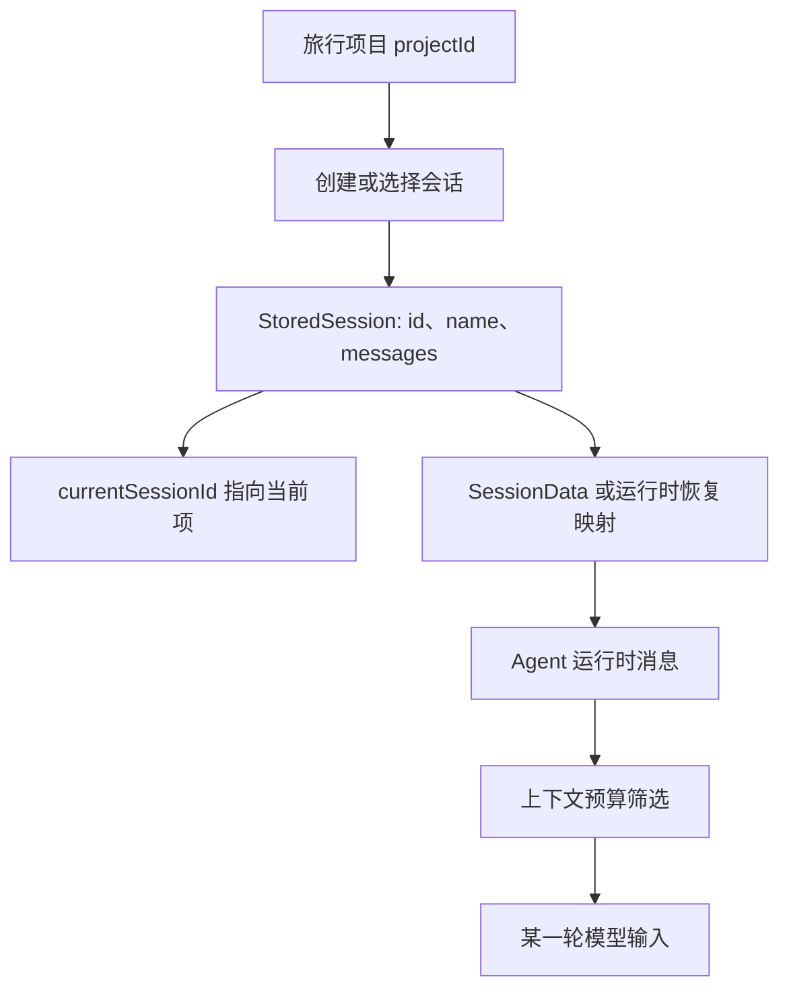
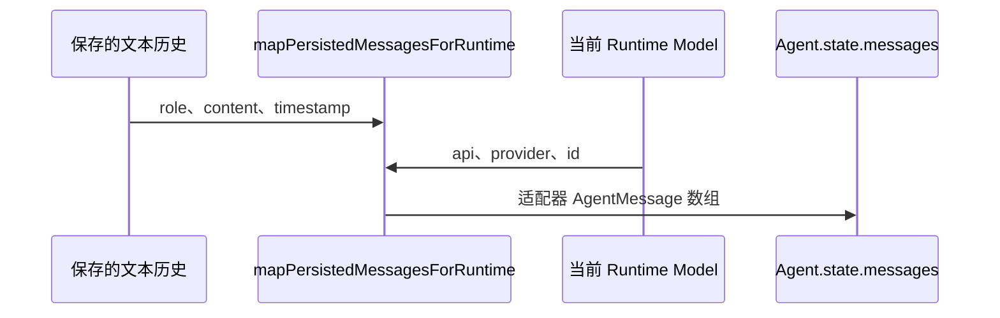

# E08：综合工作坊：不用连接模型，也能验证一段旅行会话的骨架

> 本课目标：以“小林的毕业旅行策划”为例，在不配置 API Key、不调用真实模型的前提下，完整走通“项目归属 → 会话身份 → 存储快照 → 当前会话 → 运行时恢复 → 本轮上下文”的概念链条。

前七课分别讨论了窗口与会话、启动配置、一轮交互、即时状态、身份、上下文裁剪和跨边界类型。它们若只分别记住，仍不足以解释真实系统。一个合格的理解应当能够回答：小林关闭旅行窗口后，什么会消失、什么仍能恢复；重新选择这段会话后，哪个 ID 起作用；历史消息怎样重新成为运行时消息；为什么即使恢复成功，早期预算也未必进入下一次模型调用。

本工作坊不要求修改仓库源码。所有操作都围绕 `SessionStore` 的现有行为和已有测试设计，使注意力集中在数据责任，而非模型账号或网络环境。

## 1. 实验边界与预期成果

本实验刻意不连接模型。它能够验证会话存储与转换的局部事实，却不能证明真实供应商请求、流式事件或模型回答质量。边界明确后，观察结果才不会被过度解读。

完成本课后，应能形成一份简短的“旅行会话事实表”，至少包含：

| 项目 | 应能写出的结论 | 对应的源码依据 |
| --- | --- | --- |
| 项目身份 | 旅行项目通过 `projectId` 归属，不用标题代替稳定 ID | [packages/core/src/types/agent.ts 第 216 行](../../../../packages/core/src/types/agent.ts#L216) 与 [packages/core/src/lib/integrations/pi-agent/types.ts 第 243 行](../../../../packages/core/src/lib/integrations/pi-agent/types.ts#L243) |
| 会话身份 | 公共与运行路径使用 `sessionId`；当前存储快照用 `id`，转换时显式映射 | [packages/core/src/lib/integrations/pi-agent/session-store.ts 第 22 行](../../../../packages/core/src/lib/integrations/pi-agent/session-store.ts#L22) 与 [packages/core/src/lib/integrations/pi-agent/session-store.ts 第 278 行](../../../../packages/core/src/lib/integrations/pi-agent/session-store.ts#L278) |
| 当前选择 | `currentSessionId` 是指向会话列表中某项的引用 | [packages/core/src/lib/integrations/pi-agent/session-store.ts 第 16 行](../../../../packages/core/src/lib/integrations/pi-agent/session-store.ts#L16) 与 [packages/core/src/lib/integrations/pi-agent/session-store.ts 第 179 行](../../../../packages/core/src/lib/integrations/pi-agent/session-store.ts#L179) |
| 存储内容 | 会话快照保存消息、提示词、模型信息与可选项目上下文 | [packages/core/src/lib/integrations/pi-agent/session-store.ts 第 22 行](../../../../packages/core/src/lib/integrations/pi-agent/session-store.ts#L22) |
| 恢复内容 | 持久化文本会按当前模型 API 转成适配器运行时消息 | [packages/core/src/lib/integrations/pi-agent/core/runtime-history.ts 第 57 行](../../../../packages/core/src/lib/integrations/pi-agent/core/runtime-history.ts#L57) |
| 模型可见内容 | 完整历史还会经过过滤、预算和尾部保留 | [packages/core/src/lib/integrations/pi-agent/core/agent.ts 第 325 行](../../../../packages/core/src/lib/integrations/pi-agent/core/agent.ts#L325) |



图中的 `currentSessionId` 与消息恢复是两条不同的箭头：前者决定列表中“当前选中哪一段”；后者决定“怎样把已有数据组织为 Agent 可用的形状”。选中一段会话不等于已经把它成功恢复给模型。

## 2. 准备：建立一份纸面会话快照

先不运行代码，建立如下教学数据。时间戳使用任意递增数字即可；它们只用于说明先后顺序，不表示真实日期。

```ts
const tripSession = {
  id: "trip-2026-xiaolin",
  name: "小林毕业旅行",
  createdAt: 1_700_000_000_000,
  updatedAt: 1_700_000_120_000,
  systemPrompt: "你是谨慎的旅行规划助手。",
  model: { provider: "openai", id: "example-model" },
  projectContext: {
    projectId: "project-graduation-trip",
    projectName: "毕业旅行",
    currentPath: "/data/projects/graduation-trip",
  },
  messages: [
    { role: "user", content: "预算不超过 8000 元。", timestamp: 1_700_000_010_000 },
    { role: "assistant", content: "已记录预算上限。", timestamp: 1_700_000_020_000 },
    { role: "user", content: "第三天不要安排连续爬山。", timestamp: 1_700_000_030_000 },
  ],
};
```

这是一份帮助理解 `StoredSession` 的教学对象，不应直接当作生产环境的适配器消息类型样例。实际 [packages/core/src/lib/integrations/pi-agent/session-store.ts 第 22 行](../../../../packages/core/src/lib/integrations/pi-agent/session-store.ts#L22) 使用从 `@originos/pi-agent-adapter` 导入的 `AgentMessage[]`；不同适配器版本可能对助手消息的字段有额外要求。本课先使用字符串形式把注意力放在会话层的关系上。

将它与一个列表外层放在一起：

```ts
const sessionsList = {
  currentSessionId: "trip-2026-xiaolin",
  sessions: [tripSession],
};
```

此处可验证的第一条事实是：`currentSessionId` 不保存小林的所有消息，它只是指向 `sessions` 中 ID 相同的那一项。若把 `currentSessionId` 改为 `"missing-session"`，列表对象在语法上仍可写出，但它已经产生引用不一致；`SessionStore.setCurrentSession` 会先验证目标存在，避免通过其公开方法创建这种状态。

## 3. 实验一：从“新会话”观察哪些事实尚未发生

阅读 [packages/core/src/lib/integrations/pi-agent/session-store.ts 第 198—217 行](../../../../packages/core/src/lib/integrations/pi-agent/session-store.ts#L198)。它会构造一个新的 `StoredSession`，关键字段如下：

```ts
const session: StoredSession = {
  id: this.generateSessionId(),
  name: name || "新会话",
  createdAt: Date.now(),
  updatedAt: Date.now(),
  messages: [],
  systemPrompt: "",
  model: { provider: "anthropic", id: "claude-haiku-4-5" },
};
```

### 观察 A：为什么消息数组为空

`messages: []` 不是“系统忘记保存消息”。创建动作仅建立容器；小林还没有提交旅行需求，因此不存在可保存的对话历史。将空数组与“模型没有上下文”区分开：空会话尚未有用户消息；已有长会话被 E06 的预算裁剪，则是历史存在但本轮输入被选择。

### 观察 B：为什么已有模型信息却没有完整 Agent 运行时

新会话默认保存 `provider` 与 `id`，这使后续恢复至少能知道使用哪一类模型。但它没有由此自动生成 `OriginOSAgent` 实例、工具集合、网络连接或 `isThinking`。模型标识是可持久化配置；运行时对象与即时状态属于另一层。E02 与 E04 的区别在这里得到一次具体验证。

### 观察 C：创建会话会不会成为当前会话

`createSession` 的最后调用 `saveSession(session)`；而 `saveSession` 会将 `this.sessionsCache!.currentSessionId = sessionData.id`。因此，新建会话会成为当前会话。这不是由窗口标题推断出来的，而是由写入逻辑决定的行为。

已有 [packages/core/src/lib/integrations/pi-agent/__tests__/session-store.test.ts 第 83—106 行](../../../../packages/core/src/lib/integrations/pi-agent/__tests__/session-store.test.ts#L83) 覆盖了生成 ID、默认名称以及“新建会话成为当前会话”的事实。测试名称说明了验证意图；实际断言才是可重复的证据。

## 4. 实验二：在两段旅行会话之间切换

现在增加一段独立会话。它可能是小林为“毕业旅行”项目建立的备用方案，也可能属于另一个项目；无论哪种情况，它都必须拥有不同会话 ID。

```text
sessions = [
  { id: "trip-main", name: "东京五日游", ... },
  { id: "trip-backup", name: "雨天备选方案", ... },
]
currentSessionId = "trip-backup"
```

阅读 [packages/core/src/lib/integrations/pi-agent/session-store.ts 第 179—195 行](../../../../packages/core/src/lib/integrations/pi-agent/session-store.ts#L179)，然后按顺序推演：

1. 方法先在 `sessions` 中查找传入 ID。
2. 若找不到，返回 `false`，不会改写当前指针。
3. 若找到，写入新的 `currentSessionId`，再通过 `jsonStore.write` 持久化整个列表数据，返回 `true`。

这段流程产生两个不应被遗漏的边界。

| 操作 | 正确的结论 | 不应得出的结论 |
| --- | --- | --- |
| `setCurrentSession("trip-main")` 成功 | 当前选择从备选方案切到主行程 | 已自动向模型发送所有主行程历史 |
| `setCurrentSession("does-not-exist")` 返回 `false` | 存储层拒绝悬空引用 | 网络、模型或工具调用发生错误 |
| 关闭一个聊天窗口 | 窗口实例可能消失 | `sessions.json` 中的快照必然被删除 |

[packages/core/src/lib/integrations/pi-agent/__tests__/session-store.test.ts 第 219—248 行](../../../../packages/core/src/lib/integrations/pi-agent/__tests__/session-store.test.ts#L219) 针对存在的目标与多次切换进行断言。该测试支持“切换当前会话指针”的结论，但它不覆盖浏览器窗口行为，也不覆盖真实服务端会话路由，因此不能扩大解释范围。

## 5. 实验三：删除当前会话时，系统为什么要清空指针

继续阅读 [packages/core/src/lib/integrations/pi-agent/session-store.ts 第 125—148 行](../../../../packages/core/src/lib/integrations/pi-agent/session-store.ts#L125)。删除逻辑先从 `sessions` 数组移除目标；如果被删 ID 正好等于 `currentSessionId`，再把当前指针设置为 `null`。

这是引用完整性的基本规则。假设当前值仍然保留 `"trip-main"`，但数组中已经没有该对象，后续 `loadCurrentSession` 会找不到会话。清空为 `null` 明确表达“目前没有选择任何有效会话”，比保留一个过期 ID 更可诊断。

已有 [packages/core/src/lib/integrations/pi-agent/__tests__/session-store.test.ts 第 283—330 行](../../../../packages/core/src/lib/integrations/pi-agent/__tests__/session-store.test.ts#L283) 覆盖了删除存在与不存在会话、删除当前会话后 `loadCurrentSession()` 返回 `null`、删除非当前会话不影响当前选择。这是本工作坊中最适合用自动化测试复核的异常路径之一。

删除存储快照也不等于已经中断正在运行的模型请求。`SessionStore` 的职责是会话文件与缓存管理；请求中断、工具执行与 UI 状态应沿 E03、E04 的 Agent 运行时路径分析。跨层副作用若没有显式调用链，就不能假定必然发生。

## 6. 实验四：把已保存文本恢复为运行时消息

前面的 `StoredSession` 描述的是一个存储快照。运行时恢复的另一条路径由 [packages/core/src/lib/integrations/pi-agent/core/runtime-history.ts 第 57—91 行](../../../../packages/core/src/lib/integrations/pi-agent/core/runtime-history.ts#L57) 的 `mapPersistedMessagesForRuntime` 展示。它接受最小持久化消息：

```ts
type PersistedRuntimeMessage = {
  role: "user" | "assistant" | "system" | "tool" | "toolResult";
  content: string;
  timestamp: number;
};
```

设定以下两条小林历史：

```ts
const history = [
  { role: "user", content: "预算不超过 8000 元。", timestamp: 10 },
  { role: "assistant", content: "已记录预算上限。", timestamp: 20 },
] as const;
```

在一个 OpenAI 运行时模型下，恢复函数产生两个适配器消息：第一条仍是用户字符串；第二条助手内容变为文本内容块，并从当前模型带入 `api`、`provider` 与 `model`。这一步解释了“恢复”不是读取 JSON 后把对象原样放回内存，而是**按当前运行时协议重建可接受的消息结构**。



两项限制必须同时写进实验结论：

- `system` 消息在该映射函数中被过滤，不会生成运行时消息。
- `tool` 与 `toolResult` 被包装成带标签的用户消息文本，并未恢复成原始的工具调用状态。

因此，恢复之后的历史可以支持继续对话，但未必保留了历史执行过程的全部机器可读细节。若产品要求精确重放工具调用，当前映射规则不足以满足要求，需要另外设计持久化协议与状态恢复机制。

[packages/core/src/lib/integrations/pi-agent/core/__tests__/runtime-history-restore.test.ts 第 52—70 行](../../../../packages/core/src/lib/integrations/pi-agent/core/__tests__/runtime-history-restore.test.ts#L52) 已验证 OpenAI 和 Anthropic 两种模型下，助手消息会继承当前模型的 `api`、`provider`、`model`，并使用文本内容块。该测试没有覆盖工具角色与不受支持 API 的异常路径；本实验应把它们列为未验证边界，而非默认认为已正确处理。

## 7. 实验五：恢复成功，不等于早期预算已进入本轮输入

将小林第一天的“预算不超过 8 000 元”恢复为 `Agent.state.messages` 后，仍有最后一道选择：E06 的 `convertToLlm`。它只接纳 `user`、`assistant`、`toolResult` 角色，计算可用预算，限制单条巨型内容，再从最新消息向前保留。

因此应把两个问题分开记录：

| 问题 | 需要检查的位置 | 成功意味着什么 |
| --- | --- | --- |
| 第一日预算是否被恢复进运行时消息 | `mapPersistedMessagesForRuntime` 或 `SessionStore` 的恢复路径 | 内存中存在可供后续处理的表示 |
| 第一日预算是否进入下一轮模型请求 | `convertToLlm` 的角色过滤与 token 预算选择 | 该条在本轮输入 `Message[]` 中 |

若第一题为“是”、第二题为“否”，并不矛盾。这正是长会话中“页面还显示，模型却似乎忘记”的一个可能原因。它还提示一个产品设计问题：关键旅行约束若必须长期可见，不能只依赖早期闲聊消息；后续课程会讨论更可靠的摘要、记忆或项目上下文策略。

## 8. 可选的自动化复核与环境说明

仓库已有 `SessionStore` 的单元测试。依赖已经安装且包脚本可用时，可以从仓库根目录执行：

```bash
pnpm --filter @originos/core exec vitest run src/lib/integrations/pi-agent/__tests__/session-store.test.ts
```

这条命令应被理解为“请求 Vitest 执行该测试文件”，不是对环境成功的保证。若出现 `vitest: command not found`，说明当前依赖或包命令不可用；若出现权限、Corepack 或包管理器下载错误，说明环境准备失败。它们不能用来判断 `SessionStore` 逻辑通过或失败。

即使命令通过，得到的证据范围也仅限该测试文件的断言：新建、保存、加载、重命名、删除、当前会话和静态转换等。真实 API 请求、浏览器交互、模型 API 兼容性和历史裁剪仍需要对应的集成测试或人工验证。

本单元新增的协议与工具状态阅读还对应两项独立测试：[packages/core/src/lib/integrations/pi-agent/__tests__/message.test.ts](../../../../packages/core/src/lib/integrations/pi-agent/__tests__/message.test.ts) 验证消息协议工具的验证与转换，[packages/core/src/lib/integrations/pi-agent/core/__tests__/tool-event-status.test.ts](../../../../packages/core/src/lib/integrations/pi-agent/core/__tests__/tool-event-status.test.ts) 验证工具结果形状到失败状态的归一化。两项测试均不替代真实客户端发送链或窗口错误提示的端到端验证。

## 9. 工作坊验收表

将下面各项逐条答成完整句子。每一项都应包含至少一个真实字段名或函数名，而不是只使用“会话”“状态”等泛称。

| 验收问题 | 合格回答应包含的证据 |
| --- | --- |
| 小林新建旅行会话时，为什么 `messages` 是空数组？ | `createSession`、尚未产生消息、容器与历史的区别 |
| 为什么新建会话会成为当前会话？ | `createSession → saveSession`、`currentSessionId = sessionData.id` |
| 选择另一段会话时，`setCurrentSession` 先做什么验证？ | 在 `sessions` 中按 ID 查找、失败返回 `false` |
| 删除当前会话后，为什么是 `null` 而不是保留旧 ID？ | 引用完整性、避免悬空 `currentSessionId`、`loadCurrentSession` |
| 为什么持久化助手文本不能直接等同于运行时助手消息？ | 内容块、`api/provider/model`、`mapPersistedMessagesForRuntime` |
| 为什么恢复了早期预算，模型仍可能没遵守它？ | `convertToLlm`、token 预算、从最新消息向前保留 |

若任一回答只能说出“系统会保存”“模型会记住”而说不出字段、函数与边界，则应回到对应课程核对源码。形式化术语不是目标；能够根据具体数据流定位责任，才是本单元的学习成果。

## 10. E01—E08 单元结论

小林的旅行窗口、旅行项目、旅行会话和 Agent 运行时不是同一个对象：窗口负责当前可见界面；项目提供长期归属；`sessionId` 串起连续对话；运行时配置决定本次 Agent 如何工作；事件更新即时 UI 状态；存储快照服务于重新打开；恢复转换重建适配器消息；上下文预算最终决定模型本轮实际可见的历史。

这一单元尚未解释浏览器如何向服务端创建会话、消息怎样通过网络流式返回。现在具备这些基础概念后，下一单元才能准确分析客户端请求、服务端路由与流式传输，而不会把网络失败、会话选择错误、运行时状态和模型上下文问题混为一谈。
