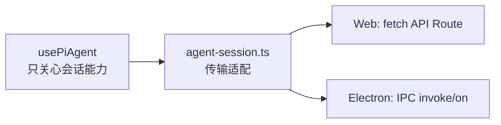

# E09：浏览器不是 Agent 运行时

小林打开旅行规划窗口时，屏幕上已经出现输入框、消息列表和发送按钮。对零基础读者来说，很容易产生一个直觉：既然对话发生在浏览器里，那 Agent 应该也在浏览器里工作。

这节课要先拆掉这个误解。

Pi Agent 的前端 Hook 负责“让用户能对话”，但它不负责“让模型思考”。浏览器侧保存的是界面状态、当前会话身份、正在发送或正在流式生成的状态、错误提示、前端消息列表；真正的 Agent 运行时由服务端或桌面主进程侧的运行时管理。只有分清这一点，后面读创建会话、发送消息、SSE、停止生成时才不会混乱。

## 1. 本节源码入口

| 文件 | 本节关注点 |
| --- | --- |
| `packages/core/src/lib/integrations/pi-agent/client-hooks.ts` | React 客户端 Hook，维护 UI 状态、创建会话、发送消息、处理流式事件 |
| `packages/core/src/lib/integrations/electron/services/agent-session.ts` | Electron 与 Web 两种环境下的会话传输适配层 |

这一节不进入具体模型调用，也不进入持久化恢复细节。我们只建立边界：客户端可以保存什么，不能直接做什么。

## 2. 客户端 Hook 保存的不是“Agent 本体”

在 `client-hooks.ts` 里，`usePiAgent` 暴露给 UI 的状态大致包括：

| 状态 | 面向 UI 的意义 | 不能误解成什么 |
| --- | --- | --- |
| `sessionId` | 当前窗口绑定的是哪段会话 | 不是 Agent 进程本身 |
| `messages` | 当前页面要显示的消息列表 | 不一定等同于磁盘上最终保存的消息 |
| `isInitialized` | 这段客户端对话是否已完成初始化 | 不代表模型已经完成准备或已经回答 |
| `isLoading` | 当前是否正在发送请求或等待结果 | 不代表服务端所有工作都阻塞 |
| `isStreaming` | 当前是否处于流式接收过程 | 不代表每个事件都已经落盘 |
| `thinking` | UI 上的思考状态提示 | 不等同于模型内部真实思维过程 |
| `uiState.errorMessage` | 给用户看的错误提示 | 不应泄露服务端敏感错误细节 |

这些状态的共同特征是：它们服务于界面和交互。

例如小林输入“帮我安排第一天路线”，前端会立刻把这句话放进 `messages`，并追加一个正在流式生成的助手占位消息。这个行为让界面响应更快，但它不等于服务端已经完成模型调用，也不等于助手消息已经被持久化。

## 3. 为什么要有传输适配层

OriginOS 既有 Web 场景，也有 Electron 桌面场景。对于 UI 来说，它希望只调用“创建会话”“发送消息”“订阅事件”这些稳定函数；但底层传输方式可能不同：

- 在 Web 环境下，客户端通过 `fetch('/api/agent/...')` 调用 Next API Route。
- 在 Electron 环境下，客户端可以通过 `window.electronAPI.invoke(...)` 走 IPC。
- 对事件订阅来说，Electron 侧还能使用 `window.electronAPI.on(...)` 监听主进程推来的 Agent 事件。

`agent-session.ts` 的作用就是把这些差异包起来。它让上层 Hook 不必在业务流程里到处写“如果是 Electron 就这样，如果是浏览器就那样”。这是一种典型的边界适配：上层关心能力，下层负责通道。



这张图说明：`usePiAgent` 并不直接拥有“怎么跨进程/跨网络”的细节，它把这件事交给 `agent-session.ts`。

## 4. 浏览器侧真正拥有的三类数据

为了避免混淆，可以把浏览器侧数据分成三类。

第一类是身份数据。包括 `sessionId`、`projectContext`、`entryType`、`entryId`。这些字段用来告诉服务端“我是谁，我属于哪个入口，我要操作哪段会话”。

第二类是显示数据。包括 `messages`、`thinking`、`uiState`。这些字段用来决定页面上显示什么。

第三类是运行中控制数据。包括 `activeStreamIdRef`、`activeStreamSessionIdRef`、`abortControllerRef`、`streamUnsubscribeRef`。这些字段不主要面向用户，而是保证当前这条流和后续事件不会串。

这三类数据用途不同。身份数据错了，会访问错会话；显示数据错了，用户看到的内容会乱；控制数据错了，旧回复可能追加到新回复里。

## 5. 源码窗口一：`SessionState` 说明 Hook 保存的是 UI 会话快照

这组定义位于 [packages/core/src/lib/integrations/pi-agent/client-hooks.ts 第 35—52 行](../../../../packages/core/src/lib/integrations/pi-agent/client-hooks.ts#L35)。它只保存字符串化的可显示消息、活动工具名称和几个 UI 布尔值，并没有模型客户端、工具实现或磁盘句柄。

读 `client-hooks.ts` 时，第一段应该看 `SessionState`。它不是 Agent 的完整状态，而是前端为了显示和交互保留的一份快照。

| 字段组 | 代表字段 | 读源码时要注意什么 |
| --- | --- | --- |
| 会话身份 | `sessionId`、`projectContext` | 这些字段只说明当前 Hook 绑定到哪段服务端会话，不代表运行时实例就在浏览器里 |
| 运行状态 | `isInitialized`、`isRunning`、`isThinking` | 它们服务于按钮、loading、思考提示，不等价于模型内部状态 |
| 显示内容 | `messages`、`progressMessage`、`errorMessage` | 它们决定用户看到什么，但不自动证明服务端已经持久化 |
| 工具展示 | `activeTools` | 用来显示工具执行过程，不是工具真实执行环境 |

这一段源码的教学价值在于，它把“聊天 UI 状态”和“Agent 运行时状态”分开了。新手读到 `messages` 时最容易误判，以为它就是系统唯一消息源。实际不是。前端消息可以先于服务端最终保存而出现，也可能在流式失败时被修正。

## 6. 源码窗口二：全局 Map 解决 Hook 重新实例化问题

具体实现见 [packages/core/src/lib/integrations/pi-agent/client-hooks.ts 第 54—92 行](../../../../packages/core/src/lib/integrations/pi-agent/client-hooks.ts#L54)：`getSessionState` 按 `sessionId` 惰性创建快照，`_updateSessionState` 原地合并更新后通知订阅者，`_subscribeToSession` 返回删除当前监听器的清理函数。

```ts
const globalSessionStore = new Map<string, SessionState>();
const sessionListeners = new Map<string, Set<() => void>>();

export function _updateSessionState(sessionId: string, updates: Partial<SessionState>) {
  const state = getSessionState(sessionId);
  Object.assign(state, updates);
  sessionListeners.get(sessionId)?.forEach(listener => listener());
}
```

`Object.assign` 表明这是浅合并；若未来 `SessionState` 增加嵌套对象，更新其内部字段时必须明确是否整体替换。Map 又只存在当前 JavaScript 进程内，刷新页面或进程退出后不会自动恢复，因此不能把它称为持久化仓库。

`client-hooks.ts` 里还有 `globalSessionStore` 和 `sessionListeners`。它们说明这个 Hook 不只是普通的局部 React state。

- `globalSessionStore` 用 `sessionId` 保存不同会话的前端状态。
- `sessionListeners` 保存订阅者，用来通知同一会话的 Hook 实例更新。
- `_updateSessionState` 会把更新合并进全局状态，再通知监听器。
- `_subscribeToSession` 让组件重新挂载后还能接住同一会话状态。

这对新手很重要。React 组件卸载、重挂载、窗口切换时，如果所有状态都只存在组件内部，界面可能丢掉当前会话的前端快照。全局 Map 不是持久化数据库，它只是浏览器运行期间的共享状态层。

## 7. 源码窗口三：`useRef` 保存异步控制身份

这些引用集中在 [packages/core/src/lib/integrations/pi-agent/client-hooks.ts 第 303—353 行](../../../../packages/core/src/lib/integrations/pi-agent/client-hooks.ts#L303)。同一窗口还展示了组件卸载清理：增加 operation epoch、abort 恢复请求、取消流订阅、清空活动流并中止 fetch。清理顺序说明卸载不是删除服务端会话，而是剥夺旧异步操作继续写当前 UI 的资格。

`usePiAgent` 内部有一组 `useRef`，比普通 state 更适合保存异步流程中的当前值。

| ref | 作用 | 如果没有它可能怎样 |
| --- | --- | --- |
| `sessionIdRef` | 异步回调里读取当前会话 | 闭包拿到旧 sessionId |
| `projectContextRef` | 异步回调里读取当前项目上下文 | 发送到错误项目或入口 |
| `abortControllerRef` | 保存当前流的取消控制器 | 停止按钮无法中断当前请求 |
| `activeStreamIdRef` | 记录当前流身份 | 旧流事件可能进入新流 |
| `streamUnsubscribeRef` | 保存 Electron 事件订阅取消函数 | 切换会话后旧订阅继续生效 |
| `sessionOperationEpochRef` | 标记初始化/恢复操作的新旧 | 晚返回的旧请求覆盖新状态 |
| `destroyedRef` | 标记 Hook 是否已销毁 | 销毁后异步结果继续写 UI |

这些 ref 不主要用于展示，而是用于保护异步边界。读者要建立一个判断：凡是事件晚到、请求晚返回、用户中途停止、窗口切换，都要看这些 ref 是否参与判断。

## 8. 小林案例：一句话在浏览器里发生了什么

小林输入：

> 帮我做一份杭州三天两晚旅行计划。

在浏览器这一侧，重点动作不是“思考旅行计划”，而是：

1. 确认当前 Hook 已初始化，至少知道 `sessionId`。
2. 把小林这句话加入前端消息列表。
3. 追加一个空的助手占位消息，并标记它正在流式生成。
4. 构造请求，把内容、会话身份和入口归属发给后端。
5. 开始监听或读取服务端返回的事件。
6. 后续每收到一段可见文本，就更新助手占位消息。

这六步都发生在客户端职责范围内。真正生成路线建议，是后端 Agent 运行时的职责。

## 9. 本节要形成的第一个工程判断

当你以后看到聊天框出问题时，不要一上来就说“模型坏了”。先判断问题发生在哪一层：

| 现象 | 更可能先检查的位置 |
| --- | --- |
| 点击发送没有任何 UI 变化 | `client-hooks.ts` 的初始化、加载状态、发送函数 |
| 网络请求 400 或 403 | API Route 的参数校验、会话归属校验 |
| 文字出现重复 | `stream-dedupe.ts` 或前端 delta 处理 |
| 回复卡住但服务端还在运行 | SSE 读取、Electron 事件订阅、渲染调度 |
| 停止后旧内容继续出现 | `streamId`、`AbortController`、active stream 判断 |

这就是本节的学习终点：浏览器负责对话体验和状态保护，但浏览器不是 Agent 运行时。下一节会继续看浏览器怎样拿到第一张“入场券”：服务端认可的会话。

## 10. 传输适配层怎样真正分流 Web 与 Electron

不要只根据文件名相信“它是适配层”。[packages/core/src/lib/integrations/electron/services/agent-session.ts 第 46—70 行](../../../../packages/core/src/lib/integrations/electron/services/agent-session.ts#L46) 的 `createAgentSession` 展示了可核验的分支：Electron 调用 `IPC_CHANNELS.AGENT_SESSION_CREATE`；其他环境向 `/api/agent/sessions` 发 POST，并交给 `readJsonResponse` 解析。

这条边界带来两个设计结果。第一，Hook 调用的是统一函数，不携带 IPC channel 或 fetch 细节。第二，统一返回类型不等于底层语义完全相同：Electron 主进程和 Next Route 仍可能有不同生命周期、错误和事件时序，后续必须分别测试。

### 本课的测试证据

[packages/core/src/lib/integrations/pi-agent/__tests__/client-hooks-session-isolation.test.ts 第 176—262 行](../../../../packages/core/src/lib/integrations/pi-agent/__tests__/client-hooks-session-isolation.test.ts#L176) 同时挂载两个 Hook，证明带明确 session/stream 身份的事件不会进入另一窗口。[packages/core/src/lib/integrations/electron/services/__tests__/agent-session.test.ts 第 14 行开始](../../../../packages/core/src/lib/integrations/electron/services/__tests__/agent-session.test.ts#L14) 则验证 Electron 订阅指定 `sessionId` 后，会忽略缺少身份或身份不匹配的事件。

这些测试证明客户端边界的隔离判断；它们使用 mock 传输，不证明真实浏览器请求、Electron IPC 注册和服务端运行时已经端到端连通。

## 11. 本节源码验收

读完本节，应能打开 `client-hooks.ts` 指出：

1. 哪些字段只是前端显示状态。
2. 哪些 ref 是为了防止异步旧结果污染当前状态。
3. `globalSessionStore` 为什么不是磁盘持久化。
4. 为什么浏览器不应该被描述为 Agent 运行时所在位置。

如果只能说“前端负责 UI，后端负责运行时”，还不算掌握。必须能把这句话落到 `SessionState`、全局 Map 和 `useRef` 三个源码窗口。

## 12. 自测问题

1. 为什么不能说 `messages` 一定就是服务端最终保存的消息？
2. `agent-session.ts` 为什么不应该写成 UI 组件的一部分？
3. 如果两个窗口串流，应该优先检查 `sessionId` 还是模型 prompt？
4. 浏览器侧的 `AbortController` 能不能替代服务端的运行时中断？为什么？
