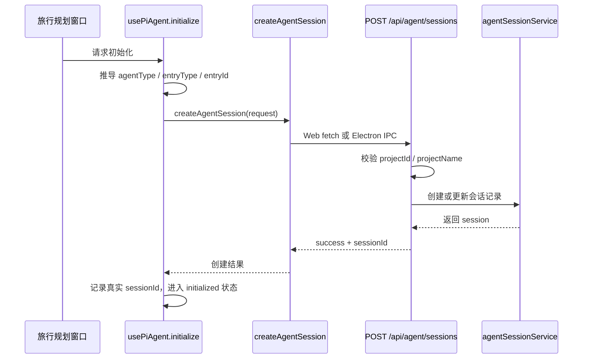

# E10：创建会话跨过第一个 HTTP 边界

E09 已经说明：浏览器不是 Agent 运行时。那小林第一次打开旅行规划窗口时，浏览器怎样和服务端约定“从现在开始，这个窗口对应这一段 Agent 会话”？

答案是创建会话。

创建会话不是简单地在前端生成一个字符串。前端可以传入一个期望的 `sessionId`，但最终要以服务端返回的真实 `sessionId` 为准。因为只有服务端知道这段会话是否已经存在、属于哪个项目或入口、工作目录在哪里、运行时配置怎样保存。

## 1. 本节源码入口

| 文件 | 本节关注点 |
| --- | --- |
| `packages/core/src/lib/integrations/pi-agent/client-hooks.ts` | `initializeSession` 和 `initialize` 如何发起创建会话 |
| `packages/core/src/lib/integrations/electron/services/agent-session.ts` | `createAgentSession` 如何在 Web/Electron 环境中转发请求 |
| `packages/web/src/app/api/agent/sessions/route.ts` | `POST /api/agent/sessions` 如何校验、创建或更新会话 |

本节只讲“会话创建边界”，不展开会话如何保存到磁盘。持久化内部细节会在 E21-E30 单元继续。

## 2. 创建会话的整体路径



这条链路的关键是：前端初始化最终依赖服务端确认，而不是只在本地设置 `isInitialized = true`。

## 3. 客户端初始化做了什么

`client-hooks.ts` 里的初始化分两层：

- `initializeSession`：负责组装创建请求并调用传输层。
- `initialize`：负责把结果提交到 Hook 状态，并处理并发初始化或恢复的竞争。

`initializeSession` 会根据传入参数推导几个字段：

| 字段 | 来源 | 用途 |
| --- | --- | --- |
| `sessionId` | 调用方传入的初始会话标识 | 作为创建或复用会话的候选身份 |
| `agentType` | options 或项目上下文推导 | 决定运行时类型和工具范围 |
| `entryType` | 通常来自 `agentType` 或上下文 | 区分 skill、agent、role-agent 等入口 |
| `entryId` | 从项目上下文或 `projectId` 规范化得到 | 和 `entryType` 一起确认入口归属 |
| `projectContext` | 项目、技能或 Agent 入口上下文 | 提供工作目录、输出目录、项目身份 |
| `systemPrompt` | 调用方传入 | 给运行时构建初始行为约束 |
| `llmConfig` | 调用方传入或用户配置 | 选择模型供应商和模型参数 |

这些字段不是装饰。后续发送消息、恢复会话、隔离事件都会依赖它们。

例如小林从“旅行规划 Skill”入口打开窗口，前端不能只说“我要聊天”。它必须告诉服务端：这是一个 skill 入口，入口 ID 是旅行规划对应的标识，工作目录应该落在哪里。

## 4. 源码窗口一：`initializeSession` 的字段推导

`initializeSession` 是创建会话前最关键的客户端窗口。读这一段时，要按字段流动顺序看，而不是只看函数名。

这项逻辑定义在 [packages/core/src/lib/integrations/pi-agent/client-hooks.ts 第 207—249 行](../../../../packages/core/src/lib/integrations/pi-agent/client-hooks.ts#L207)：

```ts
const agentType = variables?.['agentType'];
const entryType = projectContext.entryType
  ?? (agentType === 'skill'
    ? 'skill'
    : agentType === 'role-agent'
      ? 'role-agent'
      : 'agent');
const entryId = projectContext.entryId
  ?? (entryType === 'skill' && projectContext.projectId.startsWith('skill-')
    ? projectContext.projectId.slice('skill-'.length)
    : projectContext.projectId);
```

这里有两层“优先使用显式信息，否则按规则补齐”的逻辑。

第一层是 `entryType`。如果调用方已经在 `projectContext` 中给出入口类型，运行时保留这个明确选择；只有缺失时，才依据 `agentType` 推导。`skill` 和 `role-agent` 有专门分支，其余类型统一归入普通 `agent`。因此，`agentType` 更像运行时实现类型，`entryType` 则是恢复与归属校验使用的入口分类，二者相关但不能混为一个字段。

第二层是 `entryId`。Skill 项目 ID 使用 `skill-{name}` 形式时，代码会去掉 `skill-` 前缀，把真正的 Skill 名称作为入口 ID；其他入口则直接使用 `projectId`。例如 `projectId = "skill-trip-planner"` 会得到 `entryId = "trip-planner"`。以后恢复会话时，请求必须重新给出同一组入口身份，否则服务端无法证明它仍在操作原来的会话。

| 代码关注点 | 教学含义 |
| --- | --- |
| 读取 `variables?.['agentType']` | 调用方可以通过 variables 指定当前 Agent 类型 |
| 推导 `entryType` | 如果项目上下文已有入口类型，优先使用；否则根据 agentType 或默认规则推导 |
| 推导 `entryId` | 入口 ID 必须稳定，否则后续恢复和归属校验会失去锚点 |
| 构造 `scopedProjectContext` | 把项目上下文和入口身份合并成服务端可识别的上下文 |
| 调用 `createAgentSession` | 真正跨过传输边界 |
| 检查响应是否成功 | 服务端未确认前，客户端不能把会话当作可用 |

这一段要让读者理解：初始化不是“设置几个 state”，而是先把会话身份正规化，再交给服务端确认。

随后，正规化后的 `scopedProjectContext` 和创建参数一起传入 `createAgentSession`。函数最后没有返回调用方最初给出的 ID，而是返回 `response.data.sessionId`。这正是“服务端身份优先”的源码依据。

## 5. 源码窗口二：`initialize` 怎样提交结果并防竞态

`initialize` 包在 `initializeSession` 外面，负责把服务端返回结果提交到 Hook 状态。它会做三类保护。

第一，增加 operation epoch。这样旧的初始化请求晚回来时，可以判断它已经不是当前最新操作。

第二，失效正在进行的恢复。初始化和恢复都可能改变当前会话，不能让它们无序竞争。

第三，分离活动流。初始化新会话前，旧流不应继续影响当前状态。

这项提交保护定义在 [packages/core/src/lib/integrations/pi-agent/client-hooks.ts 第 389—429 行](../../../../packages/core/src/lib/integrations/pi-agent/client-hooks.ts#L389)：

```ts
const operationEpoch = sessionOperationEpochRef.current + 1;
sessionOperationEpochRef.current = operationEpoch;
invalidatePendingRestore();
detachActiveStream(true);

const isCurrentOperation = () =>
  !destroyedRef.current
  && sessionOperationEpochRef.current === operationEpoch;

const initializedSession = await initializeSession(/* ... */);
if (!isCurrentOperation()) return;
setSessionId(initializedSession.sessionId);
setMessages([]);
```

`operationEpoch` 可以理解为“会话切换操作的票号”。每次初始化或恢复都会拿到更大的票号。异步请求返回时，只有票号仍等于当前值，才有资格修改 Hook。`destroyedRef` 还会阻止组件销毁后的晚到结果继续写状态。

请特别注意 `setMessages([])` 的位置：它发生在服务端确认成功、并且该操作仍是最新操作之后。若在请求发出前就清空，创建失败会让旧对话无故消失；若没有 epoch 检查，旧初始化晚返回又可能清空新恢复出来的历史。

因此，读 `initialize` 时要带着一个问题：如果小林快速打开两个不同 Agent 窗口，哪个异步结果有资格写入当前 Hook？

## 6. 源码窗口三：服务端 POST `/api/agent/sessions`

服务端 `sessions/route.ts` 的 POST 入口要逐段读：

完整创建边界位于 [packages/web/src/app/api/agent/sessions/route.ts 第 54—145 行](../../../../packages/web/src/app/api/agent/sessions/route.ts#L54)。这段代码先校验身份字段，再处理配置和已有会话，最后才创建新记录。

| 代码窗口 | 要看什么 |
| --- | --- |
| 请求体读取 | `body` 中哪些字段被使用，哪些字段是可选 |
| 必填校验 | `projectId` 和 `projectName` 缺失时返回 400 |
| LLM 配置处理 | 请求配置和用户配置如何合并 |
| 已有 session 分支 | `body.sessionId` 已存在时更新上下文和配置 |
| 目录准备 | `agentBaseDir` 存在时确保目录可用 |
| 创建请求 | `createRequest` 怎样传给 `agentSessionService.createSession` |
| 响应 | 成功返回 201 和 session 数据，失败返回 500 |

这个窗口证明：会话创建是服务端业务边界，不是前端本地对象创建。

已有会话分支尤其值得逐行理解：

```ts
const existing = await agentSessionService.getSession(body.sessionId, body.projectId);
if (existing) {
  existing.projectContext = {
    ...existing.projectContext,
    ...body.projectContext,
    ...(body.agentBaseDir ? { currentPath: body.agentBaseDir } : {}),
    ...(body.outputDir ? { outputDir: body.outputDir } : {}),
  };
  if (body.agentType) existing.agentType = body.agentType;
  if (body.llmConfig) existing.llmConfig = llmConfigWithMapping;
  await agentSessionService.saveSession(existing);
  return /* 200 */;
}
```

这不是简单的“ID 已存在就原样返回”。新的项目上下文覆盖旧上下文中的同名字段；`agentBaseDir` 被转换为 `currentPath`；显式传入的 Agent 类型和 LLM 配置会被刷新。只有查不到已有记录时，代码才进入 `createSession` 并返回 201。因此，同一个 POST 入口实际具有两种成功语义：200 表示确认并更新已有会话，201 表示新建会话。

## 7. 传输层为什么返回统一响应

`agent-session.ts` 的 `createAgentSession` 在 Web 环境中会向 `/api/agent/sessions` 发 POST 请求；在 Electron 环境中则走 IPC。上层 Hook 看到的是统一结构：

具体分流可在 [packages/core/src/lib/integrations/electron/services/agent-session.ts 第 46—70 行](../../../../packages/core/src/lib/integrations/electron/services/agent-session.ts#L46) 中核对。

```ts
{
  success: boolean;
  data?: { sessionId: string };
  error?: { code: string; message: string };
  timestamp: string;
}
```

统一响应有两个好处。

第一，上层不需要知道底层通道。无论是浏览器 fetch 还是 Electron IPC，Hook 都可以按同一种方式判断成功或失败。

第二，错误处理可以集中。`agent-session.ts` 里的 `readJsonResponse` 会在 HTTP 非 2xx 时读取错误 payload，并抛出包含后端错误信息的异常。这样调用方不必只得到一个模糊的 “fetch failed”。

## 8. 服务端创建会话时做了哪些校验

`packages/web/src/app/api/agent/sessions/route.ts` 的 `POST` 入口并不是无条件创建会话。它至少处理这些事情：

| 动作 | 为什么必要 |
| --- | --- |
| 读取请求体 | 拿到 `projectId`、`projectName`、`sessionId`、`agentType` 等字段 |
| 校验 `projectId` 和 `projectName` | 没有项目身份就无法建立归属边界 |
| 保存运行时 LLM 配置 | 避免后续消息 route 无法恢复模型配置 |
| 合并用户配置和请求配置 | 让会话拿到当前可用模型设置 |
| 处理已有 `sessionId` | 如果会话已存在，更新上下文而不是盲目新建 |
| 创建 `agentBaseDir` | 确保运行时产物有合法工作目录 |
| 调用 `agentSessionService.createSession` | 交给下层服务真正创建会话记录 |

这里尤其要注意“已有会话更新”。如果传入的 `sessionId` 已经存在，服务端会更新它的项目上下文、运行时配置等字段，然后返回成功。这说明创建接口同时承担了“创建或确认可用会话”的职责。

## 9. 小林案例：服务端为什么不能省略

假设浏览器只在本地生成 `sessionId = trip-window-1`，然后直接开始发送消息，会出现几个问题：

- 服务端不知道这段会话属于旅行规划 Skill 还是普通项目 Agent。
- 服务端不知道工作目录应该放在哪里。
- 关闭再打开时，服务端无法根据持久化记录恢复同一段对话。
- 多个入口使用相同本地 ID 时，可能发生归属混乱。

因此，正确做法是：前端可以发起初始化，但必须等服务端确认后，把服务端返回的 `sessionId` 写回 Hook 状态。

## 10. 初始化里的并发保护

`initialize` 不只是调用 `initializeSession`。它还会处理一种常见竞态：用户快速切换窗口或恢复会话时，旧的初始化请求可能比新的恢复请求更晚返回。

如果没有保护，旧请求晚回来后可能覆盖当前窗口状态，让小林明明已经切到 B 会话，界面又被 A 会话的结果改回去。

为避免这种问题，`client-hooks.ts` 使用操作序号一类的机制来判断“这次返回是不是当前最新操作”。这也是后续 E17 会重点讲的隔离思路：异步代码不能只看结果成功，还要确认结果仍属于当前上下文。

## 11. 测试证据与证据边界

源码结论还需要测试把关键不变量固定下来。

- [packages/core/src/lib/integrations/pi-agent/__tests__/client-hooks-session-isolation.test.ts 第 145—174 行](../../../../packages/core/src/lib/integrations/pi-agent/__tests__/client-hooks-session-isolation.test.ts#L145) 证明初始化会把规范化后的 `entryType`、`entryId` 保存到创建请求，并在后续消息请求中继续携带。
- [packages/core/src/lib/integrations/pi-agent/__tests__/client-hooks-session-isolation.test.ts 第 442—486 行](../../../../packages/core/src/lib/integrations/pi-agent/__tests__/client-hooks-session-isolation.test.ts#L442) 构造“初始化 A 先发出、恢复 B 先完成、初始化 A 后返回”的乱序场景，证明晚到的 A 不能覆盖当前 B 会话。

这两组测试证明的是 Hook 的字段传递和并发提交规则。它们没有证明 API Route 真能创建目录，也没有证明会话 JSON 已经写入磁盘；后两项必须分别由 Route 集成测试和持久化测试提供证据。正式验收时不能用一个 Hook 单元测试替代整条链路。

## 12. 本节小结

创建会话的本质，是浏览器和服务端建立共同认可的会话身份。它不是纯前端动作，也不是纯 UI 状态更新。

读完本节要记住三句话：

1. 前端发起初始化，服务端确认会话身份。
2. `sessionId`、`projectId`、`entryType`、`entryId` 是后续隔离和恢复的基础。
3. 初始化成功的标志不是“前端生成了 ID”，而是服务端返回了可用会话。

## 13. 本节源码验收

读完本节，应能在源码中说明：

1. `entryType` 和 `entryId` 是在哪里推导出来的。
2. `createAgentSession` 在 Web 和 Electron 下分别走什么通道。
3. POST `/api/agent/sessions` 为什么要求 `projectId` 和 `projectName`。
4. 已有会话分支为什么不是简单报错。
5. 初始化晚返回为什么不能无条件覆盖当前状态。

## 14. 自测问题

1. 为什么 `projectId` 和 `projectName` 缺失时服务端不能继续创建会话？
2. 已有 `sessionId` 再次传入时，服务端为什么可能选择更新而不是新建？
3. 为什么 Hook 要使用服务端返回的真实 `sessionId`？
4. 初始化请求晚返回时，为什么不能无条件写入当前 UI 状态？
