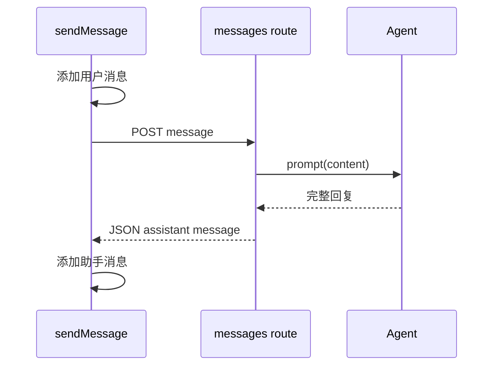
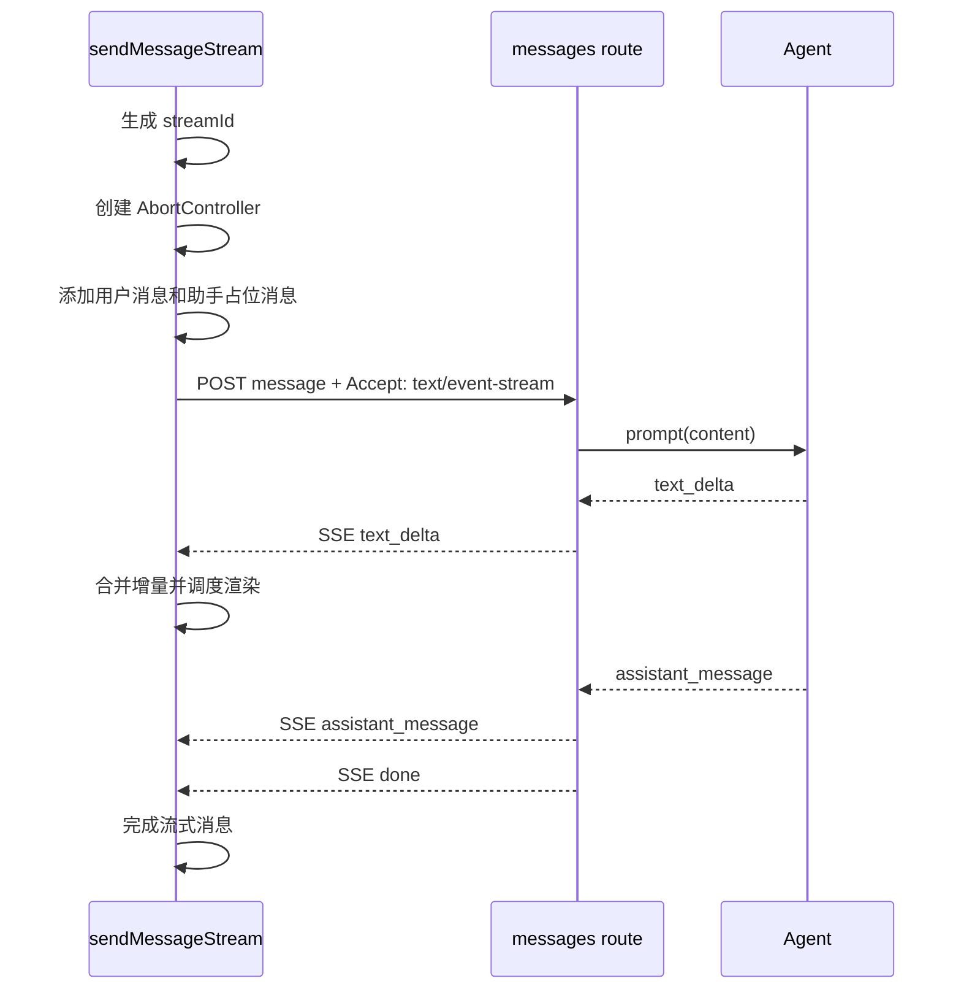

# E11：普通消息与流式消息是两条发送路径

会话创建完成后，小林终于可以发送问题。此时 Pi Agent 运行时提供了两种发送方式：普通消息和流式消息。

普通消息像提交表单：浏览器发出请求，服务端处理完，再返回一个完整 JSON。流式消息像听现场播报：浏览器发出请求后，服务端不立刻结束连接，而是持续推送事件，前端边收边显示。

这两条路径都能完成“一问一答”，但适用体验和实现细节完全不同。

## 1. 本节源码入口

| 文件 | 本节关注点 |
| --- | --- |
| `packages/core/src/lib/integrations/pi-agent/client-hooks.ts` | `sendMessage` 与 `sendMessageStream` 的客户端差异 |
| `packages/core/src/lib/integrations/electron/services/agent-session.ts` | `sendAgentMessage` 与 `sendAgentMessageStream` 的传输差异 |
| `packages/web/src/app/api/agent/sessions/[sessionId]/messages/route.ts` | 服务端如何根据请求头决定普通响应还是 SSE |

本节先分清两条路径。SSE 事件的细节放到 E13，去重和渲染放到 E15-E16。

## 2. 两条路径的整体对比

| 对比项 | 普通消息 `sendMessage` | 流式消息 `sendMessageStream` |
| --- | --- | --- |
| 浏览器请求 | POST 一次，等待 JSON | POST 一次，要求 `text/event-stream` |
| 服务端响应 | 完整 assistant message | 一串 SSE 事件 |
| 前端体验 | 等待结束后显示完整回复 | 回复逐段出现 |
| 前端控制 | 加载中、成功、失败 | 加载中、流式中、增量更新、停止 |
| 典型用途 | 简单命令、非实时结果 | 聊天、长回答、工具执行过程展示 |
| 复杂度 | 较低 | 较高，需要处理事件、去重、取消、旧流隔离 |

对初学者来说，不能因为两者都叫“发送消息”就把源码混在一起读。普通路径的重点是请求-响应；流式路径的重点是连接生命周期。

## 3. 普通消息路径

普通消息在客户端大致做这些事：

1. 检查 Hook 是否已经初始化。
2. 检查当前是否处于恢复过程中，如果正在恢复就拒绝发送。
3. 把用户消息乐观追加到前端 `messages`。
4. 调用 `sendAgentMessage`。
5. 等待服务端返回完整助手消息。
6. 把助手消息追加到前端 `messages`。
7. 如果出错，设置错误状态，并追加错误提示。



普通路径适合理解“最小闭环”：用户输入如何变成服务端 prompt，服务端结果如何回到 UI。

## 4. 流式消息路径

流式路径会多出很多保护动作。

客户端会先生成新的 `streamId`，创建新的 `AbortController`，清理旧的活动流，然后追加用户消息和助手占位消息。之后它会向服务端发送请求，并在连接保持期间不断处理事件。



注意：流式路径里，前端不是等最终消息才创建助手气泡。它先创建一个空助手消息，然后随着事件到来不断填充内容。

## 5. 源码窗口一：普通路径 `sendMessage`

读 `sendMessage` 时，要按“前端乐观更新 → 服务端完整响应 → 前端收尾”的顺序看。

| 步骤 | 源码行为 | 为什么需要 |
| --- | --- | --- |
| 前置检查 | 未初始化、正在恢复时不能发送 | 避免没有会话身份或历史未稳定时发消息 |
| 用户消息入列 | 先把用户消息加入前端 messages | 让 UI 立即反馈用户操作 |
| 调用 `sendMessageToAgent` | 通过传输层发普通 POST | 隔离 Web/Electron 差异 |
| 读取完整响应 | 等服务端返回 assistant message | 普通路径没有持续事件 |
| 成功收尾 | 添加助手消息、更新状态 | 结束 loading/thinking |
| 失败收尾 | 设置 errorMessage，恢复 UI 状态 | 不让界面一直 loading |

普通路径的关键是：它虽然简单，也不能绕过初始化检查和恢复检查。

传输适配函数定义在 [packages/core/src/lib/integrations/pi-agent/client-hooks.ts 第 255—274 行](../../../../packages/core/src/lib/integrations/pi-agent/client-hooks.ts#L255)，Hook 的完整普通发送状态机位于 [packages/core/src/lib/integrations/pi-agent/client-hooks.ts 第 511—596 行](../../../../packages/core/src/lib/integrations/pi-agent/client-hooks.ts#L511)。先读短函数，再读 Hook，能够分清“组装请求”和“管理界面状态”是两种职责。

```ts
const result = await sendMessageToAgent(
  operationSessionId,
  message,
  operationProjectContext,
);
if (!isCurrentOperation()) return;
```

这里把当前 `sessionId` 和 `projectContext` 拍成局部快照。请求返回以后，再比较当前会话是否仍等于 `operationSessionId`。所以普通请求虽然没有 `streamId`，也仍然需要防止 A 会话的晚到响应写进 B 会话。

底层 Web 请求定义在 [packages/core/src/lib/integrations/electron/services/agent-session.ts 第 196—223 行](../../../../packages/core/src/lib/integrations/electron/services/agent-session.ts#L196)。它把 `projectId`、`entryType`、`entryId` 一并发送，不是只传 `content`。这三个字段是服务端归属校验所需的证据。

## 6. 源码窗口二：流式路径 `sendMessageStream`

`sendMessageStream` 的源码要比普通路径多读几个控制变量：

| 控制变量 | 作用 |
| --- | --- |
| `streamId` | 标识这一轮流式生成 |
| `AbortController` | 中断当前 Web fetch 或活动流 |
| `activeStreamIdRef` | 判断事件是否属于当前流 |
| `activeStreamSessionIdRef` | 判断事件是否属于当前会话 |
| `streamUnsubscribeRef` | Electron 环境下取消事件订阅 |
| `StreamRenderScheduler` | 控制 UI 更新节奏 |

读这一段时，不能只找“请求在哪里发出”。更重要的是看它怎样为一轮流式回复准备容器：用户消息、助手占位消息、流身份、取消器、调度器。这些准备动作决定后续事件能否安全落地。

完整流式函数位于 [packages/core/src/lib/integrations/pi-agent/client-hooks.ts 第 599—1059 行](../../../../packages/core/src/lib/integrations/pi-agent/client-hooks.ts#L599)。它很长，不适合从头扫到尾；初学者可以按以下五段阅读：

1. 第 599—630 行：检查初始化和恢复状态，废弃旧流，建立新 `streamId`。
2. 第 631—723 行：建立本轮用户消息、助手占位消息和事件处理器。
3. 第 724—866 行：Electron 的“先订阅，再发送”分支。
4. 第 868—1056 行：Web 的 fetch、SSE 解码和事件分发分支。
5. `finally` 收尾：只允许当前活动流撤销 running/thinking 状态和调度器。

助手占位消息不是最终事实。它是 UI 为“尚在形成中的回答”预留的可变容器；最终 `assistant_message` 或 `done` 到达后，还要用服务端事实完成校准。把占位消息当成持久化结果，会混淆展示态与存储态。

## 7. 源码窗口三：Web 流式分支和 Electron 流式分支

同一个 `sendMessageStream` 内部有两条环境分支。

| 环境 | 事件从哪里来 | 关键读法 |
| --- | --- | --- |
| Web | 直接 `fetch` `/api/agent/sessions/{sessionId}/messages`，读取 `response.body` | 看请求头 `Accept: text/event-stream`、`getReader()`、buffer 解析 |
| Electron | 先 `subscribeAgentEvents`，再 `sendAgentMessageStream` | 看订阅先于发送、事件按 `sessionId` / `streamId` 过滤 |

这里有一个容易误读的点：`agent-session.ts` 里的 `sendAgentMessageStream` 在 Web 分支也写了 `Accept: text/event-stream`，但 `client-hooks.ts` 的 Web 流式主路径是直接使用 `fetch` 读取 SSE body。不能把这个 helper 误讲成 Web 流式读取器。

## 8. 服务端怎样判断走哪条路径

`messages/route.ts` 的 POST 入口会读取请求头。当前端请求头里包含：

```http
Accept: text/event-stream
```

服务端就返回 SSE 流。否则，它按普通 JSON 响应处理。

这个设计有一个好处：同一个 URL 可以支持两种发送方式。前端不需要为普通消息和流式消息维护两个完全不同的 API 地址，只需要通过请求头声明自己想要哪种响应。

但这也带来一个要求：客户端必须清楚自己进入了哪条路径。尤其是流式路径，不能再按一次性 JSON 的方式去读响应体。

真实分叉位于 [packages/web/src/app/api/agent/sessions/[sessionId]/messages/route.ts 第 138—158 行](../../../../packages/web/src/app/api/agent/sessions/%5BsessionId%5D/messages/route.ts#L138)：

```ts
const acceptHeader = _request.headers.get('accept') || '';
const wantsStreaming = acceptHeader.includes('text/event-stream');

if (wantsStreaming) {
  const stream = createEventStream(/* ... */);
  return new Response(stream, {
    headers: { 'Content-Type': 'text/event-stream' /* ... */ },
  });
}
```

`Accept` 描述的是客户端愿意接收的响应媒体类型，`Content-Type` 描述的是服务端实际返回的媒体类型。前者用于选择分支，后者用于声明结果；二者位置不同，不能互换。

## 9. Web 与 Electron 的差异

在 Web 环境中，`sendMessageStream` 会直接使用 `fetch` 读取 SSE 响应体。它需要拿到 `response.body.getReader()`，再一段一段解码文本。

在 Electron 环境中，前端更依赖 `subscribeAgentEvents` 监听主进程推送的事件，再调用 `sendAgentMessageStream` 启动发送。这里有一个重要顺序：通常要先订阅事件，再启动发送。否则运行时很快发出的早期事件可能丢失。

也就是说，两种环境的“事件来源”不同，但 Hook 最终都把它们翻译成同一种 UI 更新流程。

## 10. 小林案例：为什么旅行计划适合流式

如果小林的问题是“2+2 等于几”，普通消息足够。但她问的是“三天两晚旅行计划”，回答可能包括交通、住宿、每日路线、预算提醒、备选方案。生成过程会比较长。

如果用普通消息，小林只能看到加载状态，直到服务端全部完成。她不知道 Agent 是否正在工作，也不知道是否卡住。

如果用流式消息，小林可以先看到“系统将按交通、住宿、路线来整理”，再看到第一天、第二天、第三天逐步出现。即使最终回答还没完成，她也能判断方向是否正确，并决定是否停止。

## 11. 两条路径的错误为何不能按同一种方式处理

普通响应在 HTTP 请求结束前仍能决定返回哪个 JSON。当前实现即使 LLM 失败，也可能返回 HTTP 201，并在响应体中同时携带 `success: true`、已保存的用户消息和 `error.code = "LLM_ERROR"`。相关逻辑位于 [packages/web/src/app/api/agent/sessions/[sessionId]/messages/route.ts 第 239—289 行](../../../../packages/web/src/app/api/agent/sessions/%5BsessionId%5D/messages/route.ts#L239)。这表示“消息请求已被系统接收并保存”与“模型成功生成回答”是两个不同结果。

SSE 则不同。响应头一旦发送，服务端不能在流进行到一半时改成另一个 HTTP 状态码。运行时错误必须作为 `error` 事件写入已经打开的事件流，前端再据此结束占位消息和 loading 状态。因此，排错时应先问“失败发生在建立连接之前还是之后”，再决定查看 HTTP JSON 还是 SSE 事件。

## 12. 测试证据与尚未证明的部分

- [packages/core/src/lib/integrations/pi-agent/__tests__/client-hooks-session-isolation.test.ts 第 176—263 行](../../../../packages/core/src/lib/integrations/pi-agent/__tests__/client-hooks-session-isolation.test.ts#L176) 证明项目级事件不能串进另一会话的活动流。
- [packages/core/src/lib/integrations/pi-agent/__tests__/client-hooks-session-isolation.test.ts 第 264—352 行](../../../../packages/core/src/lib/integrations/pi-agent/__tests__/client-hooks-session-isolation.test.ts#L264) 证明被中止的旧流即使继续送达事件，也不能污染当前消息。

这些测试固定了客户端事件归属规则，但不能单独证明真实浏览器、Next.js Route 和模型运行时之间的 SSE 连接可用。完整验收还需要 Route 契约测试和端到端流测试；E69-E70 会专门建立这层证据边界。

## 13. 本节小结

普通消息和流式消息不是“同一个功能的两种 UI 动画”，而是两种不同的通信路径。

普通路径追求简单：一次请求，一次完整响应。

流式路径追求体验：一次请求，持续事件，前端增量更新。

后面的课程会主要围绕流式路径展开，因为它包含更多真实工程问题：事件格式、去重、渲染节流、旧流隔离、停止生成和错误处理。

## 14. 本节源码验收

读完本节，应能指出：

1. 普通路径和流式路径分别在哪个函数里。
2. 两条路径共同的前置保护是什么。
3. Web 流式路径为什么要直接读取 `response.body`。
4. Electron 流式路径为什么要先订阅事件。
5. `sendAgentMessageStream` 这个 helper 在 Web 主流式路径中不能被误读为什么。

## 15. 自测问题

1. 为什么同一个 `/messages` route 可以同时支持普通消息和流式消息？
2. 流式路径为什么需要助手占位消息？
3. Electron 环境为什么要先订阅事件再启动流式发送？
4. 如果前端用 JSON 方式读取 SSE 响应，会出现什么问题？
