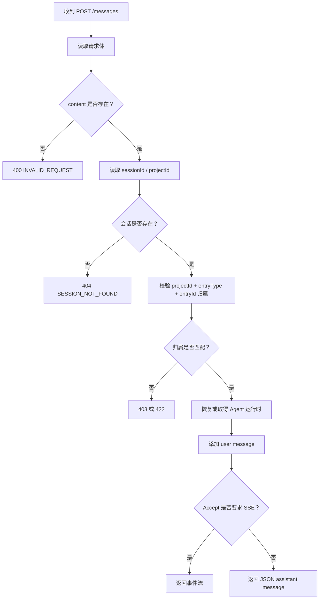
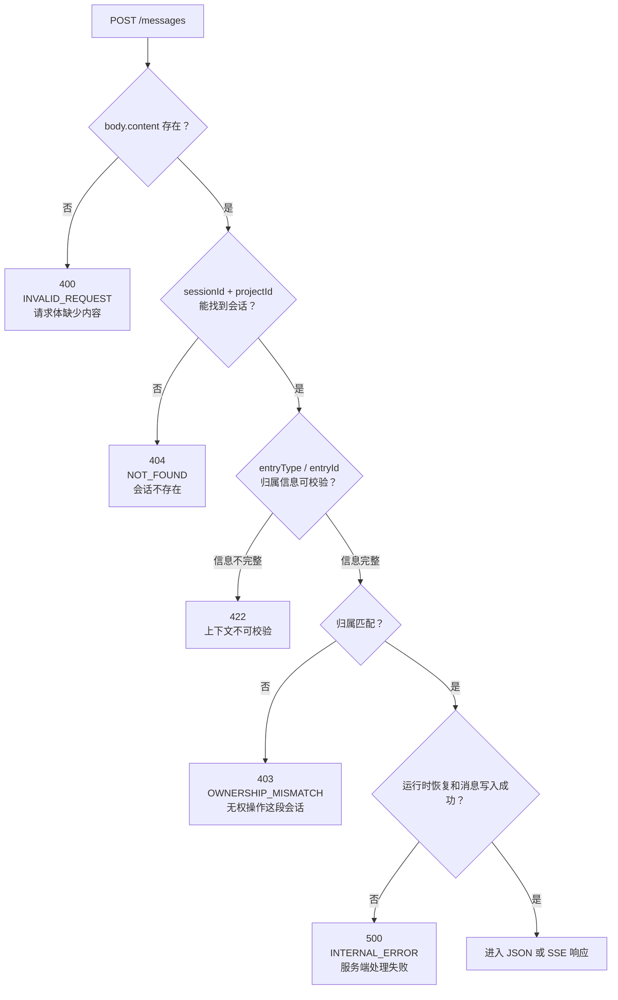

# E12：服务端消息 Route 要先恢复运行时再执行 Prompt

现在小林已经完成会话创建，并发出旅行规划问题。请求到达服务端以后，服务端不能马上把问题丢给模型。它必须先确认三件事：

1. 这段会话存在。
2. 这个请求确实有权操作这段会话。
3. 对应的 Agent 运行时已经可用，并且历史消息已经恢复到运行时里。

这节课重点读 `/messages` route 和 `AgentManager` 的协作。

## 1. 本节源码入口

| 文件 | 本节关注点 |
| --- | --- |
| `packages/web/src/app/api/agent/sessions/[sessionId]/messages/route.ts` | POST 消息时的校验、恢复、添加用户消息、选择响应模式 |
| `packages/core/src/lib/integrations/pi-agent/agent-manager.ts` | `getOrRestoreAgentRuntime` 如何保证运行时可用 |

本节只讲服务端收到消息后的前半程：从请求进入到执行 prompt 之前，以及 prompt 如何被启动。

## 2. 服务端 POST 消息的关键步骤

可以把 `messages/route.ts` 的 POST 入口理解成一道闸门。它不是简单转发请求，而是逐层检查。



这张图里的每一步都有实际工程意义。任何一步省略，都可能造成错误会话被访问、历史上下文丢失、重复消息注入或错误响应不清晰。

读这张图时，要把每个节点都对应回源码：`content` 判断对应 POST 函数里的必填校验；会话查找对应 `agentSessionService.getSession(sessionId, projectId)`；归属校验对应 `assertSessionMessageOwnership`；运行时准备对应 `agentManager.getOrRestoreAgentRuntime(session)`；用户消息写入对应 `agentSessionService.addMessage`；最后的分叉对应 `Accept` 请求头里的 `text/event-stream` 判断。箭头不是抽象流程，而是服务端必须按顺序执行的防线。

## 3. 状态码闸门图：错误不是同一种失败

同样是“发送失败”，`messages/route.ts` 会把不同失败停在不同闸门前。下面这张图专门帮助读者区分 400、403、404、422、500 的来源。



这张图回答的是排错问题：看到错误码时，应该回到哪段源码。400 优先看请求体，404 优先看 `getSession`，403/422 优先看 `session-restore.ts` 的归属校验，500 再看运行时恢复、消息写入或 prompt 过程。这样读者不会把所有失败都归因于模型，也不会把权限错误误判成网络错误。

## 4. 为什么先校验 content

请求体里的 `content` 是用户这一轮真正要发送给 Agent 的文本。如果没有内容，服务端会返回 400。

这不是吹毛求疵。服务端如果允许空内容继续进入 Agent，后续可能出现三种问题：

- 运行时收到空 prompt，浪费模型调用。
- 会话历史里保存无意义的用户消息。
- 前端以为发送成功，但用户实际上没有发出有效问题。

因此，`content` 校验属于最基础的输入边界。

## 5. 为什么要做会话归属校验

小林的旅行规划会话不应该被另一个窗口、另一个入口或另一个项目随意操作。服务端会用 `sessionId` 找到会话，再结合请求中的 `projectId`、`entryType`、`entryId` 做归属校验。

| 字段 | 校验意义 |
| --- | --- |
| `sessionId` | 请求声称要操作哪段会话 |
| `projectId` | 请求属于哪个项目或入口上下文 |
| `entryType` | 请求来自 skill、agent 还是 role-agent |
| `entryId` | 请求来自哪个具体入口 |

如果只校验 `sessionId`，一旦前端传错 ID 或旧窗口复用错误上下文，就可能把消息发进不该发的会话。归属校验把“会话身份”和“入口身份”绑在一起，减少跨入口误操作。

## 6. 为什么要先恢复运行时，再添加当前用户消息

`messages/route.ts` 在添加当前用户消息之前，会调用 `agentManager.getOrRestoreAgentRuntime(session)`。

这个顺序非常关键。原因是：如果运行时已经因为刷新、关闭窗口、服务端缓存回收而不存在，服务端需要根据持久化会话恢复运行时历史。恢复时应该注入的是“之前已经存在的消息”，不应该把当前这条新用户消息重复注入。

如果顺序反过来：

1. 先把当前用户消息保存进 session。
2. 再用整个 session 恢复运行时。
3. 然后又把当前内容交给 `prompt(content)`。

运行时就可能同时在历史里看到这条新消息，又在 prompt 参数里再看到一次，造成重复输入。

所以源码里的顺序体现了一个很重要的边界：恢复运行时使用旧历史；当前用户消息作为本轮 prompt 单独进入。

## 7. 源码窗口一：POST `/messages` 前半段

这一段源码要按“拒绝无效请求 → 找到会话 → 确认归属 → 恢复运行时 → 写入当前用户消息”的顺序读。

完整前半段位于 [packages/web/src/app/api/agent/sessions/[sessionId]/messages/route.ts 第 51—156 行](../../../../packages/web/src/app/api/agent/sessions/%5BsessionId%5D/messages/route.ts#L51)。其中最容易被忽略、也最不能交换的三行是：

```ts
const agent = await agentManager.getOrRestoreAgentRuntime(session);
session = await agentSessionService.addMessage(sessionId, userMessage, projectId);
const userMessage = session.messages[session.messages.length - 1]!;
```

示例省略了 `addMessage` 的对象字段，但保留了真实执行顺序。第一行让运行时只接收已经持久化的旧历史；第二行把当前用户输入保存为新事实；第三行取得真正落库后的消息对象，供 JSON 响应或 SSE 首事件继续使用。若把第一、二行交换，恢复出来的历史会提前包含本轮输入，而稍后的 `prompt(body.content)` 又会提交一次同样内容。

| 顺序 | 源码动作 | 失败时的表现 |
| --- | --- | --- |
| 1 | 从 params 读取 `sessionId`，从 body 读取 `projectId` 和 `content` | `content` 缺失返回 400 |
| 2 | `agentSessionService.getSession(sessionId, projectId)` | 找不到返回 404 |
| 3 | `assertSessionMessageOwnership(...)` | 归属不匹配返回 403，信息不完整返回 422 |
| 4 | `agentManager.getOrRestoreAgentRuntime(session)` | 恢复失败进入 500 或错误路径 |
| 5 | `agentSessionService.addMessage(...)` 保存当前 user message | 写入失败返回 500 |
| 6 | 读取 `Accept` 判断 `wantsStreaming` | 决定返回 SSE 还是 JSON |

这张表是本节最重要的源码阅读顺序。不能跳过前四步直接看 `agent.prompt`，否则会误以为服务端只是模型调用代理。

## 8. 源码窗口二：`session-restore.ts` 在这里承担局部职责

完整的恢复系统会在 E21-E30 深讲，但本节必须局部理解两个函数：

- `assertSessionMessageOwnership`：确认当前请求的 `sessionId`、`projectId`、`entryType`、`entryId` 和持久化会话匹配。
- `toRestoreAgentSessionError`：把内部错误转换成 API 可以返回的错误结构。

它们在消息 route 中承担的是“消息发送前的归属闸门”。这不是恢复体验问题，而是安全边界和数据隔离问题。

归属校验的实现位于 [packages/core/src/lib/integrations/pi-agent/session-restore.ts 第 262—324 行](../../../../packages/core/src/lib/integrations/pi-agent/session-restore.ts#L262)。它先验证持久化对象和 `projectContext` 的结构，再比较 `sessionId`，最后根据会话是否已经保存入口身份，决定请求是否必须提供 `entryType` 和 `entryId`。

这里还保留了一条旧数据兼容规则：老会话若没有持久化入口身份，可以只按项目范围校验；新会话一旦已有入口身份，请求缺少这组字段就会被拒绝。兼容不等于放弃校验，而是根据数据版本采用不同强度的可证明身份。

## 9. 源码窗口三：`AgentManager.getOrRestoreAgentRuntime`

运行时恢复与复用定义在 [packages/core/src/lib/integrations/pi-agent/agent-manager.ts 第 197—275 行](../../../../packages/core/src/lib/integrations/pi-agent/agent-manager.ts#L197)。

`getOrRestoreAgentRuntime(session)` 的读法是：

| 分支 | 含义 |
| --- | --- |
| 有 pending restore | 等待同一 session 正在进行的恢复，避免重复恢复 |
| 当前没有 Agent | 调用 `restoreAgentRuntime(session)` 创建并恢复 |
| 恢复后仍无 Agent | 抛出运行时恢复失败 |
| 当前已有 Agent | 调用 `getOrCreateAgent` 复用，并刷新 systemPrompt、工作目录、模型配置等上下文 |

这个函数体现了服务端运行时的基本策略：能复用则复用，需要恢复则恢复，但不能在历史未稳定时直接 prompt。

源码中的 `runtimeRestorePromises` 是按 `sessionId` 保存的恢复 Promise。若两个消息请求几乎同时发现同一运行时不存在，第二个请求不会再创建一套 Agent，而是等待第一份恢复 Promise。`finally` 只删除自己登记的那份 Promise，避免旧恢复错误清掉后来替换的新任务。

真正替换历史之前还有 `await agent.waitForIdle()`。它表达的边界是：不能在 Agent 仍执行上一轮任务时突然替换其消息历史。只有运行时空闲，`replacePersistedMessages(session.messages)` 才把存储记录投影为下一轮 prompt 可见的模型上下文。

## 10. AgentManager 做了什么

`AgentManager` 管理内存中的 `OriginOSAgent` 实例。对于一段会话，它会做两种判断：

- 如果运行时已经存在，就复用它，并刷新工具上下文和模型配置。
- 如果运行时不存在，就创建 Agent，并用持久化会话里的历史消息恢复运行时。

这里的“复用”不是临时权宜，而是必要的生命周期管理。Agent 运行时可能持有工具、系统 prompt、上下文、记忆模块等状态。频繁无意义地销毁重建，会影响性能和行为一致性。

但复用也不能不加控制。每次复用时都要刷新工具执行上下文，确保文件工具等能力仍然指向当前会话的工作目录。这一点会在 Tools 单元更深入展开。

## 11. 小林案例：刷新后继续问为什么还能接上

小林第一轮问：“帮我规划杭州三天两晚路线。”

页面刷新后，她第二轮问：“第二天能不能少走路？”

如果运行时还在内存中，服务端可以直接复用原来的 Agent。若运行时不在，服务端必须先从会话记录里恢复第一轮历史，再处理“第二天能不能少走路”。否则 Agent 可能不知道“小林说的第二天”指的是哪份路线。

这就是 `getOrRestoreAgentRuntime` 存在的理由。

## 12. 普通响应与流式响应从这里分叉

完成校验、恢复和用户消息添加后，服务端才会根据 `Accept` 请求头分叉：

- 如果前端要求 `text/event-stream`，进入事件流构建。
- 如果不是 SSE，执行普通 prompt，并在结束后返回 JSON。

这说明普通路径和流式路径共享同一套前置安全边界。不能因为流式体验更复杂，就绕过会话校验；也不能因为普通路径简单，就跳过运行时恢复。

## 13. 状态变化与副作用清单

Route 很长时，初学者容易只记住返回值，忽略已经发生的副作用。按执行顺序整理如下：

| 阶段 | 内存运行时 | 会话存储 | HTTP / SSE | 失败后是否已有新事实 |
| --- | --- | --- | --- | --- |
| 输入与归属校验 | 不变 | 不变 | 可返回 400/403/404/422 | 没有 |
| 恢复运行时 | 可能创建 Agent 并注入旧历史 | 不变 | 尚未开始响应主体 | 没有本轮消息 |
| 保存用户消息 | 已可用 | 追加本轮 user message | 尚未生成助手结果 | 已保存用户输入 |
| 执行普通 prompt | 产生事件与结果 | 随后追加 assistant message | 返回 JSON | 可能只有用户消息 |
| 执行流式 prompt | 产生并转发事件 | 流结束过程中保存结果 | 持续 SSE | 连接中途可失败 |

这张表解释了一个看似反常的现象：模型失败不代表用户消息没有保存。调用方若盲目重试整次 POST，可能重复追加同一句用户输入；重试设计必须先确认服务端已经完成了哪些副作用。

## 14. 测试证据与缺口

- [packages/core/src/lib/integrations/pi-agent/__tests__/session-restore.test.ts 第 162—196 行](../../../../packages/core/src/lib/integrations/pi-agent/__tests__/session-restore.test.ts#L162) 验证新会话需要匹配入口范围，也验证旧会话仍可走项目级兼容路径。
- 同一测试文件继续覆盖其他项目、其他 Skill 和其他 Agent 类型的归属不匹配场景，说明校验目标不是字段“存在”即可，而是值必须与持久化身份一致。

这些是纯函数级的归属证据。它们没有直接执行 Next.js `POST`，因此不能单独证明 403/422 映射、恢复与 `addMessage` 的调用顺序或 SSE 响应头。要宣称 Route 整体成立，还需要针对 Route 依赖做集成测试；现有证据与缺口必须同时写清楚。

## 15. 本节小结

服务端 `/messages` route 的核心职责不是“收到文本就调用模型”，而是：

1. 确认输入有效。
2. 确认会话存在。
3. 确认请求属于这段会话。
4. 确认 Agent 运行时已经带着正确历史可用。
5. 再选择普通响应或流式响应。

这也是后续排查 Agent 对话问题的基本顺序。先查请求和会话边界，再查运行时和模型。

## 16. 本节源码验收

读完本节，应能在 `messages/route.ts` 中指出：

1. 400、403、404、422、500 分别从哪些分支产生。
2. 为什么归属校验发生在运行时恢复之前。
3. 为什么运行时恢复发生在保存当前用户消息之前。
4. `wantsStreaming` 是怎样由请求头决定的。
5. 普通响应和流式响应共享了哪些安全边界。

## 17. 自测问题

1. 为什么 `getOrRestoreAgentRuntime(session)` 要发生在保存当前用户消息之前？
2. 只校验 `sessionId` 不校验 `projectId` 可能有什么风险？
3. 运行时复用时为什么还要刷新工具上下文？
4. 普通响应和流式响应共享哪些前置步骤？
