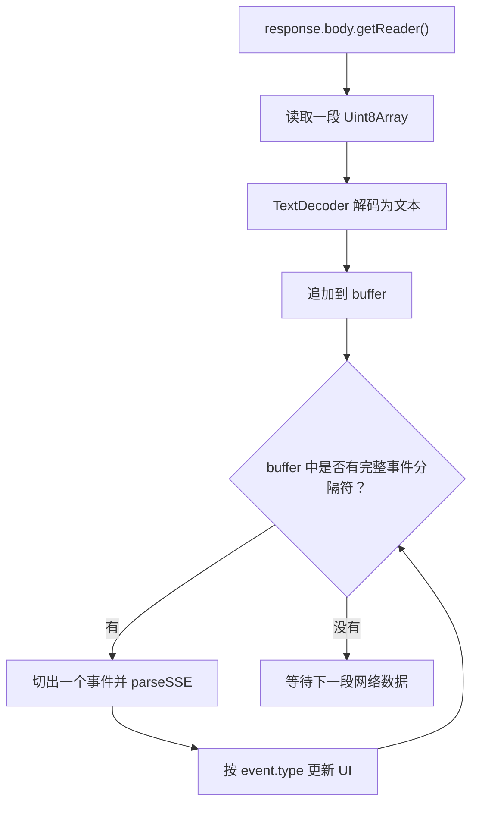

# E13：SSE 事件不是一个 JSON 响应

流式回复最容易被误解的地方，是把它想象成“服务端慢慢返回一个很大的 JSON”。实际上，SSE 是一串事件。每个事件都是一小段文本帧，浏览器要持续读取、解析、分发，直到收到结束信号。

这节课讲清楚 SSE 的格式、事件类型，以及前端为什么要用循环读取响应体。

## 1. 本节源码入口

| 文件 | 本节关注点 |
| --- | --- |
| `packages/web/src/app/api/agent/sessions/[sessionId]/messages/route.ts` | `createEventStream`、`createRuntimeEventStream`、`createInProcessEventStream` 如何发送 SSE |
| `packages/core/src/lib/integrations/pi-agent/client-hooks.ts` | `parseSSE` 和 Web 分支如何读取 `response.body` |

## 2. SSE 的最小格式

服务端推送给浏览器的每一帧通常长这样：

```text
data: {"type":"text_delta","data":{"delta":"第一天建议先到西湖"}}

data: {"type":"text_delta","data":{"delta":"，下午去灵隐寺。"}}

data: {"type":"done","data":{}}

```

注意两个细节。

第一，每帧以 `data:` 开头。前端解析时会去掉这个前缀，再把后面的字符串当 JSON 解析。

第二，事件之间用空行分隔，也就是文本里常见的 `\n\n`。前端读取网络流时，一次 `read()` 不一定刚好读到一个完整事件，所以必须维护缓冲区，把完整事件切出来，剩余半截留到下一次继续拼。

## 3. 为什么不能用普通 JSON 读取

普通 JSON 响应的读取方式通常是：

```ts
const data = await response.json();
```

这意味着浏览器要等整个响应结束，才能开始解析。对流式回复来说，这正好违背目标。我们希望第一段文字到达时就能显示，而不是等所有内容结束。

所以 `sendMessageStream` 在 Web 分支会读取 `response.body.getReader()`，并循环调用 `reader.read()`。每拿到一段字节，就用 `TextDecoder` 解成字符串，再把完整 SSE 帧解析出来。



这就是为什么 SSE 客户端代码看起来比普通请求复杂。

## 4. 源码窗口一：`parseSSE` 只解析完整事件

`client-hooks.ts` 的 `parseSSE` 要解决一个底层问题：网络每次给前端的文本片段，不一定刚好等于一个完整 SSE 事件。

解析器位于 [packages/core/src/lib/integrations/pi-agent/client-hooks.ts 第 176—201 行](../../../../packages/core/src/lib/integrations/pi-agent/client-hooks.ts#L176)：

```ts
for (const line of text.split('\n')) {
  if (line.startsWith('data: ')) {
    if (currentData) currentData += '\n';
    currentData += line.slice(6);
  } else if (line === '' && currentData.trim()) {
    events.push(JSON.parse(currentData));
    currentData = '';
  }
}
```

`currentData` 说明一个事件可以包含多条 `data:` 行；第二条起会补回换行符。只有遇到空行，累计数据才会被当成完整 JSON。解析失败只记录错误而不击穿整个读取循环，这能保留后续帧，但也要求日志能够暴露解析异常，否则客户端可能表现为“静默少字”。

还要明确当前实现的边界：它只识别带一个空格的 `data: `，没有实现 `event:`、`id:`、`retry:` 或注释行。因此它是面向本项目服务端输出格式的轻量解析器，不是完整的通用 SSE 标准库。

读这个函数时，要看三个点：

| 代码关注点 | 教学含义 |
| --- | --- |
| `text.split('\n')` | SSE 是文本协议，先按行处理 |
| `line.startsWith('data: ')` | 当前实现主要识别 `data:` 行 |
| 空行触发 JSON.parse | 空行表示一帧事件结束，此时才解析 |

因此，`parseSSE` 不是“任意拿到一点文本就 parse”。它要等到事件边界出现。这个边界意识对流式协议非常重要。

## 5. 源码窗口二：Web 分支的 buffer 处理

Web 流式路径里，`sendMessageStream` 会循环读取 `reader.read()`。每次读取到的是字节数组，经 `TextDecoder` 变成文本后追加到 buffer。

读这一段时要抓住一个变量：buffer。

| buffer 状态 | 前端应该怎么做 |
| --- | --- |
| 里面没有完整 `\n\n` | 继续等待下一段网络数据 |
| 里面有一个完整事件 | 切出这个事件，交给 `parseSSE` |
| 里面有多个完整事件 | 循环切出多个事件 |
| 最后剩下半截事件 | 留在 buffer，下一轮继续拼 |

如果没有 buffer，前端很容易在半个 JSON 上调用 `JSON.parse`，然后把正常网络分片误判为格式错误。

真实读取循环位于 [packages/core/src/lib/integrations/pi-agent/client-hooks.ts 第 868—1022 行](../../../../packages/core/src/lib/integrations/pi-agent/client-hooks.ts#L868)。关键不是假设“每次 read 得到一帧”，而是寻找 buffer 中最后一个完整的 `\n\n`：

```ts
buffer += decoder.decode(value, { stream: true });
const lastCompleteEventEnd = buffer.lastIndexOf("\n\n");
if (lastCompleteEventEnd !== -1) {
  const completedPart = buffer.slice(0, lastCompleteEventEnd + 2);
  const events = parseSSE(completedPart);
  // 逐事件分发
  buffer = buffer.slice(lastCompleteEventEnd + 2);
}
```

使用 `lastIndexOf` 可以一次交给解析器多个完整事件，同时把最后半帧留在 buffer。`TextDecoder` 的 `{ stream: true }` 则让跨网络块的多字节字符继续由同一个 decoder 拼合；中文或 emoji 恰好从字节中间断开时，不会因为单块解码而被破坏。

## 6. 源码窗口三：`display-content.ts` 清洗可展示内容

SSE 事件里的文本不一定都能直接显示。`messages/route.ts` 会使用 `sanitizeAgentDisplayContent`，它来自 `display-content.ts`。

这个文件的局部职责是：把不同形态的模型内容变成 UI 可展示字符串。

| 函数 | 本单元关注点 |
| --- | --- |
| `stripHiddenReasoning` | 移除 `<think>` 或 `<thinking>` 这类隐藏 reasoning 标签 |
| `extractDisplayContent` | 字符串直接清洗；数组内容优先拼接 text block |
| `sanitizeAgentDisplayContent` | 给 route 和流式处理提供统一清洗入口 |

这说明“展示内容”不是原样透传。正式产品要区分可展示文本和模型内部推理片段，不能把隐藏 reasoning 当正文显示给用户。

展示清洗实现位于 [packages/core/src/lib/integrations/pi-agent/display-content.ts 第 31—100 行](../../../../packages/core/src/lib/integrations/pi-agent/display-content.ts#L31)。它接收 `unknown`，因为跨模型边界后的 content 可能是字符串、content block 数组或异常结构。把清洗集中在这里，可以避免 Route 和 Hook 各自复制一套不一致的类型判断。

## 7. 本单元常见事件类型

| 事件类型 | 含义 | 前端通常怎么处理 |
| --- | --- | --- |
| `user_message` | 服务端确认收到用户消息 | 可用于事件流完整性观察 |
| `text_delta` | 新出现的一段助手文本 | 合并到当前助手占位消息 |
| `message_delta` | 另一种增量消息形态 | 与 `text_delta` 类似处理 |
| `tool_start` | 工具开始执行 | 更新思考状态或工具状态 |
| `tool_end` | 工具执行结束 | 更新工具状态，必要时展示结果摘要 |
| `artifact_changed` | 产物发生变化 | 通知 UI 刷新文件或产物列表 |
| `assistant_message` | 助手最终消息 | 用最终内容校准已显示文本 |
| `status` | 运行状态变化 | 更新 loading、thinking 等状态 |
| `error` | 本轮出现错误 | 停止流式状态并展示错误 |
| `done` | 事件流结束 | 收尾并关闭当前流 |

这些事件不是同一种东西。`text_delta` 是过程；`assistant_message` 是结果校准；`done` 是生命周期结束。初学者最常犯的错误，是把 `done` 当成最终文本，把 `text_delta` 当成完整消息。

## 8. 服务端如何发送事件

在 `messages/route.ts` 里，流式响应通过 `ReadableStream` 构建。服务端内部会不断把事件对象编码成 SSE 文本：

```text
data: <JSON.stringify(event)>

```

然后用 controller 推给 HTTP 响应。

统一流入口和两种桥接位于 [packages/web/src/app/api/agent/sessions/[sessionId]/messages/route.ts 第 315—687 行](../../../../packages/web/src/app/api/agent/sessions/%5BsessionId%5D/messages/route.ts#L315)。服务端用 `TextEncoder` 把 `data: ${JSON.stringify(msg)}\n\n` 转成字节；客户端再沿着 `reader → TextDecoder → buffer → parseSSE` 反向还原。把两端对照阅读，协议边界才完整。

这意味着服务端和前端之间约定的是事件协议，而不是函数调用。服务端不需要知道 React 怎样更新；前端也不需要知道 Agent 内部怎样执行。双方只要共同理解事件类型和字段即可。

## 9. 协议失败边界：连接结束不等于业务成功

| 观察结果 | 已证明什么 | 仍不能证明什么 |
| --- | --- | --- |
| HTTP 非 2xx | 连接前的会话、权限或服务端处理失败 | Agent 是否开始执行 |
| HTTP 200 + `error` | SSE 已建立，运行过程中失败 | 是否产生了可用的部分回答 |
| HTTP 200 + `done` | 服务端声明本轮流已收尾 | 最终文本是否与持久化消息一致 |
| 连接关闭但没有 `done` | 传输结束或中断 | 不能据此判断业务成功 |

`reader.read()` 返回 `done: true` 只是网络字节流结束；SSE 中的 `type: "done"` 才是项目协议声明的业务收尾。正式客户端不能把两者混成一个状态。

## 10. 小林案例：一段旅行回复怎样分成事件

小林问：

> 帮我规划杭州三天两晚路线。

一次可能的事件顺序是：

| 顺序 | 事件 | 说明 |
| --- | --- | --- |
| 1 | `user_message` | 服务端确认收到小林的问题 |
| 2 | `text_delta` | “先按交通、住宿、路线来规划。” |
| 3 | `tool_start` | 如果 Agent 需要读取项目文件或调用工具，会发出工具开始事件 |
| 4 | `tool_end` | 工具完成 |
| 5 | `text_delta` | “第一天：抵达杭州后……” |
| 6 | `text_delta` | “第二天：西湖和灵隐寺……” |
| 7 | `assistant_message` | 最终完整回答 |
| 8 | `done` | 本轮流式事件结束 |

页面看到的是逐渐增长的文字，但源码中真正流动的是事件。

## 11. 本节小结

SSE 的关键不是“慢慢返回 JSON”，而是“持续发送事件帧”。前端要做三件事：

1. 持续读取网络流。
2. 把字节流解析成一个个事件。
3. 按事件类型更新 UI 状态。

只有理解事件流，后面才能理解去重、渲染调度、停止生成和旧事件隔离。

## 12. 本节源码验收

读完本节，应能指出：

1. `parseSSE` 为什么按行和空行识别事件。
2. Web 流式分支为什么需要 buffer。
3. `TextDecoder` 在字节流和文本协议之间承担什么角色。
4. `sanitizeAgentDisplayContent` 为什么属于展示边界，而不是模型能力。
5. `text_delta`、`assistant_message`、`done` 在代码中分别如何触发 UI 更新。

## 13. 自测问题

1. SSE 事件之间为什么要用空行分隔？
2. 为什么 `response.json()` 不适合流式回复？
3. `text_delta`、`assistant_message`、`done` 三者有什么区别？
4. 前端为什么需要保留 buffer，而不是每次 `read()` 后直接 JSON.parse？
