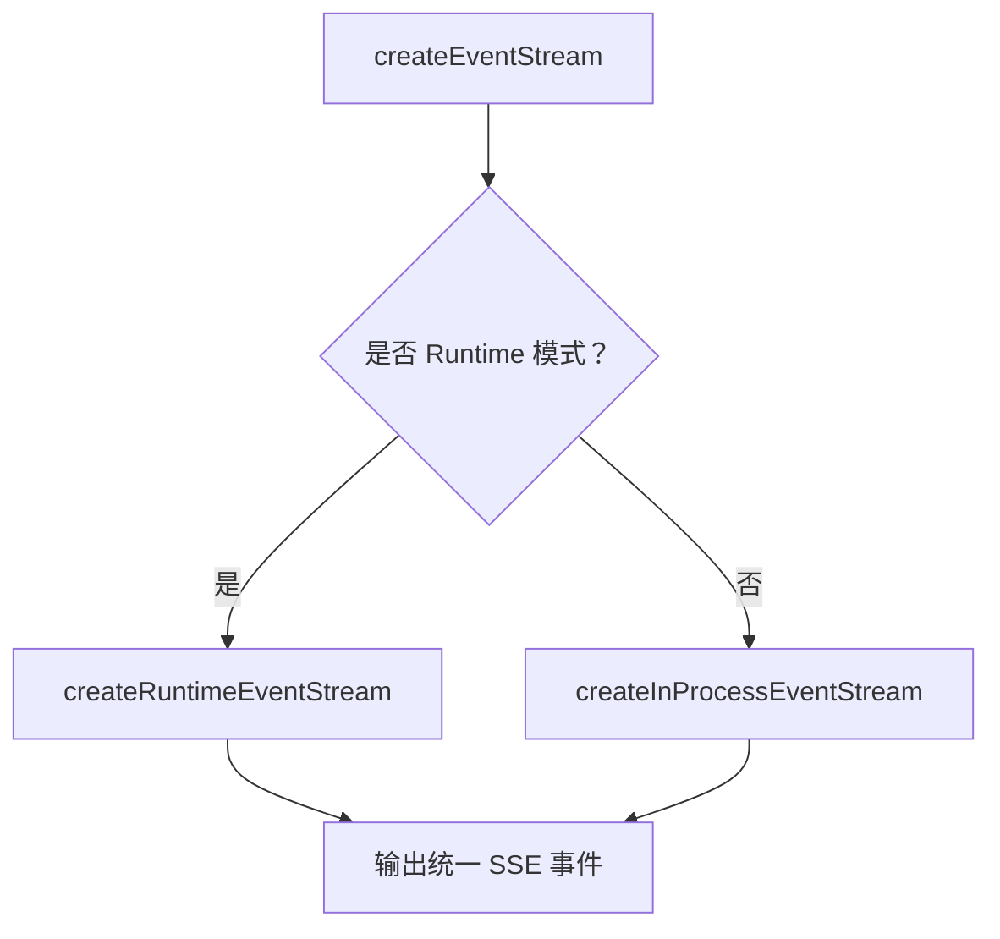
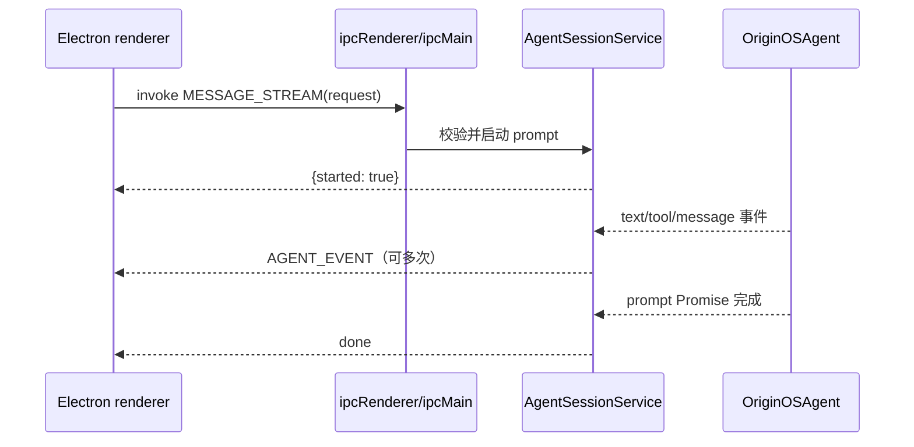

# E14：Web 两座流式桥与 Electron IPC 桥怎样统一事件

同样是小林看到文字逐段出现，Web 服务端内部可能有两种不同运行模式：Runtime 模式和 in-process 模式；桌面应用还会多经过 Electron 主进程与 renderer 之间的 IPC 边界。

前端不应该被迫理解这两种模式的全部内部差异。它需要的是稳定事件：`text_delta`、`tool_start`、`tool_end`、`assistant_message`、`done`。因此服务端要做一层桥接，把不同来源的运行时事件转换成前端能理解的 SSE 事件。

## 1. 本节源码入口

| 文件 | 本节关注点 |
| --- | --- |
| `packages/web/src/app/api/agent/sessions/[sessionId]/messages/route.ts` | `createEventStream` 如何分派到两种流式实现 |
| `packages/web/src/app/api/agent/abort/route.ts` | Web 中断时如何区分 Runtime 模式和 in-process 模式 |
| `packages/core/src/lib/integrations/electron/services/agent-session.ts` | renderer 如何在 Web fetch 与 Electron IPC 之间选择 |
| `packages/desktop/src/main/services/agent-session-service.ts` | Electron 主进程如何恢复 Agent、订阅事件并发送 `AGENT_EVENT` |
| `packages/desktop/src/main/services/stream-event-batcher.ts` | 高频文本事件如何合并并保持非文本事件顺序 |
| `packages/desktop/src/main/services/assistant-stream-state.ts` | 最终助手消息如何只发送一次 |

## 2. 为什么需要两种桥接

OriginOS 的 Agent 可以运行在不同形态里：

- Runtime 模式：Agent 运行在协作运行时或子进程体系中，服务端通过运行时进程事件拿到输出。
- in-process 模式：Agent 直接在当前服务端进程中运行，服务端订阅 `OriginOSAgent` 的内部事件。

这两种模式的事件来源不同，但对前端来说，用户体验应该尽量一致。否则 UI 代码会变成这样：

```text
如果是 Runtime 模式，按 A 事件更新；
如果是 in-process 模式，按 B 事件更新；
如果以后又多一种模式，再写 C 分支。
```

这种写法会让 UI 直接依赖运行时内部细节，边界会越来越乱。

## 3. createEventStream 是分派入口

`messages/route.ts` 的 `createEventStream` 可以理解成统一入口。它接收 Agent、用户内容、用户消息、会话身份和项目身份，然后判断当前使用哪种运行模式：



这张图的重点是最终出口相同。无论内部是 runtime bridge 还是 in-process subscription，前端收到的都应该是稳定的事件协议。

分派逻辑定义在 [packages/web/src/app/api/agent/sessions/[sessionId]/messages/route.ts 第 315—330 行](../../../../packages/web/src/app/api/agent/sessions/%5BsessionId%5D/messages/route.ts#L315)。判断依据不是请求参数，而是 Agent 实例上是否存在 `__bridgeProcess`，并且其 `getStatus()` 是否为 `running`。只有同时满足才走 Runtime 桥；否则退回进程内订阅桥。

这里的 `__bridgeProcess` 属于实现层探测，不是公共类型契约。统一事件出口已经形成，但运行模式识别仍依赖 `(agent as any)` 的内部属性。桥接实现变化时，这里是需要优先回归的脆弱边界。

## 4. Runtime 模式桥接

Runtime 模式下，服务端会把运行时事件转换成前端事件。例如：

| 运行时事件 | 转换后的前端事件 | 含义 |
| --- | --- | --- |
| 工具调用开始 | `tool_start` | 告诉 UI：Agent 正在用工具 |
| 工具调用结果 | `tool_end` | 告诉 UI：工具执行结束 |
| 消息片段 | `text_delta` | 给 UI 一段可见新增文字 |
| 助手最终消息 | `assistant_message` | 用完整内容校准最终回答 |
| Agent 失败 | `error` | 让 UI 停止并展示错误 |

这里还会出现一个重要细节：Runtime 事件可能不是天然的“纯新增片段”。有些供应商或运行时会发送累计内容，也就是第二帧包含第一帧，第三帧又包含前两帧。服务端桥接层会配合去重逻辑，只把真正可见的新内容发给前端，减少重复显示。

## 5. 源码窗口一：Runtime 桥接里的 queue 与 waiter

`createRuntimeEventStream` 里有两个非常关键的结构：`queue` 和 `waiterRef`。

| 结构 | 作用 |
| --- | --- |
| `queue` | 暂存已经从运行时拦截到、但还没写入 SSE response 的事件 |
| `waiterRef` | 当队列为空时，让发送循环等待下一条事件 |
| `enqueueEvent` | 把运行时事件转换后的前端事件放入队列，并唤醒等待者 |
| `deliveryPromise` | 持续从队列取事件，编码成 `data: ...\n\n` 推给客户端 |

这个设计把“运行时产生事件”和“HTTP 流发送事件”解耦。运行时事件来得快时先入队；HTTP 发送循环按顺序取出。对新手来说，这是一种典型的生产者-消费者结构。

Runtime 桥完整实现位于 [packages/web/src/app/api/agent/sessions/[sessionId]/messages/route.ts 第 336—520 行](../../../../packages/web/src/app/api/agent/sessions/%5BsessionId%5D/messages/route.ts#L336)，队列和等待器在第 356—370 行，发送循环在第 483—512 行。

`waitForEvent()` 在队列非空时立即完成，在队列为空时保存一个 resolve 函数。生产者 `enqueueEvent()` 入队后取走并调用这个 resolve，从而唤醒消费者。消费者醒来后用内层 `while` 排空积压事件，再决定是否继续等待。这既保持顺序，也避免对空队列忙轮询。

`completed` 只表示生产阶段结束。退出主循环后仍要再排空一次 queue，随后发送 `done` 并 `controller.close()`；否则 prompt 完成瞬间已经入队、但尚未写入 HTTP 的最后几帧可能丢失。

## 6. 源码窗口二：`promptSent` 与 `assistantMessageSent`

Runtime 桥接里还有两个防错变量。

| 变量 | 防止的问题 |
| --- | --- |
| `promptSent` | 避免 prompt 尚未真正发出时，早期或残留事件被当成本轮结果 |
| `assistantMessageSent` | 避免多 turn 或多个完成事件导致最终助手消息重复发送 |

这两个变量说明：流式桥接不能只“见事件就发”。它必须判断事件是否属于当前 prompt，最终消息是否已经发送过。

二者防的是不同问题。`promptSent` 防止本轮 prompt 发出前的残留完成/失败事件混入；`assistantMessageSent` 防止同一轮最终消息多次发送；`lastAssistantMessageContent` 还会过滤内容完全相同的最终帧。一个保护时间归属，一个保护生命周期次数，一个保护内容相等，不能用单个“防重复”概念含混带过。

## 7. in-process 模式桥接

in-process 模式下，服务端会订阅 `OriginOSAgent` 的事件。它可能收到类似消息更新、工具执行开始、工具执行结束、Agent 结束等内部事件。

服务端同样会把它们转换成前端协议：

- 文本更新转换成 `text_delta`。
- 工具开始转换成 `tool_start`。
- 工具结束转换成 `tool_end`。
- 消息结束转换成 `assistant_message`。
- Agent 结束或没有明确助手消息时，做最终 fallback。
- 最后发送 `done` 并关闭流。

这保证前端不用关心“这个事件来自子进程还是当前进程”。

## 8. 源码窗口三：in-process 桥接里的事件转换

`createInProcessEventStream` 的读法要围绕 `agent.subscribe` 展开。它不是拦截子进程事件，而是订阅当前进程内 Agent 发出的事件。

| Agent 内部事件 | 前端 SSE 事件 | 关键处理 |
| --- | --- | --- |
| `thinking_delta` / `thinking_end` | 不直接推给客户端 | 思考过程不作为正文流式展示 |
| `text_delta` | `text_delta` | 清洗内容、去重、发送可见新增 |
| `message_update` | `text_delta` | 处理嵌套的 assistantMessageEvent |
| `tool_execution_start` | `tool_start` | 带 toolCallId、toolName、args |
| `tool_execution_end` | `tool_end` | 带 result、isError |
| `message_end` | `assistant_message` | 用最终消息校准流式内容 |
| `agent_end` | `assistant_message` fallback | 非流式模型或缺少 message_end 时兜底 |
| `agent_error` | `error` | 通知前端本轮失败 |

这个窗口要读细，因为它解释了“为什么 UI 看到的事件名和 Agent 内部事件名不完全一样”。

进程内桥位于 [packages/web/src/app/api/agent/sessions/[sessionId]/messages/route.ts 第 525—687 行](../../../../packages/web/src/app/api/agent/sessions/%5BsessionId%5D/messages/route.ts#L525)。`message_end` 优先发送最终助手消息；若该事件缺失，`agent_end` 会从 Agent state 中寻找最后一条助手消息兜底。结束时必须取消 `agent.subscribe` 返回的订阅，否则监听器还会持有已经关闭的 controller 与会话对象。

## 9. 两座桥并非天然完全等价

| 观察维度 | Runtime 桥 | in-process 桥 |
| --- | --- | --- |
| 事件来源 | 覆盖 bridge process 的 `eventHandler` | `agent.subscribe` |
| 文本来源 | `MESSAGE_SENT` / `ASSISTANT_MESSAGE` | `text_delta` / `message_update` |
| 最终消息兜底 | 从任务完成 payload 的 messages 反查 | 在 `agent_end` 时读取 Agent state |
| 清理方式 | prompt 完成后结束 delivery loop | 取消 Agent 订阅并关闭 stream |
| 中断入口 | abort Route 操作运行进程 | manager 查找进程内 Agent 后 abort |

这张表不是让前端理解两套内部协议，而是给维护者一份对称性检查表：新增一种前端事件时，必须检查两座桥是否都映射；修复只落在其中一座桥，会让用户在不同运行模式下看到不一致行为。

## 10. Electron 不是“把 SSE 换个名字”

浏览器模式通过一次持续打开的 HTTP response 接收 SSE；Electron 模式则由 renderer 先发起 IPC invoke，再由主进程通过独立的 `AGENT_EVENT` channel 持续推送事件。这两种传输在时间关系上并不相同。

renderer 侧的分派位于 [packages/core/src/lib/integrations/electron/services/agent-session.ts 第 227—255 行](../../../../packages/core/src/lib/integrations/electron/services/agent-session.ts#L227)：

```ts
if (isElectron()) {
  return getIpcRenderer().invoke(
    IPC_CHANNELS.AGENT_SESSION_MESSAGE_STREAM,
    request
  );
}

return fetch(`/api/agent/sessions/${request.sessionId}/messages`, {
  headers: { Accept: 'text/event-stream' },
  // ...
});
```

这段代码表达的是“同一项业务能力有两个传输适配”，不是“Electron 也在解析 SSE”。Web 分支等待并读取 HTTP 流；Electron 分支的 invoke 只负责启动任务，真正的增量事件由 `subscribeAgentEvents` 监听 `AGENT_EVENT`。主进程最后返回的 `{ started: true }` 只是“异步任务已经启动”的确认，并不是 Agent 已经回答完成。



图中返回 `{started: true}` 的箭头和后续 `AGENT_EVENT` 箭头属于两条不同的时间线。前者结束一次 invoke；后者承载整轮输出。若把 `{started: true}` 当作完成信号，UI 会在第一个文本片段到来前就错误结束 loading 状态。

## 11. Electron 主进程桥先建立会话边界，再开始流式执行

Electron 主进程的入口位于 [packages/desktop/src/main/services/agent-session-service.ts 第 588—646 行](../../../../packages/desktop/src/main/services/agent-session-service.ts#L588)。它依次完成五件事：

1. 检查 `sessionId` 和 `content`；
2. 使用 `sessionId + projectId` 读取持久化会话；
3. 用 `assertSessionMessageOwnership` 校验入口归属；
4. 用 `getOrRestoreAgentRuntime` 获得可执行 Agent；
5. 先把用户消息写入会话，再创建事件发送器与批处理器。

这个顺序与 Web route 的核心语义一致：身份和归属要在 prompt 之前确认，用户输入也要先成为持久化事实。IPC 只是传输不同，并没有取消会话边界。

发送 payload 时，主进程同时携带 `sessionId` 和可选的 `streamId`。renderer 的订阅器会先按 `sessionId` 过滤，再把 `streamId` 交给上层识别当前流。两个 ID 分别回答“属于哪段会话”和“属于这段会话的哪次生成”，不能互相代替。

## 12. `StreamEventBatcher` 在延迟、吞吐和顺序之间取平衡

Electron IPC 若为每个字符发送一次跨进程消息，会制造大量序列化和渲染开销。`StreamEventBatcher` 的实现位于 [packages/desktop/src/main/services/stream-event-batcher.ts 第 14—134 行](../../../../packages/desktop/src/main/services/stream-event-batcher.ts#L14)，默认最多等待 32ms，或累计到 16KB 时立即刷新。

| 规则 | 目的 |
| --- | --- |
| 第一段文本立即 flush | 降低用户看到首字的等待时间 |
| 相邻且同类型的文本片段合并 | 减少 IPC 消息数量 |
| 达到 16KB 立即 flush | 避免缓冲区无界增长 |
| 最多等待 32ms | 即使内容很少，也不会长期滞留 |
| 非文本事件发送前先 flush | 防止 `tool_start` 越过尚未发送的文本 |
| `dispose()` 先 flush 再停用 | 防止结束时遗失尾部片段 |

主进程在 [packages/desktop/src/main/services/agent-session-service.ts 第 648—672 行](../../../../packages/desktop/src/main/services/agent-session-service.ts#L648) 只让 `text_delta` 进入批处理；遇到 `tool_start`、`assistant_message` 或 `done` 等事件，会先刷新已有文本，再单独发送当前事件。因此，批处理改变的是运输颗粒度，不应改变事件的逻辑顺序。

renderer 收到 `batch_events` 后，还会在 [packages/core/src/lib/integrations/electron/services/agent-session.ts 第 273—325 行](../../../../packages/core/src/lib/integrations/electron/services/agent-session.ts#L273) 再合并批次内相邻的 `text_delta`。这不是重复设计：主进程批处理减少跨进程次数，renderer 合并减少上层 listener 调用次数，二者处在不同边界。

## 13. 最终消息收敛与异常收尾

主进程在 [packages/desktop/src/main/services/agent-session-service.ts 第 674—842 行](../../../../packages/desktop/src/main/services/agent-session-service.ts#L674) 同时跟踪 `assistantContent`、`assistantMessageSent` 和 `completionFailed`。`message_end`、`agent_end`、`completion_accepted` 都可能提供最终内容，因此不能简单地见到一个完成事件就重复发送。

辅助函数 [packages/desktop/src/main/services/assistant-stream-state.ts 第 17—33 行](../../../../packages/desktop/src/main/services/assistant-stream-state.ts#L17) 固定了三条规则：空内容不发；`completionFailure` 不作为正常最终消息发；正常内容先与已经累积的流式正文协调，再由 `sent` 保证只发一次。这样，逐段文本与最终快照既不会重复拼接，也不会产生两个最终气泡。

prompt Promise 完成后，主进程会取消订阅、持久化助手内容、发送 `done`、释放 batcher；若 Promise reject，则把可见错误写入会话，并发送 `assistant_message`、`error`、`agent_error`、`done`。这里的多事件不是四次错误，而是分别服务于可见正文、错误状态、兼容事件消费者和生命周期收尾。客户端必须按事件类型处理，不能把所有 payload 都追加成聊天文字。

## 14. 为什么桥接层要负责收尾

一次 SSE 连接不能永远打开。服务端需要在合适时机发送 `done`，并关闭 `ReadableStream`。

如果没有明确收尾，会造成：

- 前端一直认为 `isStreaming = true`。
- 停止按钮一直显示可用。
- 后续发送可能被正在进行的旧流阻塞。
- 测试难以判断一轮对话是否结束。

因此，`done` 不是可选事件。它是流式生命周期的结束信号。

## 15. 中断接口还存在平台语义差异

`/api/agent/abort` 同样会根据运行模式处理：

- Runtime 模式下，它会尝试通过全局 spawner 或 registry 找到运行中的 Agent 进程并调用 `abort()`。
- in-process 模式下，它会通过 `persistentAgentManager` 找到 Agent，再调用内部 Agent 的 `abort()`，并尝试等待它进入 idle。

Electron renderer 则通过 [packages/core/src/lib/integrations/electron/services/agent-session.ts 第 330—343 行](../../../../packages/core/src/lib/integrations/electron/services/agent-session.ts#L330) 发送 `AGENT_SESSION_ABORT`。当前主进程处理器在 [packages/desktop/src/main/services/agent-session-service.ts 第 862—885 行](../../../../packages/desktop/src/main/services/agent-session-service.ts#L862) 调用的是 `agentManager.removeAgent(sessionId)`，而不是对现有 Agent 调用 `abort()`。这意味着桌面端当前“中断”更接近移除内存运行时，语义并不与 Web 分支完全相同。

因此，“停止生成”不是只取消浏览器请求，也不能笼统声称所有平台已经完全同构。客户端停止接收、运行时停止计算、运行时实例被移除是三个动作；当前各平台如何组合这些动作，必须分别以源码和测试为准。

## 16. 小林案例：同一个页面体验，背后可能不同

小林看到的都是：

> 第一段出现，第二段出现，工具状态更新，最终回答完成。

但背后可能是 Runtime 模式，也可能是 in-process 模式。前端体验的一致性不是自然发生的，而是桥接层主动把不同内部事件整理成统一协议。

## 17. 测试证据与仍需验证的边界

[packages/desktop/src/main/services/__tests__/stream-event-batcher.test.ts 第 1 行](../../../../packages/desktop/src/main/services/__tests__/stream-event-batcher.test.ts#L1) 验证首段立即发送、定时刷新、字节阈值、相邻文本合并和 dispose 收尾；[packages/desktop/src/main/services/__tests__/assistant-stream-state.test.ts 第 1 行](../../../../packages/desktop/src/main/services/__tests__/assistant-stream-state.test.ts#L1) 验证累计内容收敛、完成失败抑制与只发送一次。

这些测试证明了两个辅助状态机的局部规则，但没有直接启动 Electron 主进程、renderer 和真实 Agent，因而不能证明完整 IPC 链在窗口关闭、跨会话并发、主进程异常和真实模型返回下都可靠。`AgentSessionService` 的流式 IPC handler 仍需要一组直接的集成测试，尤其要固定 `started` 与 `done` 的先后关系、`sessionId/streamId` 过滤以及 abort 语义。

## 18. 本节小结

Web 两座桥与 Electron IPC 桥的共同目标是：内部传输可以不同，对上层暴露的事件语义尽量稳定。稳定并不意味着实现已经完全等价；启动确认、事件运输、批处理、最终消息和中断仍各有平台边界。

这也是工程分层的价值。前端依赖事件协议，服务端适配运行时差异，Agent 内部继续按自己的事件体系工作。

## 19. 本节源码验收

读完本节，应能说明：

1. `createEventStream` 根据什么选择 Runtime 或 in-process 桥接。
2. Runtime 桥接中的 `queue` 和 `waiterRef` 为什么需要同时存在。
3. `promptSent` 与 `assistantMessageSent` 分别防止哪类重复或错发。
4. in-process 模式中 `message_update` 和 `text_delta` 为什么都可能参与文本输出。
5. `done` 和 `controller.close()` 的职责区别。
6. Electron 中 `{ started: true }` 与后续 `AGENT_EVENT` 为什么不是同一个完成信号。
7. `StreamEventBatcher` 为什么要在非文本事件前 flush。
8. 当前 Electron abort 与 Web abort 的语义差异。

## 20. 自测问题

1. 为什么不应该让 UI 分别理解 Runtime 模式和 in-process 模式的全部内部事件？
2. `createEventStream` 的分派价值是什么？
3. 为什么 `done` 是流式生命周期里的必要事件？
4. 浏览器取消请求和服务端运行时 abort 有什么区别？
5. 如果 `tool_start` 在尚未 flush 的文本前发送，用户界面可能出现什么顺序错误？
