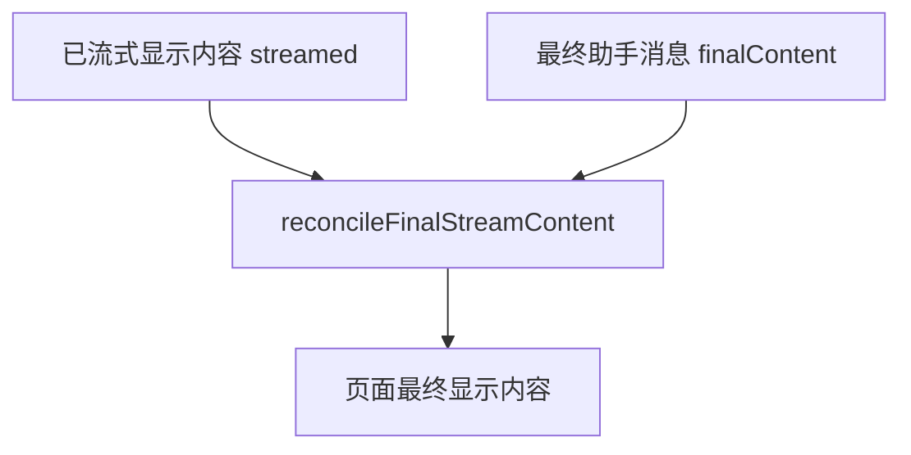

# E15：流式文本要去重，也要用最终消息校准

小林看到文字逐段出现时，页面背后在做一件很细的事：判断服务端发来的这一段，到底是不是新的。

不是所有流式供应商都会只发送“新增文字”。有的会发送累计文本，有的会在工具结果之后重复一大段上下文，有的最终消息会包含已经流式显示过的前缀。如果前端简单地把每次收到的字符串都拼到后面，页面很快就会出现重复段落。

本节讲 `stream-dedupe.ts` 和客户端如何使用它。

## 1. 本节源码入口

| 文件 | 本节关注点 |
| --- | --- |
| `packages/core/src/lib/integrations/pi-agent/stream-dedupe.ts` | 增量合并、可见 delta、尾部重复裁剪、最终内容校准 |
| `packages/core/src/lib/integrations/pi-agent/client-hooks.ts` | `sendMessageStream` 如何在收到 `text_delta` 和 `assistant_message` 时调用去重逻辑 |
| `packages/core/src/lib/integrations/pi-agent/__tests__/stream-dedupe.test.ts` | 已覆盖的去重场景 |

## 2. 三种常见流式文本形态

| 形态 | 服务端连续发来的内容 | 前端应该显示 |
| --- | --- | --- |
| 纯增量 | `你好`、`，小林`、`。` | `你好，小林。` |
| 累计帧 | `你好`、`你好，小林`、`你好，小林。` | `你好，小林。` |
| 重复完整帧 | `你好，小林。`、`你好，小林。` | `你好，小林。` |

如果只用字符串拼接：

```text
当前内容 += delta
```

那么累计帧会变成：

```text
你好你好，小林你好，小林。
```

这就是去重逻辑存在的原因。

## 3. appendStreamDelta 的基本判断

`appendStreamDelta(current, delta)` 要回答的问题是：已显示内容是 `current`，新来的片段是 `delta`，合并后应该是什么？

它会处理几类情况：

- `delta` 为空：不改变当前内容。
- `delta` 和 `current` 完全相同：认为是重复完整帧，不追加。
- `delta` 以 `current` 开头：认为是累计帧，直接使用 `delta`。
- `current` 已经以 `delta` 结尾：认为这段已经出现过，不追加。
- 两者尾首有重叠：只追加未重叠的部分。
- 都不满足：按普通增量追加。

这不是为了追求算法炫技，而是为了适配真实流式输出的不稳定形态。

基础合并逻辑定义在 [packages/core/src/lib/integrations/pi-agent/stream-dedupe.ts 第 18—49 行](../../../../packages/core/src/lib/integrations/pi-agent/stream-dedupe.ts#L18)。分支顺序本身就是语义：先处理空值和完全相同，再识别累计帧和已出现后缀，最后才扫描尾首重叠。

```ts
if (!delta) return current;
if (!current) return delta;
if (delta === current) return current;
if (delta.startsWith(current)) return delta;
if (current.endsWith(delta)) return current;
const overlap = longestSuffixPrefixOverlap(current, delta);
return current + delta.slice(overlap);
```

若一开始就无条件拼接，后续再做“全局删除重复”，很容易误删正文中本来就应当重复的词句。这里选择在流式边界只消除可识别的重叠，是更保守的策略。

## 4. 源码窗口一：重叠扫描不是全量暴力比较

`stream-dedupe.ts` 里有 `MAX_OVERLAP_SCAN`。它限制重叠扫描的最大范围。原因是流式内容可能非常长，如果每次都对完整历史和新片段做无上限比较，长回答会拖慢前端或服务端。

读这一段时要理解两个边界：

- 去重要尽量准确，但不能让算法成本随着长文本无限增长。
- 重叠判断只需要看当前内容尾部和新片段头部，因为重复通常发生在边界处。

这就是 `longestSuffixPrefixOverlap(left, right)` 的意义：找“左边尾巴”和“右边开头”最长能对上的部分，然后只追加没有重叠的后半段。

当前 `MAX_OVERLAP_SCAN` 是 65536，它把单次边界比较限制在最多约 64K 个 JavaScript code unit，而不是让每个 delta 都扫描整篇长回答。这个常量是性能护栏，不代表超过 64K 的重叠在语义上“不可能”；极端情况下算法会保守追加。因此，有限扫描不能被宣称为数学上的全局去重。

## 5. getVisibleStreamDelta 的作用

`getVisibleStreamDelta(current, next)` 不只返回合并后的完整内容，还返回“这次真正新增的可见 delta”。

例如：

| current | next | 返回 content | 返回 delta |
| --- | --- | --- | --- |
| `hello world` | `hello world again` | `hello world again` | ` again` |
| `hello world` | `hello world` | `hello world` | 空字符串 |

这对服务端桥接和前端调试都很有价值。因为有时我们既需要知道完整内容，也需要知道“这一次究竟新增了什么”。

## 6. 源码窗口二：`getVisibleStreamDelta` 是调试友好的合并接口

`appendStreamDelta` 只返回合并后的完整内容；`getVisibleStreamDelta` 还返回本次可见新增。这个设计让调用方可以同时拥有两个视角：

| 视角 | 使用场景 |
| --- | --- |
| 完整内容 `content` | 更新当前助手消息、作为下一次去重的基准 |
| 可见新增 `delta` | SSE 桥接只向客户端发送真正新增的部分 |

Runtime 桥接里就会维护 `sentTextAccumulator`。每次运行时发来新文本，都用 `getVisibleStreamDelta` 判断是否有新的可见 delta。没有新增就不发给客户端。

## 7. 最终消息为什么还要校准

流式过程中，页面显示的是不断合并出来的内容。但最终运行时可能还会发一个 `assistant_message`，里面带完整回答。

前端不能简单忽略最终消息，因为流式过程中可能丢了某些片段，或者服务端最终内容经过了整理。

前端也不能简单把最终消息追加到后面，因为这样可能重复整篇回答。

所以 `reconcileFinalStreamContent(streamed, finalContent)` 要做的是：用最终内容校准流式内容，同时避免重复前缀。



最终校准可以理解成“以最终消息为准，但不能制造重复”。

## 8. 源码窗口三：尾部重复裁剪为什么要有信号阈值

`trimRepeatingTail` 不是发现重复就删。它会看最小长度、最大长度、重复次数、扫描范围，还会判断 pattern 是否有足够信息量。

原因很直接：自然语言中有些短词重复是正常的。例如 “ok ok ok” 或列表中的重复词，不一定是生成故障。如果算法过度积极，可能误删用户本该看到的内容。

因此源码里有几类保护：

- 最小 pattern 长度：太短的不处理。
- 最小重复次数：只出现两次时不轻易判断为异常。
- 扫描长度限制：只关注尾部风险。
- fuzzy similarity：处理近似重复，但要达到相似度阈值。
- signal 判断：避免低信息量短重复被误删。

这体现了去重算法的核心取舍：宁可保守，也不能随意删正文。

尾部裁剪实现位于 [packages/core/src/lib/integrations/pi-agent/stream-dedupe.ts 第 149—208 行](../../../../packages/core/src/lib/integrations/pi-agent/stream-dedupe.ts#L149)，最终消息校准位于 [packages/core/src/lib/integrations/pi-agent/stream-dedupe.ts 第 210—224 行](../../../../packages/core/src/lib/integrations/pi-agent/stream-dedupe.ts#L210)。`reconcileFinalStreamContent` 的最后一个分支直接返回 `finalContent`：当最终消息和流式结果互不包含时，最终消息是权威事实，而不是把两个冲突版本拼在一起。

## 9. 尾部重复裁剪

`trimRepeatingTail` 处理的是另一类问题：模型或运行时在长输出尾部重复同一段话。

例如某段解释重复了三四遍。普通 delta 去重不一定能发现这种问题，因为每次重复可能已经成为当前内容的一部分。尾部裁剪会寻找重复模式，并尽量保留一份，去掉多余重复。

测试里覆盖了两类场景：

- 完全重复的长段落。
- 有少量措辞变化的近似重复段落。

这说明去重不是只处理“两个字符串完全相等”的简单情况。

## 10. 小林案例：旅行计划为什么容易重复

旅行计划类回答往往很长，并且可能夹杂工具结果、分段标题和总结。运行时可能先输出：

```text
第一天：抵达杭州，下午游览西湖。
```

下一帧又输出累计内容：

```text
第一天：抵达杭州，下午游览西湖。
第二天：灵隐寺和龙井村。
```

如果前端不识别累计帧，小林会看到“第一天”重复一次。回答越长，重复越明显。

## 11. 测试怎样证明这件事

`stream-dedupe.test.ts` 覆盖了几个关键事实：

| 测试场景 | 证明什么 |
| --- | --- |
| duplicate full-content deltas | 完整重复帧不会重复显示 |
| accumulated text | 累计帧只暴露新增后缀 |
| long accumulated frames | 很长内容之后仍能正确识别新增部分 |
| final content reconciliation | 最终内容不会重复已流式前缀 |
| repeated generated tails | 长尾重复可以被裁剪 |
| near-duplicate tails | 近似重复也能处理 |
| ordinary repeated short words | 不会误删普通短词重复 |

这些测试不是装饰，它们对应真实用户会看到的文本质量问题。

测试实现可在 [packages/core/src/lib/integrations/pi-agent/__tests__/stream-dedupe.test.ts 第 9—81 行](../../../../packages/core/src/lib/integrations/pi-agent/__tests__/stream-dedupe.test.ts#L9) 中逐项核对。测试证明的是列出的代表场景不会回归，不是对任意自然语言重复的完备判定；近似重复仍依赖阈值和启发式规则。

客户端实际调用点位于 [packages/core/src/lib/integrations/pi-agent/client-hooks.ts 第 933—988 行](../../../../packages/core/src/lib/integrations/pi-agent/client-hooks.ts#L933)：增量事件走 `appendStreamDelta`，最终 `assistant_message` 和 `done.content` 走 `reconcileFinalStreamContent`。同时检查算法与调用点，才能确认工具函数确实接入了生产链路。

## 12. 本节小结

流式文本去重解决两个问题：

1. 过程中不要重复显示已经出现过的内容。
2. 结束时用最终助手消息校准页面内容，但不要重复整段回答。

如果读者以后看到流式回复重复，不应只怀疑模型“说话啰嗦”。还要检查服务端发的是纯增量还是累计帧，前端有没有正确调用去重和最终校准。

## 13. 本节源码验收

读完本节，应能说明：

1. `appendStreamDelta` 分别怎样处理空 delta、完整重复、累计帧、尾首重叠。
2. `MAX_OVERLAP_SCAN` 为什么是性能边界。
3. `getVisibleStreamDelta` 为什么比只返回完整内容更适合流式桥接。
4. `reconcileFinalStreamContent` 怎样避免最终消息重复。
5. `trimRepeatingTail` 为什么要保守裁剪。

## 14. 自测问题

1. 纯增量和累计帧有什么区别？
2. 为什么最终 `assistant_message` 不能简单追加到当前内容后面？
3. `getVisibleStreamDelta` 为什么要同时返回 `content` 和 `delta`？
4. 尾部重复裁剪为什么不能把所有短词重复都删掉？
