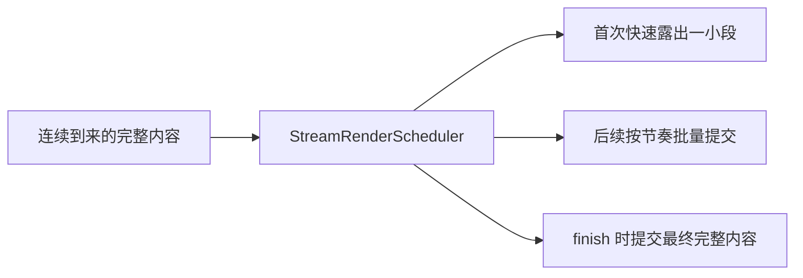

# E16：流式渲染需要调度器，而不是无限 setState

收到流式文本以后，前端还有一个问题：是不是每来一个字符、每来一个事件，都立刻更新 React 状态？

直觉上这样最“实时”。但工程上，如果事件太密集，频繁更新会让 UI 抖动、卡顿，甚至影响输入和滚动。流式回复需要的不只是“快”，还需要“稳定地快”。

本节讲 `StreamRenderScheduler`。

## 1. 本节源码入口

| 文件 | 本节关注点 |
| --- | --- |
| `packages/core/src/lib/integrations/pi-agent/stream-render-scheduler.ts` | 流式渲染调度器的批量提交、完成、刷新、取消 |
| `packages/core/src/lib/integrations/pi-agent/client-hooks.ts` | `sendMessageStream` 如何用调度器更新助手占位消息 |
| `packages/core/src/lib/integrations/pi-agent/__tests__/stream-render-scheduler.test.ts` | 调度器行为测试 |

## 2. 为什么不能无限制更新状态

假设服务端一秒钟发来几百个小片段。如果前端每收到一个片段就执行一次状态更新，会发生：

- React 重新渲染次数过多。
- 消息列表频繁重排。
- 光标、滚动、按钮状态更新被拖慢。
- 长消息时页面更容易卡顿。

所以前端需要在“用户感觉足够实时”和“浏览器能稳定渲染”之间做平衡。调度器就是这个平衡层。

## 3. 调度器的基本思想

`StreamRenderScheduler` 接收最新完整内容，但不一定每次都立即完整提交。它会按一定节奏把内容分批显示出来，并在结束时确保最终内容完整提交。



这比直接 `setState(latestContent)` 更可控。

## 4. 源码窗口一：构造参数代表渲染策略

`StreamRenderScheduler` 的构造参数不是随意数字，它们共同定义渲染节奏。

| 参数 | 含义 | 直观理解 |
| --- | --- | --- |
| `intervalMs` | 两次节奏性提交之间的间隔 | 不要过于频繁更新 UI |
| `initialChars` | 第一次快速露出的字符数 | 让用户尽快看到回复开始 |
| `minCharsPerTick` | 每轮至少推进多少字符 | 避免显示太慢 |
| `maxCharsPerTick` | 每轮最多推进多少字符 | 避免一次跳太多造成突兀 |
| `catchUpTicks` | 追赶最新内容的节奏因子 | 长内容到来时逐步追上 |
| `now` | 时间来源 | 测试时可替换成可控时间 |

读者要理解：调度器不是为了制造打字机动画，而是为了控制 React 状态提交压力。

配置、内部状态与默认值定义在 [packages/core/src/lib/integrations/pi-agent/stream-render-scheduler.ts 第 1—68 行](../../../../packages/core/src/lib/integrations/pi-agent/stream-render-scheduler.ts#L1)。默认 `intervalMs = 32` 约等于每秒最多三十余次节奏性提交，但真实次数还受输入到达、首次露出和 finish 影响，不能机械解释为固定帧率。

调度器同时保存 `latestContent` 与 `renderedContent`。前者是已收到的真值上界，后者是已经交给 React 的可见前缀，二者长度差就是 backlog。`active` 决定实例是否仍有效，`finalizing` 表示正在权威收尾，`finishResolvers` 让调用方可以等待最终提交真正完成。

## 5. schedule：接收最新内容

`schedule(content)` 的职责是告诉调度器：“目前最新内容是这个。”

调度器会保存最新内容，并决定是否立即提交一部分，或者设置定时器稍后提交。它不是只处理“新增 delta”，而是面向“当前应该显示到哪份完整内容”。

这点很重要。因为 E15 已经讲过，流式来源可能是纯增量，也可能是累计帧。经过去重和合并后，传给调度器的应该是当前完整内容。

## 6. 源码窗口二：`schedule` 如何避免过量 commit

`schedule` 会保存最新内容，但只有在合适时机才调用 `onCommit`。它会处理：

- 第一次内容到来时，尽快露出一小段。
- 如果距离上次提交时间还很短，就设置 timer。
- 如果内容增长很快，按批量策略推进。
- 如果已经取消，则忽略后续 schedule。

这里的核心不是“延迟显示”，而是“合并过密更新”。用户仍然感觉实时，但 React 不会被每个细碎事件拖垮。

`schedule` 位于 [packages/core/src/lib/integrations/pi-agent/stream-render-scheduler.ts 第 70—94 行](../../../../packages/core/src/lib/integrations/pi-agent/stream-render-scheduler.ts#L70)。如果新内容不再以前一次可见内容开头，代码会回退到二者公共前缀，再从共同事实继续渲染。这一分支处理最终内容修订或去重校准造成的非单调变化。

定时器推进逻辑位于 [packages/core/src/lib/integrations/pi-agent/stream-render-scheduler.ts 第 144—175 行](../../../../packages/core/src/lib/integrations/pi-agent/stream-render-scheduler.ts#L144)。每次推进量取 `backlog / catchUpTicks`，再夹在最小值与最大值之间：积压越多，每轮追赶越快；但不会低于可感知进度，也不会一次提交无界大块内容。

## 7. finish：不能依赖最后一个定时器

流式结束时，前端必须确保页面显示最终完整内容，并把 `isStreaming` 改为 false。

如果只依赖之前设置的渲染定时器，可能出现一个尴尬情况：服务端已经发了 `done`，但调度器还有未提交内容，页面看起来像少了一截。或者定时器被取消后，最终状态永远不落地。

所以 `finish(finalContent)` 会主动提交最终内容，并保证最终有一次非 streaming 状态的提交。

## 8. 源码窗口三：`finish`、`flush`、`cancel` 的收尾边界

这三个方法都和收尾有关，但语义不同。

| 方法 | 核心语义 | 不能混用的原因 |
| --- | --- | --- |
| `finish` | 正常结束，把最终内容完整提交 | 它代表这一轮流结束 |
| `flush` | 立即提交指定内容 | 它不一定代表整轮结束 |
| `cancel` | 取消后续更新 | 它代表当前调度器已经失效 |

停止生成、会话切换、新流开始时，旧调度器必须 `cancel`。否则即使事件已经被判定过期，旧 timer 仍可能晚一点把旧内容写进 UI。

三种收尾定义在 [packages/core/src/lib/integrations/pi-agent/stream-render-scheduler.ts 第 96—142 行](../../../../packages/core/src/lib/integrations/pi-agent/stream-render-scheduler.ts#L96)。`finish` 返回 Promise，并把 resolver 收入数组；`commitFinal` 完成非 streaming 提交后统一 resolve。重复对同一最终内容调用 `finish` 会立即返回，避免重复终态提交。

Hook 的接入位于 [packages/core/src/lib/integrations/pi-agent/client-hooks.ts 第 662—722 行](../../../../packages/core/src/lib/integrations/pi-agent/client-hooks.ts#L662)。这里为不同 assistant turn 管理 scheduler，并在切流、异常和 finally 中取消。只有检查这些生命周期调用，才能证明 scheduler 不是“写了但未接入”的孤立工具。

## 9. flush 与 cancel

`flush(content, isStreaming)` 用于立即提交最新内容，适合需要立刻同步 UI 的场景。

`cancel()` 用于停止后忽略后续更新。比如小林点了停止，或者新一轮流已经开始，旧调度器就不能再继续把旧内容提交到消息列表。

| 方法 | 作用 | 典型场景 |
| --- | --- | --- |
| `schedule` | 接收最新内容，按节奏显示 | 正常流式生成 |
| `finish` | 完成并提交最终内容 | 收到 `assistant_message` 或 `done` |
| `flush` | 立即提交 | 强制同步最终状态 |
| `cancel` | 取消后续提交 | 停止生成、切换会话、新流开始 |

## 10. UTF-16 边界为什么也要处理

测试里有一个看似很细的场景：不要把 UTF-16 surrogate pair 切开。简单说，一些 emoji 或特殊字符在 JavaScript 字符串里由两个 code unit 组成。如果截断时切在中间，页面可能出现乱码或异常字符。

例如：

```text
A😀B
```

如果调度器第一次只提交到半个 `😀`，显示就可能出错。`stream-render-scheduler.ts` 会避免在不安全的 UTF-16 边界截断。

这类细节正是正式工程和演示代码的差别。

安全截断位于 [packages/core/src/lib/integrations/pi-agent/stream-render-scheduler.ts 第 177—228 行](../../../../packages/core/src/lib/integrations/pi-agent/stream-render-scheduler.ts#L177)。如果计划切点前一个 code unit 是 high surrogate，切点向后移动一位，把配对的 low surrogate 一起提交；计算公共前缀时则反向退一位，避免保留半个字符。

它保护的是 surrogate pair，而不是完整的 Unicode grapheme cluster。由多个 code point 组合的复杂 emoji 仍可能在视觉单元内部断开。正式教材既要说明已解决的边界，也要说明尚未覆盖的更大边界。

## 11. 小林案例：为什么旅行长回答更需要调度

小林的旅行路线可能包含多天计划、预算、交通、住宿建议。服务端如果快速发来大量片段，前端不调度就可能让页面频繁重渲染。

调度后，小林仍然能感到回答在实时出现，但浏览器不必为每个微小片段都重新渲染整个消息区。

## 12. 测试怎样证明调度器可靠

`stream-render-scheduler.test.ts` 覆盖了这些关键行为：

| 测试场景 | 证明什么 |
| --- | --- |
| adaptive batches with bounded commits | 大量输入不会导致大量提交 |
| flush latest content | 可以立即提交并取消定时器 |
| final content without timer | 结束时不依赖渲染定时器 |
| incoming events as render clock | 到来的事件也能推动节奏 |
| repeated finish | 多次 finish 不会重复制造最终提交 |
| done supplies more content | done 带更多内容时仍能完整显示 |
| cancellation | 取消后忽略后续更新 |
| UTF-16 surrogate pair | 不切坏 emoji 等字符 |

这些测试覆盖的是用户能直接感受到的体验质量：不卡、不丢、不乱、不乱码。

测试实现位于 [packages/core/src/lib/integrations/pi-agent/__tests__/stream-render-scheduler.test.ts 第 4—168 行](../../../../packages/core/src/lib/integrations/pi-agent/__tests__/stream-render-scheduler.test.ts#L4)。测试使用 fake timers 和可控 `now`，把现实中的时间不确定性转成可重复断言。它证明“给定调度输入时提交有界且终态完整”，但不等于证明真实页面已经达到 60fps；真实性能仍需浏览器数据和消息列表级测量。

## 13. 本节小结

流式 UI 不是越频繁更新越好。可靠的流式渲染需要调度器：

- 正常生成时分批提交。
- 结束时强制完整提交。
- 停止或切换时取消旧提交。
- 截断文本时保护字符边界。

读完本节后，读者应该能理解：流式回复的“顺滑感”不是 CSS 动画给的，而是状态更新节奏控制出来的。

## 14. 本节源码验收

读完本节，应能说明：

1. 每个构造参数对应什么体验或性能取舍。
2. `schedule` 为什么保存最新内容但不总是立即完整提交。
3. `finish` 为什么不能依赖 timer。
4. `cancel` 为什么是停止和切换会话时的安全边界。
5. UTF-16 安全截断为什么属于真实产品质量问题。

## 15. 自测问题

1. 为什么每收到一个 delta 就 setState 可能造成性能问题？
2. `schedule` 和 `finish` 的职责有什么区别？
3. 停止生成时为什么要 cancel 调度器？
4. UTF-16 边界问题为什么会影响流式渲染？
