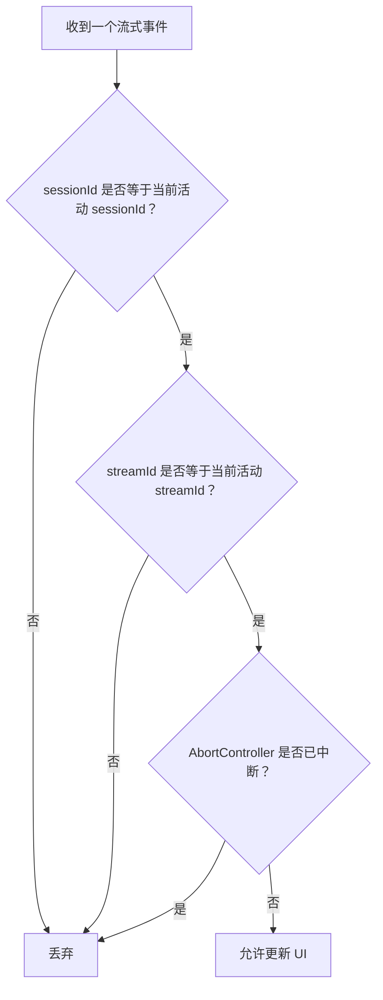
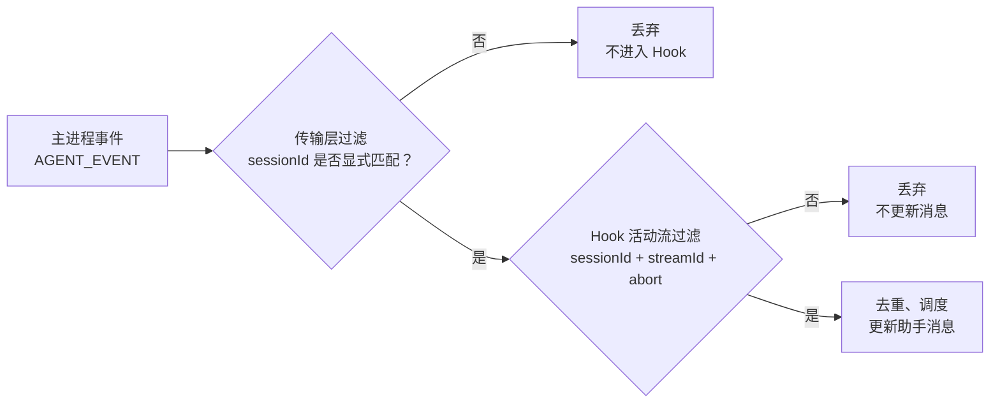

# E17：流身份防止多窗口和旧事件串流

当只有一个窗口、一次发送时，流式逻辑看起来已经够复杂。但真实应用里，小林可能同时打开旅行规划 Agent 和资料整理 Agent，也可能在一轮回复没结束时点击停止，再马上发送新问题。

这时最大风险不是“没有回复”，而是“回复进了错误的地方”。E17 讲的就是会话隔离和流身份。

## 1. 本节源码入口

| 文件 | 本节关注点 |
| --- | --- |
| `packages/core/src/lib/integrations/pi-agent/client-hooks.ts` | `streamId`、活动流引用、`isActiveStream` 判断 |
| `packages/core/src/lib/integrations/electron/services/agent-session.ts` | Electron 事件订阅按 `sessionId` 过滤 |
| `packages/core/src/lib/integrations/pi-agent/__tests__/client-hooks-session-isolation.test.ts` | 多会话、旧流、恢复竞态的隔离测试 |

## 2. 为什么只靠 sessionId 还不够

`sessionId` 能区分不同会话，但不能区分同一会话里的不同流。

例如：

1. 小林在同一窗口发送第一问。
2. 第一问开始流式生成，得到 `streamId = A`。
3. 小林点停止。
4. 小林马上发送第二问，得到 `streamId = B`。
5. 服务端或 Electron 事件通道里，第一问的旧事件晚到了。

如果前端只看 `sessionId`，旧事件仍然属于同一会话，于是可能被错误追加到第二问的助手消息里。

所以流式隔离需要两个身份：

| 身份 | 区分什么 |
| --- | --- |
| `sessionId` | 哪段会话 |
| `streamId` | 这段会话里的哪一轮流式生成 |

## 3. active stream 判断

`client-hooks.ts` 在流式发送时会记录当前活动流：

- 当前活动 `streamId`。
- 当前活动 `sessionId`。
- 当前 `AbortController`。
- 当前 Electron 订阅取消函数。

处理事件时，前端会判断这个事件是否仍属于当前活动流。只有同时满足会话和流身份匹配，并且请求没有被 abort，事件才可以更新消息列表。



这张图就是防串流的核心。

图中的三个判断分别对应三个源码责任。`sessionId` 判断保证事件属于当前会话，主要解决跨窗口串流；`streamId` 判断保证事件属于当前这一轮生成，主要解决停止后重发或同会话旧流晚到；`AbortController` 判断保证用户已经停止后，旧异步不能继续写 UI。最后的“允许更新 UI”才会进入去重、调度和消息列表更新。也就是说，文本内容本身不能证明事件有效，事件身份才是第一判断。

## 4. Electron 订阅也要过滤

Electron 环境中，事件可能从主进程统一推到渲染进程。如果订阅不按会话过滤，A 会话事件可能被 B 会话 Hook 收到。

`agent-session.ts` 的 `subscribeAgentEvents` 支持传入 `sessionId`。当事件里没有匹配的 `sessionId` 时，监听器不会继续处理。

这是一道靠近传输层的过滤。前端 Hook 内部还会继续做 `streamId` 判断。两层保护叠加，才能降低串流风险。

下面这张图把两层过滤分开。它回答的问题是：为什么不能只在 Hook 里判断，也不能只靠 Electron 订阅过滤。



这张图里，左侧的传输层过滤对应 `agent-session.ts` 的 `subscribeAgentEvents`，它负责挡住没有明确目标会话的事件；右侧的 Hook 活动流过滤对应 `client-hooks.ts` 中当前流身份判断，负责挡住同一会话里的旧流、停止后的事件和切换后的残留事件。两层过滤处理的问题不同，所以不能互相替代。

## 5. 源码窗口一：`isActiveStream` 的三重判断

`client-hooks.ts` 的流式处理里会定义类似 `isActiveStream` 的判断。它不是只看一个字段，而是综合判断：

真实定义位于 [packages/core/src/lib/integrations/pi-agent/client-hooks.ts 第 615—630 行](../../../../packages/core/src/lib/integrations/pi-agent/client-hooks.ts#L615)：

```ts
const streamSessionId = sessionIdRef.current;
const abortController = new AbortController();
const streamId = `stream-${Date.now()}-${streamSequenceRef.current++}`;
activeStreamIdRef.current = streamId;
const isActiveStream = () =>
  activeStreamIdRef.current === streamId
  && sessionIdRef.current === streamSessionId
  && !abortController.signal.aborted;
```

闭包捕获的是本轮固定的 `streamSessionId`、`streamId` 和 controller，而 `sessionIdRef.current`、`activeStreamIdRef.current` 表示此刻仍然活跃的身份。比较“当时是谁”和“现在是谁”，才能判断异步结果是否仍有提交资格。

| 判断 | 防止的问题 |
| --- | --- |
| 当前 `streamId` 是否匹配 | 同一会话旧流事件污染新流 |
| 当前 `sessionId` 是否匹配 | 不同会话之间串流 |
| 当前 abort signal 是否已中断 | 用户停止后事件继续生效 |

这三个条件缺一个都不完整。只看 `sessionId` 防不了同会话旧流；只看 `streamId` 防不了跨会话误投；不看 abort signal，停止后仍可能更新 UI。

## 6. 源码窗口二：`subscribeAgentEvents` 的会话级过滤

`agent-session.ts` 里的 Electron 订阅逻辑会检查事件 payload 中的 `sessionId`。如果订阅方传了目标 `sessionId`，事件没有显式携带相同 sessionId 就会被丢弃。

这个设计有一个具体目标：避免 project-level 的宽泛事件被 session 级窗口消费。也就是说，一个只带 `projectId` 的事件不能自动进入某个具体会话窗口。

读者要注意，这里不是“多做一层保险”这么简单，而是不同粒度事件的边界问题：

| 事件粒度 | 能否进入具体会话流 |
| --- | --- |
| 明确带目标 `sessionId` | 可以继续进入 Hook 内部判断 |
| 只带 `projectId` | 不应进入具体 session 订阅 |
| 带错误 `sessionId` | 直接丢弃 |

过滤实现位于 [packages/core/src/lib/integrations/electron/services/agent-session.ts 第 290—326 行](../../../../packages/core/src/lib/integrations/electron/services/agent-session.ts#L290)。当订阅传入 `sessionId` 时，payload 未携带字符串 sessionId 也会被拒绝，而不是把“缺失”视为通配。这一默认拒绝策略正是会话级订阅的隔离边界。

该函数的 `catch {}` 会吞掉 JSON 解析或分发异常。这避免坏 payload 冲击渲染进程，却会降低故障可见性；正式排错时不能只看 UI，还要检查主进程事件是否格式异常。教材应同时解释保护效果和诊断代价。

## 7. 源码窗口三：批量事件合并 `coalesceAgentEventBatch`

Electron 事件里可能出现 `batch_events`。`agent-session.ts` 会用 `coalesceAgentEventBatch` 把连续的 `text_delta` 合并成一条较大的 delta。

这和 E16 的渲染调度有关。事件合并发生在传输适配层，渲染调度发生在 UI 更新层。两者目标不同：

| 层级 | 目标 |
| --- | --- |
| 批量事件合并 | 减少连续小 delta 的事件数量 |
| 渲染调度 | 控制 React 状态提交节奏 |

不能把二者混为一谈。合并事件并不等于可以跳过渲染调度；渲染调度也不等于解决了传输层事件过碎的问题。

合并算法位于 [packages/core/src/lib/integrations/electron/services/agent-session.ts 第 265—288 行](../../../../packages/core/src/lib/integrations/electron/services/agent-session.ts#L265)。它只合并**连续相邻**的 `text_delta`；一旦中间出现 `tool_start`，前后文本就保持分离，从而不破坏工具事件的顺序。它还通过 `{ ...event }` 复制输出事件，避免直接修改调用方传入的数组元素。

## 8. 旧流为什么很危险

旧流事件通常发生在这些场景：

- 用户点击停止，但服务端已经发出的一些事件还在路上。
- 浏览器 abort 了 fetch，但某些异步处理已经排队。
- Electron 订阅没有及时取消。
- 用户快速切换会话，旧请求晚于新请求返回。

旧事件的危险在于它们看起来“合法”。它们可能带着同一个 `sessionId`，内容也是正常文本。只有 `streamId` 和当前活动状态能判断它们是否过期。

## 9. 测试覆盖了哪些隔离场景

`client-hooks-session-isolation.test.ts` 是这一节的重要证据。

| 测试场景 | 证明什么 |
| --- | --- |
| normalized entry ownership scope | 创建和发送都会携带规范化入口归属 |
| project-level events not delivered to another stream | 缺少目标会话身份的事件不会串入其他会话 |
| late events from aborted stream | 停止后的旧流事件不会污染新流 |
| newest restore wins | 晚返回的旧恢复请求不能覆盖较新的恢复状态 |
| active Session idempotent restore | 恢复当前会话时不会重复请求 |
| restore failure keeps current Session | 恢复失败不能破坏当前消息 |
| restore B removes A subscription | 切换会话后旧订阅被移除，新请求只发往新会话 |

这些测试说明：隔离不仅发生在流式文本层，也发生在初始化、恢复、订阅、发送多个环节。

可直接核对的测试窗口包括：

- [packages/core/src/lib/integrations/pi-agent/__tests__/client-hooks-session-isolation.test.ts 第 176—263 行](../../../../packages/core/src/lib/integrations/pi-agent/__tests__/client-hooks-session-isolation.test.ts#L176)：不同会话与 project-level 事件隔离。
- [packages/core/src/lib/integrations/pi-agent/__tests__/client-hooks-session-isolation.test.ts 第 264—352 行](../../../../packages/core/src/lib/integrations/pi-agent/__tests__/client-hooks-session-isolation.test.ts#L264)：abort 后旧流的 delta 和 final 都不能污染新流。
- [packages/core/src/lib/integrations/pi-agent/__tests__/client-hooks-session-isolation.test.ts 第 353—486 行](../../../../packages/core/src/lib/integrations/pi-agent/__tests__/client-hooks-session-isolation.test.ts#L353)：乱序恢复和晚到初始化不能覆盖最新会话。
- [packages/core/src/lib/integrations/electron/services/__tests__/agent-session-stream.test.ts 第 1 行起](../../../../packages/core/src/lib/integrations/electron/services/__tests__/agent-session-stream.test.ts#L1)：批量 delta 合并与工具事件顺序。

这些测试通过 mock 控制事件顺序，证明客户端状态机的防污染规则；它们不证明跨真实 Electron IPC 的所有 payload 都必然携带正确 sessionId。真实边界仍需主进程发送端和集成测试共同验证。

## 10. 源码窗口四：测试不是只测 happy path

`client-hooks-session-isolation.test.ts` 的价值在于，它专门构造“晚到”和“串流”场景，而不是只测正常发送成功。

| 测试动作 | 读者要看懂的断言 |
| --- | --- |
| 同时启动 projectHook 和 skillHook | 不同 Hook 实例不能互相接收最终消息 |
| 先发第一条流，再 abort，再发第二条流 | 第一条旧 `streamId` 的 delta 和 final 都不能进入第二条 |
| 让 restore A 和 restore B 乱序返回 | 后返回的旧操作不能覆盖新会话 |
| 切换到 B 后发 A 的旧事件 | B 的消息列表不能出现 late A |

这些测试对应真实用户行为，不是人为复杂化。流式 UI 的很多 bug 都只会在乱序、停止、切换时出现。

## 11. 小林案例：停止后马上追问

小林第一问：

> 帮我规划杭州三天两晚。

生成到一半，她觉得预算太高，点击停止，然后马上发第二问：

> 按人均 1500 元重新规划。

此时第一问的旧事件如果晚到，绝不能追加到第二问后面。否则页面可能出现“预算 1500 元规划”中混入“高预算酒店推荐”的内容。

防止这个问题的关键就是：第二问创建了新的 `streamId`，旧 `streamId` 的事件即使到达，也会被丢弃。

## 12. 本节小结

流式隔离要同时看会话身份和流身份。

- `sessionId` 防止不同会话之间串。
- `streamId` 防止同一会话的新旧流之间串。
- `AbortController` 和订阅取消防止停止或切换后的旧异步继续生效。
- 测试要覆盖“晚到”“切换”“停止后重发”这些真实竞态。

如果未来出现串流 bug，排查时不能只看消息内容，要先看事件身份。

## 13. 本节源码验收

读完本节，应能说明：

1. `sessionId` 和 `streamId` 分别防哪类串流。
2. Electron 订阅为什么拒绝只带 `projectId` 的事件。
3. `coalesceAgentEventBatch` 和 `StreamRenderScheduler` 的层级差异。
4. 旧流事件为什么即使内容正常也必须丢弃。
5. 隔离测试为什么必须制造乱序返回和 late event。

## 14. 自测问题

1. 为什么同一会话里仍然需要 `streamId`？
2. 旧事件为什么不能只靠文本内容识别？
3. Electron 订阅按 `sessionId` 过滤解决了什么问题？
4. “最新恢复获胜”与流式隔离有什么共同思想？
