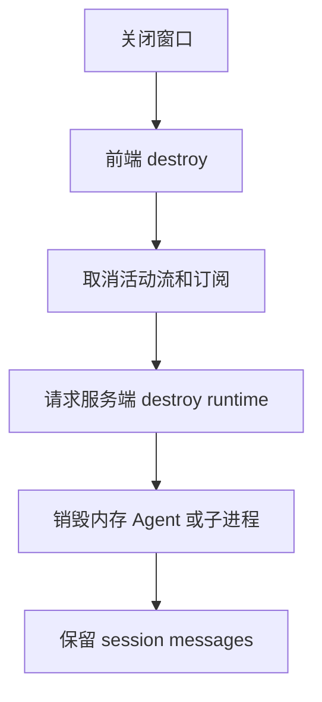

# E18：停止、销毁和删除会话不是一件事

小林使用旅行规划 Agent 时，会遇到几个看似相近的动作：停止生成、关闭窗口、删除会话。它们在用户界面上都像是在“结束某件事”，但源码层面完全不同。

本节要把三个动作分清楚：

- abort：停止当前正在进行的生成。
- destroy：销毁当前运行时实例，通常用于关闭窗口，但保留会话数据。
- delete session：删除持久化会话记录。

这一节主要讲 abort 和 destroy；delete session 会在持久化单元继续深入。

## 1. 本节源码入口

| 文件 | 本节关注点 |
| --- | --- |
| `packages/core/src/lib/integrations/pi-agent/client-hooks.ts` | `abort`、`destroy`、`detachActiveStream` 的前端行为 |
| `packages/core/src/lib/integrations/electron/services/agent-session.ts` | `abortAgentSession`、`destroyAgentSession` 的传输行为 |
| `packages/web/src/app/api/agent/abort/route.ts` | 服务端中断运行中 Agent |
| `packages/web/src/app/api/agent/sessions/destroy/route.ts` | 按 sessionId 或 projectId 销毁运行时 |
| `packages/web/src/app/api/agent/sessions/[sessionId]/destroy/route.ts` | 按路径 sessionId 销毁运行时 |
| `packages/desktop/src/main/services/agent-session-service.ts` | Electron abort/destroy 的真实主进程语义 |

## 2. 三个动作的差异

| 动作 | 用户语义 | 运行时语义 | 会话数据 |
| --- | --- | --- | --- |
| abort | 停止当前回答 | 尽量中断正在执行的 Agent 操作，并停止当前流 | 保留 |
| destroy | 关闭窗口或释放运行时 | 销毁内存中或子进程中的 Agent 实例 | 保留 |
| delete session | 删除这段历史 | 删除持久化会话记录 | 删除或不可再恢复 |

这张表必须牢牢记住。否则很容易把“关闭窗口”做成“删除聊天记录”，或者把“停止生成”做成“销毁整个 Agent”。

## 3. 前端 abort 做了什么

`client-hooks.ts` 的 `abort` 位于 [packages/core/src/lib/integrations/pi-agent/client-hooks.ts 第 1061—1085 行](../../../../packages/core/src/lib/integrations/pi-agent/client-hooks.ts#L1061)，会处理当前活动流：

1. 读取当前 `AbortController`。
2. 调用 `abort()` 中断浏览器侧请求或当前异步读取。
3. 取消 Electron 订阅或流式监听。
4. 把当前正在 streaming 的助手消息标记为非 streaming。
5. 如果助手消息没有内容，可能显示“已停止”一类提示。
6. 重置 `isLoading`、`isStreaming`、`thinking` 等 UI 状态。
7. 通知服务端 `/api/agent/abort`，让运行时也尽量停止。

前端 abort 的目标是：页面不要再接收和显示这轮流式生成，用户可以继续下一步操作。

## 4. 源码窗口一：`detachActiveStream` 是停止前的公共清理

`client-hooks.ts` 里的 `detachActiveStream` 可以理解成“把当前活动流从 Hook 上摘下来”。它会处理：

这项公共清理定义在 [packages/core/src/lib/integrations/pi-agent/client-hooks.ts 第 373—386 行](../../../../packages/core/src/lib/integrations/pi-agent/client-hooks.ts#L373)。

| 清理对象 | 为什么要清理 |
| --- | --- |
| `activeStreamIdRef` | 让旧 `streamId` 立即失效 |
| `abortControllerRef` | 中断 Web fetch 或当前异步读取 |
| `streamUnsubscribeRef` | 取消 Electron 事件订阅 |
| loading / streaming 状态 | 让 UI 不再显示正在生成 |
| server abort 通知 | 让服务端运行时也尽量停下 |

这个函数的价值在于复用。初始化新会话、恢复会话、停止生成、销毁 Hook，都可能需要先把当前活动流安全摘掉。

## 5. 为什么前端 abort 还要通知服务端

浏览器侧 abort 可以停止当前 fetch 或停止读取事件，但它不一定保证服务端模型调用立刻停止。如果服务端运行时继续执行，就会浪费资源，甚至可能继续调用工具。

所以 `abortAgentSession` 会向 `/api/agent/abort` 发送请求。这里要注意一个源码级细节：客户端 helper 当前发送的是 `{ sessionId }`，而 `/api/agent/abort` 的注释和实现读取的是 `agentId`。这意味着这条路径存在字段命名不一致的风险，需要后续代码层面进一步核准或修复；当前实现不能被视为已经完全闭合的服务端中断保证。

两端证据分别位于 [packages/core/src/lib/integrations/electron/services/agent-session.ts 第 330—344 行](../../../../packages/core/src/lib/integrations/electron/services/agent-session.ts#L330) 和 [packages/web/src/app/api/agent/abort/route.ts 第 21—35 行](../../../../packages/web/src/app/api/agent/abort/route.ts#L21)。按当前代码，Web helper 发出的 body 没有 `agentId`，Route 会返回 400 `INVALID_REQUEST`。这不是“潜在可能”，而是静态源码已经能确认的契约不一致；在修复前，Web 侧停止只能可靠地立即停止本地接收，不能宣称服务端执行已被中断。

服务端再根据当前模式查找运行中的 Agent。Web Runtime 进程入口保存于 [packages/web/src/app/api/agent/_runtime-agent-registry.ts 第 1—37 行](../../../../packages/web/src/app/api/agent/_runtime-agent-registry.ts#L1) 的 `globalThis.__runtimeAgents`，借此避免 Next.js HMR 创建彼此隔离的 Map；进程内长驻 Agent 则通过 [packages/core/src/lib/integrations/pi-agent/persistent-agent-manager.ts 第 1 行](../../../../packages/core/src/lib/integrations/pi-agent/persistent-agent-manager.ts#L1) 查询。本节只引用后者的 abort 查找接口，其完整长驻生命周期属于后续专门单元。

服务端的查找顺序是：

- Runtime 模式：通过 spawner、registry 或进程列表定位并 abort。
- in-process 模式：通过 `persistentAgentManager` 找到 Agent，调用内部 `abort()`，并尝试等待 idle。

这说明完整停止是双边动作：前端停止接收，服务端停止执行。

## 6. 源码窗口二：`/api/agent/abort` 的运行时查找顺序

`abort/route.ts` 的 POST 入口要按两种模式读。

| 模式 | 查找方式 | 教学重点 |
| --- | --- | --- |
| Runtime 模式 | 先用 agentId 查 spawner，再用 projectId 查 registry，最后扫描进程 | 运行时进程身份可能需要映射 |
| in-process 模式 | 用 `persistentAgentManager.getAgent(agentId)` 查内存 Agent | 当前进程内 Agent 可以直接调用内部 abort |

如果找不到 Agent，route 会把它当成“已经停止”一类情况处理，而不是直接让用户面对硬错误。这种设计有利于停止按钮的幂等体验，但也意味着测试要确认它不会掩盖真正的字段不匹配问题。

## 7. destroy 与 abort 的区别

`destroy` 更像“Hook 生命周期结束”。[packages/core/src/lib/integrations/pi-agent/client-hooks.ts 第 1087—1114 行](../../../../packages/core/src/lib/integrations/pi-agent/client-hooks.ts#L1087) 会失效操作 epoch、终止恢复和流、清空本地状态与监听器，**但这个 Hook 方法本身没有调用服务端 destroy Route**。

真正关闭应用窗口时，Web 窗口管理层会另外调用 `destroyAgentSession`。因此不能把“Hook 的 `destroy()`”和“关闭窗口完整链路”当成同一个函数。前者负责本地状态释放，后者由窗口管理器负责通知服务端；如果某个调用方只执行 Hook destroy 而没有走窗口管理链，服务端运行时仍可能存在。

但 destroy route 的注释明确表达了一个重要约束：销毁 Agent 实例时，持久化会话数据应该保留。也就是说，小林关闭旅行规划窗口，不代表她的历史对话被删除。下次打开时，系统仍可能根据会话记录恢复。

## 8. 源码窗口三：destroy route 的查找策略

两个 destroy route 都要解决同一个问题：调用方给的身份和运行时真实身份不一定完全相同。

请求体版本位于 [packages/web/src/app/api/agent/sessions/destroy/route.ts 第 21—150 行](../../../../packages/web/src/app/api/agent/sessions/destroy/route.ts#L21)，路径版本位于 [packages/web/src/app/api/agent/sessions/[sessionId]/destroy/route.ts 第 17—120 行](../../../../packages/web/src/app/api/agent/sessions/%5BsessionId%5D/destroy/route.ts#L17)。客户端统一 helper 则位于 [packages/core/src/lib/integrations/electron/services/agent-session.ts 第 132—146 行](../../../../packages/core/src/lib/integrations/electron/services/agent-session.ts#L132)。

| route | 主要输入 | 典型查找策略 |
| --- | --- | --- |
| `/api/agent/sessions/destroy` | body 中的 `sessionId` / `projectId` | 直接查 sessionId；必要时通过 session DB 找 UUID；再用模糊匹配兜底 |
| `/api/agent/sessions/[sessionId]/destroy` | path 中的 `sessionId` | 直接查 path sessionId；查全部进程；必要时用 session DB 找 projectId 对应会话 |

这里的兜底策略说明了运行时生命周期管理的复杂性。但它也带来一个风险：模糊匹配必须谨慎，否则理论上可能误伤不相关进程。这是一项需要关注的集成风险，不能只把兜底描述成优点。

## 9. 两个 destroy route 为什么都存在

源码里有两个 destroy route：

- `POST /api/agent/sessions/destroy`：请求体里可以带 `sessionId` 或 `projectId`，适合调用方不方便把 sessionId 放进路径时使用。
- `POST /api/agent/sessions/[sessionId]/destroy`：路径直接带 `sessionId`。

它们都围绕同一个目标：找到正在运行的 Agent 实例并销毁。但由于 Runtime 模式、skill 场景、UUID 与入口 ID 映射等复杂情况，源码里会出现直接查找、通过 session DB 查找、模糊匹配等兜底。

读者不需要在本节记住每个兜底分支，但要理解为什么 destroy 比普通“删 Map”复杂：运行时身份在不同模式下可能不是同一个字段。

## 10. 幂等成功与“确实销毁”必须分开观察

destroy Route 找不到运行时仍会返回 HTTP 200，响应中用 `agentDestroyed: false` 表示没有实际销毁对象。这种设计让重复关闭具备幂等体验，但调用方不能只看 `success: true` 就记录“已销毁一个 Agent”。

abort Route 更进一步：只要请求带有可用 `agentId` 且没有执行异常，即使没有找到目标也返回成功，把它解释为“已经停止”。这适合用户按钮的幂等语义，却要求日志、指标或测试另行区分“找到了并中断”与“没有找到”。否则字段映射错误可能长期被 200 掩盖。

## 11. 小林案例：三个按钮对应三件事

假设 UI 上有三个操作：

| 操作 | 正确后果 |
| --- | --- |
| 停止生成 | 当前回答停止，窗口仍打开，小林可以继续问 |
| 关闭窗口 | 当前运行时释放，但历史会话仍保留 |
| 删除历史 | 这段会话记录被移除，后续不应再从历史恢复 |

如果实现混淆：

- 点击停止却 destroy 运行时，可能导致后续继续问需要重新恢复，体验变差。
- 关闭窗口却 delete session，小林会丢失历史。
- 删除历史却只 destroy，列表里可能仍能看到旧会话。

## 12. 与 E17 的连接：停止后还要防旧事件

abort 不是故事结束。即使前端调用了 abort，旧事件也可能已经在传输途中。因此 E17 的 `streamId` 和 active stream 判断仍然必要。

换句话说：

- abort 是主动停止。
- stream identity 是停止后的防污染保护。

两者缺一不可。

## 13. Electron 中 abort 与 destroy 也不能合并

Electron renderer 的 `abortAgentSession` 会 invoke `AGENT_SESSION_ABORT`。当前主进程 handler 位于 [packages/desktop/src/main/services/agent-session-service.ts 第 862—885 行](../../../../packages/desktop/src/main/services/agent-session-service.ts#L862)，实际调用 `agentManager.removeAgent(sessionId)`。它没有显式等待当前 prompt idle，也没有在这里调用 Agent 实例的 `abort()`。因此当前桌面 abort 的代码语义更接近“从 manager 移除运行时”，不能直接套用 Web abort 的说明。

Electron destroy handler 位于 [packages/desktop/src/main/services/agent-session-service.ts 第 278—329 行](../../../../packages/desktop/src/main/services/agent-session-service.ts#L278)，调用 `finalizeAndRemoveAgent`，并提供按 sessionId、从 session 反查 projectId、显式 projectId 三层查找。`finalize` 这个动作说明 destroy 允许先执行生命周期收尾；abort handler 当前没有同样过程。

| Electron 操作 | 当前主进程调用 | 可以确认 | 不能直接确认 |
| --- | --- | --- | --- |
| abort | `removeAgent(sessionId)` | manager 中的运行时被移除 | 正在执行的底层模型/工具是否立刻终止 |
| destroy | `finalizeAndRemoveAgent(...)` | 尝试做收尾并移除运行时 | 一定找到了目标；要看 `agentDestroyed` |

这项差异需要通过代码修正或集成测试进一步统一。在此之前，不能用相同按钮名称掩盖平台差异。

## 14. 测试证据与缺口

[packages/core/src/lib/integrations/pi-agent/__tests__/client-hooks-session-isolation.test.ts 第 1 行](../../../../packages/core/src/lib/integrations/pi-agent/__tests__/client-hooks-session-isolation.test.ts#L1) 对 Hook 使用 mock `abortAgentSession`，可证明本地会话隔离与调用意图；它不会启动真实 Web route 或 Electron IPC handler。当前也没有直接覆盖桌面 `AGENT_SESSION_ABORT` 与 `AGENT_SESSION_DESTROY` handler 的集成测试。

所以源码已经足以确认 Web body 字段不匹配和 Electron handler 的当前调用方式，却不能证明真实模型请求、子进程或工具进程一定在用户点击停止后立即终止。后续验收必须同时观察：客户端不再接收、运行时停止产生事件、Agent 是否从 manager 移除、持久化 session 是否保留。

## 15. 本节小结

停止、销毁、删除会话分别作用在不同层级：

- abort 作用于当前正在执行的一轮生成。
- destroy 作用于运行时实例生命周期。
- delete session 作用于持久化数据。

正式工程里必须把它们分开实现、分开命名、分开测试。

## 16. 本节源码验收

读完本节，应能说明：

1. `detachActiveStream` 清理了哪些前端活动流状态。
2. 客户端 `abortAgentSession` 和 `/api/agent/abort` 的字段命名为什么需要警惕。
3. Runtime 模式和 in-process 模式的 abort 查找方式有什么不同。
4. destroy 为什么保留会话数据。
5. destroy route 的模糊匹配为什么既是兜底，也是需要测试的风险点。
6. Electron abort 与 destroy 当前分别调用什么，为什么不能写成同一语义。

## 17. 自测问题

1. 为什么关闭窗口不应该默认删除会话历史？
2. 浏览器 abort 和服务端 abort 分别解决什么问题？
3. destroy route 为什么需要按 sessionId、projectId 或运行时进程查找？
4. 为什么 abort 后仍然需要 `streamId` 防止旧事件污染？
