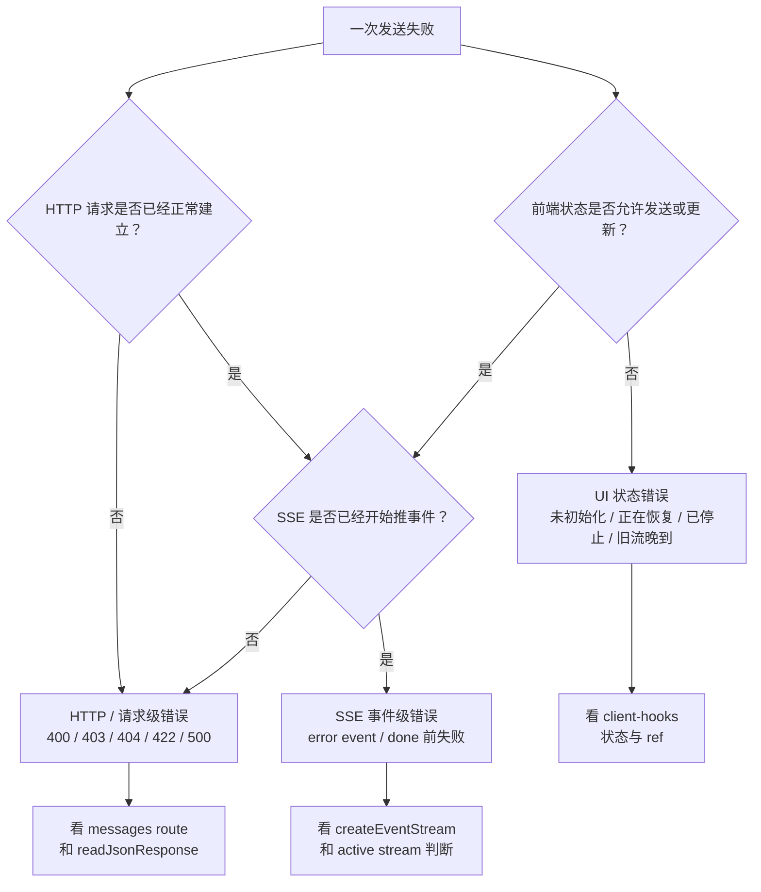

# E19：错误处理要跨 HTTP、SSE 和 UI 三层

流式对话的错误处理比普通请求复杂。普通请求失败时，前端通常只需要处理一个错误响应；流式请求可能在连接建立前失败，也可能在事件流中途失败，还可能没有明确最终消息但已经显示了一部分内容。

本节讲错误怎样从服务端、传输层一路到 UI。

## 1. 本节源码入口

| 文件 | 本节关注点 |
| --- | --- |
| `packages/core/src/lib/integrations/electron/services/agent-session.ts` | HTTP 非成功响应如何读取错误 payload |
| `packages/core/src/lib/integrations/pi-agent/client-hooks.ts` | 客户端如何设置错误状态、停止 loading/streaming |
| `packages/web/src/app/api/agent/sessions/[sessionId]/messages/route.ts` | 服务端如何返回 400、403、404、422、500，以及流式 `error` 事件 |

## 2. 错误先分三层

下面这张图先把错误放到三层里。它回答的问题是：看到失败时，应该先判断“失败发生在哪里”，而不是直接找模型或网络。



这张图的节点都能回到源码。HTTP 请求级错误主要对应 `messages/route.ts` 的参数校验、会话查找和归属校验，以及 `agent-session.ts` 的 `readJsonResponse`。SSE 事件级错误对应 `createRuntimeEventStream`、`createInProcessEventStream` 中发送的 `error` 事件。UI 状态错误对应 `client-hooks.ts` 里的初始化状态、恢复状态、`AbortController` 和活动流判断。三条线分开后，排查就不会混成一句“发送失败”。

| 层级 | 典型错误 | 前端应该怎么理解 |
| --- | --- | --- |
| HTTP 建连前或请求级错误 | 400 参数错误、403 归属错误、404 会话不存在、500 服务端异常 | 请求没有正常进入或完成业务流程 |
| SSE 事件流中错误 | 服务端已经开始流式返回，但中途发出 `error` 事件 | 本轮流式生成失败，需要停止当前流 |
| UI 状态错误 | 当前未初始化、正在恢复、用户停止、旧事件晚到 | 不一定是服务端错误，可能是前端生命周期保护 |

排查时要先判断错误发生在哪一层。否则很容易把前端状态保护误判为服务端异常，或者把服务端权限错误误判为模型失败。

## 3. HTTP 错误：请求还没正常进入对话流程

`messages/route.ts` 会返回几类请求级错误：

| 状态码 | 场景 | 含义 |
| --- | --- | --- |
| 400 | `content` 缺失 | 请求不完整 |
| 403 | 会话归属不匹配 | 请求无权操作这段会话 |
| 404 | session 不存在 | 会话身份无法找到 |
| 422 | 请求上下文无法校验 | 入口信息或归属信息不完整 |
| 500 | 服务端内部异常 | 服务端处理失败 |

这些错误通常会以 JSON payload 返回。`agent-session.ts` 的 `readJsonResponse` 会在响应非 `ok` 时尽量读取错误内容，并把错误信息带到调用方。

## 4. 源码窗口一：`readJsonResponse` 的错误读取边界

`agent-session.ts` 的 `readJsonResponse` 做了一件容易忽略的事：即使 HTTP 状态不是成功，它仍然先尝试读取 JSON payload。

实现位于 [packages/core/src/lib/integrations/electron/services/agent-session.ts 第 17—27 行](../../../../packages/core/src/lib/integrations/electron/services/agent-session.ts#L17)：

```ts
const payload = (await response.json()) as T;
if (!response.ok) {
  const message = payload && typeof payload === 'object' && 'error' in payload
    ? JSON.stringify((payload as { error: unknown }).error)
    : response.statusText;
  throw new Error(message);
}
return payload;
```

这样做的原因是，服务端通常会返回结构化错误：

```ts
{
  success: false,
  error: {
    code: 'INVALID_REQUEST',
    message: 'content is required'
  }
}
```

如果客户端只看 `response.statusText`，错误会很粗糙；读取 payload 后，调用方至少能拿到业务错误码和消息。

但也要注意：有些函数并没有统一使用 `readJsonResponse`。例如恢复会话的 GET 分支会直接读取 JSON，再由调用方检查 `success`。所以教材不能简单说“所有 HTTP 错误都由 readJsonResponse 处理”。

此外，`response.json()` 自己位于 `response.ok` 判断之前。如果网关返回 HTML 错误页、空 body 或损坏 JSON，函数会先抛出 JSON 解析错误，得不到 `statusText` 兜底。这是当前 helper 的真实边界；调用方看到的错误可能不是后端业务错误结构。

## 5. SSE 错误：连接已经开始，但本轮失败

流式响应一旦开始，服务端已经不能像普通 HTTP 那样随时改状态码。此时更常见的方式是在事件流里发送：

```text
data: {"type":"error","data":{"error":"..."}}

```

前端收到 `error` 事件后，需要：

1. 确认这个事件仍属于当前活动流。
2. 设置错误状态。
3. 停止 loading 和 streaming。
4. 完成或终止当前助手占位消息。
5. 清理活动流引用。

这就是为什么流式错误处理必须和 E17 的 active stream 判断结合。旧流的错误不能影响新流。

服务端 Runtime 桥发送 `error` 的位置在 [packages/web/src/app/api/agent/sessions/[sessionId]/messages/route.ts 第 467—517 行](../../../../packages/web/src/app/api/agent/sessions/%5BsessionId%5D/messages/route.ts#L467)，进程内桥的错误映射在 [packages/web/src/app/api/agent/sessions/[sessionId]/messages/route.ts 第 657—687 行](../../../../packages/web/src/app/api/agent/sessions/%5BsessionId%5D/messages/route.ts#L657)。两座桥都能表达错误，但错误 payload 字段必须和客户端读取的 `data.message` 保持一致；契约测试应覆盖这一点。

## 6. 源码窗口二：`messages/route.ts` 的普通路径 fallback

普通路径里，服务端会订阅 Agent 事件并累计 assistant 内容。它会处理几种可能：

普通收集路径位于 [packages/web/src/app/api/agent/sessions/[sessionId]/messages/route.ts 第 158—289 行](../../../../packages/web/src/app/api/agent/sessions/%5BsessionId%5D/messages/route.ts#L158)。

| 来源 | 用途 |
| --- | --- |
| `text_delta` / `message_delta` | 累计流式文本，即使最终走 JSON 也能收集内容 |
| `message_update` | 从嵌套 assistant message event 中提取文本 |
| `message_end` / `agent_end` | 尝试找到最终助手消息 |
| catch 中的 sessionState | prompt 抛错时，从运行时状态里尽量取最后助手消息 |
| fallback 错误内容 | 没有助手内容时，避免前端收到空结果 |

这说明普通路径也不是简单 `const result = await agent.prompt()`。它仍然依赖 Agent 事件来拼出最终可返回内容。

## 7. 最终消息缺失时的 fallback

流式过程中可能发生一种情况：前端已经收到一些 `text_delta`，但服务端没有明确发出可用的最终 `assistant_message`。

这时系统需要做收尾判断：

- 如果已经有可见内容，可以把已显示内容作为本轮助手消息。
- 如果完全没有内容，应该显示失败或停止提示，而不是留下一个永远空白、永远 streaming 的气泡。

服务端普通路径也有类似 fallback：如果没有得到助手内容，可能返回一个错误提示内容，避免前端完全没有消息可展示。

fallback 的原则是：不能把失败伪装成成功，但也不能让 UI 留在半完成状态。

当前实现需要读者特别警惕：当 LLM 失败时，Route 仍可能返回 HTTP 201 和 `success: true`，同时在 payload 中携带 `error.code = "LLM_ERROR"`，并把形如 `[LLM Error: ...]` 的文本保存为 assistant message。这表示“用户消息处理与持久化成功”，并不表示“模型生成成功”。客户端若只检查 `success`，就会误判业务结果。

因此，响应至少要分开判断三件事：HTTP 请求是否被接收、`error` 字段是否存在、`assistantMessage` 内容是否为正常生成结果。一个布尔值不能覆盖三层事实。

## 8. 源码窗口三：错误事件必须经过活动流判断

前端收到 SSE `error` 后，不能立刻把当前 UI 改成失败。它要先确认这个错误属于当前活动流。

原因是旧流也可能失败。假设小林已经停止第一轮并开始第二轮，第一轮服务端晚到一个 `error`。如果前端不检查 `streamId`，第二轮正在正常生成，也会被错误终止。

因此，流式错误处理要和 E17 的身份判断一起理解。错误事件也是事件，也必须服从同样的归属规则。

Electron 分支的错误处理可在 [packages/core/src/lib/integrations/pi-agent/client-hooks.ts 第 724—864 行](../../../../packages/core/src/lib/integrations/pi-agent/client-hooks.ts#L724) 核对；Web 分支在 [packages/core/src/lib/integrations/pi-agent/client-hooks.ts 第 868—1056 行](../../../../packages/core/src/lib/integrations/pi-agent/client-hooks.ts#L868)。两边都先验证活动流再写错误状态，但它们的收尾代码并非逐行相同，修改其中一条路径时必须回归另一条。

## 9. UI 错误信息不能泄露敏感细节

测试里有一个重要倾向：当恢复失败返回后端敏感细节时，UI 不应直接把完整后端信息暴露给用户，而应该展示可理解但不泄露内部细节的错误。

这对正式产品很重要。错误提示要帮助用户知道“现在不能操作”，但不应暴露内部路径、堆栈、令牌、具体系统结构等信息。

## 10. 小林案例：三种失败怎么区分

小林发送旅行规划问题，可能遇到三种失败：

| 现象 | 可能原因 | 排查方向 |
| --- | --- | --- |
| 一点发送就报错 | 会话未初始化或请求参数缺失 | 看 `client-hooks.ts` 的初始化状态和请求体 |
| 请求返回 403 | 当前窗口请求的入口身份不匹配会话 | 看 `projectId`、`entryType`、`entryId` |
| 写到一半失败 | Agent 执行或工具调用中途失败 | 看 SSE `error` 事件和服务端日志 |

同样是“失败”，根因完全不同。

## 11. 错误处理的工程目标

一个好的错误处理设计，不是简单把异常打印出来，而是达成四个目标：

1. 服务端明确区分输入错误、归属错误、会话不存在和内部错误。
2. 传输层把可用错误结构交给调用方。
3. 前端停止错误流，避免 UI 卡在 loading 或 streaming。
4. 用户看到清晰提示，但不会看到敏感内部细节。

## 12. 测试证据应当覆盖什么

本节不能只靠阅读 catch 分支验收。至少需要四组证据：

| 测试层 | 必须固定的不变量 |
| --- | --- |
| 传输 helper | 非 2xx JSON 错误能带出业务 code/message；非 JSON body 有稳定兜底 |
| Route | 400/403/404/422/500 映射正确；LLM_ERROR 的 HTTP 与 payload 语义明确 |
| SSE 契约 | 两座桥的 `error.data` 形状一致，错误后不会再产生有效正文事件 |
| Hook 竞态 | 旧流 error 不影响新流；当前流 error 终止占位消息和 loading 状态 |

[packages/core/src/lib/integrations/pi-agent/__tests__/client-hooks-session-isolation.test.ts 第 264—352 行](../../../../packages/core/src/lib/integrations/pi-agent/__tests__/client-hooks-session-isolation.test.ts#L264) 已覆盖旧流晚到事件的隔离思想，但这不能代替 Route 状态码与异常 payload 测试。现有证据和仍缺失的证据都必须写进验收结论，不能把“有相关测试”扩大成“错误链已完整证明”。

## 13. 本节小结

流式错误跨越 HTTP、SSE 和 UI 三层。读源码时要先问：

- 连接是否已经建立？
- 错误是在请求级返回，还是作为事件流中的 `error` 发送？
- 当前错误是否属于活动流？
- 前端是否完成了收尾？
- 用户提示是否足够清晰且安全？

如果这些问题都能回答，才算真正理解了 Pi Agent 流式错误边界。

## 14. 本节源码验收

读完本节，应能说明：

1. 哪些错误是 HTTP 请求级错误，哪些错误是 SSE 事件级错误。
2. `readJsonResponse` 能处理哪些响应，哪些路径不是它处理。
3. 普通 JSON 路径为什么也要订阅 Agent 事件。
4. 流式 `error` 为什么也必须经过活动流身份判断。
5. fallback 是为了 UI 收尾，不是为了掩盖真实失败。

## 15. 自测问题

1. 为什么 SSE 开始后不能只依赖 HTTP 状态码表达中途错误？
2. 403 和 404 在会话消息 route 里分别代表什么？
3. 为什么旧流的 `error` 事件不能影响当前新流？
4. fallback 内容应该解决什么问题，又不能掩盖什么问题？
