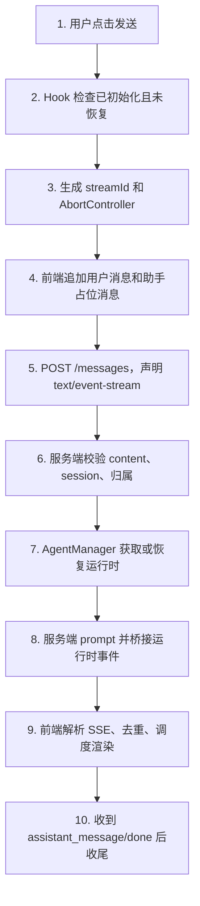

# E20：综合走读：从点击发送到流式完成

E09-E19 已经分别讲了客户端边界、会话创建、消息发送、服务端恢复、SSE 事件、去重、渲染调度、隔离、停止和错误处理。E20 不引入新大概念，而是把整条链路完整走一遍。

本节的目标是让读者能够拿着源码，从“小林点击发送”一路追到“页面显示最终回复”，并能指出每个文件负责什么。

## 1. 本节源码总表

| 环节 | 可直接进入的源码窗口 | 在总链路中的职责 |
| --- | --- | --- |
| 客户端状态与发送 | [packages/core/src/lib/integrations/pi-agent/client-hooks.ts 第 303—1114 行](../../../../packages/core/src/lib/integrations/pi-agent/client-hooks.ts#L303) | 初始化、恢复、普通发送、流式发送、停止和本地销毁 |
| Web/Electron 传输适配 | [packages/core/src/lib/integrations/electron/services/agent-session.ts 第 17—344 行](../../../../packages/core/src/lib/integrations/electron/services/agent-session.ts#L17) | 把 Hook 调用翻译成 fetch 或 IPC，并过滤 Electron 事件 |
| 创建会话 API | [packages/web/src/app/api/agent/sessions/route.ts 第 54—145 行](../../../../packages/web/src/app/api/agent/sessions/route.ts#L54) | 校验并创建或更新服务端会话 |
| 消息 API 与 SSE | [packages/web/src/app/api/agent/sessions/[sessionId]/messages/route.ts 第 51—687 行](../../../../packages/web/src/app/api/agent/sessions/%5BsessionId%5D/messages/route.ts#L51) | 归属闸门、恢复顺序、JSON 收集与两座 SSE 桥 |
| 运行时管理 | [packages/core/src/lib/integrations/pi-agent/agent-manager.ts 第 197—275 行](../../../../packages/core/src/lib/integrations/pi-agent/agent-manager.ts#L197) | 去重恢复任务、复用或重建 Agent、注入旧历史 |
| 流式去重 | [packages/core/src/lib/integrations/pi-agent/stream-dedupe.ts 第 1—224 行](../../../../packages/core/src/lib/integrations/pi-agent/stream-dedupe.ts#L1) | 合并 delta、裁剪异常重复、校准最终消息 |
| 渲染调度 | [packages/core/src/lib/integrations/pi-agent/stream-render-scheduler.ts 第 1—255 行](../../../../packages/core/src/lib/integrations/pi-agent/stream-render-scheduler.ts#L1) | 合并过密状态更新并保证终态落地 |
| 停止 | [packages/web/src/app/api/agent/abort/route.ts 第 21—109 行](../../../../packages/web/src/app/api/agent/abort/route.ts#L21) | 尝试中断服务端运行时；当前 Web 请求字段仍存在契约不一致 |
| 销毁运行时 | [packages/web/src/app/api/agent/sessions/destroy/route.ts 第 21—150 行](../../../../packages/web/src/app/api/agent/sessions/destroy/route.ts#L21) | 关闭窗口时释放运行时但保留持久化历史 |
| 核心竞态测试 | [packages/core/src/lib/integrations/pi-agent/__tests__/client-hooks-session-isolation.test.ts 第 145 行起](../../../../packages/core/src/lib/integrations/pi-agent/__tests__/client-hooks-session-isolation.test.ts#L145) | 用可控乱序固定会话、流和恢复归属不变量 |

## 2. 一次完整发送的十步

这十步就是本单元的主骨架。任何问题都可以先定位到其中一步。

## 3. 第一步到第四步：前端准备本轮 UI 状态

小林点击发送后，前端不会傻等服务端。它会先做本轮 UI 准备：

- 检查当前 Hook 是否已经初始化。
- 检查是否处于恢复中。
- 清理上一条活动流。
- 生成新的 `streamId`。
- 创建新的 `AbortController`。
- 追加用户消息。
- 追加助手占位消息。
- 创建渲染调度器。

这些动作的目的不是“假装已经回答”，而是给本轮流式回复建立安全容器。后续所有事件都必须落到这个容器里。

源码走读时应同时记录“事实存在哪里”。用户消息先进入 Hook 展示态，服务端校验后再进入会话持久化；助手占位消息只存在于前端；运行时生成的 delta 是过程事件；最终 assistant message 才用于校准展示并形成服务端消息。四种对象都叫“消息”时，必须靠所处层和生命周期区分。

## 4. 第五步到第七步：服务端先过边界，再恢复运行时

请求到达 `/api/agent/sessions/[sessionId]/messages` 后，服务端必须先确认：

- 请求内容是否存在。
- 会话是否存在。
- 请求是否属于这段会话。
- 运行时是否已经存在；如果不存在，能否从持久化会话恢复。

这一步体现服务端边界。前端说“我要发送”，服务端不能直接相信它。服务端要用会话和入口身份做校验。

这里还有一个不可交换的顺序：`getOrRestoreAgentRuntime(session)` 必须发生在保存本轮 user message 之前。恢复只注入旧历史，本轮内容随后落库并作为 prompt 单独提交。否则同一句问题可能同时出现在恢复历史和 prompt 参数里。

## 5. 第八步：不同运行模式变成同一种事件协议

Agent 执行 prompt 时，内部可能是 Runtime 模式，也可能是 in-process 模式。服务端桥接层把内部事件转换成前端协议。

前端最终关心的是：

- 文本来了：`text_delta`。
- 工具开始：`tool_start`。
- 工具结束：`tool_end`。
- 最终助手消息来了：`assistant_message`。
- 本轮结束：`done`。
- 出错：`error`。

这让 UI 不必关心运行时内部形态。

“统一”指的是前端事件协议，而不是两座桥的内部代码完全相同。Runtime 桥使用队列和进程事件拦截；in-process 桥使用 Agent 订阅。新增事件、错误字段或收尾规则时，需要对称检查两座桥。

## 6. 第九步：前端不是直接拼字符串

前端拿到 `text_delta` 后，不应该无脑追加。它要先经过去重：

- 完整重复帧要丢掉。
- 累计帧要只取新增后缀。
- 重叠片段要合并。
- 最终消息要校准。

然后再交给渲染调度器：

- 高频片段分批提交。
- 结束时保证最终内容完整。
- 停止或切换时取消旧调度。
- 避免切坏特殊字符。

所以页面逐字出现的背后，不是一个简单的 `content += chunk`。

## 7. 第十步：收尾比开始更容易出错

流式结束时，前端要处理：

- `assistant_message`：用最终内容校准已显示文本。
- `done`：结束流式状态。
- `error`：停止当前流并展示错误。
- `abort`：用户主动停止。
- 旧事件：如果身份不匹配，丢弃。

很多流式 bug 不发生在开始，而发生在收尾。比如按钮一直 loading、旧内容晚到、最终消息重复、停止后又冒出一段文字。这些都属于收尾和身份判断问题。

## 8. 本单元测试证据

| 测试文件 | 已证明内容 |
| --- | --- |
| `client-hooks-session-isolation.test.ts` | 入口归属随创建和发送传递；不同会话事件不串；停止后的旧流事件被忽略；恢复竞态不覆盖当前会话；切换会话会移除旧订阅 |
| `stream-dedupe.test.ts` | 重复完整帧、累计帧、长累计帧、最终消息校准、尾部重复裁剪、近似重复、不误删普通短词 |
| `stream-render-scheduler.test.ts` | 大量输入批量提交、flush、finish、事件节奏驱动、重复 finish、done 带更多内容、取消、UTF-16 边界 |

这些测试覆盖了本单元最核心的工程风险：串流、重复、卡顿、取消、收尾。

更准确地说，它们为这些风险提供了**局部自动化证据**，并没有证明整条 Web/Electron 端到端链路已经通过。当前还缺少或需要单独核对的证据包括：Next.js 消息 Route 的完整状态码契约、真实 SSE 网络分片、主进程 payload 的 sessionId 完整性、abort Web 字段契约，以及 destroy 模糊匹配不会误伤。“已覆盖”只能限定到具体测试断言。

## 9. 综合实验一：纸上模拟一轮正常流式回复

请读者用纸面表格模拟小林的一轮发送。不要运行代码，也不要跳步骤。

| 时刻 | 发生的事 | 应该变化的状态或数据 |
| --- | --- | --- |
| T1 | 小林点击发送 | 前端检查 initialized，不在 restoring |
| T2 | Hook 创建本轮流身份 | 生成新的 `streamId`，保存新的 `AbortController` |
| T3 | Hook 更新消息列表 | 追加 user message 和空 assistant placeholder |
| T4 | Web 分支发起请求 | POST `/messages`，请求头包含 `Accept: text/event-stream` |
| T5 | 服务端收到请求 | 校验 `content`，读取 session，校验归属 |
| T6 | 服务端准备运行时 | `getOrRestoreAgentRuntime(session)` |
| T7 | 服务端保存当前用户消息 | `agentSessionService.addMessage` |
| T8 | 服务端开始 SSE | 发送 `user_message`，然后桥接运行时事件 |
| T9 | 前端收到 `text_delta` | 清洗、去重、交给调度器 |
| T10 | 前端收到 `assistant_message` | 用最终内容校准当前助手消息 |
| T11 | 前端收到 `done` | 结束 streaming，清理活动流 |

这个实验的验收标准是：读者能给每一行指出至少一个对应源码位置。

## 10. 综合实验二：纸上模拟停止后重发

第二个实验专门训练旧流防护。

| 时刻 | 第一轮 stream A | 第二轮 stream B | 正确行为 |
| --- | --- | --- | --- |
| T1 | A 开始生成 | 无 | 页面显示 A 的部分内容 |
| T2 | 小林点击停止 | 无 | A 的 AbortController 中断，A 的订阅或读取被取消 |
| T3 | A 的旧 delta 晚到 | B 尚未开始 | 因 A 已不是 active stream，丢弃 |
| T4 | 无 | B 开始生成 | 生成新的 streamId B |
| T5 | A 的 final 晚到 | B 正在生成 | A final 仍然丢弃 |
| T6 | 无 | B 收到 final | B 的助手消息完成 |

这个实验对应 `client-hooks-session-isolation.test.ts` 中“aborted stream late events”的测试思想。

## 11. 综合实验三：把现象映射到源码窗口

| 现象 | 第一定位 | 第二定位 |
| --- | --- | --- |
| 初始化成功但发送 403 | `messages/route.ts` 归属校验 | `initializeSession` 的 `entryType` / `entryId` 推导 |
| Web 流式没有逐段显示 | Web fetch SSE 读取 | `parseSSE` 和 buffer 处理 |
| Electron 下连续小片段太碎 | `coalesceAgentEventBatch` | `StreamRenderScheduler` |
| 最终回答重复一遍 | `reconcileFinalStreamContent` | `assistant_message` 处理 |
| 停止按钮点了但服务端继续跑 | `/api/agent/abort` | `abortAgentSession` 请求字段 |
| 关闭窗口后历史不该丢 | destroy route | 后续 E21-E30 的 session 持久化 |

这个表要训练读者形成排查路径：不要从现象直接跳到模型，要先定位边界。

## 12. 仍然需要读者保持警惕的地方

已有测试不等于所有风险都消失。读源码时还要注意：

- Web SSE 与 Electron IPC 的真实端到端表现是否一致。
- Runtime 模式和 in-process 模式的事件字段是否长期保持兼容。
- 服务端 `abort` 是否能真正中断不同供应商的模型调用。
- `abortAgentSession` 发送的字段与 `/api/agent/abort` 读取的字段是否一致。
- destroy 的兜底匹配是否可能误伤不相关运行时。
- 错误提示是否在所有路径上都既清晰又不泄露敏感信息。

这些问题更接近集成验收和产品级验证，不能只靠单个工具函数测试证明。

## 13. 用五条不变量验收整条链路

完成纸上走读后，不应只复述函数名，还要能验证以下不变量：

1. **身份不变量**：创建、发送、恢复始终携带同一组 `sessionId + projectId + entryType + entryId`。
2. **顺序不变量**：旧历史先恢复，本轮用户消息后保存，prompt 最后执行。
3. **事件不变量**：只有当前 session 的当前 stream 且未 abort 的事件能写 UI。
4. **终态不变量**：无论 `assistant_message`、`done`、`error` 还是用户 abort，助手占位消息都不能永久停在 streaming。
5. **数据不变量**：abort 不删除历史，销毁运行时不删除历史，只有 delete session 改变持久化会话存在性。

任何一条无法从生产源码和对应测试中同时指出证据，本单元就只能算“理解了设计”，不能算“验证了实现”。

## 14. 纸上调试练习

请按下面现象定位可能源码范围。

| 现象 | 优先查看 |
| --- | --- |
| 点击发送后没有用户消息出现 | `client-hooks.ts` 发送前状态检查和乐观追加 |
| 服务端返回 403 | `messages/route.ts` 的归属校验 |
| 回复第一段重复出现 | `stream-dedupe.ts` 和 `text_delta` 处理 |
| 长回答时页面明显卡顿 | `stream-render-scheduler.ts` |
| 停止后旧文字继续冒出 | `streamId`、`isActiveStream`、`AbortController`、订阅取消 |
| 关闭窗口后历史丢失 | 检查是否把 destroy 误做成 delete session |

## 15. 口头验收

学完本单元，读者应该能不看笔记说清：

1. 创建会话为什么必须经过服务端确认。
2. 普通 JSON 消息和 SSE 流式消息的差别。
3. `/messages` route 在 prompt 前做了哪些校验和恢复。
4. Runtime 与 in-process 两种模式怎样输出相似事件。
5. 前端为什么需要同时用 `sessionId` 和 `streamId` 判断事件归属。
6. 去重器和渲染调度器分别解决什么问题。
7. abort、destroy、delete session 的差异。
8. 出错时如何判断错误发生在 HTTP、SSE 还是 UI 状态层。

如果能回答这些问题，这一单元就达到了目标：读者不仅知道“流式回复会动”，还知道它为什么可靠，以及它可能在哪里坏。
