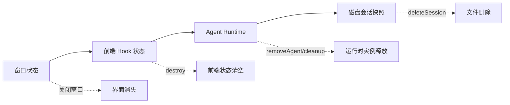
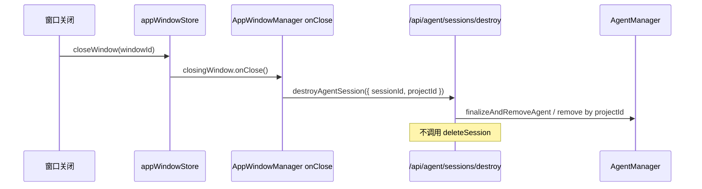

# E21：关闭窗口不是删除会话

小林结束第一天的旅行规划后，把旅行 Agent 窗口关掉。第二天他重新打开入口，希望继续问：“如果预算增加 1000 元，住宿要不要升级？”系统能不能继续这段对话，取决于我们是否分清四件事：窗口状态、前端 Hook 状态、Agent 运行时实例、磁盘会话快照。

这四件事经常被初学者混在一起。混在一起之后，最典型的错误是：关闭窗口时把磁盘历史也删掉；或者相反，以为磁盘里还有历史，下一轮模型就一定能看到上文。真实系统必须把它们分开处理。

## 1. 四种“还在”和“不在”



这张图故意把四层画成一条链，但实际删除并不会自动层层传递。窗口消失，不等于 JSON 文件删除；Runtime 被清理，也不等于历史不可恢复；前端 Hook 清空了 `messages`，也只说明当前浏览器状态没了，不说明服务端没有保存。

| 层 | 典型对象 | 消失意味着什么 | 不意味着什么 |
| --- | --- | --- | --- |
| 窗口状态 | Web 桌面窗口、对话框 | 用户当前看不到界面 | 会话历史被删除 |
| 前端 Hook | `usePiAgent` 内的 `sessionId`、`messages` | 当前组件不再持有状态 | 服务端 Runtime 被删除 |
| Agent Runtime | `AgentManager` 缓存的 `OriginOSAgent` | 内存里的 Agent 实例需要重建 | 持久化历史不存在 |
| 持久化快照 | `AgentSession` 或 `StoredSession` | 文件仍可被读取和恢复 | 旧进程还活着 |

对用户体验来说，“关掉窗口后还能继续”依赖最后一层仍然存在，并且中间两层能够重新建立。

## 2. `destroy` 清空的是前端运行状态

阅读 [packages/core/src/lib/integrations/pi-agent/client-hooks.ts 第 1088—1114 行](../../../../packages/core/src/lib/integrations/pi-agent/client-hooks.ts#L1088)。`destroy` 做的事情很明确：

```ts
const destroy = useCallback(() => {
  destroyedRef.current = true;
  sessionOperationEpochRef.current += 1;
  restoreTargetRef.current = null;
  restoreAbortControllerRef.current?.abort();
  restoreAbortControllerRef.current = null;
  setIsInitialized(false);
  setSessionId(null);
  sessionIdRef.current = null;
  setProjectContext(null);
  projectContextRef.current = null;
  setRestoredSession(null);
  setMessages([]);
  setActiveTools([]);
  streamUnsubscribeRef.current?.();
  abortControllerRef.current?.abort();
  eventListenersRef.current.clear();
}, []);
```

这段代码要分三层读。

第一层是“让旧异步结果失效”。`destroyedRef.current = true` 和 `sessionOperationEpochRef.current += 1` 会让恢复请求、发送请求这类异步操作在返回后发现自己已经过期。`restoreAbortControllerRef.current?.abort()` 则尝试取消正在进行的恢复请求。

第二层是“清空当前页面持有的身份和内容”。`setSessionId(null)`、`setProjectContext(null)`、`setRestoredSession(null)`、`setMessages([])` 说明 Hook 不再认为自己绑定到任何会话。

第三层是“断开流和监听器”。`streamUnsubscribeRef.current?.()`、`abortControllerRef.current?.abort()`、`eventListenersRef.current.clear()` 处理的是仍可能回来的事件。

注意这段代码里没有 `deleteSession`。这不是偶然遗漏，而是边界清晰：前端 Hook 销毁只处理当前组件的运行状态，不处理持久化文件。

这些动作都在前端状态边界内。它没有直接调用 `AgentSessionService.deleteSession`，也没有证明磁盘快照被删除。读者要养成一个习惯：看到 `destroy`，先问“销毁的是哪个层的对象？”而不是把“销毁”理解成所有层都被清空。

## 3. `AgentManager.removeAgent` 移除的是运行时实例

阅读 [packages/core/src/lib/integrations/pi-agent/agent-manager.ts 第 525—537 行](../../../../packages/core/src/lib/integrations/pi-agent/agent-manager.ts#L525)。`removeAgent(sessionId)` 会根据 `sessionId` 找到运行时缓存项，调用 Agent 的清理逻辑，移除工具上下文，并从 `agents` Map 中删除这个运行时实例。

```ts
removeAgent(sessionId: string): boolean {
  const entry = this.agents.get(sessionId);
  if (!entry) {
    return false;
  }

  entry.agent.destroy();
  removeToolContext(sessionId);
  this.agents.delete(sessionId);
  return true;
}
```

这段代码的关键词是 `this.agents.delete(sessionId)`。`agents` 是运行时缓存，不是会话文件目录。删除 Map 项只代表当前进程不再持有这个 Agent 实例。它不会顺着 sessionId 去 `projects/{projectId}/sessions/` 或 `data/sessions/sessions.json` 删除 JSON。

这一步释放的是内存里的执行对象。对小林来说，它意味着“下一次继续对话时，可能要重新创建 Agent 并注入历史”。它不意味着第一天的旅行方案已经从文件里删除。

同一个文件里还有 `cleanup()`，会根据空闲时间和窗口绑定状态清理长期不用的 Agent。这个机制的存在进一步说明：Runtime 缓存天然不是可靠历史来源。可靠历史必须来自持久化层。

## 4. 窗口关闭链路：关闭会触发 Runtime 销毁，但保留持久化数据

前面只看了底层 `destroy` 和 `removeAgent`。现在补上窗口关闭的调用来源。 [packages/web/src/services/AppWindowManager.ts 第 28—52 行](../../../../packages/web/src/services/AppWindowManager.ts#L28) 会在打开 agent、project、solution、skill 等窗体时注入 `onClose`：

```ts
if (entryType && entryId && MEMORY_ENTRY_TYPES.has(entryType)) {
  const originalOnClose = config.onClose;
  config = {
    ...config,
    onClose: () => {
      originalOnClose?.();
      destroyAgentSession({ sessionId, projectId }).catch(...);
      consolidateMemory(entryType, entryId).catch(...);
    },
  };
}
```

这段代码说明，关闭窗口确实可能触发 Agent 销毁，但它调用的是 `destroyAgentSession`，不是 `deleteSession`。同时还会触发 memory consolidation。也就是说，窗口关闭是“结束当前活跃运行时并做收尾”，不是“删除这段历史”。

再看 [packages/web/src/store/appWindowStore.ts 第 125—132 行](../../../../packages/web/src/store/appWindowStore.ts#L125)：

```ts
const closingWindow = get().windows[windowId];
closingWindow?.onClose?.();
set((state) => {
  const { [windowId]: closed, ...remaining } = state.windows;
  const newOrder = state.windowOrder.filter((id) => id !== windowId);
});
```

这里先调用窗口自己的 `onClose`，再从 `windows` 状态里移除窗口。它处理的是窗口列表和焦点顺序，不直接操作 session 文件。

最后看 [packages/core/src/lib/integrations/electron/services/agent-session.ts 第 132—145 行](../../../../packages/core/src/lib/integrations/electron/services/agent-session.ts#L132)。浏览器侧 `destroyAgentSession` 会 POST 到 `/api/agent/sessions/destroy`。这个 API 文件头在 [packages/web/src/app/api/agent/sessions/destroy/route.ts 第 1—8 行](../../../../packages/web/src/app/api/agent/sessions/destroy/route.ts#L1) 明确写着：销毁的是 agent instance，持久化 session data 会保留在磁盘上。

这个源码链路把本节结论固定下来：



这张图比“关闭不等于删除”更精确：关闭可能经过 Runtime 销毁接口，但销毁接口的语义是释放运行时，不是删除持久化快照。

## 5. 删除会话才是删除持久化快照

删除持久化快照要看会话服务。业务会话服务的删除在 [packages/core/src/lib/features/agent/session-service.ts 第 180—185 行](../../../../packages/core/src/lib/features/agent/session-service.ts#L180)，适配层 `SessionStore` 的删除在 [packages/core/src/lib/integrations/pi-agent/session-store.ts 第 133—155 行](../../../../packages/core/src/lib/integrations/pi-agent/session-store.ts#L133)。它们都不是普通关闭窗口时自然发生的副作用。

| 动作 | 是否清页面 | 是否清 Runtime | 是否删文件 | 读者判断 |
| --- | --- | --- | --- | --- |
| 关闭窗口 | 是 | 可能触发运行时清理 | 通常不应默认删除 | UI 生命周期 |
| `destroy()` | 是 | 取消订阅和请求 | 否 | 前端 Hook 生命周期 |
| `removeAgent()` | 否 | 是 | 否 | 运行时缓存生命周期 |
| `deleteSession()` | 可能需要刷新列表 | 不一定 | 是 | 持久化生命周期 |

表格里的“不一定”和“可能”不是含糊，而是工程上必须尊重调用链。只有源码中真的调用了某个服务，才能说该层状态会变化。

## 6. 常见错例：把“关闭”写成“删除”

假设有人为了“释放资源”，在窗口关闭回调里直接调用删除会话接口。表面上看，窗口关闭后没有残留数据，很干净；但对用户来说，这是灾难性的语义变化。小林只是把旅行规划窗口关掉，并没有说“删除这段旅行方案”。第二天他重新打开时，历史已经不存在，这不是恢复功能失败，而是生命周期设计错误。

另一个相反错例是：只保留磁盘快照，却以为下一轮模型自然会记得历史。磁盘文件还在，只能证明数据可读；如果没有 E27 的 Runtime hydrate，下一轮发送消息时模型仍可能只看到新问题，而看不到第一天的规划过程。

因此，本节真正要建立的是一条排错判断：

| 用户现象 | 不能立刻下的结论 | 应该先查 |
| --- | --- | --- |
| 关闭窗口后历史列表还在 | Runtime 一定还活着 | `AgentManager.hasAgent(sessionId)` 或恢复路径 |
| Runtime 被清理 | 历史一定丢了 | session 文件是否存在 |
| 页面 `messages` 为空 | 服务端没有保存 | `destroy()` 是否清空了前端状态 |
| 删除接口返回成功 | 当前 Runtime 一定停止 | 是否还有运行时移除调用 |

这张表把四层生命周期重新拆开。它要求读者遇到问题时先定位层级，而不是被“关闭”“销毁”“删除”这些相近词带偏。

## 7. 测试证据：本节能证明什么

本节直接引用的源码说明了对象责任，但它本身还不能证明完整恢复链路。能证明的范围是：

- `client-hooks.ts` 的 `destroy` 明确清空前端状态、取消订阅和请求；
- `agent-manager.ts` 的 `removeAgent` 明确移除运行时缓存和工具上下文；
- `AppWindowManager` 到 `/api/agent/sessions/destroy` 的关闭链路指向 Runtime 销毁，而非 session 删除；
- `session-service.ts` 与 `session-store.ts` 的删除方法明确以 session ID 删除持久化对象。

## 8. 小实验与口头验收

读者可以做一个纸面验收：给出下面四句话，判断哪一句是正确的。

1. “关闭窗口后，session 文件一定被删除。”
2. “`destroy()` 后，当前 Hook 不再持有 messages。”
3. “`removeAgent()` 后，磁盘历史一定消失。”
4. “`deleteSession()` 才是删除持久化快照的动作。”

正确答案是 2 和 4。1 和 3 都把不同生命周期混在了一起。

合格口头答案必须能解释：为什么 `destroy()` 里没有 `deleteSession` 是正确边界，而不是遗漏；为什么 Runtime 被移除后，系统仍然可能通过持久化快照恢复会话。

## 9. 本节小结

会话恢复的第一课不是“怎么读 JSON”，而是“不要把不同生命周期混为一谈”。窗口、Hook、Runtime、文件是四种对象。关闭窗口只是用户界面消失；Hook destroy 只是前端状态清空；AgentManager remove 只是运行时缓存释放；deleteSession 才真正删除持久化快照。
