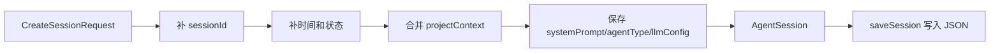

# E22：`AgentSessionService` 是主会话仓库

上一节区分了“关闭窗口”和“删除会话”。这一节进入主会话仓库： [packages/core/src/lib/features/agent/session-service.ts](../../../../packages/core/src/lib/features/agent/session-service.ts) 。它负责把业务层的 `AgentSession` 写进 JSON 存储，并提供创建、读取、更新、追加消息、删除、列表、摘要和统计能力。

如果把会话恢复比作第二天继续旅行规划，`AgentSessionService` 就是旅行社的档案室。前端可以关，Runtime 可以释放，但档案室里的文件必须能说明：这是谁的旅行计划、何时创建、对话说过什么、下一次要用什么上下文继续。

## 1. `AgentSession` 是主快照

先读 [packages/core/src/types/agent.ts 第 207—231 行](../../../../packages/core/src/types/agent.ts#L207)。`AgentSession` 的字段可以分成五组：

| 字段 | 含义 | 恢复时为什么重要 |
| --- | --- | --- |
| `sessionId` | 会话唯一标识 | 找到同一份历史 |
| `createdAt`、`updatedAt`、`status` | 生命周期信息 | 列表排序、状态展示、统计 |
| `messages` | 持久化消息历史 | 页面展示和运行时历史注入的基础 |
| `projectContext` | 项目或入口上下文 | 决定归属、工作目录、输出目录 |
| `systemPrompt`、`agentType`、`config`、`llmConfig` | 运行配置 | 重新创建 Runtime 时不能丢 |

新手常犯的错误是只保存 `messages`。但只保存消息不够。假设小林的历史里有“请规划成都三日游”，如果丢了 `projectContext.currentPath`，工具下一次可能不知道把文件写到哪个目录；如果丢了 `agentType`，服务端可能不知道该按 skill、agent 还是 role-agent 的方式恢复；如果丢了 `llmConfig`，下一轮可能不再使用原来的模型配置。

## 2. 创建会话：从请求变成完整快照

阅读 [packages/core/src/lib/features/agent/session-service.ts 第 54—85 行](../../../../packages/core/src/lib/features/agent/session-service.ts#L54)。`createSession` 接收 `CreateSessionRequest`，然后补齐一份完整 `AgentSession`：

```ts
const session: AgentSession = {
  sessionId,
  createdAt: now,
  updatedAt: now,
  status: 'active',
  messages: [],
  projectContext: {
    projectId: request.projectId,
    projectName: request.projectName,
    ...request.projectContext,
  },
  systemPrompt: request.systemPrompt || '',
  agentType: request.agentType || 'generic',
  config: {
    sessionId,
    systemPrompt: request.systemPrompt,
    agentType: request.agentType,
  },
  ...(request.llmConfig ? { llmConfig: request.llmConfig } : {}),
};
```

这段代码里最容易被忽略的是 `projectContext` 的合并顺序。它先写入 `projectId` 和 `projectName`，再展开 `request.projectContext`。这意味着如果调用方在 `request.projectContext` 中也传入 `projectId`，后者会覆盖前者。教材在这里不能只说“服务补了 projectId”，还要提醒：边界调用方必须保持请求顶层字段与上下文字段一致，否则可能造成保存归属和恢复归属不一致。

- `sessionId`：优先使用请求给的 ID，否则生成 UUID；
- `createdAt`、`updatedAt`：使用当前时间；
- `status`：默认为 `active`；
- `messages`：新会话从空数组开始；
- `projectContext`：至少包含 `projectId` 和 `projectName`，再合并请求里的上下文；
- `systemPrompt`：没有时为空字符串；
- `agentType`：没有时是 `generic`；
- `config`：保存 sessionId、systemPrompt、agentType；
- `llmConfig`：如有则保存。



这张图说明创建不是简单转发请求。请求表达“我要开一个会话”，`AgentSession` 表达“系统已经拥有一份可持久化、可恢复、可管理的会话档案”。

## 3. 路径规则：项目会话和全局会话不是一个目录

`saveSession` 位于 [packages/core/src/lib/features/agent/session-service.ts 第 90—104 行](../../../../packages/core/src/lib/features/agent/session-service.ts#L90)。它根据 `session.projectContext?.projectId` 决定写入路径：

| 是否有 `projectId` | 写入路径 |
| --- | --- |
| 有 | `projects/{projectId}/sessions/{sessionId}.json` |
| 无 | `sessions/{sessionId}.json` |

对应的路径拼接在 [packages/core/src/lib/features/agent/session-service.ts 第 345—352 行](../../../../packages/core/src/lib/features/agent/session-service.ts#L345)。这条规则很关键。它意味着小林的旅行 Agent 如果有明确项目上下文，历史不会简单放在全局 `sessions/` 下，而是放在项目维度的 sessions 目录里。

路径规则是恢复 bug 的高频源头。读取时如果没带 `projectId`，就可能去全局目录找项目会话，结果得到 `null`。因此后面讲 API route 时，会特别注意哪些接口传了 `projectId`，哪些接口没有传。

## 4. 读取、更新和追加消息

`getSession` 在 [packages/core/src/lib/features/agent/session-service.ts 第 106—116 行](../../../../packages/core/src/lib/features/agent/session-service.ts#L106)。它根据 `sessionId` 和可选 `projectId` 生成路径，读取 JSON 后返回其中的 `data`。

`updateSession` 在 [packages/core/src/lib/features/agent/session-service.ts 第 118—149 行](../../../../packages/core/src/lib/features/agent/session-service.ts#L118)。它不会盲目覆盖整个对象，而是按字段更新：`messages` 整组替换，`status` 更新状态，`projectContext` 与旧上下文合并，`summary` 和 `llmConfig` 按请求替换，并刷新 `updatedAt`。

`addMessage` 在 [packages/core/src/lib/features/agent/session-service.ts 第 151—177 行](../../../../packages/core/src/lib/features/agent/session-service.ts#L151)。它追加单条消息，并给消息补 `id` 和 `timestamp`。这说明系统持久化消息时不只保存用户文本，还要让每条消息有可追踪身份和时间。

| 方法 | 输入 | 主要副作用 | 适合场景 |
| --- | --- | --- | --- |
| `createSession` | 创建请求 | 新建完整快照 | 第一次打开入口 |
| `saveSession` | 完整 `AgentSession` | 整体写入文件 | Runtime 保存完整状态 |
| `updateSession` | 局部更新 | 合并部分字段 | 改状态、摘要、配置 |
| `addMessage` | 单条消息 | 追加消息并更新时间 | 普通对话轮次 |
| `getSession` | ID 与项目 ID | 读取快照 | 恢复、详情、统计 |

## 5. 逐段理解 `saveSession`：路径比写入动作更重要

`saveSession` 只有十几行，但它决定了后面很多恢复问题。读源码时要按顺序看：

```ts
async saveSession(session: AgentSession): Promise<void> {
  session.updatedAt = Date.now();
  const projectId = session.projectContext?.projectId;

  await this.store.write(
    this.getSessionPath(session.sessionId, projectId),
    session as any,
  );
}
```

1. `session.updatedAt = Date.now()`：保存动作会刷新更新时间，因此列表排序依赖的是最后保存时间，不是创建时间。
2. `const projectId = session.projectContext?.projectId`：服务不从外部参数拿路径范围，而是从 session 自己的上下文里取。
3. `this.getSessionPath(session.sessionId, projectId)`：如果 `projectId` 存在，就进入项目 sessions 目录；不存在才进入全局 sessions 目录。
4. `this.store.write(..., session as any)`：`jsonStore.write` 负责把数据包进统一文件结构。

这里最容易错的是第 2 步。假设创建时 `projectContext.projectId` 被漏掉，小林的旅行会话就会被写进全局 `sessions/`；恢复时如果前端带着 `projectId=skill-travel-planner` 去项目目录读，就读不到。这不是“文件没保存”，而是“保存路径和读取路径不是同一条规则”。

## 6. 列表、摘要和统计

`listSessions` 位于 [packages/core/src/lib/features/agent/session-service.ts 第 180—228 行](../../../../packages/core/src/lib/features/agent/session-service.ts#L180)。它会根据是否传入 `projectId` 决定列哪个目录，过滤非法 session 文件，读取每个 session，再按 `updatedAt` 倒序排序。

关键代码可以压缩成：

```ts
const sessionsDir = projectId
  ? `${getProjectSessionsDir(projectId)}/`
  : `${SESSIONS_DIR}/`;

const files = await this.store.listFiles(sessionsDir);

for (const file of files) {
  const sessionId = file.replace('.json', '');
  if (!isValidSessionId(sessionId)) continue;
  const session = await this.getSession(sessionId, projectId);
  if (!session?.projectContext) continue;
  if (projectId && session.projectContext.projectId !== projectId) continue;
  sessions.push(this.toSessionListItem(session));
}
```

这段代码有三层防线。第一层是目录范围：有项目 ID 时只列项目目录。第二层是文件名过滤：不像 session ID 的文件不会进入列表。第三层是内容过滤：没有 `projectContext` 的 session 会被跳过，项目 ID 不一致也会被跳过。列表不是把目录里的 JSON 全部展示出来，而是把能被识别为会话列表项的对象展示出来。

摘要相关逻辑在 [packages/core/src/lib/features/agent/session-service.ts 第 246—339 行](../../../../packages/core/src/lib/features/agent/session-service.ts#L246)。它统计总消息数、用户消息数、助手消息数、工具调用数、第一条消息和最后一条消息。项目统计则汇总某个项目下所有会话的数量、状态和平均消息数。这些管理能力不是恢复本身，但会影响用户如何找回历史。

## 7. 错误场景：为什么“会话存在”仍然读不到

考虑三种情况：

| 保存时状态 | 读取时参数 | 结果 | 排查方向 |
| --- | --- | --- | --- |
| 有 `projectId` | 带同一个 `projectId` | 能读到 | 正常路径 |
| 有 `projectId` | 不带 `projectId` | 可能读不到 | 读取去了全局目录 |
| 无 `projectId` | 带 `projectId` | 可能读不到 | 保存去了全局目录 |

这张表比“检查文件是否存在”更精确。文件存在只能说明某个目录有数据；恢复成功要求保存路径和读取路径一致。

## 8. 测试与缺口

本节使用的主要证据来自源码结构。`session-store.test.ts` 对简单存储模型有较多 CRUD 测试，但它测试的是另一个类，不能作为 `AgentSessionService` 项目路径规则的直接证据。后者是否可靠，需要自己的服务测试或调用它的 Route 集成测试确认。

如果为本节补测试，至少应写三组：

- Given 一个带 `projectId` 的 session，When 保存并用同一个 `projectId` 读取，Then 能读到。
- Given 一个带 `projectId` 的 session，When 不带 `projectId` 读取，Then 应按当前路径规则读不到。
- Given 两个项目下同名 `sessionId`，When 分别传不同 `projectId` 读取，Then 不应串读。

这些测试会把“路径隔离”固定成行为，而不是只停留在源码推理。

## 9. 小实验与口头验收

不运行代码也可以做一次路径推演。假设小林的会话是：

```ts
const session = {
  sessionId: 'trip-session-001',
  projectContext: {
    projectId: 'skill-travel-planner',
    projectName: '毕业旅行规划',
  },
};
```

问题一：`saveSession(session)` 会写到哪里？答案应是 `projects/skill-travel-planner/sessions/trip-session-001.json`。

问题二：如果随后调用 `getSession('trip-session-001')`，为什么可能读不到？因为读取路径会变成全局 `sessions/trip-session-001.json`。

问题三：如果 `request.projectContext` 覆盖了顶层 `projectId`，为什么危险？因为保存路径、恢复归属和入口身份可能不再一致。

合格口头答案必须能说清：`AgentSessionService` 的恢复可靠性不是由 `sessionId` 单独保证，而是由 `sessionId + projectContext.projectId + 路径规则` 共同保证。

## 10. 本节小结

`AgentSessionService` 是业务层主会话仓库。它保存的不是几条聊天气泡，而是一份可恢复档案：身份、状态、消息、项目上下文、提示词、Agent 类型和模型配置。项目会话与全局会话的路径不同，这是后续恢复接口必须谨慎传参的原因。
