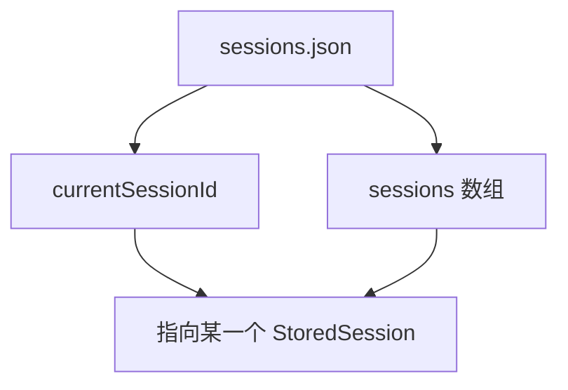

# E23：`SessionStore` 展示简单持久化模型

上一节讲的是 feature 层主会话仓库。本节看另一个容易混淆的文件： [packages/core/src/lib/integrations/pi-agent/session-store.ts](../../../../packages/core/src/lib/integrations/pi-agent/session-store.ts) 。它位于 Pi Agent integration 下，使用固定文件 `data/sessions/sessions.json`，维护一个会话列表和 `currentSessionId`。

这个文件适合用来理解“最小会话存储模型”：一个 JSON 文件、一个内存缓存、一组 CRUD 方法、一个当前会话指针。它不等于 E22 的项目会话仓库，但它把持久化的基础动作展示得很清楚。

## 1. `SessionsListData`：列表加指针

阅读 [packages/core/src/lib/integrations/pi-agent/session-store.ts 第 8—14 行](../../../../packages/core/src/lib/integrations/pi-agent/session-store.ts#L8)。`SessionsListData` 只有两个字段：

| 字段 | 含义 |
| --- | --- |
| `currentSessionId` | 当前会话 ID，可以为 `null` |
| `sessions` | 所有已保存的 `StoredSession[]` |

这是一种非常常见的本地状态结构：真正的数据放在数组里，当前选中的对象用 ID 引用。小林第二天打开历史列表时，`sessions` 负责列出所有旅行对话，`currentSessionId` 负责记住上一次正在看的那一段。



这张图强调一点：`currentSessionId` 本身不是会话内容。它只是一个指针。指针指向不存在的 ID 时，文件格式仍可能是合法 JSON，但业务状态已经不一致；因此 `setCurrentSession` 必须先确认目标存在。

## 2. `StoredSession`：适配层快照

`StoredSession` 定义在 [packages/core/src/lib/integrations/pi-agent/session-store.ts 第 16—39 行](../../../../packages/core/src/lib/integrations/pi-agent/session-store.ts#L16)。它包含 `id`、`name`、`createdAt`、`updatedAt`、`messages`、`systemPrompt`、`model` 和可选 `projectContext`。

与 `AgentSession` 相比，`StoredSession` 字段命名和结构更贴近适配层。比如它用 `id` 而不是 `sessionId`，模型字段也保存为 `{ provider, id }`。这就是为什么本文件提供 `fromAgentSession`、`toAgentSession`、`toSessionData` 这类静态映射方法。

| 对象 | 所在层 | 身份字段 | 主要用途 |
| --- | --- | --- | --- |
| `AgentSession` | feature 层 | `sessionId` | 项目会话仓库、API、恢复主合同 |
| `StoredSession` | Pi Agent integration | `id` | 简单本地快照和适配层会话列表 |
| `SessionData` | Pi Agent adapter | `sessionId` | 交给 Agent 运行时恢复的数据形状 |

这张表帮助读者避免把字段名不同误判为“不一致”。字段名变化本身不是问题，问题在于有没有显式映射，以及映射是否丢字段。

## 3. 初始化和缓存

`initialize` 在 [packages/core/src/lib/integrations/pi-agent/session-store.ts 第 52—61 行](../../../../packages/core/src/lib/integrations/pi-agent/session-store.ts#L52)。它会创建 `data/sessions` 目录，然后调用 `loadSessions()`。`loadSessions` 在 [packages/core/src/lib/integrations/pi-agent/session-store.ts 第 298—327 行](../../../../packages/core/src/lib/integrations/pi-agent/session-store.ts#L298)，会优先复用 `sessionsCache`，没有缓存时再从 JSON 文件读取；如果文件不存在，则返回 `{ currentSessionId: null, sessions: [] }`。

可以把核心逻辑看成下面这段：

```ts
if (this.sessionsCache) {
  return this.sessionsCache;
}

try {
  const data = await jsonStore.read<SessionsListData>(SessionStore.SESSIONS_FILE);
  this.sessionsCache = data?.data ?? { currentSessionId: null, sessions: [] };
} catch {
  this.sessionsCache = { currentSessionId: null, sessions: [] };
}
```

这里有两个设计选择。第一，缓存存在时直接返回缓存，说明同一进程中的读操作优先使用内存状态。第二，读取失败时返回空列表，而不是抛出错误。这让新环境可以自然启动，但也意味着“文件损坏”和“真的没有会话”在这个简单模型里可能都表现为空状态；如果产品需要区分，就要在更高层增加错误处理。

缓存的意义是减少重复读文件，但缓存也带来一个判断点：同一个进程内，读取可能来自内存；跨进程、重启后，读取必须来自文件。读者在排查“我改了 JSON 但页面没变”的问题时，要先判断是否有缓存层。

## 4. 保存会话：更新或追加，再设置当前会话

`saveSession` 位于 [packages/core/src/lib/integrations/pi-agent/session-store.ts 第 63—96 行](../../../../packages/core/src/lib/integrations/pi-agent/session-store.ts#L63)。它会加载当前列表，查找是否已有相同 `id`；存在则保留原 `createdAt` 并更新其他字段，不存在则追加新会话；最后把 `currentSessionId` 设置为当前保存的会话，并写回 `sessions.json`。

源码的关键分支如下：

```ts
const existingIndex = this.sessionsCache!.sessions.findIndex(
  (s) => s.id === sessionData.id
);

if (existingIndex >= 0) {
  this.sessionsCache!.sessions[existingIndex] = {
    ...sessionData,
    updatedAt: Date.now(),
  };
} else {
  this.sessionsCache!.sessions.push({
    ...sessionData,
    name: sessionData.name || SessionStore.generateDefaultName(sessionData.id),
    createdAt: Date.now(),
    updatedAt: Date.now(),
  });
}

this.sessionsCache!.currentSessionId = sessionData.id;
```

这里要特别注意：更新已有会话时，当前实现直接展开 `sessionData` 并刷新 `updatedAt`，没有显式保留原来的 `createdAt`。因此不能断言“更新时一定保留创建时间”。若希望创建时间不可变，需要额外测试和实现保护。

这说明 `saveSession` 不只是保存内容，还会改变“当前会话”指针。小林保存第二段旅行对话后，历史列表里的当前项会变成第二段，而不是第一段。

## 5. 加载、切换、重命名、删除

| 方法 | 源码位置 | 行为 |
| --- | --- | --- |
| `loadSession` | [packages/core/src/lib/integrations/pi-agent/session-store.ts 第 101—108 行](../../../../packages/core/src/lib/integrations/pi-agent/session-store.ts#L101) | 按 ID 找会话，找不到返回 `null` |
| `loadCurrentSession` | [packages/core/src/lib/integrations/pi-agent/session-store.ts 第 113—124 行](../../../../packages/core/src/lib/integrations/pi-agent/session-store.ts#L113) | 先读当前 ID，再加载对应会话 |
| `listSessions` | [packages/core/src/lib/integrations/pi-agent/session-store.ts 第 129—139 行](../../../../packages/core/src/lib/integrations/pi-agent/session-store.ts#L129) | 按更新时间倒序返回列表 |
| `deleteSession` | [packages/core/src/lib/integrations/pi-agent/session-store.ts 第 133—155 行](../../../../packages/core/src/lib/integrations/pi-agent/session-store.ts#L133) | 删除会话，若删的是当前会话则清空指针 |
| `renameSession` | [packages/core/src/lib/integrations/pi-agent/session-store.ts 第 158—176 行](../../../../packages/core/src/lib/integrations/pi-agent/session-store.ts#L158) | 改名并更新时间 |
| `setCurrentSession` | [packages/core/src/lib/integrations/pi-agent/session-store.ts 第 179—195 行](../../../../packages/core/src/lib/integrations/pi-agent/session-store.ts#L179) | 只允许把已存在会话设为当前 |

这组方法共同维护一个不变量：`currentSessionId` 应该为空，或指向 `sessions` 中真实存在的一项。`setCurrentSession` 和 `deleteSession` 都在保护这个不变量。

## 6. 测试证明了哪些行为

`session-store.test.ts` 覆盖了初始化、创建、保存、加载、列表排序、当前会话、重命名、删除、清空、静态映射、跨操作持久化、消息顺序和项目上下文保留。尤其要注意三个断言：创建新会话后它会成为当前会话；删除当前会话后 `loadCurrentSession()` 返回 `null`；保存多条消息后，加载出来的消息顺序保持不变。

## 7. 静态映射方法：不要让字段名变化变成数据丢失

`SessionStore` 后半段提供了三个静态方法：`fromAgentSession`、`toAgentSession`、`toSessionData`。这类方法在教学中很重要，因为它们说明系统没有把所有层都强行使用同一个对象。

读者应重点看三个问题：

| 映射问题 | 为什么重要 |
| --- | --- |
| `id` 和 `sessionId` 如何转换 | 防止不同层查找同一会话时 ID 字段错位 |
| `messages` 是否保持顺序 | 模型上下文依赖历史顺序 |
| `projectContext` 是否保留 | 恢复工具目录、项目身份和用户上下文 |

如果映射丢了 `projectContext`，小林第二天虽然能看到聊天历史，但 Agent 可能不知道文件应该写到哪个项目目录。如果映射改变了消息顺序，模型会把后发生的话当成先发生，恢复就失真。

## 8. Given/When/Then 读测试

`session-store.test.ts` 里的测试可以这样读：

| Given | When | Then | 保护的行为 |
| --- | --- | --- | --- |
| 空 store | `createSession("我的会话")` | 生成 session ID，消息为空 | 新会话有稳定初始形状 |
| 已有两个会话 | `setCurrentSession(session1.id)` | 当前会话变成 session1 | 当前指针只能指向存在项 |
| 保存多条消息 | `loadSession(id)` | 消息数组完全相同 | 历史顺序不被存储破坏 |
| 删除当前会话 | `loadCurrentSession()` | 返回 `null` | 当前指针不会悬空 |

这张表把测试从“覆盖了 CRUD”推进到“证明了哪些系统不变量”。阅读测试时应沿着断言提取不变量，而不是只列测试文件名。

## 9. 小实验与口头验收

手动推演下面三步：

1. 创建会话 A，`currentSessionId = A`。
2. 创建会话 B，`currentSessionId = B`。
3. 删除会话 A。

此时当前会话应该是谁？答案是 B，因为删除非当前会话不应影响当前指针。

再推演另一组：

1. 创建会话 A，`currentSessionId = A`。
2. 删除会话 A。

此时 `loadCurrentSession()` 应返回什么？答案是 `null`，因为当前指针不能指向已经删除的会话。

合格口头答案必须能解释：`currentSessionId` 是指针，不是数据；`sessions` 数组才保存会话内容；删除和切换都必须维护“指针不能悬空”这个不变量。

## 10. 本节小结

`SessionStore` 帮读者建立最小持久化心智模型：一个 JSON 文件保存列表，一个指针表示当前会话，一个缓存减少重复读取，一组方法维护增删改查和字段映射。它和 `AgentSessionService` 不是同一个层级，但二者共同说明：可恢复会话必须有明确数据结构、稳定 ID、可验证路径和不会悄悄丢字段的映射。
