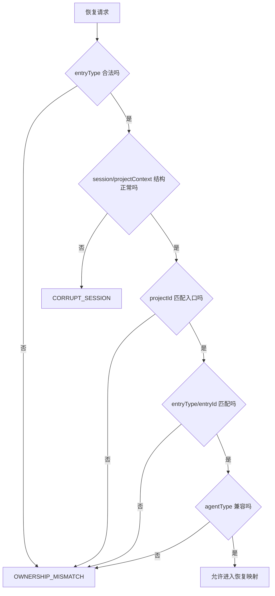

# E24：恢复请求首先是归属范围

小林第二天打开旅行 Agent 时，前端不能只告诉服务端“我要恢复 session-123”。因为 `session-123` 这串 ID 本身不能证明它属于旅行 Agent。恢复请求必须同时说明：要恢复哪份会话，以及它应该属于哪个入口范围。

本课中的 ownership 指**会话快照与入口范围的一致性**，不是完整的用户身份认证。`projectId`、`entryType`、`entryId` 都来自请求范围；它们可以用于拒绝误配和跨入口串台，但仅凭这些字段不能证明当前网络请求者就是小林。若产品存在多用户或不可信客户端，还需要独立的登录身份、权限策略和服务端授权数据。

这个范围由 [packages/core/src/lib/integrations/pi-agent/session-restore.ts](../../../../packages/core/src/lib/integrations/pi-agent/session-restore.ts) 中的 `RestoreAgentSessionRequest` 表达。

## 1. `RestoreAgentSessionRequest` 的四个核心字段

阅读 [packages/core/src/lib/integrations/pi-agent/session-restore.ts 第 33—38 行](../../../../packages/core/src/lib/integrations/pi-agent/session-restore.ts#L33)。恢复请求包含：

| 字段 | 作用 |
| --- | --- |
| `sessionId` | 要恢复哪一份会话 |
| `projectId` | 请求方认为这份会话属于哪个项目或入口项目 ID |
| `entryType` | 入口类型：`skill`、`agent`、`role-agent` |
| `entryId` | 入口 ID，例如具体 skill 名称或 agent 名称 |

这四个字段合起来才是恢复范围。只看 `sessionId`，服务端最多知道文件名；加上 `projectId`、`entryType`、`entryId`，服务端才能判断“请求声称从哪个入口访问”。这里验证的是声明与快照是否一致，不是声明者的真实用户身份。

## 2. 入口类型不是装饰字段

`RESTORE_ENTRY_TYPES` 定义在 [packages/core/src/lib/integrations/pi-agent/session-restore.ts 第 111—115 行](../../../../packages/core/src/lib/integrations/pi-agent/session-restore.ts#L111)。当前允许的入口类型是 `skill`、`agent`、`role-agent`。`SUPPORTED_AGENT_TYPES` 位于 [packages/core/src/lib/integrations/pi-agent/session-restore.ts 第 117—123 行](../../../../packages/core/src/lib/integrations/pi-agent/session-restore.ts#L117)，说明哪些持久化 `agentType` 可以和入口类型匹配。

如果没有这个限制，小林的旅行规划 skill 理论上可能拿到另一个 RoleAgent 的历史。这不是普通 bug，而是会话隔离问题。

## 3. `expectedProjectId` 建立入口与项目 ID 的关系

阅读 [packages/core/src/lib/integrations/pi-agent/session-restore.ts 第 197—208 行](../../../../packages/core/src/lib/integrations/pi-agent/session-restore.ts#L197)。`expectedProjectId` 的规则是：

| `entryType` | 期待的 `projectId` |
| --- | --- |
| `skill` | `skill-${entryId}` |
| `agent` | `entryId` |
| `role-agent` | `entryId` |

这条规则解释了为什么很多 skill 会话的 `projectId` 看起来像 `skill-xxx`。它不是随便拼的字符串，而是恢复归属的一部分。假设旅行规划 skill 的 `entryId` 是 `travel-planner`，那么它的期望项目 ID 就应该是 `skill-travel-planner`。

## 4. `assertSessionOwnership` 的校验顺序

核心校验在 [packages/core/src/lib/integrations/pi-agent/session-restore.ts 第 210—298 行](../../../../packages/core/src/lib/integrations/pi-agent/session-restore.ts#L210)。它会检查入口类型是否合法，持久化 session 和 `projectContext` 是否是对象，持久化的 `projectId` 是否与期望范围一致，快照里保存的 `entryType`、`entryId` 是否与请求一致，以及 `agentType` 是否与入口类型兼容。

可以先看一个压缩后的源码窗口：

```ts
const requiredProjectId = expectedProjectId(request);
if (sessionProjectId !== requiredProjectId) {
  throw new RestoreAgentSessionError('OWNERSHIP_MISMATCH', ...);
}

const persistedEntryType = projectContext['entryType'];
if (persistedEntryType !== undefined && persistedEntryType !== request.entryType) {
  throw new RestoreAgentSessionError('OWNERSHIP_MISMATCH', ...);
}

const persistedEntryId = projectContext['entryId'];
if (persistedEntryId !== undefined && persistedEntryId !== request.entryId) {
  throw new RestoreAgentSessionError('OWNERSHIP_MISMATCH', ...);
}
```

这段代码的核心不是“比较字符串”，而是建立三道门。

第一道门是项目身份。`expectedProjectId(request)` 根据入口类型和入口 ID 算出应该属于谁。对于 skill，规则是 `skill-${entryId}`；对于 agent 和 role-agent，规则是 `entryId` 本身。

第二道门是入口类型。如果快照里已经保存 `entryType`，它必须与本次请求一致。这样能防止同一个 `projectId` 下把不同入口类型混起来。

第三道门是入口 ID。如果快照里已经保存 `entryId`，它也必须与请求一致。这样能防止两个 skill 或两个 agent 之间互相恢复历史。

这三道门共同表达一件事：恢复不能只凭 `sessionId`，还必须让请求范围与快照中的入口身份一致。



这张图说明校验失败分两类：结构坏了是 `CORRUPT_SESSION`，归属不对是 `OWNERSHIP_MISMATCH`。二者不能混为一谈。结构坏说明文件本身不可信；归属不对说明请求者不该读这份会话。

## 5. ownership 校验为什么仍不是完整授权

把这段函数当成完整安全授权会产生危险误解。当前请求合同没有签名、用户凭证或角色权限；`assertSessionOwnership` 也没有查询“当前登录用户是否拥有 projectId”。它比较的是两组数据：请求声称的入口范围与持久化快照记录的入口范围。

| 安全问题 | 当前 ownership 校验是否回答 | 还需要什么 |
| --- | --- | --- |
| Skill A 是否误恢复了 Skill B 的快照 | 是，通过 entry/project 一致性拒绝 | 当前函数即可提供结构性隔离 |
| 请求中的 projectId 是否与快照一致 | 是 | 当前函数即可比较 |
| 请求者是否已经登录 | 否 | 认证边界 |
| 当前用户是否拥有该项目 | 否 | 服务端授权查询或访问控制表 |
| sessionId 是否可被其他用户猜到 | 否 | 不可预测 ID、访问控制与泄漏防护 |

因此，本课把 `OWNERSHIP_MISMATCH` 理解为“范围不一致”，而不是“已经完成所有权限验证”。在单用户本地应用中，这道门仍能有效防止入口串台；当系统扩展到多用户或远程服务时，必须在 route 或下层服务增加真正的主体授权。

## 6. 消息发送也要校验归属

恢复校验不是只发生在 GET 时。`assertSessionMessageOwnership` 位于 [packages/core/src/lib/integrations/pi-agent/session-restore.ts 第 300—353 行](../../../../packages/core/src/lib/integrations/pi-agent/session-restore.ts#L300)，用于发送消息前确认当前请求的 scope 与持久化 session 匹配。

它的关键思想可以简化为：

```ts
if (session.sessionId !== scope.sessionId) {
  throw new RestoreAgentSessionError('OWNERSHIP_MISMATCH', ...);
}

if (hasPersistedEntryIdentity) {
  if (!scope.entryType || !scope.entryId) {
    throw new RestoreAgentSessionError('OWNERSHIP_MISMATCH', ...);
  }
  assertSessionOwnership(session, {
    sessionId: scope.sessionId,
    projectId: scope.projectId,
    entryType: scope.entryType,
    entryId: scope.entryId,
  });
}
```

这段逻辑解决的是“恢复后继续发送”的安全问题。即使小林已经恢复过某个 session，下一轮消息也不能只凭前端记住的 `sessionId` 直接发送；服务端仍要确认消息属于同一入口范围。

它有一个兼容路径：如果旧会话没有保存 `entryType` 和 `entryId`，可以退回到 project-only 校验。这是为了让旧数据仍可使用。但新数据一旦保存了入口身份，后续请求就必须提供匹配入口，否则会被拒绝。

## 7. 用三个请求例子理解归属

假设旅行规划 skill 的 `entryId` 是 `travel-planner`，那么它对应的 `projectId` 应为 `skill-travel-planner`。下面三个请求看起来只差一点，但结果完全不同。

| 请求 | 是否应通过 | 原因 |
| --- | --- | --- |
| `sessionId=s1`、`projectId=skill-travel-planner`、`entryType=skill`、`entryId=travel-planner` | 是 | 项目 ID 和入口身份匹配 |
| `sessionId=s1`、`projectId=skill-travel-planner`、`entryType=skill`、`entryId=budget-planner` | 否 | skill 的期望项目 ID 应变成 `skill-budget-planner` |
| `sessionId=s1`、`projectId=travel-planner`、`entryType=agent`、`entryId=travel-planner` | 否或需旧数据兼容 | 入口类型变了，agentType 兼容性也可能不成立 |

这张表帮助读者看到：归属不是一个字段决定的，而是多个字段共同决定。`sessionId` 相同也不能绕过入口范围。

## 8. 测试证据：归属失败必须被拒绝

`session-restore.test.ts` 对归属校验的测试可以按 Given/When/Then 阅读：

| Given | When | Then | 保护什么 |
| --- | --- | --- | --- |
| session 属于 skill A | 用 skill A 的请求恢复 | 返回恢复结果 | 正常恢复路径 |
| session 属于 skill A | 用 skill B 的请求恢复 | 抛 `OWNERSHIP_MISMATCH` | 防止跨 skill 历史串台 |
| session 属于 agent A | 用 role-agent 请求恢复 | 抛归属错误 | 防止入口类型混用 |
| 旧 session 没有 entry 身份 | 用 project-only 兼容路径发消息 | 可按旧规则通过 | 保留旧数据迁移空间 |

测试里最值得注意的是“失败发生在 Runtime hydrate 之前”。它说明范围校验不是前端提示，也不是页面展示限制，而是服务端恢复边界的结构性闸门。测试没有提供登录用户或权限仓库，因此不能证明多用户授权。

## 9. 小实验与口头验收

纸面推演：把同一个 `sessionId=s1` 分别放到两个入口里恢复。第一个入口是 `entryType=skill`、`entryId=travel-planner`、`projectId=skill-travel-planner`；第二个入口是 `entryType=skill`、`entryId=budget-planner`、`projectId=skill-travel-planner`。读者应能判断第一个请求通过，第二个请求失败，并说明失败不是因为 `sessionId` 不存在，而是因为 `expectedProjectId(request)` 与入口身份不匹配。

口头验收：读者应能独立回答为什么恢复接口不能设计成 `GET /sessions/{sessionId}` 后直接返回历史。回答应包含三点：`sessionId` 只能定位快照，入口字段用来校验范围一致性；服务端必须重新校验而不能只信任前端状态；范围失败应阻止 Runtime 恢复。还要补充：若要证明“当前用户有权访问”，必须加入本函数之外的认证与授权证据。

## 10. 本节小结

恢复请求首先是入口范围，不是简单文件名。`sessionId` 回答“哪份快照”，`projectId`、`entryType`、`entryId` 回答“请求声称从哪个入口访问”。`assertSessionOwnership` 把入口类型、项目 ID、入口 ID 和 agent 类型串成一致性校验链，防止跨 skill、跨 agent、跨 role-agent 的历史串台；它不替代用户认证与项目授权。
