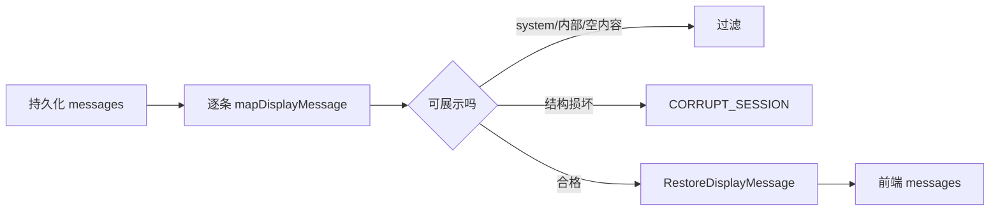

# E25：展示快照必须过滤历史

持久化消息历史不是页面消息列表。Agent 运行时可能保存 `system` 消息、内部恢复提示、工具结果、只包含 thinking 的 assistant 消息等。恢复时如果把这些内容原样塞回页面，小林可能会看到系统提示词、内部控制消息，甚至看到一条没有正文的“空助手回复”。

因此 [packages/core/src/lib/integrations/pi-agent/session-restore.ts](../../../../packages/core/src/lib/integrations/pi-agent/session-restore.ts) 要做一件关键工作：把完整历史映射成有边界的展示快照。

## 1. 展示角色白名单

`DISPLAY_ROLES` 定义在 [packages/core/src/lib/integrations/pi-agent/session-restore.ts 第 101—109 行](../../../../packages/core/src/lib/integrations/pi-agent/session-restore.ts#L101)。可展示角色只有四类：`user`、`assistant`、`tool`、`toolResult`。

`system` 不在其中。原因很直接：系统提示词是控制 Agent 行为的上下文，不是用户对话内容。它应该影响下一轮模型推理，但不应该作为聊天气泡展示给用户。

## 2. `mapDisplayMessage` 的过滤逻辑

阅读 [packages/core/src/lib/integrations/pi-agent/session-restore.ts 第 134—179 行](../../../../packages/core/src/lib/integrations/pi-agent/session-restore.ts#L134)。`mapDisplayMessage` 对单条消息做这些检查：

```ts
function mapDisplayMessage(message: unknown): RestoreDisplayMessage | null {
  if (!isRecord(message)) {
    throw new RestoreAgentSessionError('CORRUPT_SESSION', ...);
  }

  const role = message['role'];
  if (typeof role !== 'string') {
    throw new RestoreAgentSessionError('CORRUPT_SESSION', ...);
  }

  if (role === 'system' || !DISPLAY_ROLES.has(role)) {
    return null;
  }

  const content = message['content'];
  if (typeof content !== 'string' && !Array.isArray(content)) {
    throw new RestoreAgentSessionError('CORRUPT_SESSION', ...);
  }

  const displayContent = extractDisplayContent(content);
  if (!displayContent || isInternalMessage(role, displayContent)) {
    return null;
  }
}
```

这段代码要按“错误”和“过滤”两类结果分开读。`message` 不是对象、`role` 不是字符串、`content` 形状不对，说明历史结构不可信，所以抛 `CORRUPT_SESSION`。`system`、非展示角色、空展示内容、内部恢复消息，并不一定代表文件坏了，只是不应该进入页面，所以返回 `null`。

| 检查 | 不通过时怎样处理 | 原因 |
| --- | --- | --- |
| 消息必须是对象 | 抛 `CORRUPT_SESSION` | 历史结构坏了 |
| `role` 必须是字符串 | 抛 `CORRUPT_SESSION` | 无法判断角色 |
| `role === system` | 返回 `null` | 系统消息不展示 |
| 角色不在白名单 | 返回 `null` | 非展示消息忽略 |
| `content` 必须是字符串或数组 | 抛 `CORRUPT_SESSION` | 内容形状不可信 |
| 提取展示文本为空 | 返回 `null` | 空气泡不展示 |
| 内部恢复消息 | 返回 `null` | 控制消息不展示 |
| 可选 `id`、`timestamp` 类型不对 | 抛 `CORRUPT_SESSION` | 元数据形状不可信 |

这里的设计很有分寸：有些内容“不适合展示”，所以过滤；有些内容“结构不可信”，所以报错。比如 `system` 消息不展示是正常情况；但 `content` 既不是字符串也不是数组，就说明存储数据可能损坏，应阻止恢复。

## 3. 为什么 thinking-only assistant 会被过滤

测试里有一个重要场景：assistant 消息只有 thinking，没有可展示文本。`mapDisplayMessage` 会调用 `extractDisplayContent` 提取展示内容，如果提取结果为空，就返回 `null`。

这对用户体验很重要。小林第二天打开历史时，应该看到自己问了什么、Agent 最终回答了什么，而不是看到模型内部思考占位。thinking 可以用于调试或运行时控制，但不应被当成正式聊天内容。

## 4. `mapSessionDisplayMessages` 处理整段历史

`mapSessionDisplayMessages` 位于 [packages/core/src/lib/integrations/pi-agent/session-restore.ts 第 181—195 行](../../../../packages/core/src/lib/integrations/pi-agent/session-restore.ts#L181)。它先确认 `messages` 是数组，再逐条调用 `mapDisplayMessage`，最后过滤掉 `null`。

```ts
function mapSessionDisplayMessages(messages: unknown): RestoreDisplayMessage[] {
  if (!Array.isArray(messages)) {
    throw new RestoreAgentSessionError('CORRUPT_SESSION', ...);
  }

  return messages
    .map(mapDisplayMessage)
    .filter((message): message is RestoreDisplayMessage => message !== null);
}
```

这一段短代码很适合练习源码阅读。`map` 表示每条历史都要经过同一套规则；`filter` 表示被判定为“不展示”的消息会从页面快照里消失；类型谓词 `message is RestoreDisplayMessage` 是 TypeScript 对过滤结果的说明，不是额外的运行时校验。



这张图显示，恢复展示列表不是“尽量展示所有东西”。它是一道安全边界：不该给用户看的要过滤，结构坏掉的要拒绝，只有合格消息才能进入前端。

## 5. 测试证据

`session-restore.test.ts` 构造了一段混合历史：用户消息、`system` 消息、thinking-only assistant、内部恢复用户消息、普通 assistant 文本、`toolResult`。测试期望恢复结果里只保留用户消息、普通 assistant 文本和工具结果。

| 历史项 | 是否展示 | 原因 |
| --- | --- | --- |
| 用户提问 | 是 | 对话内容 |
| 系统提示词 | 否 | 控制上下文 |
| thinking-only assistant | 否 | 没有展示文本 |
| 内部恢复提示 | 否 | 运行控制消息 |
| assistant 正文 | 是 | 对话内容 |
| toolResult | 是 | 可解释工具结果 |

## 6. 错误场景：展示过滤写错会出现什么

如果恢复时不做展示过滤，小林可能看到三类不应该出现的内容：

| 错误展示 | 可能来源 | 后果 |
| --- | --- | --- |
| 系统提示词气泡 | `system` message | 暴露 Agent 行为指令和内部约束 |
| 空 assistant 气泡 | thinking-only message | 用户以为 Agent 回复异常或内容丢失 |
| “恢复上下文”类用户消息 | internal recovery message | 把内部控制动作误当成用户真实输入 |

如果过滤过度，也会出问题。例如把 `toolResult` 全部过滤掉，用户可能看不到 Agent 为什么得出某个结论；把 assistant 正文误判为空，则恢复后的历史会断裂。因此过滤规则必须既克制又明确：不是所有非用户消息都删掉，而是按展示角色、内容形状和内部标记判断。

## 7. Given/When/Then 读恢复测试

`session-restore.test.ts` 的展示快照测试可以这样拆：

| Given | When | Then |
| --- | --- | --- |
| 一段包含 user、system、thinking-only、internal、assistant、toolResult 的历史 | 调用 `createRestoreAgentSessionResult` | 返回的 `messages` 只包含 user、assistant 正文、toolResult |
| 一段空历史 | 调用恢复结果生成 | 不自动塞欢迎语 |
| 一条消息不是对象 | 映射展示消息 | 抛 `CORRUPT_SESSION` |
| 一条消息的 content 形状错误 | 映射展示消息 | 抛 `CORRUPT_SESSION` |

这些测试保护的是展示边界，不是完整端到端恢复。它们不能证明浏览器已经渲染正确，也不能证明下一轮模型已恢复；这些要分别看前端 Hook 和 Runtime hydrate。

## 8. 小实验与口头验收

小实验：给出三条消息，让读者在纸上判断结果。

```ts
{ role: 'system', content: '你是旅行规划 Agent' }
{ role: 'assistant', content: [{ type: 'thinking', text: '先规划路线' }] }
{ role: 'assistant', content: '第一天上午去宽窄巷子。' }
```

合格答案是：第一条被过滤，因为 `system` 不属于展示角色；第二条被过滤，因为它没有可展示正文；第三条保留，因为它是可展示 assistant 正文。这个小实验的重点不是背结论，而是按 `mapDisplayMessage` 的顺序判断。

口头验收：读者应能拿一条持久化消息判断它会被展示、过滤还是导致 corrupt。判断步骤是：先看消息是不是对象，再看 role，再看 content 形状，再看提取出的展示文本是否为空，最后看是否属于内部恢复消息。

## 9. 本节小结

恢复时不能把磁盘历史原样渲染。`session-restore.ts` 通过角色白名单、内容形状检查、展示文本提取和内部消息过滤，把完整历史变成安全的展示快照。读者排查“恢复后多出奇怪消息”或“恢复后某些消息消失”时，要先判断这条消息是不该展示，还是结构损坏导致恢复失败。
