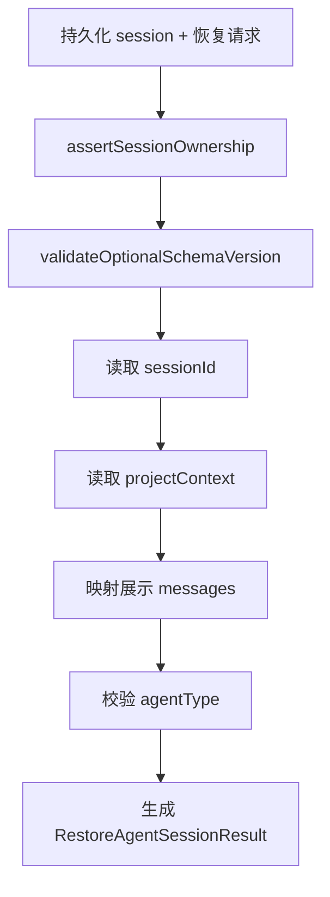
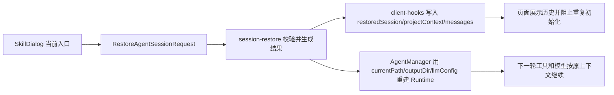

# E26：恢复结果是一份有边界的合同

前面两节分别讲了归属校验和展示过滤。通过这些检查后，系统不能只返回 `messages`。因为恢复要同时服务两个消费者：前端页面和 Agent 运行时。页面需要可展示历史；运行时需要工作目录、输出目录、模型配置、Agent 类型等信息，以便下一轮真的接着做。

这份边界合同由 `RestoreAgentSessionResult` 表达，生成逻辑在 [packages/core/src/lib/integrations/pi-agent/session-restore.ts 第 396—465 行](../../../../packages/core/src/lib/integrations/pi-agent/session-restore.ts#L396)。

## 1. `RestoreAgentSessionResult` 包含哪些信息

阅读 [packages/core/src/lib/integrations/pi-agent/session-restore.ts 第 62—81 行](../../../../packages/core/src/lib/integrations/pi-agent/session-restore.ts#L62)。恢复结果包含：

| 字段 | 给谁用 | 作用 |
| --- | --- | --- |
| `contractVersion` | 前后端共同使用 | 标记恢复合同版本 |
| `sessionId` | 前端与运行时 | 绑定同一会话 |
| `projectContext` | 前端与运行时 | 保留项目、入口、目录上下文 |
| `messages` | 前端 | 展示过滤后的历史 |
| `agentType` | 服务端与前端 | 判断恢复的 Agent 类型 |
| `workingDirectory` | 运行时 | 工具执行默认目录 |
| `outputDir` | 运行时 | 技能或 Agent 输出目录 |
| `llmConfig` | 运行时 | 恢复模型配置 |
| `runtime` | 前端判断 | 表示服务端运行时已恢复且可继续 |

这张表说明恢复结果不是数据库对象的简单返回。它是把持久化快照重新组织成“页面可用 + Runtime 可用”的合同。

## 2. 合同版本为什么重要

`AGENT_SESSION_RESTORE_CONTRACT_VERSION = 1` 位于 [packages/core/src/lib/integrations/pi-agent/session-restore.ts 第 18 行](../../../../packages/core/src/lib/integrations/pi-agent/session-restore.ts#L18)。`validateOptionalSchemaVersion` 位于 [packages/core/src/lib/integrations/pi-agent/session-restore.ts 第 355—372 行](../../../../packages/core/src/lib/integrations/pi-agent/session-restore.ts#L355)，允许没有版本，也允许 `1`、`"1"`、`"1.0"`，但拒绝未知版本。

这是一种兼容策略：老数据没有版本也可以恢复；当前版本可以恢复；明显不认识的新版本不强行恢复。如果不做版本判断，未来字段语义变化后，旧恢复逻辑可能错误解释新文件。对小林来说，这可能表现为“历史看起来还在，但工作目录或模型配置恢复错了”。

## 3. 读取项目上下文和模型配置

`readProjectContext` 在 [packages/core/src/lib/integrations/pi-agent/session-restore.ts 第 374—394 行](../../../../packages/core/src/lib/integrations/pi-agent/session-restore.ts#L374)，会从持久化对象中读取 `projectId`、`entryType`、`entryId`、`ontologyId`、`currentPath`、`projectName`、`userId`、`outputDir`。如果关键字段类型不对，会抛 `CORRUPT_SESSION`。

`readRuntimeLLMConfig` 在 [packages/core/src/lib/integrations/pi-agent/session-restore.ts 第 384—394 行](../../../../packages/core/src/lib/integrations/pi-agent/session-restore.ts#L384)，要求 `llmConfig` 要么不存在，要么是对象。这里体现了恢复系统的态度：可选字段可以没有，但有了就必须形状正确。不能因为“尽量恢复”而吞掉明显损坏的数据。

关键源码可以分成两段看：

```ts
const optionalString = (field: string): string | undefined => {
  const value = rawContext[field];
  if (value === undefined) return undefined;
  if (typeof value !== 'string') {
    throw new RestoreAgentSessionError('CORRUPT_SESSION', ...);
  }
  return value;
};
```

这一段说明“可选”不等于“随便”。字段可以不存在；但只要存在，就必须是字符串。这样可以兼容旧数据没有 `outputDir`，但不能接受 `outputDir: 123` 这种损坏形状。

```ts
const llmConfig = session['llmConfig'];
if (llmConfig === undefined) return undefined;
if (!isRecord(llmConfig)) {
  throw new RestoreAgentSessionError('CORRUPT_SESSION', ...);
}
return { ...llmConfig } as RuntimeLLMConfig;
```

这里的浅拷贝 `{ ...llmConfig }` 有一个边界：它复制配置对象的顶层字段，避免直接复用原对象；但它不是深度验证器，不会逐个确认 provider、model、baseUrl 的业务合法性。恢复合同只负责形状边界，更深的模型配置有效性属于模型创建或供应商调用阶段。

## 4. `createRestoreAgentSessionResult` 的顺序



这张图里的顺序不能随便交换。比如先映射消息再校验归属，就可能在错误入口上处理不该读取的历史；先返回结果再校验版本，就可能把不兼容数据交给前端。

再看返回对象的主干：

```ts
return {
  contractVersion: AGENT_SESSION_RESTORE_CONTRACT_VERSION,
  sessionId,
  projectContext,
  messages,
  ...(normalizedAgentType ? { agentType: normalizedAgentType } : {}),
  ...(projectContext.currentPath ? { workingDirectory: projectContext.currentPath } : {}),
  ...(projectContext.outputDir ? { outputDir: projectContext.outputDir } : {}),
  ...(llmConfig ? { llmConfig } : {}),
  runtime: {
    restored: true,
    resumable: true,
  },
};
```

`agentType`、`workingDirectory` 和 `outputDir` 都采用条件展开：只有读到了有效值，才会出现在恢复结果顶层。这个细节很重要。它说明恢复合同既不会编造不存在的字段，也不会把 `undefined` 当成有意义的业务值传给调用方。`workingDirectory` 和 `outputDir` 一旦存在，都来自 `projectContext`，不是恢复阶段临时新计算出来的路径。它们被提升到恢复结果顶层，是为了让前端和后续发送逻辑更容易使用。`runtime.restored` 与 `runtime.resumable` 则是恢复边界的状态声明，不携带 Runtime 实例本身。

## 5. `runtime` 字段表达的是恢复结果，不是运行时对象

恢复结果里的 `runtime` 大致表达 `restored: true` 和 `resumable: true`。它不是 `OriginOSAgent` 实例，也不是可以直接调用的对象。它只告诉前端：服务端已经完成了必要恢复，这个 session 可以继续。真正的运行时恢复由服务端边界调用 `agentManager.restoreAgentRuntime` 完成，下一节会详细讲。

## 6. 字段缺失会造成哪一类恢复失败

`RestoreAgentSessionResult` 的每个字段都对应一个具体后果。读者不能把它当成普通 DTO。

| 缺失或错误字段 | 表面现象 | 根因 |
| --- | --- | --- |
| `sessionId` 错误 | 前端绑定到错误会话 | 恢复结果不能证明与请求一致 |
| `projectContext.currentPath` 缺失 | 工具下一轮可能写错目录 | Runtime 缺少工作目录 |
| `messages` 映射错误 | 页面历史不完整或泄漏内部消息 | 展示快照边界失败 |
| `agentType` 错误 | 用错误入口恢复会话 | 类型兼容校验不足 |
| `llmConfig` 错误 | 下一轮模型配置变化 | 运行配置没有随快照恢复 |
| `runtime.resumable` 不可信 | 页面以为可继续，实际下一轮失败 | 服务端没有完成恢复承诺 |

这张表把字段转换成用户能感知的问题：排查恢复故障时，应从错误现象反推缺失或不一致的合同字段，而不是只背字段名。

## 7. 字段流：恢复结果里的字段从哪里来，又到哪里去

恢复合同里的字段不是摆设。以 SkillDialog 为例，用户从历史列表选择一个会话时， [packages/web/src/components/skills/SkillDialog.tsx 第 392—397 行](../../../../packages/web/src/components/skills/SkillDialog.tsx#L392) 会这样发起恢复：

```ts
const restored = await restoreSession({
  sessionId: selectedSessionId,
  projectId: `skill-${currentSkill}`,
  entryType: 'skill',
  entryId: currentSkill,
});
```

这说明 `RestoreAgentSessionRequest` 的身份字段来自当前 skill 入口，而不是从历史文件里直接拿来信任。恢复成功后，`restoreSession` 会把 `projectContext`、`messages`、`restoredSession` 写回 Hook 状态；SkillDialog 则记录 `restoredSessionIdRef`，避免刚恢复完又被初始化 effect 重复覆盖。

再看 [packages/web/src/components/skills/SkillDialog.tsx 第 470—497 行](../../../../packages/web/src/components/skills/SkillDialog.tsx#L470)。普通初始化会重新计算：

```ts
const skillDir = skillData?.baseDir;
const agentWorkDir = skillData?.workingDir ?? skillData?.outputDir ?? skillDir;
const outputDir = skillData?.outputDir;
const systemPrompt = buildSkillSystemPrompt(
  currentSkill,
  content,
  skillDir,
  agentWorkDir,
  outputDir,
);

await initialize(
  effectiveSessionId,
  { projectId: `skill-${currentSkill}`, projectName: `技能: ${currentSkill}` },
  {
    agentType: 'skill',
    systemPrompt,
    ...(agentWorkDir && { agentBaseDir: agentWorkDir }),
    ...(outputDir && { outputDir }),
  },
  llmConfig
);
```

这段代码说明，新建/初始化路径中的 `agentBaseDir`、`outputDir`、`systemPrompt`、`llmConfig` 会进入 session 创建与 Runtime。恢复路径则要从持久化快照里把这些信息带回来。否则恢复后的会话看似有历史，下一轮工具执行和模型配置却可能退回默认值。

上传文件也依赖目录信息。 [packages/web/src/components/skills/SkillDialog.tsx 第 738—744 行](../../../../packages/web/src/components/skills/SkillDialog.tsx#L738) 使用 `outputDir ?? workingDir ?? currentSkillDirRef ?? baseDir` 选择上传基准路径。这个例子说明 `workingDirectory` 与 `outputDir` 对用户可见功能有直接影响：它们不只是给 Runtime 的内部字段，也会影响附件写到哪里。

字段流可以概括为：



这张图说明恢复合同连接了三个方向：入口身份、页面状态、运行时上下文。缺任何一边，恢复都只是局部成功。

## 8. 客户端为什么也调用 `createRestoreAgentSessionResult`

E27 会讲服务端在返回前已经做过恢复校验。但 [packages/core/src/lib/integrations/pi-agent/client-hooks.ts 第 472 行](../../../../packages/core/src/lib/integrations/pi-agent/client-hooks.ts#L472) 仍然会在客户端再次调用 `createRestoreAgentSessionResult(response.data, request)`。

这不是重复劳动，而是边界防御。服务端返回的是存储 session，客户端要把它变成自己使用的恢复快照，并再次确认返回数据与当前请求一致。这样做至少有三点价值：

1. 前端不会直接相信任意 response body。
2. 前端得到的是统一的 `RestoreAgentSessionResult`，而不是存储对象。
3. 如果中间接口形状变化，客户端能在提交 state 前失败，而不是提交一半错误状态。

## 9. Given/When/Then 读合同测试

| Given | When | Then | 证明范围 |
| --- | --- | --- | --- |
| 合法持久化 session | 生成恢复结果 | 返回 contractVersion、sessionId、projectContext、messages、runtime | 合同字段完整 |
| 未知 schema 版本 | 生成恢复结果 | 抛 `CORRUPT_SESSION` | 版本不兼容会被拒绝 |
| sessionId 与请求不一致 | 生成恢复结果 | 抛 `OWNERSHIP_MISMATCH` | 返回对象不能冒充请求对象 |
| 空消息数组 | 生成恢复结果 | 返回空展示消息 | 恢复不会自动编造欢迎语 |

这些测试证明的是合同生成，不证明 API 已 hydrate Runtime。服务端顺序还要看 E27。

## 10. 小实验与口头验收

读者应能解释：为什么恢复结果不能只返回 `messages`？合格答案必须包含前端展示、运行时继续、归属/版本合同三个维度。如果只回答“因为还要 projectContext”，说明理解还不完整。

纸面推演：如果恢复结果里没有 `workingDirectory`，但页面成功显示了历史，小林下一轮让 Agent “把路线写成 Markdown 文件”时可能出什么问题？合格答案应指出：页面展示不受影响，但工具执行的语义根可能丢失，文件可能写到默认目录或失败；这属于 Runtime 上下文恢复不完整，不是消息展示问题。

## 11. 本节小结

`RestoreAgentSessionResult` 是一份边界合同。它不是完整数据库记录，也不是运行时实例，而是恢复流程对前端和后续消息发送的承诺：这份会话属于当前入口，结构版本可接受，展示历史已经过滤，项目上下文和运行配置已经整理好，并且运行时可以继续。
