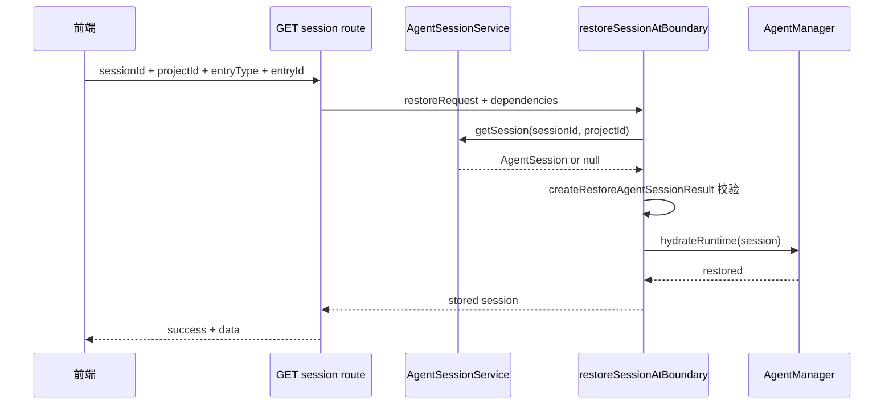

# E27：服务端恢复要先校验再 hydrate

恢复链路最容易出严重问题的地方，是服务端边界。服务端既能读文件，也能创建 Runtime。如果顺序错了，可能先把不该恢复的历史注入 Agent，再发现入口不匹配。正确顺序必须是：先读取持久化快照，先完成校验，再恢复运行时，最后返回响应。

这条规则由 [packages/core/src/lib/integrations/pi-agent/session-restore.ts](../../../../packages/core/src/lib/integrations/pi-agent/session-restore.ts) 的 `restoreSessionAtBoundary` 和 [packages/web/src/app/api/agent/sessions/[sessionId]/route.ts](<../../../../packages/web/src/app/api/agent/sessions/[sessionId]/route.ts>) 的 GET 接口共同实现。

## 1. API route 先收集恢复范围

阅读 [packages/web/src/app/api/agent/sessions/[sessionId]/route.ts 第 20—55 行](<../../../../packages/web/src/app/api/agent/sessions/[sessionId]/route.ts#L20>)。GET 请求必须从 URL query 中拿到 `projectId`、`entryType`、`entryId`。缺少任意字段都会返回 400。`entryType` 不在 `skill`、`agent`、`role-agent` 中，也会返回 400。

这说明恢复接口不是通用“按 ID 查详情”接口，而是“按当前入口范围恢复会话”接口。

## 2. 边界函数把读取、校验、hydrate 串起来

`restoreSessionAtBoundary` 位于 [packages/core/src/lib/integrations/pi-agent/session-restore.ts 第 467—510 行](../../../../packages/core/src/lib/integrations/pi-agent/session-restore.ts#L467)。它接收两个依赖：

| 依赖 | 作用 |
| --- | --- |
| `getSession(sessionId, projectId)` | 从持久化层读取 session |
| `hydrateRuntime(session)` | 把持久化历史恢复进运行时 |

核心代码窗口如下：

```ts
const session = await dependencies.getSession(request.sessionId, request.projectId);
if (!session) {
  throw new RestoreAgentSessionError('NOT_FOUND', 'Session was not found.');
}

createRestoreAgentSessionResult(session, request);

try {
  await dependencies.hydrateRuntime(session);
} catch (error) {
  throw toRestoreAgentSessionError(error);
}

return session;
```

这段代码有一个非常重要的特点：`createRestoreAgentSessionResult(session, request)` 的返回值没有被保存。它在这里承担的主要责任是“校验会不会失败”。如果归属、版本、消息结构有问题，它会在这里抛错；只有它不抛错，才会进入 `hydrateRuntime`。



这张时序图最重要的是 `createRestoreAgentSessionResult` 在 `hydrateRuntime` 之前。它意味着归属错误、结构损坏、版本不兼容都会在触碰运行时之前被挡住。

## 3. 为什么先校验再 hydrate

假设有人拿到了小林旅行会话的 `sessionId`，但从另一个 skill 入口发起恢复。如果服务端先创建 Runtime、注入历史，再做归属检查，即使最后返回 403，运行时里也可能已经出现不该出现的历史。这会留下串台风险。

先校验再 hydrate 的收益有三点：

1. 不属于当前入口的历史不会进入 Runtime。
2. 损坏历史不会污染 Agent 内存。
3. 测试可以明确断言：失败时 `hydrateRuntime` 没有被调用。

`session-restore.test.ts` 正是这样验证的：归属错误和 corrupt history 都应在 Runtime hydration 之前被拒绝。

把这句话拆成测试语言，就是：

| Given | When | Then |
| --- | --- | --- |
| 持久化 session 属于 skill A | 用 skill B 的请求调用 `restoreSessionAtBoundary` | 抛 `OWNERSHIP_MISMATCH`，`hydrateRuntime` 未调用 |
| 持久化 session 的 messages 结构损坏 | 调用 `restoreSessionAtBoundary` | 抛 `CORRUPT_SESSION`，`hydrateRuntime` 未调用 |
| 持久化 session 合法 | 调用 `restoreSessionAtBoundary` | 等待 `hydrateRuntime` 完成后才返回 |

这组断言保护的是服务端边界顺序。它比“函数会抛错”更重要，因为它证明错误数据不会先污染 Runtime。

## 4. `AgentManager.restoreAgentRuntime` 如何恢复运行时

阅读 [packages/core/src/lib/integrations/pi-agent/agent-manager.ts 第 201—246 行](../../../../packages/core/src/lib/integrations/pi-agent/agent-manager.ts#L201)。`restoreAgentRuntime` 会用 `runtimeRestorePromises` 合并同一个 session 的并发恢复，避免同时恢复两次。

真正执行恢复的是 `restoreAgentRuntimeOnce`。它先判断这个 session 是否已经有 Runtime；然后调用 `getOrCreateAgent` 创建或复用 `OriginOSAgent`；把 `systemPrompt`、`agentType`、`agentBaseDir`、`outputDir`、`llmConfig` 带进去；如果之前没有 Runtime，就等待 Agent idle，再调用 `agent.replacePersistedMessages(session.messages)` 注入历史。

源码主干如下：

```ts
const hadRuntime = this.hasAgent(session.sessionId);
const agent = await this.getOrCreateAgent(
  session.sessionId,
  session.projectContext.projectId,
  {
    systemPrompt: session.systemPrompt || undefined,
    agentType: session.agentType,
    agentBaseDir: session.projectContext.currentPath,
    outputDir: session.projectContext.outputDir,
    llmConfig: session.llmConfig,
  },
);

if (hadRuntime) {
  return {
    sessionId: session.sessionId,
    historyMessageCount: session.messages.length,
  };
}

await agent.waitForIdle();
const historyMessageCount = agent.replacePersistedMessages(session.messages);
```

这里有两个分支。已有 Runtime 时，系统不重复替换历史，只返回消息数量。没有 Runtime 时，先创建 Agent，再等待它空闲，最后用持久化消息替换运行时历史。等待 idle 的含义是：不要在 Agent 正处理另一轮时硬塞历史，否则会造成运行中状态和恢复历史交错。

这说明恢复运行时不是“把展示 messages 交给模型”。运行时拿到的是持久化 `session.messages`，保留了 Agent 下一轮所需的历史形状；前端拿到的是过滤后的展示快照。

## 5. 启动器中的复用逻辑

恢复还出现在 launcher 层。阅读 [packages/core/src/lib/features/services/launcher/base.ts 第 188—211 行](../../../../packages/core/src/lib/features/services/launcher/base.ts#L188)。`createOrRestoreSession` 会在传入 `sessionId` 时先调用 `agentSessionService.getSession(params.sessionId, params.projectId)`。如果能读到已有 session，就返回 `{ sessionId: existing.sessionId, isNew: false }`；读不到才新建。

```ts
if (params.sessionId) {
  const existing = await agentSessionService.getSession(
    params.sessionId,
    params.projectId,
  );
  if (existing) {
    return { sessionId: existing.sessionId, isNew: false };
  }
}

const session = await agentSessionService.createSession(params);
return { sessionId: session.sessionId, isNew: true };
```

这段代码里 `params.projectId` 再次出现，说明会话复用也依赖路径范围。如果启动器只传 sessionId，不传项目范围，就可能无法找到项目目录下的旧 session，然后错误地新建一个会话。

这段逻辑解决的是“打开入口时是否复用已有会话”。它和 GET restore route 关注点不同：

| 位置 | 主要问题 | 结果 |
| --- | --- | --- |
| launcher base | 启动入口时，有 sessionId 是否复用 | 返回旧 sessionId 或新建 session |
| GET restore route | 已知 sessionId 时，能否安全恢复 | 校验、hydrate、返回持久化 session |

如果读者把这两处混成一个函数，就会误解恢复链路。launcher 负责启动时选择“新建还是复用”；restore route 负责把已有快照安全接回 Runtime 和前端。

## 6. 错误码如何映射 HTTP 状态

GET route 在 [packages/web/src/app/api/agent/sessions/[sessionId]/route.ts 第 75—90 行](<../../../../packages/web/src/app/api/agent/sessions/[sessionId]/route.ts#L75>) 把恢复错误映射成 HTTP 状态：

| 错误码 | HTTP 状态 | 含义 |
| --- | --- | --- |
| `NOT_FOUND` | 404 | 找不到会话 |
| `OWNERSHIP_MISMATCH` | 403 | 会话不属于当前入口 |
| `CORRUPT_SESSION` | 422 | 会话数据损坏或不兼容 |
| `RESTORE_FAILED` | 500 | 其他恢复失败 |

这张表对调试很重要。404、403、422、500 指向完全不同的问题。如果前端把它们都展示成“恢复失败”，开发者排查成本会大幅上升。

## 7. 小实验与口头验收

纸面推演：如果 `restoreSessionAtBoundary` 把 `hydrateRuntime(session)` 放在 `createRestoreAgentSessionResult(session, request)` 之前，会出现什么风险？合格答案必须指出：错误入口或损坏历史可能先进入 Runtime，即使最后 HTTP 返回 403 或 422，运行时也已经被污染。

读者还应能按顺序复述服务端恢复链路：API 收集范围，`AgentSessionService` 读取，`createRestoreAgentSessionResult` 校验和映射，`AgentManager.restoreAgentRuntime` 注入历史，最后返回响应。顺序说错，尤其是把 hydrate 放到校验之前，就说明没有掌握本节。

## 8. 本节小结

服务端恢复边界的关键顺序是：收集入口范围，读取持久化快照，校验归属和结构，恢复 Runtime，再返回响应。`restoreSessionAtBoundary` 把这条顺序封装起来，`AgentManager.restoreAgentRuntime` 负责把历史重新注入 Agent。只有这两者都成立，小林看到历史之后，下一轮追问才不会失忆。
