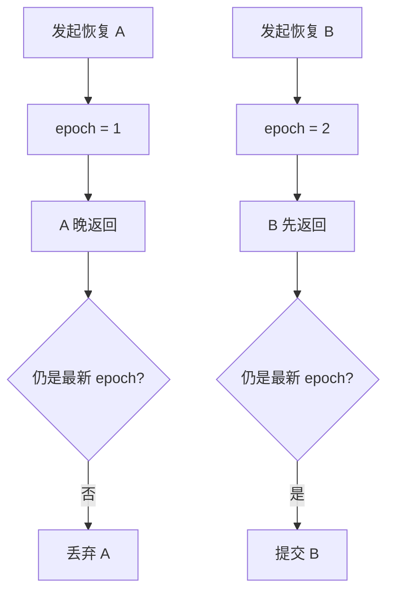

# E28：前端只提交最新恢复结果

服务端恢复正确，不代表页面一定正确。浏览器里可能同时发生多个操作：用户连续点击两个历史会话，旧请求比新请求更晚返回；用户点开会话后又立刻关闭窗口；恢复过程中又触发初始化。前端必须保证只有“当前仍然有效的最新恢复”可以提交状态。

这部分逻辑集中在 [packages/core/src/lib/integrations/pi-agent/client-hooks.ts 第 431—509 行](../../../../packages/core/src/lib/integrations/pi-agent/client-hooks.ts#L431) 的 `restoreSession`。

## 1. 恢复前先判断是否已经是当前会话

`restoreSession` 一开始会判断：如果当前已经初始化，并且当前 `sessionId` 与请求的 `sessionId` 相同，就直接返回 `null`。这是一种幂等处理。

对小林来说，如果他已经在“成都三日游”会话里，又重复点击同一条历史，前端不需要再发一次 GET 恢复请求。重复恢复不仅浪费，还可能打断当前流式状态。

## 2. operation epoch：给异步操作编号

`restoreSession` 会增加 `operationEpochRef.current`，并把当前恢复目标写入 `restoreTargetRef`。随后定义 `isLatestRestore()`：Hook 没有被 destroy，请求没有被 abort，当前 operation epoch 没变，restore target 仍然是这次请求的 sessionId。这段逻辑来自 [packages/core/src/lib/integrations/pi-agent/client-hooks.ts 第 431—462 行](../../../../packages/core/src/lib/integrations/pi-agent/client-hooks.ts#L431)。

源码窗口如下：

```ts
const operationEpoch = sessionOperationEpochRef.current + 1;
sessionOperationEpochRef.current = operationEpoch;
restoreTargetRef.current = request.sessionId;
restoreAbortControllerRef.current?.abort();
const restoreController = new AbortController();
restoreAbortControllerRef.current = restoreController;

const isLatestRestore = () =>
  !destroyedRef.current
  && !restoreController.signal.aborted
  && sessionOperationEpochRef.current === operationEpoch
  && restoreTargetRef.current === request.sessionId;
```

这段代码要分两种防线理解。`AbortController` 是请求级防线：它尝试让旧请求停止，或至少让本地知道这个请求已经失效。`operationEpoch` 是状态提交防线：就算旧请求没有真正停止，返回后也要比较版本，版本不一致就不能提交。`restoreTargetRef` 则防止同一个 Hook 在多个 session 之间切换时混淆目标。



这张图对应常见竞态：A 先发出，B 后发出，但 B 先完成。正确结果是页面显示 B；A 即使之后成功返回，也不能覆盖 B。

## 3. 恢复前要断开旧流

`restoreSession` 会调用 `detachActiveStream(true)`。这一步防止旧会话的 SSE 事件继续写入当前页面。`detachActiveStream` 的主体在 [packages/core/src/lib/integrations/pi-agent/client-hooks.ts 第 379—393 行](../../../../packages/core/src/lib/integrations/pi-agent/client-hooks.ts#L379)：它会清空当前 stream id、取消订阅、abort 请求、清理运行状态，并在需要时通知服务端 abort 旧 session。

测试 `client-hooks-session-isolation.test.ts` 中有一个场景：恢复 B 后，移除 A 的订阅，再发送下一轮消息时只发给 B。这说明前端恢复不仅改 `messages`，还要切断旧事件通道。

这个场景保护的是“旧流迟到”。如果不切断旧流，小林切到“重庆周末游”会话后，上一段“成都三日游”的迟到 token 仍可能追加到当前页面。用户看到的是自然语言文本，很难判断它来自哪个 session，所以前端必须在数据层阻断。

## 4. 成功恢复后提交哪些状态

恢复成功后，前端会调用 `getAgentSession(request)`，再用 `createRestoreAgentSessionResult(response.data, request)` 在客户端也生成一次恢复快照。随后它会提交 `sessionId`、`projectContext`、`isInitialized: true`、`messages`、`restoredSession`，并清空 running、thinking、activeTools、progress、error 等临时状态。对应提交代码在 [packages/core/src/lib/integrations/pi-agent/client-hooks.ts 第 463—491 行](../../../../packages/core/src/lib/integrations/pi-agent/client-hooks.ts#L463)。

源码主干如下：

```ts
const response = await getAgentSession(request);
if (!isLatestRestore()) return null;
if (!response.success || !response.data) {
  throw toRestoreAgentSessionError(response.error ?? { code: 'RESTORE_FAILED' });
}

const snapshot = createRestoreAgentSessionResult(response.data, request);
if (!isLatestRestore()) return null;

sessionIdRef.current = snapshot.sessionId;
projectContextRef.current = snapshot.projectContext;
isInitializedRef.current = true;
setSessionId(snapshot.sessionId);
setProjectContext(snapshot.projectContext);
setMessages(snapshot.messages);
setRestoredSession(snapshot);
setIsInitialized(true);
setIsThinking(false);
setIsRunning(false);
setActiveTools([]);
```

这里两次调用 `isLatestRestore()` 不是多余。第一次挡住“请求返回后已经过期”；第二次挡住“解析恢复快照期间又发生切换或销毁”。异步代码只要有 `await`，就要重新检查当前操作是否仍然有效。

这一步有两个意义。第一，页面从空状态重新获得历史；第二，`restoredSession` 保存工作目录、输出目录、模型配置等恢复元信息，供后续发送消息时使用。

## 5. 失败恢复不能破坏当前会话

如果恢复失败，并且这次失败仍属于最新操作，Hook 会设置可控错误信息并抛出错误。对应代码在 [packages/core/src/lib/integrations/pi-agent/client-hooks.ts 第 492—500 行](../../../../packages/core/src/lib/integrations/pi-agent/client-hooks.ts#L492)。但测试要求：当前 session 和 messages 不应被失败恢复覆盖。

这对用户体验很关键。小林正在看“成都三日游”，点击另一个历史失败了，页面不应该突然变空，也不应该把当前消息列表清掉。失败应该作为错误状态出现，而不是破坏已可用的当前会话。

## 6. destroy 会让待恢复结果失效

`destroy` 在恢复过程中会标记 `destroyedRef.current = true`，增加 operation epoch，abort 当前 restore controller，清空 restore target，并清空状态和订阅。相关失效逻辑和恢复 finally 清理位于 [packages/core/src/lib/integrations/pi-agent/client-hooks.ts 第 501—507 行](../../../../packages/core/src/lib/integrations/pi-agent/client-hooks.ts#L501)。因此一个已经被关闭窗口触发失效的恢复请求，即使之后拿到服务端成功响应，也不能提交到页面。测试里“aborted restore 不提交 partial state”验证的就是这个行为。

## 7. 状态提交表：恢复成功到底改了什么

| 状态 | 恢复成功后的值 | 为什么要改 |
| --- | --- | --- |
| `sessionId` | 恢复快照的 `sessionId` | 后续消息必须发到同一会话 |
| `projectContext` | 恢复快照的上下文 | 工具目录和归属范围要跟着恢复 |
| `messages` | 过滤后的展示消息 | 页面重新展示历史 |
| `restoredSession` | 完整恢复合同 | 保存 Runtime 继续所需信息 |
| `isInitialized` | `true` | 表示当前 Hook 可继续发送消息 |
| `isRunning` / `isThinking` | `false` | 恢复结束不是一轮生成中 |
| `activeTools` | 空数组 | 旧工具执行状态不能跨恢复保留 |
| `progressMessage` / `errorMessage` | 清空 | 避免旧状态污染新会话 |

这张表让读者看到，恢复不是只 `setMessages`。如果只恢复消息列表，后续发送、工具目录、错误展示和运行状态都可能不一致。

## 8. Given/When/Then 读前端恢复测试

| Given | When | Then | 保护的用户场景 |
| --- | --- | --- | --- |
| 恢复 A 和恢复 B 同时进行，A 晚返回 | 先完成 B，再完成 A | 页面仍停留在 B | 用户快速切换历史 |
| 当前已经是 session-current | 再恢复 session-current | 返回 `null`，不发请求 | 重复点击当前会话 |
| 恢复请求 pending | 用户调用 `destroy()` | pending 成功后也不提交 | 关闭窗口后旧请求迟到 |
| 已在当前 session | 另一个恢复失败 | 当前 messages 不变 | 失败恢复不破坏可用页面 |
| A 正在流式返回 | 恢复到 B 后 A 迟到事件到达 | B 的 messages 不被污染 | 防止跨 session token 串台 |

测试说明前端恢复的难点不是 HTTP 成功，而是异步结果是否还有资格提交。零基础读者如果只学会“await 请求后 setState”，就会写出偶发串台的恢复逻辑。

## 9. 小实验与口头验收

纸面推演：恢复 A 已发出但未返回，用户又点击恢复 B。B 先返回并提交状态，A 后返回。读者应能指出 A 会被 `isLatestRestore()` 丢弃，因为 `sessionOperationEpochRef.current` 已不等于 A 发起时保存的 `operationEpoch`，并且 `restoreTargetRef.current` 也已经指向 B。

口头验收：读者应能解释 `operationEpoch` 和 `AbortController` 的区别。`AbortController` 尝试取消请求或标记请求失效；`operationEpoch` 是本地版本号，即使旧请求无法真正取消，回来后也会因为版本不匹配而被丢弃。二者配合，才能抵抗真实浏览器里的异步竞态。

## 10. 本节小结

前端恢复的核心不是“请求成功后 setState”，而是“请求成功后再次确认它仍然是最新且有效的请求”。`restoreSession` 用幂等判断、abort controller、operation epoch、restore target 和旧流断开机制，防止过期恢复、失败恢复、关闭后的恢复污染当前页面。
