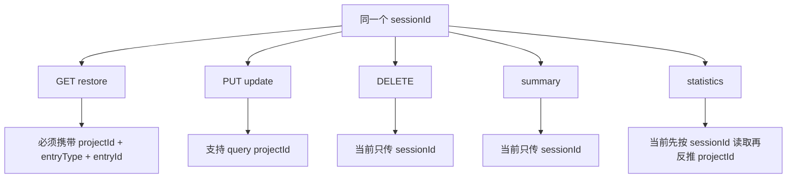

# E29：更新、删除、摘要、统计不是同一类接口

恢复接口解决“重新接上这段对话”。但会话系统还需要管理能力：修改会话、删除会话、查看摘要、统计项目会话数量。这些接口都围绕 session，却不是同一类动作。如果把它们都当成“读写 session”，很容易忽略路径、项目范围和副作用差异。

本节阅读三个 API 文件：主 route 的 PUT/DELETE、summary route、statistics route。

## 1. PUT：局部更新会话

阅读 [packages/web/src/app/api/agent/sessions/[sessionId]/route.ts 第 103—157 行](../../../../packages/web/src/app/api/agent/sessions/%5BsessionId%5D/route.ts#L103)。PUT 会从 path 中取 `sessionId`，从 query 中读取可选 `projectId`，解析 body 作为 `UpdateSessionRequest`，调用 `agentSessionService.updateSession(sessionId, updates, projectId)`，找不到时返回 404，成功时返回更新后的 session。

源码窗口如下：

```ts
const { sessionId } = await params;
const body = await _request.json();
const { searchParams } = new URL(_request.url);
const projectId = searchParams.get('projectId') || undefined;

const session = await agentSessionService.updateSession(sessionId, body, projectId);
if (!session) {
  return NextResponse.json(..., { status: 404 });
}
```

这段代码说明 PUT 的路径范围来自 query，而不是 body。body 表达“要改什么字段”；query 表达“去哪个项目范围找这份 session”。把这两类信息混在一起，会让接口既难验证，也难缓存。

这条接口的关键点是：它允许传 `projectId`。如果小林的旅行会话保存在 `projects/skill-travel-planner/sessions/` 下，PUT 必须带对应项目 ID 才能稳定找到它。

`updateSession` 的服务实现位于 [packages/core/src/lib/features/agent/session-service.ts 第 118—151 行](../../../../packages/core/src/lib/features/agent/session-service.ts#L118)。当前 Route 会把 body 直接作为 updates 传入；运行时 TypeScript 类型不会自动校验网络 JSON。因此，服务只会处理它认识的 `messages`、`status`、`projectContext`、`summary`、`llmConfig` 字段，但并没有在 Route 层验证 status 枚举、消息结构或上下文归属。PUT 能找到正确文件，不等于任意更新内容都已经得到严格验证。

## 2. DELETE：删除持久化快照

DELETE 位于 [packages/web/src/app/api/agent/sessions/[sessionId]/route.ts 第 159—208 行](../../../../packages/web/src/app/api/agent/sessions/%5BsessionId%5D/route.ts#L159)。它调用的是 `agentSessionService.deleteSession(sessionId)`。

对应源码非常短：

```ts
const { sessionId } = await params;
const deleted = await agentSessionService.deleteSession(sessionId);
```

正因为它短，才更要仔细读。这里没有解析 `_request.url`，也没有读取 `projectId`。因此它和 PUT 的查找范围不同。

这里有一个需要如实记录的风险：当前实现没有把 query 中的 `projectId` 传给 `deleteSession`。而 `AgentSessionService` 的项目会话路径规则要求项目会话使用 `projects/{projectId}/sessions/{sessionId}.json`。因此，如果目标是项目目录下的 session，仅凭 `sessionId` 删除可能找不到正确文件。

教材不能把这个点写成“删除一定覆盖项目会话”。源码能证明的是：当前 DELETE route 调用了不带 `projectId` 的删除。它可能适用于全局 session，但对项目 session 的覆盖需要进一步修正或测试证明。

服务方法本身其实支持 `projectId`，证据在 [packages/core/src/lib/features/agent/session-service.ts 第 180—185 行](../../../../packages/core/src/lib/features/agent/session-service.ts#L180)。问题不在存储能力缺失，而在 Route 没有读取并传递范围。这种“下层支持、边界丢参”的问题，只有把调用链两端放在一起才看得出来。

## 3. summary route：读取单会话摘要

阅读 [packages/web/src/app/api/agent/sessions/[sessionId]/summary/route.ts 第 12—57 行](../../../../packages/web/src/app/api/agent/sessions/%5BsessionId%5D/summary/route.ts#L12)。它调用 `agentSessionService.getSessionSummary(sessionId)`。同样要注意：这个调用没有传 `projectId`。而 `getSessionSummary` 内部会调用 `getSession(sessionId)`。如果会话只存在于项目路径下，这个摘要接口可能读不到。

源码窗口：

```ts
const { sessionId } = await params;
const summary = await agentSessionService.getSessionSummary(sessionId);
```

这段代码不能证明摘要接口不需要项目范围；它只能证明当前实现没有传项目范围。结合 E22 的路径规则，这就是风险来源。

这不是教学里的猜测，而是由路径规则推出来的代码风险。正式修复需要另外确认调用方、接口约定和测试范围；在本单元中，我们先把它作为源码审查发现记录下来。

## 4. statistics route：统计项目会话

阅读 [packages/web/src/app/api/agent/sessions/[sessionId]/statistics/route.ts 第 12—59 行](../../../../packages/web/src/app/api/agent/sessions/%5BsessionId%5D/statistics/route.ts#L12)。它先用 `getSession(sessionId)` 读取会话，再从 `session.projectContext.projectId` 取得项目 ID，最后调用 `getProjectStatistics(projectId)`。

源码窗口：

```ts
const session = await agentSessionService.getSession(sessionId);
if (!session) {
  return NextResponse.json(..., { status: 404 });
}

const projectId = session.projectContext.projectId;
const statistics = await agentSessionService.getProjectStatistics(projectId);
```

这段代码的意图是从 session 反推出项目，再统计该项目全部会话。但第一步 `getSession(sessionId)` 仍然按全局路径读取；如果项目会话不在全局目录，后续就没有机会拿到 `projectId`。

这里的问题也类似：第一步读取没有传 `projectId`，如果项目会话不在全局目录，可能连项目 ID 都拿不到。更稳妥的设计通常是让请求显式提供项目范围，或者让服务提供跨目录查找策略，并用测试固定行为。

统计计算本身位于 [packages/core/src/lib/features/agent/session-service.ts 第 243—268 行](../../../../packages/core/src/lib/features/agent/session-service.ts#L243)。它调用 `listSessions(projectId)` 后计算总数、active/completed 数、总消息数和平均消息数。也就是说，只要首步成功找到 session，后续统计确实进入项目目录；当前断点恰好发生在“如何从 path sessionId 找到项目范围”这一步。

## 5. 管理接口的责任对比

| 接口 | 目标 | 是否需要项目范围 | 当前源码观察 |
| --- | --- | --- | --- |
| GET restore | 恢复并 hydrate Runtime | 必须需要 | 要求 `projectId`、`entryType`、`entryId` |
| PUT | 局部更新 session | 项目 session 需要 | 支持 query `projectId` |
| DELETE | 删除 session 文件 | 项目 session 需要 | 当前未传 `projectId` |
| summary | 读取单会话摘要 | 项目 session 需要 | 当前未传 `projectId` |
| statistics | 读取项目统计 | 需要先找到项目 session | 当前第一步未传 `projectId` |

这张表不是在要求本节修改代码，而是在训练源码审查能力。同样是 session route，不同接口对项目范围的处理并不一致。读者不能凭“同一个目录下的 API”假定它们行为一致。

## 6. 用请求形状看接口差异

把同一个 `sessionId` 放进不同请求，读者会更容易看出差异：

| 操作 | 示例请求 | 当前服务端读取范围 |
| --- | --- | --- |
| 恢复 | `GET /api/agent/sessions/s1?projectId=skill-travel-planner&entryType=skill&entryId=travel-planner` | 明确项目和入口范围 |
| 更新 | `PUT /api/agent/sessions/s1?projectId=skill-travel-planner` | 支持项目范围 |
| 删除 | `DELETE /api/agent/sessions/s1` | 当前只按全局 sessionId 调用 |
| 摘要 | `GET /api/agent/sessions/s1/summary` | 当前先按全局 sessionId 读取 |
| 统计 | `GET /api/agent/sessions/s1/statistics` | 当前先按全局 sessionId 读取，再取项目 ID |

这张表把源码风险变成具体接口差异。小林的旅行会话如果保存在项目目录下，恢复和更新路径较清晰；删除、摘要、统计是否能覆盖同一类项目会话，需要额外测试或修正。



这张图把“同一个 sessionId 进入不同接口”后的范围差异放在一起看。恢复接口的问题是身份归属，更新接口的问题是项目路径，删除、摘要、统计的问题是当前实现是否能找到项目目录里的会话。三类问题相似，但不能合并成一句“session 接口都有范围校验”。

## 7. 如何把风险变成验收问题

如果后续要修复或验收这些接口，可以提出三个明确问题：

1. 项目会话是否必须通过 `projectId` 才能删除？
2. 摘要接口是否应该接受 `projectId` query？
3. 统计接口是否应该以 `projectId` 为入口，而不是先用 `sessionId` 反查项目？

对应测试应覆盖全局 session 删除成功、项目 session 删除成功、项目 session 摘要可读取、项目 session 统计不依赖全局路径、找不到 session 时仍返回清晰 404。

还应增加两个容易遗漏的边界：PUT body 含非法 `status` 或损坏 messages 时是否应返回 400/422，而不是把异常数据写入快照；DELETE 项目会话时是否同时处理仍在运行的 Agent，还是明确规定“删除持久化数据”和“销毁 Runtime”必须由调用方组合。接口合同必须选择一种语义并用测试固定，不能让 UI 猜测。

## 8. 这不是“顺手修一下”的问题

虽然本节指出了风险，但正式修改代码前还要确认调用方契约。原因是 API 变更可能影响前端调用、Electron 集成或已有数据。正确工程顺序应是：

1. 搜索现有调用方，确认是否已经有人传 `projectId` 或期望全局查找。
2. 补测试固定当前期望行为。
3. 再决定是给接口增加 `projectId` query，还是在 service 内提供跨目录查找。
4. 修改后同时验证全局 session 与项目 session。

教材在这里保持克制：指出源码证据和风险，但不把未实施的修复写成已经存在的能力。

## 9. 小实验与口头验收

纸面推演：假设 `s1` 只存在于 `projects/skill-travel-planner/sessions/s1.json`，不在全局 `sessions/s1.json`。读者应分别判断恢复、更新、删除、摘要、统计五个接口当前最可能的行为。合格答案应指出：恢复和更新有项目范围入口；删除、摘要、统计当前源码没有等价传入项目范围，因此需要测试或修正来证明它们覆盖项目会话。

口头验收：读者应能说出为什么 GET restore 必须带 `entryType` 和 `entryId`，而 DELETE/summary/statistics 的当前风险主要是 `projectId` 范围不足。二者不是同一种问题。前者是归属安全，后者是路径一致性。

## 10. 本节小结

更新、删除、摘要、统计都是会话管理能力，但它们不是同一个责任。恢复 GET 已经强制要求入口范围；PUT 支持项目范围；DELETE、summary、statistics 当前存在项目路径传递不足的风险。阅读这些接口时，必须区分“源码已经保证的行为”和“根据路径规则可以确认的风险”。
