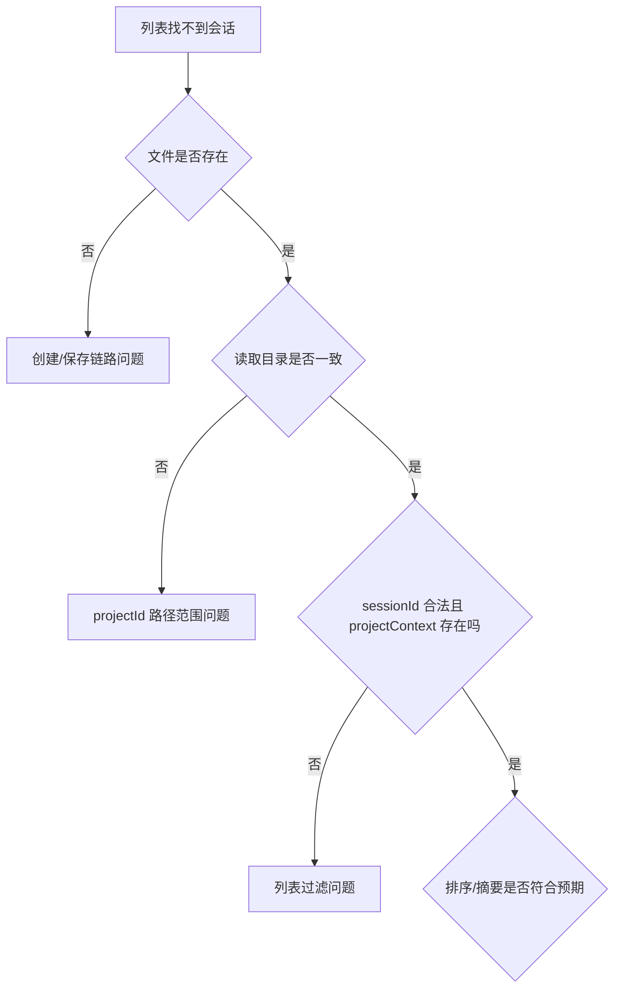

# E30：工作坊：从 bug 反推恢复链路

本节把 E21-E29 合成一个排查工作坊。目标不是写新功能，而是训练读者面对“刷新后历史丢失”“恢复后下一轮失忆”“打开 A 却看到 B 的历史”这类问题时，能按层拆解、按源码定位、按测试验证。

仍以小林的旅行规划 Agent 为例。第一天他让 Agent 做了三日游方案，第二天重新打开后出现异常。我们用四类 bug 演练完整链路。

## 1. Bug 一：历史列表里找不到昨天的会话

先不要看前端页面。第一步问：昨天的会话是否真的写入了持久化层？

排查顺序：

1. 看创建时使用的是 `AgentSessionService.createSession` 还是 `SessionStore.createSession`。
2. 如果是 `AgentSessionService`，确认 `projectContext.projectId` 是否存在。
3. 根据路径规则判断文件应在 `projects/{projectId}/sessions/{sessionId}.json` 还是 `sessions/{sessionId}.json`。
4. 看列表接口是否按相同项目范围读取。
5. 检查 `updatedAt` 是否使它排在预期位置。

这张图体现了一个原则：列表问题优先查存储和路径，不要一上来怀疑模型或 SSE。模型是否回答过，不等于会话文件是否保存正确。

## 2. Bug 二：页面恢复了历史，但下一轮 Agent 失忆

这种 bug 说明前端展示层可能成功了，但运行时层没有成功。

应检查：

- GET 恢复 route 是否调用了 `restoreSessionAtBoundary`；
- `restoreSessionAtBoundary` 是否执行到 `hydrateRuntime`；
- `agentManager.restoreAgentRuntime` 是否调用 `replacePersistedMessages(session.messages)`；
- 下一轮消息发送时是否使用同一个 `sessionId`；
- 是否被另一个 restore 或 initialize 覆盖。

| 现象 | 可能层级 | 重点源码 |
| --- | --- | --- |
| 历史能看到，模型不知道 | Runtime 恢复层 | `agent-manager.ts` |
| 历史看不到，模型知道 | 前端展示提交层 | `client-hooks.ts` |
| 历史和模型都不对 | 归属或路径层 | `session-restore.ts`、`session-service.ts` |
| 偶发串台 | 前端竞态或流订阅层 | `operationEpoch`、`detachActiveStream` |

这张表让读者学会用现象反推层级。恢复系统的问题很少能靠一个断点解决，必须先判断哪一层的承诺没有兑现。

## 3. Bug 三：A 入口看到 B 入口的历史

这是最严重的一类。排查时应优先看归属校验：

1. 前端恢复请求是否传了 `projectId`、`entryType`、`entryId`；
2. API route 是否拒绝缺失字段；
3. `expectedProjectId` 是否符合入口命名规则；
4. 持久化 `projectContext.entryType`、`entryId` 是否与请求匹配；
5. `agentType` 是否与入口类型兼容；
6. 测试中是否覆盖跨 skill、跨 agent、跨 role-agent 的拒绝场景。

不能用“前端不会传错”替代服务端校验。入口身份必须在服务端重新验证，因为恢复历史本质上是读取持久化数据。

## 4. Bug 四：恢复失败后当前会话被清空

这个问题属于前端提交策略。正确行为是：失败恢复可以显示错误，但不应破坏当前可用会话。

检查 [packages/core/src/lib/integrations/pi-agent/client-hooks.ts 第 431—508 行](../../../../packages/core/src/lib/integrations/pi-agent/client-hooks.ts#L431)：catch 分支是否只设置错误，没有清空已有 `messages`；stale restore 是否返回 `null`；destroy 后的 pending restore 是否不能提交；幂等恢复是否避免重复请求；旧流是否通过 `detachActiveStream(true)` 断开。

测试 `client-hooks-session-isolation.test.ts` 已覆盖“失败恢复保留当前 session 和 messages”“aborted restore 不提交 partial state”“晚返回的旧恢复不能覆盖新恢复”等关键行为。

## 5. 把恢复链路还原成一张责任地图

| 源码窗口 | 在恢复链路中的责任 |
| --- | --- |
| [packages/core/src/types/agent.ts 第 207 行起](../../../../packages/core/src/types/agent.ts#L207) | 定义主会话、创建/更新请求、摘要和统计的业务形状 |
| [packages/core/src/lib/features/agent/session-service.ts 第 54—352 行](../../../../packages/core/src/lib/features/agent/session-service.ts#L54) | 决定项目路径，执行 CRUD、列表、摘要和统计 |
| [packages/core/src/lib/integrations/pi-agent/session-store.ts 第 1 行起](../../../../packages/core/src/lib/integrations/pi-agent/session-store.ts#L1) | 提供更简单的本地列表、当前指针与缓存模型 |
| [packages/core/src/lib/integrations/pi-agent/session-restore.ts 第 18—510 行](../../../../packages/core/src/lib/integrations/pi-agent/session-restore.ts#L18) | 定义恢复范围、归属校验、展示过滤、结果合同和边界顺序 |
| [packages/web/src/app/api/agent/sessions/[sessionId]/route.ts 第 25—208 行](../../../../packages/web/src/app/api/agent/sessions/%5BsessionId%5D/route.ts#L25) | GET 恢复、PUT 更新、DELETE 删除和错误码映射 |
| [packages/core/src/lib/integrations/pi-agent/client-hooks.ts 第 431—508 行](../../../../packages/core/src/lib/integrations/pi-agent/client-hooks.ts#L431) | 让最新且仍有效的恢复请求提交前端状态 |
| [packages/core/src/lib/integrations/pi-agent/agent-manager.ts 第 197—275 行](../../../../packages/core/src/lib/integrations/pi-agent/agent-manager.ts#L197) | 合并并发恢复，创建或复用 Runtime，注入持久化历史 |
| [packages/core/src/lib/features/services/launcher/base.ts 第 188—211 行](../../../../packages/core/src/lib/features/services/launcher/base.ts#L188) | 启动时优先复用指定的已有 session |
| [packages/core/src/lib/integrations/pi-agent/__tests__/session-restore.test.ts 第 1 行起](../../../../packages/core/src/lib/integrations/pi-agent/__tests__/session-restore.test.ts#L1) | 固定恢复合同、归属拒绝和 hydrate 前置顺序 |
| [packages/core/src/lib/integrations/pi-agent/__tests__/client-hooks-session-isolation.test.ts 第 353 行起](../../../../packages/core/src/lib/integrations/pi-agent/__tests__/client-hooks-session-isolation.test.ts#L353) | 固定恢复竞态、失败保持和旧流隔离 |

这张图谱的用途不是记文件名，而是建立查错顺序：先看持久化文件和项目路径，再看服务端归属与结构校验，然后看 Runtime 是否 hydrate，最后看前端是否有资格提交返回结果。

## 6. 四个相似对象必须始终分开

| 对象 | 真正保存什么 | 生命周期结束后还能依靠什么恢复 |
| --- | --- | --- |
| 页面 messages | 当前 UI 的展示快照与占位消息 | 不能作为持久化依据 |
| Agent Runtime history | 下一轮模型可见上下文 | Runtime 被回收后依靠 session.messages 重建 |
| AgentSession JSON | 可恢复的业务快照 | 依靠项目路径和 sessionId 读取 |
| SessionStore cache/current pointer | 简化适配层的本地索引状态 | 依靠存储文件重读，指针本身不含历史 |

页面能看到不代表模型已经恢复；模型能继续不代表页面展示过滤正确；文件存在不代表读取时使用了正确项目路径；当前指针存在也不代表目标会话仍存在。恢复 bug 的第一步，就是先确定哪一个对象的事实与预期不一致。

## 7. 逐段口头验收清单

| 课程 | 必须能讲清的源码责任 | 最低验收问题 |
| --- | --- | --- |
| E21 | `destroy`、`removeAgent`、`deleteSession` 各自删除哪一层 | 为什么关闭窗口不等于删除会话？ |
| E22 | `createSession`、`saveSession`、`getSessionPath`、`listSessions` | 为什么有文件仍可能读不到？ |
| E23 | `sessionsCache`、`currentSessionId`、`saveSession`、静态映射 | 当前会话指针怎样避免悬空？ |
| E24 | `RestoreAgentSessionRequest`、`expectedProjectId`、`assertSessionOwnership` | 为什么 sessionId 相同仍可能不能恢复？ |
| E25 | `mapDisplayMessage`、`mapSessionDisplayMessages` | 哪些消息应过滤，哪些应判 corrupt？ |
| E26 | `readProjectContext`、`readRuntimeLLMConfig`、`createRestoreAgentSessionResult` | 为什么恢复结果不能只返回 messages？ |
| E27 | `restoreSessionAtBoundary`、`restoreAgentRuntime`、launcher 复用逻辑 | 为什么必须先校验再 hydrate？ |
| E28 | `restoreSession`、`isLatestRestore`、`detachActiveStream` | 为什么请求成功也可能不能提交 state？ |
| E29 | PUT/DELETE/summary/statistics routes | 哪些接口存在项目路径范围风险？ |

逐节验收时，要让读者用自己的话回答第三列问题，并指出至少一个源码位置。答不出源码位置，就说明还停留在概念理解；说不出错误后果，就说明还没有达到工程排查能力。

## 8. 证据边界：本单元仍不能替代哪些验证

本单元能从源码证明持久化和恢复的设计顺序，也能引用纯函数与 Hook 测试证明若干不变量，但仍不能自动推出以下结论：

- 磁盘权限异常、半写入文件或并发写入时一定不会损坏会话；
- 真实 Next.js Route 已覆盖项目会话的删除、摘要和统计；
- 浏览器刷新、服务端重启后，所有入口类型都能端到端恢复；
- Runtime history 与页面 display messages 在长会话、工具消息和异常消息下始终一致。

这些结论需要文件系统失败测试、Route 集成测试和端到端场景共同提供证据。读者在故障报告中应写清“根据哪一层证据得到哪一个结论”，避免把局部单元测试扩大成整条链路保证。

## 9. 本节小结

会话恢复不是一个函数，而是一条链。链路从持久化快照开始，经过项目路径、归属校验、展示过滤、运行时恢复、前端竞态控制，最后才表现为“用户能继续对话”。排查恢复问题时，先定位层级，再看对应源码，再用测试固定判断。这样才能避免把所有问题都含糊地归结为“session 没恢复”。
