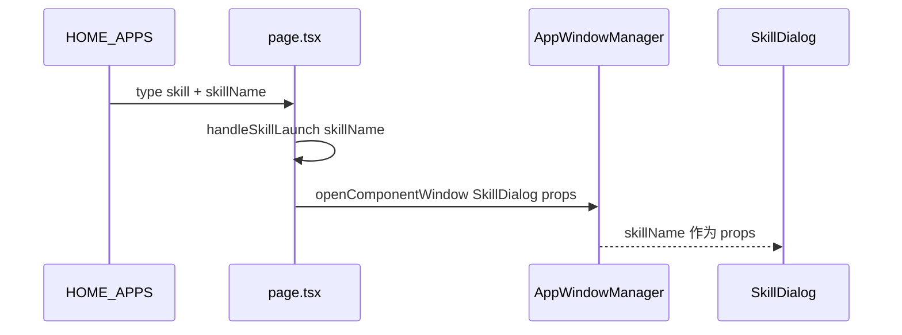
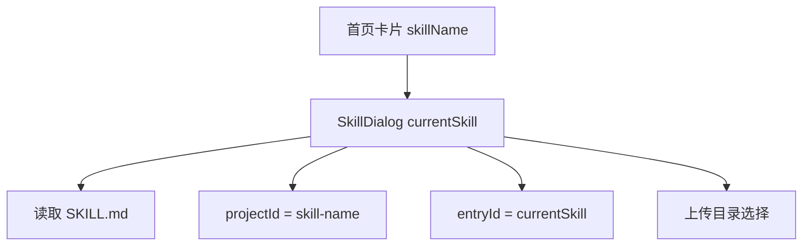

# E31：首页卡片只是 Skill 的入口，不是 Skill 本身

小林在首页点击“毕业旅行策划”卡片时，真正发生的第一件事不是模型启动，也不是 `SKILL.md` 被执行。第一件事更简单：系统根据首页配置判断这个卡片是一个 `skill` 类型入口，并拿到它对应的 `skillName`。这个 `skillName` 后续会一路传给 SkillDialog、内容接口、会话初始化和历史恢复。

本节阅读 [packages/web/src/config/homeApps.ts](../../../../packages/web/src/config/homeApps.ts)、[packages/web/src/app/page.tsx](../../../../packages/web/src/app/page.tsx)、[packages/web/src/services/AppWindowManager.ts](../../../../packages/web/src/services/AppWindowManager.ts) 和 [packages/web/src/components/skills/SkillDialog.tsx](../../../../packages/web/src/components/skills/SkillDialog.tsx) 的入口状态。

## 1. 首页配置提供的是入口身份

[packages/web/src/config/homeApps.ts 第 7—18 行](../../../../packages/web/src/config/homeApps.ts#L7) 定义了首页卡片的基本形状：

```ts
export type AppCardType = 'skill' | 'action';

export interface HomeAppConfig {
  id: string;
  name: string;
  description: string;
  icon: string;
  color: string;
  type: AppCardType;
  skillName?: string;
  action?: string;
}
```

这段类型把首页入口分成两类。`action` 类型更像“打开某个已有应用动作”，例如打开工作区；`skill` 类型则表示“打开一个会话式 Skill”。`skillName` 是 skill 入口的关键字段，它不是 UI 文案，而是后续查找 Skill 定义的业务标识。

继续看 [packages/web/src/config/homeApps.ts 第 24—66 行](../../../../packages/web/src/config/homeApps.ts#L24)。配置项里有 `type: 'skill'` 和 `skillName: 'agent-creator'`、`skillName: 'role-agent-creator'`、`skillName: 'search-and-install-skill'` 等。对于旅行案例，可以把它想象成：

```ts
{
  id: 'app-trip-planner',
  name: '毕业旅行策划',
  description: '规划路线、预算和行程文档',
  icon: '🧳',
  color: 'from-amber-500',
  type: 'skill',
  skillName: 'trip-planner',
}
```

这并不意味着 `trip-planner` 已经加载成功。它只说明：当用户点这个卡片时，系统应该用 `trip-planner` 这个名字打开一个 Skill 会话入口。

## 2. 首页点击链路把入口名交给窗口管理器

入口配置只有在点击链路里被消费，才会真正打开窗口。[packages/web/src/app/page.tsx 第 1194—1204 行](../../../../packages/web/src/app/page.tsx#L1194) 显示：首页把 `HOME_APPS` 映射为可点击项时，会判断 `app.type === 'skill'`，并把 `app.skillName` 交给 `handleSkillLaunch`：

```tsx
const appItems: SpotlightItem[] = HOME_APPS.map((app) => ({
  id: `spotlight-app-${app.id}`,
  type: SpotlightItemType.APP,
  title: app.name,
  subtitle: app.description,
  icon: app.icon,
  action: () => {
    if (app.type === 'skill' && isNonEmptyString(app.skillName)) {
      handleSkillLaunch(app.skillName, app.name);
      return;
    }
  },
}));
```

再看 [packages/web/src/app/page.tsx 第 845—868 行](../../../../packages/web/src/app/page.tsx#L845) 的 `handleSkillLaunch`：

```tsx
const handleSkillLaunch = (skillName: string, name: string, initialMessage?: string) => {
  const windowManager = AppWindowManager.getInstance();

  windowManager.openComponentWindow(
    `skill-${skillName}`,
    name,
    SkillDialog,
    {
      skillName,
      initialMessage: initialMessage?.trim() || '你好！我是' + name.split(' ')[0] + '助手，有什么可以帮助你的吗？',
    },
    {
      metadata: {
        entryType: 'skill',
        entryId: skillName,
        sessionId: `skill-${skillName}`,
        projectId: `skill-${skillName}`,
      },
    }
  );
};
```

这段代码补上了前面不能跳过的一环：`skillName` 不只是传给组件 props，还进入窗口 ID、入口元数据、项目范围和默认初始消息。对小林来说，如果入口名是 `trip-planner`，窗口 ID 会变成 `skill-trip-planner`，metadata 里的 `entryId` 和 `projectId` 也会围绕这个名字建立。

[packages/web/src/services/AppWindowManager.ts 第 245—258 行](../../../../packages/web/src/services/AppWindowManager.ts#L245) 则说明 `openComponentWindow` 如何把组件和 props 包成窗口内容：

```ts
openComponentWindow(
  id: string,
  title: string,
  component: React.ComponentType<any>,
  props?: Record<string, unknown>,
  options?: Partial<AppWindowConfig>
): string {
  return this.openWindow({
    id,
    type: 'app',
    title,
    content: { type: 'component', component, props } as ComponentContent,
    ...options,
  });
}
```

这一步仍然不是 Skill 执行。它只是打开一个承载 `SkillDialog` 的窗口，并把 `skillName` 放进 props。真正读取 `SKILL.md` 要到后续内容加载阶段。



这张图的重点是：入口身份从配置流到窗口，不直接流到模型。

## 3. SkillDialog 接收的是当前 skill 名称

[packages/web/src/components/skills/SkillDialog.tsx 第 33—40 行](../../../../packages/web/src/components/skills/SkillDialog.tsx#L33) 定义了弹窗 props：

```ts
interface SkillDialogProps {
  skillName?: string;
  initialMessage?: string;
  onMessage?: (message: string) => Promise<void>;
  onSkillChange?: (skillName: string) => void;
  skillContent?: string;
  onClose?: () => void;
}
```

`skillName` 是从入口传进来的初始技能名。`initialMessage` 是可选的首条消息，`skillContent` 则允许外部直接提供技能正文。注意这里仍然没有 Agent 实例。SkillDialog 只是获得了“要打开哪个 Skill”的入口信息。

进入组件后，[packages/web/src/components/skills/SkillDialog.tsx 第 238—254 行](../../../../packages/web/src/components/skills/SkillDialog.tsx#L238) 把入口名放进状态和 ref：

```ts
const [currentSkill, setCurrentSkill] = useState<string | undefined>(initialSkillName);
const skillContentCacheRef = useRef<Map<string, {
  content: string;
  baseDir?: string;
  workingDir?: string;
  outputDir?: string;
  systemManaged: boolean;
}>>(new Map());
const stableSessionIdRef = useRef<string>(uuidv4());
```

这段代码说明 SkillDialog 一开始准备了三类状态：当前 Skill、技能内容缓存、稳定会话 ID。它仍然没有读取 `SKILL.md`，也没有调用模型。初学者要把“入口状态”和“运行时状态”分开。

## 4. 一个名字会流向多个地方

`currentSkill` 后面至少影响四个动作：

| 使用位置 | 作用 | 错了会怎样 |
| --- | --- | --- |
| 加载技能内容 | 调用 `getAvailableSkillContent({ name })` | 找不到 `SKILL.md` 或读到错误 Skill |
| 创建会话 | 生成 `projectId: skill-${currentSkill}` | 历史会话归属范围错 |
| 恢复会话 | 传入 `entryType: 'skill'`、`entryId: currentSkill` | 归属校验失败 |
| 上传附件 | 选择 outputDir / workingDir | 附件可能写错目录 |

这就是为什么 `skillName` 不能只当作按钮文案。它是入口身份的一部分，会参与后面几乎所有边界判断。



这张图里的每条箭头都代表一个真实后果。读者排查 Skill 问题时，应先确认入口名有没有一致传递，而不是直接怀疑模型。

## 5. 测试证据与缺口

本节涉及的首页入口配置没有专门测试证明“某个卡片一定打开某个 SkillDialog”。已有测试更多覆盖 Skill 加载、目录和 launcher。这里要保持克制：源码能证明的是 `HOME_APPS` 提供 `type` 与 `skillName`，`page.tsx` 的点击链路把它传给 `handleSkillLaunch`，窗口管理器把 `SkillDialog` 与 props 包成窗口内容，SkillDialog 使用 `initialSkillName` 初始化 `currentSkill`。它仍不能证明真实浏览器点击、动画、焦点和窗口渲染都端到端正确。

如果要补强测试，应覆盖：

| Given | When | Then |
| --- | --- | --- |
| 一个 `type: 'skill'` 的首页卡片 | 用户点击卡片 | 打开 SkillDialog 并传入同一个 `skillName` |
| 一个 `type: 'action'` 的首页卡片 | 用户点击卡片 | 不走 SkillDialog，而走对应 action |
| skill 卡片缺少 `skillName` | 渲染或点击 | 给出可诊断错误，而不是打开空会话 |

## 6. 小实验 / 练习与口头验收

纸面推演：如果首页卡片 `name` 写成“毕业旅行策划”，但 `skillName` 写成 `budget-planner`，小林点击后最可能打开哪个 Skill？合格答案是：后续业务会按 `budget-planner` 查找和初始化，`name` 主要是展示文案，不能决定加载哪个 `SKILL.md`。

口头验收：读者应能解释“首页卡片不是 Skill 本身”。合格回答必须包含：卡片只提供入口身份；`skillName` 会进入后续读取和会话范围；真正的 Skill 能力要等 `SKILL.md` 被读取并拼入系统提示词后才形成。

## 7. 本节小结

Skill 的第一步是入口身份，不是模型推理。`HOME_APPS` 通过 `type: 'skill'` 和 `skillName` 告诉系统要打开哪个 Skill，`page.tsx` 把它交给 `handleSkillLaunch`，窗口管理器打开 `SkillDialog`，SkillDialog 再用这个名字进入后续加载、初始化和恢复流程。读懂这一层，后面才不会把 UI 展示、技能定义和运行时 Agent 混成一个对象。
