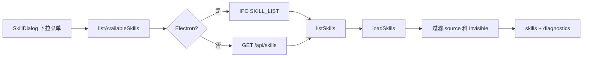

# E32：技能列表是一张经过过滤的目录表

小林打开 SkillDialog 后，顶部下拉菜单会显示可用技能。这里的“可用”不是简单读取一个文件夹并展示所有文件。系统要从多个来源加载 Skill，过滤不可见项，返回诊断信息，并且在 Web 和 Electron 两种运行环境下提供同一套调用口。

本节阅读 [packages/web/src/components/skills/SkillDialog.tsx](../../../../packages/web/src/components/skills/SkillDialog.tsx) 的列表加载、[packages/core/src/lib/integrations/electron/services/skill.ts](../../../../packages/core/src/lib/integrations/electron/services/skill.ts) 的适配函数，以及 [packages/web/src/app/api/skills/route.ts](../../../../packages/web/src/app/api/skills/route.ts) 和 [packages/core/src/lib/features/skills/service.ts](../../../../packages/core/src/lib/features/skills/service.ts) 的列表服务。

## 1. 前端只在需要时加载列表

[packages/web/src/components/skills/SkillDialog.tsx 第 304—329 行](../../../../packages/web/src/components/skills/SkillDialog.tsx#L304) 的 `loadSkillsList` 有两个关键判断：

```ts
const loadSkillsList = useCallback(async () => {
  if (skills.length > 0 || isLoadingSkillsList) return;

  setIsLoadingSkillsList(true);
  try {
    const data = await listAvailableSkills({ source: 'bundled' });
    if (data.success && data.data?.skills) {
      const skillsList: SkillDefinition[] = data.data.skills.map((s) => ({
        name: s.name,
        code: s.code || s.name,
        description: s.description,
        source: s.source,
        disableModelInvocation: s.disableModelInvocation,
        filePath: s.filePath,
        baseDir: s.baseDir,
        systemManaged: s.systemManaged,
      }));
      setSkills(skillsList);
    }
  } finally {
    setIsLoadingSkillsList(false);
  }
}, [skills.length, isLoadingSkillsList]);
```

第一层判断是懒加载：列表已经有数据或正在加载时，不重复请求。第二层判断是来源过滤：这里传了 `source: 'bundled'`，所以 UI 下拉菜单默认只展示系统内置来源。读者不要误以为 `listAvailableSkills()` 永远列出所有技能；调用方传什么过滤条件，会影响返回结果。

## 2. 同一个函数在 Web 和 Electron 下走不同通道

[packages/core/src/lib/integrations/electron/services/skill.ts 第 147—163 行](../../../../packages/core/src/lib/integrations/electron/services/skill.ts#L147) 定义了 `listAvailableSkills`：

```ts
export async function listAvailableSkills(
  request: SkillListRequest = {}
): Promise<IpcResponse<SkillListResponse>> {
  if (isElectron()) {
    return getIpcRenderer().invoke<IpcResponse<SkillListResponse>>(
      IPC_CHANNELS.SKILL_LIST,
      request
    );
  }

  const response = await fetch(`/api/skills${toQueryString({
    source: request.source,
    includeInvisible: request.includeInvisible,
    includeDiagnostics: request.includeDiagnostics,
  })}`);
  return readJsonResponse<IpcResponse<SkillListResponse>>(response);
}
```

这段代码让前端组件不用关心自己在浏览器还是桌面壳里。Electron 下走 IPC；普通 Web 下走 HTTP API。返回形状仍然是 `IpcResponse<SkillListResponse>`。这是一层适配，不是业务规则本身。

## 3. API route 只做参数解析和响应映射

[packages/web/src/app/api/skills/route.ts 第 31—41 行](../../../../packages/web/src/app/api/skills/route.ts#L31) 从 URL query 读参数，然后调用 core service：

```ts
const responseData = listSkills({
  source: (searchParams.get('source') as SkillSource | null) ?? undefined,
  includeInvisible: searchParams.get('includeInvisible') === 'true',
  includeDiagnostics: searchParams.get('includeDiagnostics') !== 'false',
});
```

这符合项目规约：`packages/web/src/app/api/` 不承载业务逻辑，只解析请求、调用下层服务、返回响应。真正决定“哪些 Skill 可见”的逻辑在 core service。

## 4. Core service 负责过滤和诊断

[packages/core/src/lib/features/skills/service.ts 第 455—475 行](../../../../packages/core/src/lib/features/skills/service.ts#L455) 的 `listSkills` 是目录表的核心：

```ts
export function listSkills(request: SkillListRequest = {}): SkillListResponse {
  const {
    source,
    includeInvisible = false,
    includeDiagnostics = true,
  } = request;

  const result = loadSkills({ includeDefaults: true });
  let skills = result.skills;

  if (source) {
    skills = skills.filter((skill) => skill.source === source);
  }

  if (!includeInvisible) {
    skills = skills.filter((skill) => !skill.disableModelInvocation);
  }

  return {
    skills: skills.map(toListItem),
    diagnostics: includeDiagnostics ? result.diagnostics : [],
  };
}
```

这段代码有三层含义：

1. `loadSkills({ includeDefaults: true })` 负责从默认位置加载 Skill。
2. `source` 过滤来源，例如 bundled、user、project。
3. `includeInvisible` 默认是 `false`，所以 `disableModelInvocation` 的 Skill 不会出现在普通列表里。

`diagnostics` 也很重要。Skill 文件名不合规、描述缺失、名称冲突等问题，不应该静默消失；它们会进入诊断结果，帮助开发者排查为什么某个 Skill 没显示。



这张图说明“技能列表”不是一个单点功能，而是一条跨 UI、适配层、API、core service、加载器的链路。

## 5. 错误边界

如果小林看不到某个 Skill，可能原因至少有四类：

| 现象 | 可能原因 | 应先看哪里 |
| --- | --- | --- |
| 下拉菜单没有出现技能 | UI 只请求 `source: 'bundled'` | `SkillDialog.tsx` 的 `loadSkillsList` |
| API 返回空列表 | 默认目录没有读到有效 `SKILL.md` | `loadSkills` 与 diagnostics |
| Skill 文件存在但不显示 | `disable-model-invocation` 或 description 缺失 | `core/skills.ts` 的解析和校验 |
| Electron 能显示，Web 不能显示 | IPC 与 HTTP 入口配置不同 | `skill.ts` 适配层和 API route |

排查顺序应从调用参数开始，再看 service 过滤，最后看磁盘加载结果。不能直接判断“模型没有识别这个 Skill”。

## 6. 详情、刷新和缓存是目录表的补充边界

技能列表不是唯一的目录接口。[packages/web/src/app/api/skills/[name]/route.ts 第 41—103 行](<../../../../packages/web/src/app/api/skills/[name]/route.ts#L41>) 提供按名称读取详情的能力：

```ts
const name = params.name;
const includeInvisible = searchParams.get('includeInvisible') !== 'false';

const result = loadSkills({ includeDefaults: true });
const skill = result.skills.find((s) => s.name === name);

if (skill.disableModelInvocation && !includeInvisible) {
  return NextResponse.json({ success: false, error: { code: 'DISABLED' } }, { status: 403 });
}

const { frontmatter, body } = loadSkillContent(skill);
```

这条 route 和 E35 的 content route 不同。detail route 返回去掉 frontmatter 后的 `body`、frontmatter 对象和 Skill 元数据；content route 默认可以返回原始 Markdown。读者不能把二者混成同一个“读取 Skill 内容”接口。

[packages/web/src/app/api/skills/refresh/route.ts 第 27—37 行](../../../../packages/web/src/app/api/skills/refresh/route.ts#L27) 则调用 `refreshSkills()`：

```ts
export async function POST(_request: NextRequest) {
  const data = refreshSkills();

  return NextResponse.json({
    success: true,
    data,
    timestamp: new Date().toISOString(),
  });
}
```

它的作用是强制重新从磁盘读取 Skill 列表，常用于开发阶段新增或修改 Skill 后刷新目录。

仓库里还存在 [packages/core/src/lib/features/services/skill-service.ts 第 32—64 行](../../../../packages/core/src/lib/features/services/skill-service.ts#L32) 的缓存封装：

```ts
async getSkills(options: { useCache?: boolean; cacheKey?: string } = {}) {
  const { useCache = true, cacheKey = 'default' } = options;

  if (useCache) {
    const now = Date.now();
    if (cachedSkillsResult && (now - cacheTimestamp) < CACHE_TTL) {
      return cachedSkillsResult;
    }
  }

  const result = loadSkills({ includeDefaults: true });
  cachedSkillsResult = result;
  cacheTimestamp = Date.now();
  this.skillsCache.set(cacheKey, result);
  return result;
}
```

这不是 `features/skills/service.ts` 的同一个 service。它更像一层缓存门面，提供 `getSkills`、`getSkillByName`、`formatSkillsForAgentPrompt` 和 diagnostics。教学上要把它放在目录能力的背景层，而不是把两个 `SkillService` 命名相近的文件当成同一个对象。

| 接口或服务 | 读什么 | 返回重点 | 本单元定位 |
| --- | --- | --- | --- |
| `GET /api/skills` | 列表 | `skills + diagnostics` | E32 主线 |
| `GET /api/skills/[name]` | 详情 | 元数据、frontmatter、去 frontmatter 后正文 | 目录补充 |
| `GET /api/skills/[name]/content` | 内容 | 原始 content、baseDir、workingDir、outputDir | E35 主线 |
| `POST /api/skills/refresh` | 刷新列表 | 重新加载后的列表和诊断 | 开发期刷新边界 |
| `features/services/skill-service.ts` | 缓存门面 | 5 秒缓存、按 key 清理、Prompt 格式化 | 背景服务 |

## 7. 测试证据与缺口

`skills.test.ts` 覆盖了 `loadSkills` 能从目录加载、能格式化 Prompt、能排除 disabled Skill、能处理名称区分和 Electron resources。`service.test.ts` 覆盖了内容读取和 materialize 场景。它们证明 core 加载和服务层有基本保障。

但这些测试不能证明 SkillDialog 下拉菜单的交互完整性，也不能证明真实浏览器点击一定触发正确请求。若要补齐端到端测试，应模拟打开下拉菜单、验证请求参数、确认列表展示和错误状态。

## 8. 小实验 / 练习与口头验收

纸面推演：一个 Skill 的 frontmatter 写了 `disable-model-invocation: true`，而 SkillDialog 调用 `listAvailableSkills({ source: 'bundled' })`。它会出现在下拉列表里吗？合格答案是：默认不会，因为 service 的 `includeInvisible` 默认是 `false`，除非调用方显式传 `includeInvisible: true`。

口头验收：读者应能说出技能列表链路的五个节点：SkillDialog、`listAvailableSkills`、Web/API 或 Electron/IPC、`listSkills`、`loadSkills`。少任何一层，都容易把列表问题定位错。

## 9. 本节小结

技能列表是一张经过过滤的目录表，不是磁盘文件的原样展示。它由前端懒加载触发，经 Web 或 Electron 适配进入 core service，再由 `loadSkills` 和过滤规则生成结果。读懂这条链路，才能解释“为什么某个 Skill 文件存在但 UI 看不到”。
