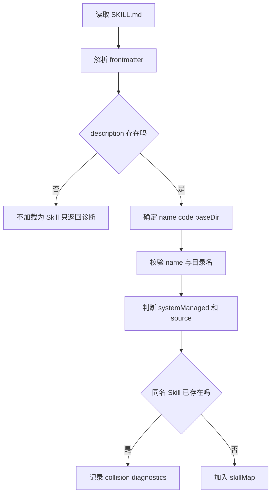

# E33：`SKILL.md` 怎样变成一个 `Skill` 对象

小林能在列表里看到“毕业旅行策划 Skill”，说明系统已经成功把磁盘上的 `SKILL.md` 变成了内存里的 `Skill` 对象。这个转换不是随便读 Markdown 文件，而是包含 frontmatter 解析、字段校验、来源分类、诊断记录和冲突处理。

本节精读 [packages/core/src/lib/integrations/pi-agent/core/skills.ts](../../../../packages/core/src/lib/integrations/pi-agent/core/skills.ts)。

## 1. `Skill` 对象的字段不是任意拼出来的

[packages/core/src/lib/integrations/pi-agent/core/skills.ts 第 30—53 行](../../../../packages/core/src/lib/integrations/pi-agent/core/skills.ts#L30) 定义了 frontmatter 和 `Skill`：

```ts
export interface SkillFrontmatter {
  name?: string;
  code?: string;
  description?: string;
  "disable-model-invocation"?: boolean;
  "originos-system"?: boolean | string;
  [key: string]: unknown;
}

export interface Skill {
  name: string;
  code?: string;
  description: string;
  filePath: string;
  baseDir: string;
  source: "bundled" | "user" | "project";
  disableModelInvocation: boolean;
  systemManaged?: boolean;
  outputDir?: string;
}
```

`name` 是 Skill 的逻辑名称；`code` 可作为另一个标识；`description` 用于列表和模型可见说明；`filePath` 指向 `SKILL.md`；`baseDir` 是技能源目录；`source` 表示来源；`outputDir` 是产物输出目录声明。读者要特别注意：`baseDir` 和 `outputDir` 不是一个字段。前者常用于读取参考文件，后者用于写产物。

## 2. frontmatter 解析是简单解析器，不是完整 YAML 引擎

[packages/core/src/lib/integrations/pi-agent/core/skills.ts 第 208—245 行](../../../../packages/core/src/lib/integrations/pi-agent/core/skills.ts#L208) 的 `parseFrontmatter` 使用正则切出 frontmatter，再按行解析 `key: value`：

```ts
const frontmatterRegex = /^---\r?\n([\s\S]*?)\r?\n---(?:\r?\n|$)([\s\S]*)$/;
const match = content.match(frontmatterRegex);

if (!match) {
  return { frontmatter: {} as T, body: content };
}

const frontmatter: T = frontmatterText.split(/\r?\n/).reduce((acc, line) => {
  const colonIndex = line.indexOf(":");
  if (colonIndex === -1) {
    return acc;
  }
  const key = line.slice(0, colonIndex).trim();
  const value = line.slice(colonIndex + 1).trim();
  acc[key] = value;
  return acc;
}, {} as Record<string, unknown>) as T;
```

这段代码给出一个重要边界：这里不是完整 YAML 解析器。它主要支持简单 `key: value`。如果读者在 `SKILL.md` 里写复杂嵌套 YAML，不应默认认为这里能正确解析。教材要如实讲源码能力，不能把“看起来像 YAML”扩大成“完整 YAML 支持”。

## 3. `loadSkillFromFile` 决定一个文件能不能成为 Skill

[packages/core/src/lib/integrations/pi-agent/core/skills.ts 第 250—305 行](../../../../packages/core/src/lib/integrations/pi-agent/core/skills.ts#L250) 是关键转换：

```ts
const rawContent = readFileSync(filePath, "utf-8");
const { frontmatter } = parseFrontmatter<SkillFrontmatter>(rawContent);
const skillDir = dirname(filePath);
const parentDirName = basename(skillDir);

const descErrors = validateDescription(frontmatter.description);
const name = frontmatter.name || parentDirName;
const code = frontmatter.code;
const nameErrors = validateName(name, parentDirName);

if (!frontmatter.description || frontmatter.description.trim() === "") {
  return { skill: null, diagnostics };
}

const systemManaged = isSystemSkillFrontmatter(frontmatter);
const effectiveSource = systemManaged ? "bundled" : source;

return {
  skill: {
    name,
    code,
    description: frontmatter.description,
    filePath,
    baseDir: skillDir,
    source: effectiveSource,
    disableModelInvocation: frontmatter["disable-model-invocation"] === true,
    systemManaged,
    outputDir: typeof frontmatter["outputDir"] === "string" ? frontmatter["outputDir"] : undefined,
  },
  diagnostics,
};
```

这段代码要分四步看：

1. 读取文件和 frontmatter。
2. 用父目录名校验 `name`。
3. 缺少 `description` 时不加载为 Skill，但会返回诊断。
4. 根据 `originos-system` 把系统托管 Skill 归类为 bundled。

如果小林的 `trip-planner/SKILL.md` 没有 description，它不会成为可用 Skill。系统不是“读不到文件”，而是“文件没有满足成为 Skill 的最低条件”。

## 4. 目录扫描不是无限制读取

[packages/core/src/lib/integrations/pi-agent/core/skills.ts 第 310—386 行](../../../../packages/core/src/lib/integrations/pi-agent/core/skills.ts#L310) 负责递归扫描目录。它会跳过隐藏项、跳过 `node_modules`、应用 `.gitignore` / `.ignore` / `.fdignore`，并区分根目录 Markdown 与子目录 `SKILL.md`：

```ts
if (entry.name.startsWith(".")) {
  continue;
}

if (entry.name === "node_modules") {
  continue;
}

const isRootMd = includeRootFiles && entry.name.endsWith(".md");
const isSkillMd = !includeRootFiles && entry.name.toLowerCase() === "skill.md";
if (!isRootMd && !isSkillMd) {
  continue;
}
```

这说明 Skill 加载器不是“把文件夹里所有 Markdown 都拿给模型”。它只承认特定位置和命名规则。这样的限制能减少误加载，但也带来调试点：文件名写成 `Skill.md` 可以被 `toLowerCase()` 支持；但文件放错层级，可能不会被扫描到。

## 5. 冲突处理：先到者获胜，后来者进诊断

[packages/core/src/lib/integrations/pi-agent/core/skills.ts 第 639—710 行](../../../../packages/core/src/lib/integrations/pi-agent/core/skills.ts#L639) 的 `loadSkills` 使用 `skillMap` 和 `realPathSet` 去重。如果两个不同路径加载出同名 Skill，第一个进入 map，后一个进入 collision diagnostics：

```ts
const existing = skillMap.get(skill.name);
if (existing) {
  collisionDiagnostics.push({
    type: "collision",
    message: `name "${skill.name}" collision`,
    path: skill.filePath,
    collision: {
      resourceType: "skill",
      name: skill.name,
      winnerPath: existing.filePath,
      loserPath: skill.filePath,
    },
  });
} else {
  skillMap.set(skill.name, skill);
  realPathSet.add(realPath);
}
```

这对排查很关键。如果小林有两个 `trip-planner`，系统不是随机使用一个；它会保留先加载的，并把冲突记录到 diagnostics。读者不能只看 UI 显示了 `trip-planner`，还要看它实际来自哪个 `filePath`。



这张图把 `SKILL.md` 到 `Skill` 对象的关键闸门串起来。最容易被忽略的是 `description`：它不是可有可无的介绍文字，而是决定文件能否被加载成 Skill 的最低字段。

| 判断点 | 通过后进入哪里 | 不通过时怎样 |
| --- | --- | --- |
| 文件能被读取 | 解析 frontmatter | 记录 warning，返回空 skill |
| `description` 存在 | 创建 `Skill` 对象 | 不加载为 Skill |
| `name` 规则合理 | 继续加载 | 记录 warning，但不一定阻止加载 |
| `originos-system` 为真 | `source` 改为 bundled | 保持原 source |
| 同名未冲突 | 加入 `skillMap` | 后来者进入 collision diagnostics |
| realpath 未重复 | 加入结果 | 重复路径跳过 |

这张表说明不同异常的严重程度不一样。缺少 description 会阻止加载；name 不匹配会形成 warning；同名冲突会保留先加载项并记录 collision。读者排查时不能把所有 diagnostics 都当成同一种失败。

## 6. 测试证据与缺口

`skills.test.ts` 覆盖了目录加载、Prompt 格式化、disabled skill 排除、同名相近 Skill 区分、materialized system skill 的 source 分类、Electron resources 下 bundled 路径解析。这些测试能证明核心加载器的若干边界。

但它没有证明复杂 YAML 能被完整支持，也没有证明所有 `.ignore` 组合都覆盖。根据源码，复杂 YAML 本来就不应被扩大承诺。

## 7. 小实验 / 练习与口头验收

小实验：判断下面这个文件能不能成为可用 Skill。

```md
---
name: trip-planner
---

帮助用户规划毕业旅行。
```

合格答案是：不能成为有效 Skill，因为缺少 `description`。正文虽然有说明，但 `loadSkillFromFile` 检查的是 frontmatter 的 `description` 字段。

口头验收：读者应能按顺序解释 `SKILL.md` 变成 `Skill` 对象的流程：读文件、解析 frontmatter、确定目录名、校验 name 和 description、判断 systemManaged、生成 `Skill`、把警告或冲突放进 diagnostics。

## 8. 本节小结

`SKILL.md` 不是被原样塞进列表。它要经过 frontmatter 解析、字段校验、目录扫描、来源分类和冲突处理，才会变成一个 `Skill` 对象。读者排查 Skill 不显示时，应先检查 description、name 与目录名、文件位置、source 过滤和 diagnostics。
