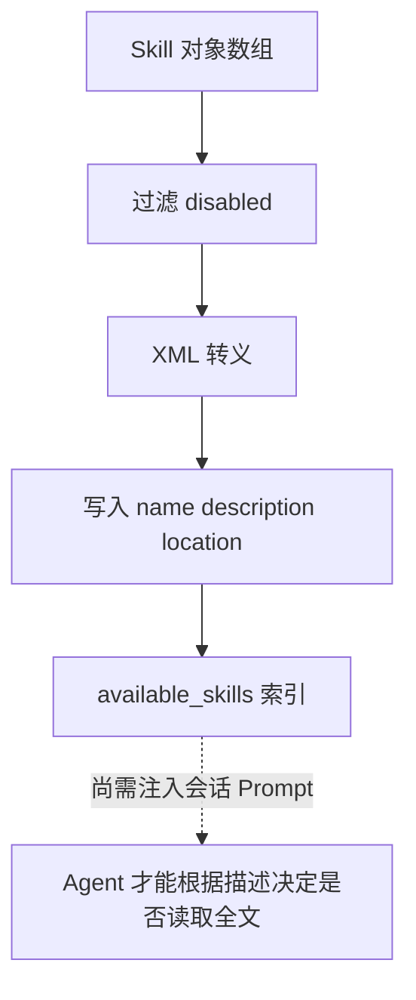

# E34：可用 Skill 怎样被格式化为 Prompt 索引，以及这条链在哪里尚未接通

Skill 有两种可能的上下文策略。第一种是“可用 Skill 索引”：把一批 Skill 的名称、描述和位置格式化成 Prompt 片段，让 Agent 知道遇到合适任务时可以读取对应说明书。第二种是 SkillDialog 主线：打开某个具体 Skill 后，把它的正文作为当前会话的系统指令。

这两种策略在仓库中并非都已形成完整生产链。`formatSkillsForPrompt` 已经能够生成索引，`SkillManager` 也能筛选索引内容；但是当前 middleware 的 session-start 分支没有把生成结果写入 session prompt。因而本课要同时讲清“格式化器已经做了什么”和“基础运行时尚未接通什么”，不能把函数存在误写成模型已经收到索引。

本节阅读 [packages/core/src/lib/integrations/pi-agent/core/skills.ts 第 400—441 行](../../../../packages/core/src/lib/integrations/pi-agent/core/skills.ts#L400) 和 [packages/core/src/lib/integrations/pi-agent/core/skills.middleware.ts 第 139—148、258—278 行](../../../../packages/core/src/lib/integrations/pi-agent/core/skills.middleware.ts#L139)。

## 1. Prompt 索引不是完整 Skill 正文

[packages/core/src/lib/integrations/pi-agent/core/skills.ts 第 416—441 行](../../../../packages/core/src/lib/integrations/pi-agent/core/skills.ts#L416) 定义了 `formatSkillsForPrompt`：

```ts
export function formatSkillsForPrompt(skills: Skill[]): string {
  const visibleSkills = skills.filter((s) => !s.disableModelInvocation);

  if (visibleSkills.length === 0) {
    return "";
  }

  const lines = [
    "\n\nThe following skills provide specialized instructions for specific tasks.",
    "Use the read tool to load a skill's file when the task matches its description.",
    "When a skill file references a relative path, resolve it against the skill directory.",
    "",
    "<available_skills>",
  ];

  for (const skill of visibleSkills) {
    lines.push("  <skill>");
    lines.push(`    <name>${escapeXml(skill.name)}</name>`);
    lines.push(`    <description>${escapeXml(skill.description)}</description>`);
    lines.push(`    <location>${escapeXml(skill.filePath)}</location>`);
    lines.push("  </skill>");
  }

  lines.push("</available_skills>");
  return lines.join("\n");
}
```

这段函数输出的是 XML 风格索引。它只放 `name`、`description`、`location`，不放完整正文。这样做有两个好处：Prompt 不会被所有 Skill 正文撑爆；Agent 仍然知道“如果任务匹配，可以用 read tool 读取具体文件”。

对小林来说，这相当于 Agent 先拿到一张“技能目录卡”：有旅行规划、预算整理、路线生成等能力的位置，但不会在每次对话开始时把所有说明书全文塞进上下文。

## 2. disabled Skill 不进入模型可见索引

函数第一行 `skills.filter((s) => !s.disableModelInvocation)` 决定了一个边界：`disable-model-invocation` 的 Skill 不会被放入模型可见索引。

这不等于文件不能存在，也不等于接口不能查询详情。它只表示“不作为模型可主动调用的能力提示”。很多初学者会把“列表里没有”理解成“系统里没有”，这是错误的。

## 3. XML 转义保护 Prompt 结构

`formatSkillsForPrompt` 调用了 `escapeXml`。 [packages/core/src/lib/integrations/pi-agent/core/skills.ts 第 400—410 行](../../../../packages/core/src/lib/integrations/pi-agent/core/skills.ts#L400) 会转义 `&`、`<`、`>`、引号和单引号：

```ts
function escapeXml(str: string): string {
  return str
    .replace(/&/g, "&amp;")
    .replace(/</g, "&lt;")
    .replace(/>/g, "&gt;")
    .replace(/"/g, "&quot;")
    .replace(/'/g, "&apos;");
}
```

这一步不是装饰。假设某个 Skill 的描述里写了 `<skill>破解预算</skill>`，如果不转义，它可能破坏 `<available_skills>` 的结构。转义后，它只是一段普通文本。



实线表示当前格式化器已经完成的步骤，虚线表示仍需调用方接通的步骤。Prompt 索引的目的不是执行 Skill，而是让 Agent 知道“有哪些说明书值得去读”；但只有索引字符串被真正追加到当前 session prompt 后，模型才可能看到它。

## 4. SkillManager 是索引和开关的管理层

[packages/core/src/lib/integrations/pi-agent/core/skills.middleware.ts 第 27—173 行](../../../../packages/core/src/lib/integrations/pi-agent/core/skills.middleware.ts#L27) 定义了 `SkillManager`。它会加载 Skill、保存 registry、记录 diagnostics，并提供 enable/disable、配置更新、usage 统计等方法。

其中 [packages/core/src/lib/integrations/pi-agent/core/skills.middleware.ts 第 139—148 行](../../../../packages/core/src/lib/integrations/pi-agent/core/skills.middleware.ts#L139) 的 `getSkillsForPrompt` 与本节直接相关：

```ts
getSkillsForPrompt(): string {
  const skills = Array.from(this.skills.values()).filter((skill) => {
    const entry = this.registry.get(skill.name);
    return (entry?.enabled ?? true) && !skill.disableModelInvocation;
  });
  return formatSkillsForPrompt(skills);
}
```

这里比 `formatSkillsForPrompt` 又多了一层 `enabled` 开关。准确说法是：**候选索引**中的 Skill 既要没有 `disableModelInvocation`，也要在 registry 中处于 enabled 状态。只有调用方把候选索引注入 prompt，候选才会成为模型可见内容。

## 5. middleware 计算了索引，但没有完成注入

[packages/core/src/lib/integrations/pi-agent/core/skills.middleware.ts 第 258—278 行](../../../../packages/core/src/lib/integrations/pi-agent/core/skills.middleware.ts#L258) 返回一个 middleware 对象。最关键的 `onSessionStart` 当前是：

```ts
onSessionStart(_session: AgentSession): void {
  const skillsPrompt = skillManager.getSkillsForPrompt();
  if (skillsPrompt) {
    // Inject skills into system prompt or context
    // This depends on how sessions are configured
  }
}
```

函数确实加载并格式化了 `skillsPrompt`，但 `if` 内只有注释，没有对 `_session` 或 system prompt 的写操作。全仓库检索也没有发现 `createSkillMiddleware` 的生产调用者；`createSkillManager` 的直接调用集中在本文件和测试中。由当前源码能够得出的结论是：

| 可以确认 | 不能确认 |
| --- | --- |
| Skill 索引格式化器已经实现 | 普通 `OriginOSAgent` 每次启动都会收到索引 |
| registry enabled 与 `disableModelInvocation` 会影响候选集合 | middleware 已把候选集合写入 session |
| 单元测试可以直接调用这些函数 | 首页 SkillDialog 依赖这条 middleware 路径 |

这不是在否定函数价值，而是在区分“能力组件已经存在”和“生产调用链已经闭合”。如果未来完成接线，应新增明确的 prompt 合并函数，并用集成测试断言 session 最终收到的 system prompt，而不能只断言格式化器返回了字符串。

## 6. 索引策略和直接打开 Skill 的区别

| 场景 | 放进 Prompt 的内容 | Agent 怎么用 |
| --- | --- | --- |
| 可用 Skill 索引 | Skill 名称、描述、位置 | 接线完成后，任务匹配时再读取具体文件 |
| SkillDialog 打开具体 Skill | 当前 Skill 正文和运行规则 | 当前会话直接按这份 Skill 工作 |

这两个场景都叫 Skill，但上下文策略完全不同。前者是“目录”；后者是“当前说明书”。如果把两者混淆，读者会误以为所有 Skill 正文都会同时进入模型，或者误以为点击某个 Skill 只是告诉模型“可用列表里有它”。

## 7. 测试证据与缺口

[packages/core/src/lib/integrations/pi-agent/__tests__/skills.test.ts 第 45—110 行](../../../../packages/core/src/lib/integrations/pi-agent/__tests__/skills.test.ts#L45) 覆盖 `formatSkillsForPrompt` 的基本输出、空列表返回空字符串、全部 disabled 时返回空字符串，以及 disabled Skill 不进入格式化结果。这证明索引格式和候选过滤有单元测试。

测试没有证明 middleware 已把字符串注入真实 session，更没有证明模型一定会正确选择 Skill。需要补充的最小证据包括：middleware 被生产入口创建；session-start 后最终系统提示词包含索引；disabled Skill 不出现在最终提示词；模型选中 Skill 后能通过受限读取工具取得正文。

## 8. 小实验与口头验收

小实验：如果有三个 Skill，其中两个正常，一个 `disable-model-invocation: true`，`formatSkillsForPrompt` 会输出几个 `<skill>` 节点？合格答案是两个。disabled 的 Skill 文件可以存在，但不会进入模型可见索引。

口头验收还应回答：为什么 `formatSkillsForPrompt()` 返回非空字符串，仍不能证明模型看到了它？答案必须指出调用者需要把字符串写入最终 session prompt，而当前 middleware 分支尚未执行这一步。

## 9. 本节小结

`formatSkillsForPrompt` 能把可用 Skill 格式化成适合写入 Prompt 的索引，而不是执行 Skill。它过滤 disabled Skill，转义 XML 字符，只保留名称、描述和位置。当前基础 middleware 只计算了这个索引，尚未把它注入 session；真正已形成会话主链的是后续 SkillDialog 的内容加载与系统提示词构建。读源码时必须把“函数实现”“生产接线”“模型行为”分成三层。
