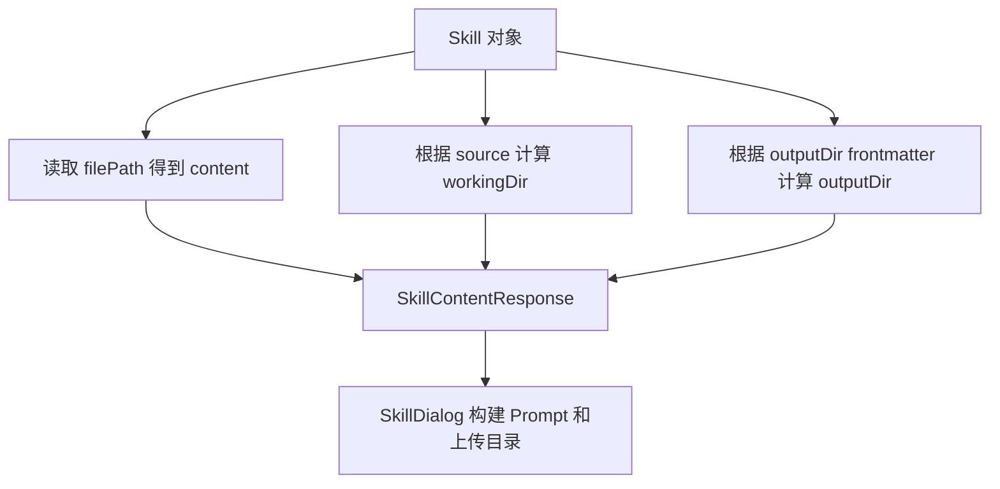
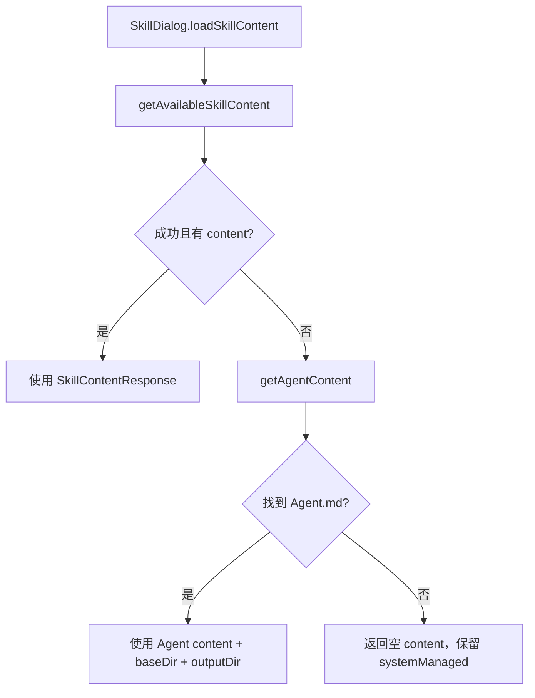

# E35：Skill 内容返回的不只是 Markdown

小林打开“毕业旅行策划 Skill”时，前端调用内容接口读取 `SKILL.md`。如果接口只返回 Markdown 正文，系统仍然不够用。Agent 还需要知道：技能源目录在哪里、工作目录在哪里、产物输出目录在哪里、这个 Skill 是否系统托管。否则下一轮读参考文件、写旅行计划、上传附件都会失去边界。

本节阅读 [packages/core/src/lib/features/skills/service.ts 第 35—47、171—209、488—510 行](../../../../packages/core/src/lib/features/skills/service.ts#L35) 的内容服务，并追踪它怎样跨过 Web API 边界。

## 1. 内容响应包含目录信息

[packages/core/src/lib/features/skills/service.ts 第 35—47 行](../../../../packages/core/src/lib/features/skills/service.ts#L35) 定义了 `SkillContentResponse`：

```ts
export interface SkillContentResponse {
  content: string;
  baseDir: string;
  /** 技能工作目录（CWD，用于 bash 执行和认知文件写入） */
  workingDir: string;
  /** 产物输出目录（用于创建 Agent 等产物） */
  outputDir: string;
  /** 系统内置技能不允许作为用户技能导出 */
  systemManaged: boolean;
  frontmatter?: SkillFrontmatter;
}
```

这几个字段承担不同责任：

| 字段 | 责任 | 不能误认为 |
| --- | --- | --- |
| `content` | `SKILL.md` 原始内容 | 不是运行时对象 |
| `baseDir` | 技能源目录 | 不一定可写产物 |
| `workingDir` | Agent 工具默认工作目录 | 不一定等于源目录 |
| `outputDir` | 产物输出目录 | 不一定等于 `baseDir` |
| `systemManaged` | 系统托管标记 | 不是普通 UI 标签 |

## 2. bundled Skill 的工作目录会落到数据目录

[packages/core/src/lib/features/skills/service.ts 第 171—180 行](../../../../packages/core/src/lib/features/skills/service.ts#L171) 的 `resolveSkillWorkingDirectory` 决定工作目录：

```ts
function resolveSkillWorkingDirectory(skill: Skill): string {
  const skillCode = skill.code ?? skill.name;
  const dir = skill.source === 'bundled'
    ? path.join(getDataRoot(), 'skills', skillCode)
    : skill.baseDir;
  if (!existsSync(dir)) {
    mkdirSync(dir, { recursive: true });
  }
  return dir;
}
```

这里的规则非常关键：bundled Skill 的源定义可能来自模板目录或应用资源目录，这些位置不应该写用户产物。因此系统把 bundled Skill 的工作目录指向 `data/skills/{skillCode}`。非 bundled Skill 则使用自己的 `baseDir`。

对小林来说，毕业旅行 Skill 的说明书可以来自系统内置目录；但小林生成的行程表应该写到数据目录，而不是写回系统模板目录。

## 3. outputDir 可以由 frontmatter 改写

[packages/core/src/lib/features/skills/service.ts 第 182—209 行](../../../../packages/core/src/lib/features/skills/service.ts#L182) 负责解析 `outputDir`：

```ts
function resolveOutputDirFromFrontmatter(outputDir: string): string {
  if (path.isAbsolute(outputDir)) {
    return outputDir;
  }

  const normalized = outputDir.replace(/\\/g, '/').replace(/^\.?\//, '').replace(/\/+$/, '');
  if (normalized === 'data') {
    return getDataRoot();
  }
  if (normalized.startsWith('data/')) {
    return path.join(getDataRoot(), normalized.slice('data/'.length));
  }
  return path.join(getDataRoot(), normalized);
}

function resolveSkillOutputDir(skill: Skill): string {
  const workingDir = resolveSkillWorkingDirectory(skill);
  if (skill.outputDir) {
    return resolveOutputDirFromFrontmatter(skill.outputDir);
  }
  return workingDir;
}
```

这段代码说明 `outputDir` 有自己的规则。它可以是绝对路径，也可以是以 `data/` 开头的运行时数据根路径，还可以是普通相对路径。没有声明时，默认等于 workingDir。

这里还存在一项必须直说的信任边界：绝对路径会被原样返回，普通相对路径会拼到 data root，但函数没有调用 `path.relative` 或其他边界检查确认结果仍位于允许的数据目录。也就是说，`resolveSkillOutputDir` 是路径解释器，不是完整的路径授权器。系统托管 Skill 的 frontmatter 可以由项目维护者控制；若未来允许不受信任的用户 Skill 自由声明绝对 `outputDir`，还需要在加载、授权或工具执行层增加限制。不能把“解析成功”写成“这个目录一定安全可写”。

## 4. `getSkillContent` 把正文和目录一起返回

[packages/core/src/lib/features/skills/service.ts 第 488—510 行](../../../../packages/core/src/lib/features/skills/service.ts#L488) 是内容服务主干：

```ts
export function getSkillContent(request: SkillContentRequest): SkillContentResponse {
  const skill = findSkillForContent(request.name);

  if (!skill) {
    throw new SkillServiceError('NOT_FOUND', `Skill "${request.name}" not found`, 404);
  }

  const content = readFileSync(skill.filePath, 'utf-8');
  const workingDir = resolveSkillWorkingDirectory(skill);
  const outputDir = resolveSkillOutputDir(skill);
  const response: SkillContentResponse = {
    content,
    baseDir: skill.baseDir,
    workingDir,
    outputDir,
    systemManaged: skill.systemManaged === true,
  };
}
```

注意 `content` 使用 `readFileSync(skill.filePath)` 读的是源文件；`workingDir` 和 `outputDir` 则是根据来源和 frontmatter 计算出来的运行目录。`readFileSync`、`mkdirSync` 都是同步文件系统操作；当前函数运行在服务端边界，不应被浏览器组件直接导入。内容和目录在同一个响应里返回，是为了让前端构建系统提示词和上传路径时有完整信息。



这张图说明内容接口不是“Markdown 下载接口”。它是 Skill 会话初始化前的上下文准备接口。

## 5. Web route 决定返回正文还是完整目录合同

[packages/web/src/app/api/skills/[name]/content/route.ts 第 39—92 行](../../../../packages/web/src/app/api/skills/%5Bname%5D/content/route.ts#L39) 调用 `getSkillContent`，再依据 `format` 查询参数分成两种响应：

| 请求 | 响应 | 能否得到目录字段 |
| --- | --- | --- |
| 默认 `format=raw` | `text/markdown`，只返回 `data.content` | 不能 |
| `format=json` | `{ success, data, timestamp }` | 能得到 `baseDir`、`workingDir`、`outputDir` 等 |

route 注释中的“Get raw markdown content”只描述默认分支，不能概括 JSON 分支。SkillDialog 若需要构建完整会话上下文，必须走能返回 `SkillContentResponse` 的适配路径；只下载 Markdown 正文无法获得目录合同。

错误响应也保持相同分叉：raw 请求返回纯文本错误，JSON 请求返回结构化错误对象。客户端解析方式必须与请求格式一致，不能总是假设响应是 JSON。

## 6. `SkillDialog` 还有一条 Agent 内容 fallback

`SkillDialog` 的加载顺序位于 [packages/web/src/components/skills/SkillDialog.tsx 第 65—97 行](../../../../packages/web/src/components/skills/SkillDialog.tsx#L65)。它先调用 `getAvailableSkillContent` 读取普通 Skill；失败或没有正文时，再调用 `getAgentContent(skillName)`。第二条路径用于“以 Skill 入口启动的 Role Agent”等内容，不是同一个 skills content API 的重复请求。



图中的 fallback 改变了“内容来自哪里”，也改变了目录合同。普通 Skill 路径可能返回 `workingDir` 和 `systemManaged`；Agent 内容合同中的 `workingDir` 是可选字段。`SkillDialog` 不能假设两条路径字段完全相同，它只能在可用字段基础上构建 prompt 和会话目录。

## 7. Agent 内容 fallback 在 Web 与 Electron 中各有入口

renderer 适配函数位于 [packages/core/src/lib/integrations/electron/services/agent-session.ts 第 346—357 行](../../../../packages/core/src/lib/integrations/electron/services/agent-session.ts#L346)：Web 环境请求 `/api/agents/{id}?format=json`，Electron 环境 invoke `AGENT_CONTENT_GET`。

Web Route 在 [packages/web/src/app/api/agents/[id]/route.ts 第 71—148 行](../../../../packages/web/src/app/api/agents/%5Bid%5D/route.ts#L71) 先查 `data/agents/{id}/Agent.md`，再回退到 `.claude/skills/{id}/Agent.md`。JSON 响应包含 `content`、实际定义所在的 `baseDir`，以及始终指向 `data/agents/{id}` 的 `outputDir`。这保持了“定义可来自只读目录，产物仍写到数据目录”的原则。

Electron 主进程的同类 handler 位于 [packages/desktop/src/main/services/agent-session-service.ts 第 887—935 行](../../../../packages/desktop/src/main/services/agent-session-service.ts#L887)，使用相同的目录优先级与 outputDir 规则。两端当前都没有返回明确 `workingDir`，而接口把它声明为可选。因此，fallback 成功只能确认正文、源目录和产物目录，不能凭普通 Skill 合同补造一个工作目录。

| 入口 | 首选定义 | fallback 定义 | outputDir | workingDir |
| --- | --- | --- | --- | --- |
| 普通 Skill content | data/user/project/bundled Skill 解析结果 | materialize bundled Skill | 由 Skill 规则计算 | 必填 |
| Web Agent content | `data/agents/{id}/Agent.md` | `.claude/skills/{id}/Agent.md` | `data/agents/{id}` | 当前未返回 |
| Electron Agent content | `data/agents/{id}/Agent.md` | `.claude/skills/{id}/Agent.md` | `data/agents/{id}` | 当前未返回 |

这张表说明“SkillDialog 最后拿到了 content”还不够。调试工作目录时，必须先判断命中了普通 Skill 还是 Agent fallback，再看该合同实际提供哪些目录字段。

## 8. materialize：系统 Skill 打开时可能先复制到数据目录

[packages/core/src/lib/features/skills/service.ts 第 263—274 行](../../../../packages/core/src/lib/features/skills/service.ts#L263) 的 `findSkillForContent` 有一个特殊逻辑：

```ts
const dataSkill = loadSkillFromDirectory(path.join(getSkillsDataDir(), name), 'user').skill;
if (dataSkill) {
  return dataSkill;
}

const skill = findSkill(name);
if (skill?.systemManaged) {
  return materializeBundledSkill(skill.code ?? skill.name) ?? skill;
}
return skill ?? materializeBundledSkill(name) ?? undefined;
```

它会先看数据目录里是否已经有同名 Skill；如果找不到，再看普通加载结果；系统托管 Skill 会尝试 materialize 到数据目录。这样做是为了让打包态、系统模板和运行时数据目录之间有明确边界。

## 9. 测试证据与缺口

`service.test.ts` 覆盖了 Windows 兼容路径下按目录名读取已有 data skill，以及从 Electron resources materialize bundled skill 后返回内容。`skill-output-dir.test.ts` 覆盖了 bundled skill 返回 `data/skills/{name}` 作为 outputDir、项目 skill 保留自己的 baseDir 等目录规则。

这些测试证明目录解析核心规则存在，但不证明所有真实 Skill 的 frontmatter 都写得正确，也没有证明任意绝对 `outputDir` 都符合授权策略。内容 route 还需要覆盖 raw/JSON 成功和错误四个分支，避免客户端按错误内容类型解析。

当前也没有发现同时驱动 `SkillDialog → getAgentContent → Web Route/Electron IPC` 的直接集成测试。因此源码可以证明两条 fallback 已存在，不能证明 Web 与 Electron 返回字段永远保持一致，也不能证明 fallback 后的上传和工具 CWD 正确。测试应分别构造 `data/agents` 命中、`.claude/skills` 回退、两者缺失和平台切换四类场景。

## 10. 小实验与口头验收

纸面推演：一个 bundled Skill 的 `baseDir` 在 `templates/skills/trip-planner`，没有声明 `outputDir`。它的 workingDir 应该在哪里？合格答案是：`data/skills/{skillCode}`，而不是模板目录。因为 bundled Skill 的源目录不能作为用户产物目录。

口头验收：读者应能解释 `baseDir`、`workingDir`、`outputDir` 的区别，并说明路径解析为什么不等于路径授权；还应能判断默认 raw 响应为什么不足以初始化完整 Skill 会话，以及 Agent fallback 为什么不能凭空补出 `workingDir`。

## 11. 本节小结

普通 Skill 内容接口返回的不只是 `SKILL.md` 正文，还返回源目录、工作目录、输出目录和系统托管标记。`SkillDialog` 在普通 Skill 加载失败时还会进入 Agent 内容 fallback，Web 与 Electron 分别通过 Route 和 IPC 提供正文、源目录与输出目录。目录合同取决于实际命中的路径，不能把一条入口的字段假定为另一条入口也必然存在。
