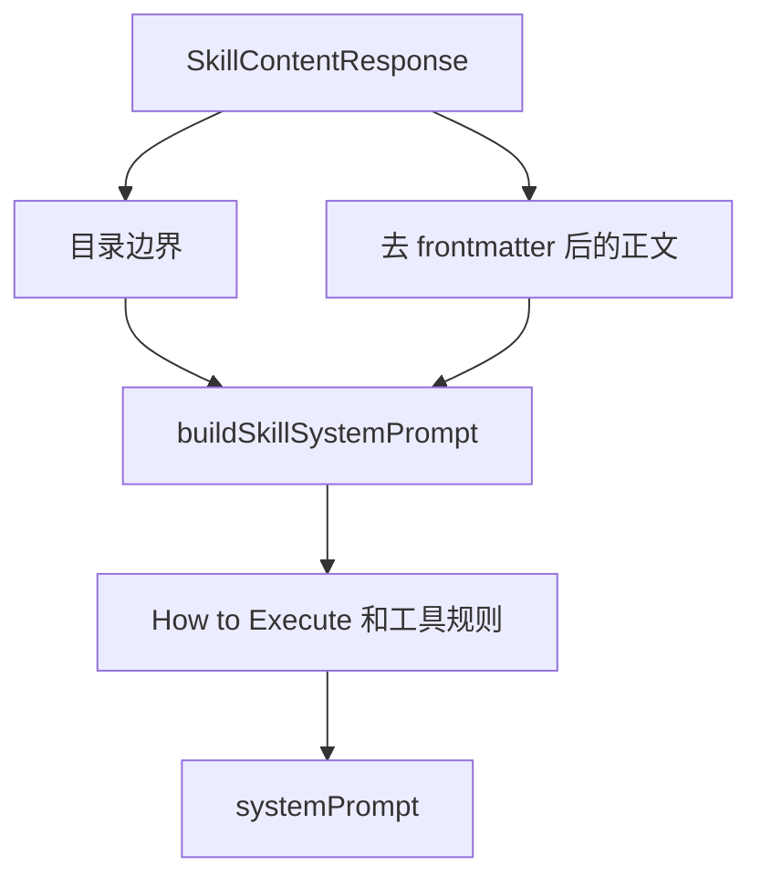

# E36：SkillDialog 把 Skill 正文变成当前会话的系统提示词

到 E35 为止，系统已经拿到了 `SKILL.md` 内容、技能源目录、工作目录和输出目录。但这些信息还没有进入 Agent。E36 要讲的是 SkillDialog 如何把它们组合成当前会话的 `systemPrompt`，再调用 `initialize` 创建 Pi Agent 会话。

本节精读 [packages/web/src/components/skills/SkillDialog.tsx 第 103—221、450—525 行](../../../../packages/web/src/components/skills/SkillDialog.tsx#L103) 的 `buildSkillSystemPrompt` 和初始化 effect。

## 1. 系统提示词先注入目录边界

[packages/web/src/components/skills/SkillDialog.tsx 第 103—136 行](../../../../packages/web/src/components/skills/SkillDialog.tsx#L103) 的 `buildSkillSystemPrompt` 先处理工作目录、输出目录和技能源目录：

```ts
if (workDir) {
  lines.push(`Working directory: ${workDir}`);
  lines.push('All bash commands and cognitive files (Memory.md, practice/) are resolved from this directory.');
}

if (outputDir && outputDir !== workDir) {
  lines.push(`Output directory for artifacts: ${outputDir}`);
  lines.push('Use `${OUTPUT_DIR}` in shell commands only when you need the native absolute artifact directory.');
}

if (skillDir) {
  lines.push(`Skill assets directory: ${skillDir}`);
  lines.push('Use this directory to read reference files and templates only. Do NOT write output files here.');
  lines.push('You can use ${CLAUDE_SKILL_DIR} in shell commands to reference this directory.');
}
```

这段代码把三个目录直接写进 Prompt。原因很实际：Agent 执行任务时需要知道哪里能读、哪里能写。对于小林的旅行 Skill，参考模板可能在技能源目录，生成的行程文档应写到输出目录，认知文件和 bash 默认路径应从工作目录解析。

## 2. Skill 正文会去掉 frontmatter 后进入指令区

[packages/web/src/components/skills/SkillDialog.tsx 第 138—163 行](../../../../packages/web/src/components/skills/SkillDialog.tsx#L138) 解析 frontmatter，并把正文放进 `## Skill Instructions`：

```ts
const frontmatterMatch = skillContent.match(/^---\n([\s\S]*?)\n---/);
let displayName = skillName;
if (frontmatterMatch?.[1]) {
  const nameMatch = frontmatterMatch[1].match(/^name:\s*(.+)$/m);
  if (nameMatch?.[1]) displayName = nameMatch[1].trim();

  const descMatch = frontmatterMatch[1].match(/^description:\s*(.+)$/m);
  if (descMatch?.[1]) displayName = descMatch[1].trim();
}

const bodyWithoutFrontmatter = frontmatterMatch
  ? skillContent.slice(frontmatterMatch[0].length).trim()
  : skillContent;

lines.push(`You are ${displayName}.`);
lines.push('## Skill Instructions');
lines.push(bodyWithoutFrontmatter);
```

这里有一个容易忽略的源码细节：如果存在 `description`，代码会把 `displayName` 改成 description。也就是说 `You are ...` 里可能出现描述文本，而不一定是 `name`。当前行为不能概括为“只使用 name”。

## 3. 变量替换发生在字符串构建末尾

[packages/web/src/components/skills/SkillDialog.tsx 第 208—220 行](../../../../packages/web/src/components/skills/SkillDialog.tsx#L208) 最后对完整字符串执行两次全局替换：

```ts
if (skillDir) {
  result = result.replace(/\$\{CLAUDE_SKILL_DIR\}/g, skillDir);
}
if (outputDir) {
  result = result.replace(/\$\{OUTPUT_DIR\}/g, outputDir);
}
```

因为替换作用于已经拼好的整份文本，所以占位符不仅会在通用目录说明中被替换，也会在 Skill 正文中被替换。这个行为方便 Skill 作者引用目录，但也形成一项模板合同：Skill 正文中出现同名字面量时，同样会被改写。若 `skillDir` 或 `outputDir` 缺失，对应占位符不会被清空，而可能继续留在最终提示词里。

这里的替换只改变模型看到的文字，不会设置 Shell 环境变量。模型后来把绝对路径写进 `execute_command` 参数，与操作系统中真实存在 `$OUTPUT_DIR` 是两回事。文件工具是否允许该路径，还要经过工具上下文和路径边界检查。

## 4. 运行规则也被追加进 Prompt

[packages/web/src/components/skills/SkillDialog.tsx 第 165—220 行](../../../../packages/web/src/components/skills/SkillDialog.tsx#L165) 继续追加执行规则、工具调用规则、网络访问和用户沟通规则。这些内容不是 Skill 作者写在 `SKILL.md` 里的正文，而是 SkillDialog 为会话补上的通用运行约束。

| Prompt 区块 | 作用 |
| --- | --- |
| `How to Execute` | 要求理解意图、判断操作类型、给出过程和结果 |
| `Tool Execution Rules` | 要求需要工具时直接调用，不把工具执行确认抛给用户 |
| `Network Access` | 告知外部网络访问授权 |
| `User Communication Rules` | 要求对用户隐藏内部实现细节 |

这说明 Skill 会话的 system prompt 是“目录边界 + Skill 正文 + 通用运行规则”的组合，而不是 `SKILL.md` 的简单复制。

还要区分“提示词授权”与“程序授权”。这份文本写着允许通过 `execute_command` 访问外部网络，并要求工具调用前不要反复征求确认；但文字不能绕过工具注册、scope、路径校验、进程权限或运行环境限制。安全边界若只存在于 Prompt，模型偏离指令时就没有程序兜底。E41—E54 会继续检查真实工具层负责哪些限制。



图里的 `systemPrompt` 是 Agent 当前会话的行为基础。后续小林发送“帮我生成三天行程”时，模型看到的不是按钮配置，而是这份组合后的系统提示词。

## 5. 初始化 effect 把 prompt 传给 `initialize`

[packages/web/src/components/skills/SkillDialog.tsx 第 470—498 行](../../../../packages/web/src/components/skills/SkillDialog.tsx#L470) 是会话初始化的核心：

```ts
const content = skillData?.content ?? '';
const skillDir = skillData?.baseDir;
const agentWorkDir = skillData?.workingDir ?? skillData?.outputDir ?? skillDir;
const outputDir = skillData?.outputDir;
currentSkillDirRef.current = agentWorkDir ?? skillDir;
const systemPrompt = buildSkillSystemPrompt(currentSkill, content, skillDir, agentWorkDir, outputDir);

const llmConfig = normalizeRuntimeLLMConfig(getEffectiveConfig());

await initialize(
  effectiveSessionId,
  {
    projectId: `skill-${currentSkill}`,
    projectName: `技能: ${currentSkill}`,
  },
  {
    agentType: 'skill',
    systemPrompt,
    ...(agentWorkDir && { agentBaseDir: agentWorkDir }),
    ...(outputDir && { outputDir }),
  },
  llmConfig
);
```

这段代码把 Skill 接入前面单元讲过的会话创建链路。`projectId` 采用 `skill-${currentSkill}`，`agentType` 是 `skill`，`agentBaseDir` 来自工作目录，`outputDir` 单独传入变量，模型配置来自设置页的有效配置。

`initialize` 后还有一道并发保护。 [packages/web/src/components/skills/SkillDialog.tsx 第 499—524 行](../../../../packages/web/src/components/skills/SkillDialog.tsx#L499) 再次检查 `transitionGuardRef.current.isCurrent(initializationToken)`；如果用户在等待期间已经切换 Skill 或会话，旧初始化结果会直接停止，不再覆盖当前 UI。初始化成功与“该结果仍属于当前选择”是两个条件。

## 6. 初始化不是发送用户消息

初始化只创建会话和运行时上下文。它不会自动替小林说“帮我规划旅行”。如果有 `initialMessage`，后续 effect 会按自动启动规则发送；普通情况下，小林还要在输入框里发第一条消息。

这一区分很重要。`systemPrompt` 是 Agent 的行为背景，不是用户请求。用户消息才是一轮 turn 的输入。把两者混淆，会导致读者误以为“打开 Skill 就是在执行任务”。

## 7. 失败路径：Prompt 组装错会造成什么后果

SkillDialog 的初始化链路看起来只是字符串拼接，但这里的错误会直接变成运行时问题。

| 错误位置 | 可能后果 | 为什么不是小问题 |
| --- | --- | --- |
| `skillData.content` 为空 | Agent 只能使用通用助手提示 | Skill 的专业流程没有进入模型 |
| `skillDir` 缺失 | `${CLAUDE_SKILL_DIR}` 无法指向源材料 | Agent 读取参考文件和模板时失去定位 |
| `agentWorkDir` 缺失 | `agentBaseDir` 不会传给 `initialize` | 后续工具相对路径可能退回默认目录 |
| `outputDir` 缺失 | 产物目录提示和变量不完整 | 生成文件可能写到工作目录或错误目录 |
| `lastInitRef` 判断错误 | 重复初始化或跳过应初始化的会话 | 用户可能看到历史被清空或 Skill 未切换 |

这张表说明，Prompt 组装不是“文案问题”。它同时承载行为指令、目录边界和会话初始化变量。对小林来说，最直观的失败不是代码报错，而是旅行 Skill 变成普通聊天助手，或者行程文件写到不该写的位置。

## 8. 两份 Prompt 构建器并不完全相同

仓库还在 [packages/core/src/lib/features/services/launcher/skill.ts 第 134—245 行](../../../../packages/core/src/lib/features/services/launcher/skill.ts#L134) 实现了另一份 `buildSkillSystemPrompt`。它服务于 launcher，而不是 React `SkillDialog`。两者有相似目标，但当前文本并不等价：

| 维度 | `SkillDialog` 构建器 | launcher 构建器 |
| --- | --- | --- |
| frontmatter 身份 | `description` 会覆盖前面读到的 `name` | 只用 `name` 更新展示名 |
| 依赖信息 | 没有构造依赖安装区 | 注入 dependencies 与 prerequisites |
| 可用工具说明 | 只有通用工具规则 | 还加入 `buildSkillToolsSection()` 的工具清单 |
| 工作目录参数 | `skillDir`、`workDir`、`outputDir` 都可选 | 工作目录和源目录为必填参数 |
| 调用环境 | React Skill 对话窗口 | core launcher |

因此，“两个函数名称相同”不等于行为已经复用。任何一边新增规则，都可能造成另一条入口漂移。长期更稳妥的方向是把纯字符串构建逻辑下沉到共享层，由两个入口传入差异化参数；这只是改进方向，不是当前源码已经实现的事实。

## 9. 测试证据与缺口

[packages/core/src/lib/features/services/launcher/__tests__/skill-launcher.test.ts](../../../../packages/core/src/lib/features/services/launcher/__tests__/skill-launcher.test.ts) 证明 launcher 路径下 system prompt 会包含 Skill 内容、会替换 `${OUTPUT_DIR}`，并且不会注入 MSYS 风格路径。 [packages/core/src/lib/integrations/pi-agent/__tests__/skill-output-dir.test.ts](../../../../packages/core/src/lib/integrations/pi-agent/__tests__/skill-output-dir.test.ts) 证明输出目录规则。它们不直接执行 `SkillDialog` 中的私有构建器，因此不能用来证明 React 入口与 launcher 入口完全一致。

如果要补测试，应直接覆盖：给定 content、baseDir、workingDir、outputDir，`buildSkillSystemPrompt` 是否包含目录约束、是否去掉 frontmatter、是否替换变量、是否保留 Skill 正文。

还应补充一组“同输入、双入口”的合同测试：给两个构建器相同 Skill 正文和目录，明确哪些输出必须一致、哪些差异是有意设计。否则重复实现会在单边修改后无声漂移。

## 10. 小实验与口头验收

纸面推演：`skillData` 只有 `baseDir`，没有 `workingDir` 和 `outputDir`，`agentWorkDir` 会是什么？合格答案是：会退回 `skillDir`，因为代码使用 `workingDir ?? outputDir ?? skillDir`。但读者也应指出，对 bundled Skill 来说更理想的是内容接口已经返回 `workingDir`，避免写入源目录。

口头验收：读者应能说明 SkillDialog 初始化时传给 `initialize` 的四类信息：会话 ID、项目上下文、运行变量、模型配置；还能解释 Prompt 中写有路径或网络授权，为什么不等于操作系统和工具层已经放行。

## 11. 本节小结

SkillDialog 把 `SKILL.md` 正文、目录边界和通用运行规则组合成 `systemPrompt`，替换目录占位符，再通过 `initialize` 创建 `agentType: 'skill'` 的 Pi Agent 会话。初始化结果只有仍属于当前切换令牌时才能进入 UI。仓库中的 launcher 还有另一份并不完全相同的构建器；读者必须分别判断两条入口，不能用其中一条的测试替另一条作证。
