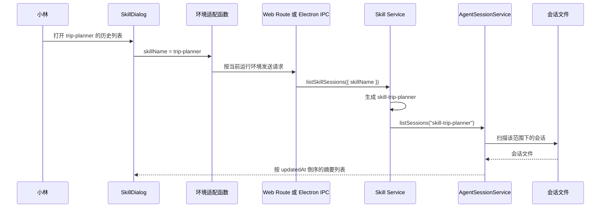
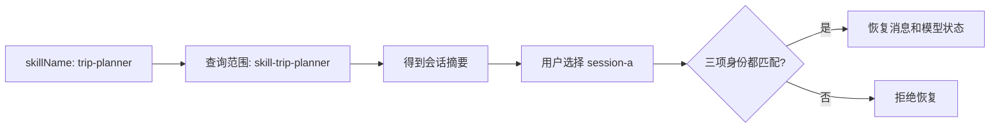

# E37：Skill 历史会话为什么使用 `skill-${name}` 作为项目范围

小林昨天用“毕业旅行策划” Skill 讨论了城市、预算和交通，今天重新打开 Skill，希望继续昨天的对话。系统要完成的并不只是“读取几个 JSON 文件”，而是回答三个不同的问题：

1. 应当去哪个会话范围里寻找历史？
2. 历史列表需要返回哪些摘要信息？
3. 点击某条历史以后，怎样证明它确实属于当前 Skill？

这三个问题分别对应**查找范围、列表合同和恢复归属**。如果把它们混为一谈，就容易出现“列表里能看到，点击却恢复失败”，或者“文件明明存在，列表却为空”的现象。

本节会从 `trip-planner` 这个具体输入出发，沿着 UI、环境适配、Web/Electron 边界、core service 和会话存储逐层推演。读完以后，读者应当能够独立定位 Skill 历史会话问题，而不只是记住一个字符串模板。

## 1. 先分清四个容易混淆的名字

假设毕业旅行 Skill 的名称是 `trip-planner`，四个字段的含义如下。

| 字段 | 本例中的值 | 它回答的问题 | 主要使用者 |
| --- | --- | --- | --- |
| `skillName` | `trip-planner` | 当前要列出哪个 Skill 的历史？ | 列表接口 |
| `entryType` | `skill` | 用户从哪一类入口进入？ | 恢复归属校验 |
| `entryId` | `trip-planner` | 当前具体是哪一个入口？ | 恢复归属校验 |
| `projectId` | `skill-trip-planner` | 这批会话存放在哪个逻辑范围？ | 会话服务与存储 |

`skillName` 和 `entryId` 在本例中碰巧相同，但职责不同：前者是“列谁的历史”的查询条件，后者是“正在从谁的入口恢复”的身份信息。`projectId` 则在原名称前增加 `skill-`，把 Skill 会话纳入通用项目会话体系，同时避免与名为 `trip-planner` 的普通项目混在一起。

因此，`skill-${name}` 不是展示名称，也不是随意的文件名前缀，而是一条跨创建、列表和恢复阶段都必须一致的**范围约定**。

## 2. 一次历史加载在系统中怎样前进



图中最关键的变化发生在 Skill Service：对外输入还是 `trip-planner`，进入通用会话服务之前却变成了 `skill-trip-planner`。后面的文件扫描、归属过滤和排序都以这个范围为准。

可以把整条链路概括为：

```text
入口名称 → 业务范围 → 范围内的会话文件 → 可展示的摘要 → 经过归属校验的完整会话
```

列表阶段只需要摘要，点击恢复时才需要完整消息。这样既减少列表读取量，也避免把全部对话内容一次性塞进历史下拉框。

## 3. UI 层只提交业务名称，不碰磁盘路径

[packages/web/src/components/skills/SkillDialog.tsx 第 331—355 行](../../../../packages/web/src/components/skills/SkillDialog.tsx#L331) 的 `loadSessionHistory` 负责发起加载：

```ts
const loadSessionHistory = useCallback(async () => {
  if (!currentSkill) return;
  setIsLoadingHistory(true);
  try {
    const data = await listAvailableSkillSessions({ skillName: currentSkill });
    if (data.success && data.data?.sessions) {
      setSessionHistory(data.data.sessions.map((s) => ({
        sessionId: s.sessionId,
        createdAt: s.createdAt,
        updatedAt: s.updatedAt,
        messageCount: s.messageCount,
        summary: s.summary,
      })));
    }
  } catch (error) {
    console.error('Failed to load session history:', error);
  } finally {
    setIsLoadingHistory(false);
  }
}, [currentSkill]);
```

按执行顺序阅读这段代码：

1. `currentSkill` 为空时直接返回，因为系统还不知道要查哪个 Skill。
2. 请求开始前把 `isLoadingHistory` 设为 `true`，界面可以显示加载状态。
3. UI 只传 `skillName`，不拼 `data/projects/...` 之类的磁盘路径。
4. 成功后只保留列表所需字段，不把完整消息装进 `sessionHistory`。
5. 无论成功还是失败，`finally` 都会把加载状态恢复为 `false`。

这里还有一个值得注意的边界：异常目前只写入控制台，没有形成用户可见的错误状态；如果响应是 `success: false`，旧的 `sessionHistory` 也不会在这个函数中主动清空。因此，“加载动画结束”并不等于“历史加载成功”，界面设计和测试都不能用 `isLoadingHistory === false` 代替成功证据。

## 4. 同一个调用函数怎样跨 Web 与 Electron

[packages/core/src/lib/integrations/electron/services/skill.ts 第 193—207 行](../../../../packages/core/src/lib/integrations/electron/services/skill.ts#L193) 对 UI 隐藏运行环境差异：

```ts
export async function listAvailableSkillSessions(
  request: SkillSessionsRequest
): Promise<IpcResponse<SkillSessionsResponse>> {
  if (isElectron()) {
    return getIpcRenderer().invoke<IpcResponse<SkillSessionsResponse>>(
      IPC_CHANNELS.SKILL_SESSION_LIST,
      request
    );
  }

  const response = await fetch(`/api/skill-sessions${toQueryString({
    skillName: request.skillName,
  })}`);
  return readJsonResponse<IpcResponse<SkillSessionsResponse>>(response);
}
```

在浏览器中，它把 `skillName` 编入查询字符串；在 Electron 中，它把同一请求对象交给 `SKILL_SESSION_LIST` IPC 通道。`SkillDialog` 因而不需要出现两套历史加载逻辑。

“共用适配函数”只说明 UI 的调用方式一致，并不自动证明两端行为完全一致。Web route 和 Electron handler 仍然各自承担协议映射，必须分别检查；真正复用的业务规则位于后面的 core service。

### 4.1 Web 边界：把查询参数交给 core

[packages/web/src/app/api/skill-sessions/route.ts 第 12—22 行](../../../../packages/web/src/app/api/skill-sessions/route.ts#L12) 读取查询参数：

```ts
const searchParams = request.nextUrl.searchParams;
const skillName = searchParams.get('skillName');

const data = await listSkillSessions({ skillName: skillName ?? undefined });
```

route 没有自行扫描文件，也没有复制 `skill-${name}` 规则。缺少参数时，它把 `undefined` 交给 service，由业务层统一验证。

### 4.2 Electron 边界：把 IPC 请求交给同一个 core service

[packages/desktop/src/main/services/skill-service.ts 第 90—103 行](../../../../packages/desktop/src/main/services/skill-service.ts#L90) 注册 IPC handler，并调用同一个 `listSkillSessions`。因此两种入口最终共享范围转换、列表结构和业务错误定义。

这条依赖方向也符合项目分层：Web route 和 Electron main 是边界层，Skill Service 与 AgentSessionService 位于 core；上层负责接线，下层负责规则。

## 5. Core Service 在哪里建立 Skill 范围

[packages/core/src/lib/features/skills/service.ts 第 542—559 行](../../../../packages/core/src/lib/features/skills/service.ts#L542) 是范围转换的唯一关键点：

```ts
export async function listSkillSessions(
  request: SkillSessionsRequest
): Promise<SkillSessionsResponse> {
  if (!request.skillName) {
    throw new SkillServiceError(
      'INVALID_REQUEST',
      'skillName is required',
      400
    );
  }

  const sessions = await agentSessionService.listSessions(`skill-${request.skillName}`);

  return { sessions, count: sessions.length };
}
```

这段代码完成三件事：验证业务输入、将 `trip-planner` 规范化为 `skill-trip-planner`、把底层列表和数量包装成 Skill 侧公开结果。

如果创建会话时使用 `skill-trip-planner`，列表却查询 `trip-planner`，两者会落入不同范围；文件没有丢失，查询只是去了错误的位置。反过来，如果所有 Skill 都使用固定的 `skill` 作为 `projectId`，不同 Skill 的历史又会混入同一个范围。

## 6. AgentSessionService 不是简单地“列目录”

[packages/core/src/lib/features/agent/session-service.ts 第 190—229 行](../../../../packages/core/src/lib/features/agent/session-service.ts#L190) 的 `listSessions(projectId)` 还会依次完成：

1. 根据是否有 `projectId` 选择项目会话目录或全局会话目录。
2. 枚举候选文件，并跳过不合法的 session id。
3. 读取会话；无法恢复的条目不会进入公开列表。
4. 跳过缺少 `projectContext` 的项目会话。
5. 再次比较会话内部的 `projectId` 与请求范围，避免目录位置与内部归属不一致。
6. 把完整会话转换为 `SessionListItem` 摘要。
7. 按 `updatedAt` 倒序排列，让最近使用的会话排在前面。

因此，磁盘上“有一个 JSON 文件”只是候选证据，不足以证明它应当出现在列表里。文件名是否合法、内容能否读取、内部项目归属是否一致，都会影响最终结果。

| sessionId | 内部 `projectId` | `updatedAt` | 是否进入本次列表 |
| --- | --- | --- | --- |
| `session-a` | `skill-trip-planner` | 今天 09:00 | 是，且排在前面 |
| `session-b` | `skill-budget-helper` | 昨天 20:00 | 否，归属不匹配 |

这个过滤是在会话服务内部完成的，不能只靠 UI 隐藏不属于当前 Skill 的条目。

## 7. “列得出来”为什么仍不等于“恢复得了”

选择历史时，[packages/web/src/components/skills/SkillDialog.tsx 第 374—409 行](../../../../packages/web/src/components/skills/SkillDialog.tsx#L374) 提交完整入口身份：

```ts
const restored = await restoreSession({
  sessionId: selectedSessionId,
  projectId: `skill-${currentSkill}`,
  entryType: 'skill',
  entryId: currentSkill,
});
```

列表阶段的问题是“哪些会话可能属于这个范围”；恢复阶段的问题是“这一个具体会话能否在当前入口下被接受”。后者更严格，还要检查入口类型和入口 id。



图中的两道门不能互相替代：范围查询缩小候选集合，恢复归属校验保护具体会话。仅仅因为会话出现在列表里，不能跳过第二道门。

`SkillDialog` 还使用转换令牌避免较慢的旧恢复请求覆盖较新的选择。这个令牌解决的是**时间顺序**问题，`projectId/entryId` 解决的是**身份归属**问题；二者不是同一种保护。

## 8. 从现象反推故障层

| 用户看到的现象 | 先检查什么 | 可能的源码原因 | 不能直接下的结论 |
| --- | --- | --- | --- |
| 历史按钮点开后为空 | `currentSkill`、请求参数、查询范围 | 保存和列表使用了不同 `projectId` | “文件一定被删了” |
| 一直显示加载中 | `finally` 是否执行、组件是否仍挂载 | 请求未结束或调用链阻塞 | “列表数据太多” |
| 加载结束但仍显示旧列表 | 响应是否失败、失败时是否清空状态 | 当前 UI 只记录控制台错误 | “本次加载成功但排序错了” |
| 能看到记录但点击恢复失败 | 恢复请求的三项身份与会话内部元数据 | `entryType`、`entryId` 或 `projectId` 不匹配 | “列表查询一定错误” |
| 两个 Skill 的记录混在一起 | 创建、列表、恢复的范围构造 | 共同使用了过宽的 `projectId` | “只在前端过滤即可” |

可靠的排查顺序是：

```text
currentSkill → 适配层请求 → Web/IPC 边界 → 范围转换 → 文件与内部 projectId
             → 摘要映射和排序 → 恢复身份 → 过期异步请求是否被丢弃
```

按顺序收集证据，可以避免在还没确认范围字符串时就去修改 UI。

## 9. 测试证据：源码已经证明什么，还缺什么

当前源码可以直接证明 Skill Service 会拒绝空 `skillName`，合法名称会被转换为 `skill-${skillName}`，AgentSessionService 会过滤内部归属并按更新时间排序，UI 点击恢复时会再次提交三项身份。

但在现有相关测试中，没有找到覆盖 Skill 历史完整链路的专门用例。下面这些行为仍应通过自动化测试固定下来：

| Given | When | Then | 证明的合同 |
| --- | --- | --- | --- |
| 范围内有两个合法会话 | 打开历史列表 | 返回两个摘要且最近更新者在前 | 范围与排序 |
| 请求缺少 `skillName` | 调用 Web route 或 IPC | 返回结构化无效请求错误 | 双入口错误映射 |
| 目录中混入内部归属不同的文件 | 列表查询 | 该会话不进入结果 | 存储层防串台 |
| 从 trip-planner 点击 budget 会话 | 恢复 | 归属校验拒绝 | 恢复边界 |
| 先点 A 后点 B，A 最后返回 | 两个请求竞态 | 最终仍停留在 B | 时间顺序保护 |
| 请求失败且旧列表仍存在 | 重新加载 | 明确保留、清空或展示错误的产品语义 | UI 失败语义 |

最后一项目前不是已经固定的合同，而是需要产品和测试共同明确的缺口。教材必须区分“源码现状”和“推荐补强”，不能把建议写成已实现事实。

## 10. 推演练习：从一处不一致找到最终症状

假设创建会话时错误地使用 `projectId: 'trip-planner'`，而列表仍执行 `listSessions('skill-trip-planner')`。请依次回答：会话保存在哪个范围、列表查询哪个范围、文件是否一定丢失、用户最终看到什么。

完整答案是：会话保存在 `trip-planner` 范围，列表查询 `skill-trip-planner` 范围；文件可能仍存在，但不属于本次查询集合，所以小林看到空列表或缺少该条历史。正确修复点是统一创建、列表和恢复的范围规则，而不是让 UI 扫描更多目录。

进一步思考：如果列表为了“找回来”而同时查询两个范围，会掩盖错误数据并扩大候选集合，后续恢复仍可能因归属不匹配而失败，因此不能把宽松查询当成根治方案。

## 11. 本节小结

Skill 历史会话是一条完整的归属链：

```text
skillName → skill-${skillName} → 范围内过滤和排序 → 摘要展示
          → projectId + entryType + entryId 再校验 → 恢复完整会话
```

读者真正需要掌握的不是背诵 `skill-` 前缀，而是理解每个字段在哪一层承担什么责任。遇到问题时，先验证范围是否一致，再验证会话内部归属，最后检查 UI 的异步顺序和失败状态，才能区分“数据不在查询范围”“会话身份不合法”和“旧请求覆盖新选择”三类完全不同的故障。
