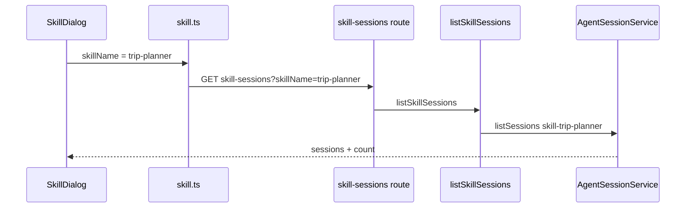

# E37：Skill 历史会话使用 `skill-${name}` 作为项目范围

小林用毕业旅行 Skill 规划了第一版行程，第二天再打开时，希望能看到历史会话。这个能力不是靠浏览器本地缓存实现的，而是通过会话系统按项目范围列出历史。对于 Skill，会话项目范围采用 `skill-${skillName}`。

本节阅读 [packages/web/src/components/skills/SkillDialog.tsx](../../../../packages/web/src/components/skills/SkillDialog.tsx)、[packages/web/src/app/api/skill-sessions/route.ts](../../../../packages/web/src/app/api/skill-sessions/route.ts) 和 [packages/core/src/lib/features/skills/service.ts](../../../../packages/core/src/lib/features/skills/service.ts)。

## 1. SkillDialog 加载当前 Skill 的历史

[packages/web/src/components/skills/SkillDialog.tsx 第 331—355 行](../../../../packages/web/src/components/skills/SkillDialog.tsx#L331) 的 `loadSessionHistory`：

```ts
const loadSessionHistory = useCallback(async () => {
  if (!currentSkill) return;
  setIsLoadingHistory(true);
  try {
    const data = await listAvailableSkillSessions({ skillName: currentSkill });
    if (data.success && data.data?.sessions) {
      setSessionHistory(data.data.sessions.map((s) => ({
        sessionId: s.sessionId,
        createdAt: s.createdAt,
        updatedAt: s.updatedAt,
        messageCount: s.messageCount,
        summary: s.summary,
      })));
    }
  } finally {
    setIsLoadingHistory(false);
  }
}, [currentSkill]);
```

这里的关键输入仍然是 `currentSkill`。UI 不直接知道会话文件在哪里，也不自己拼磁盘路径；它只把 skill 名称交给 service。

## 2. Web 和 Electron 仍然共用适配函数

[packages/core/src/lib/integrations/electron/services/skill.ts 第 193—207 行](../../../../packages/core/src/lib/integrations/electron/services/skill.ts#L193) 的 `listAvailableSkillSessions`：

```ts
export async function listAvailableSkillSessions(
  request: SkillSessionsRequest
): Promise<IpcResponse<SkillSessionsResponse>> {
  if (isElectron()) {
    return getIpcRenderer().invoke<IpcResponse<SkillSessionsResponse>>(
      IPC_CHANNELS.SKILL_SESSION_LIST,
      request
    );
  }

  const response = await fetch(`/api/skill-sessions${toQueryString({
    skillName: request.skillName,
  })}`);
  return readJsonResponse<IpcResponse<SkillSessionsResponse>>(response);
}
```

和技能列表一样，这里也把 Web fetch 与 Electron IPC 包成同一个函数。对 SkillDialog 来说，获取历史会话不需要关心运行环境。

## 3. API route 只把 query 转成 service 请求

[packages/web/src/app/api/skill-sessions/route.ts 第 12—22 行](../../../../packages/web/src/app/api/skill-sessions/route.ts#L12)：

```ts
const searchParams = request.nextUrl.searchParams;
const skillName = searchParams.get('skillName');

const data = await listSkillSessions({ skillName: skillName ?? undefined });
```

如果缺少 `skillName`，错误不会在 API route 里自己拼出来，而是交给 core service 抛 `SkillServiceError`。这仍然符合 app route 只做边界映射的原则。

## 4. Core service 把 skillName 变成项目范围

[packages/core/src/lib/features/skills/service.ts 第 542—559 行](../../../../packages/core/src/lib/features/skills/service.ts#L542)：

```ts
export async function listSkillSessions(
  request: SkillSessionsRequest
): Promise<SkillSessionsResponse> {
  if (!request.skillName) {
    throw new SkillServiceError(
      'INVALID_REQUEST',
      'skillName is required',
      400
    );
  }

  const sessions = await agentSessionService.listSessions(`skill-${request.skillName}`);

  return {
    sessions,
    count: sessions.length,
  };
}
```

这就是本节最重要的源码。Skill 历史会话不是按 `skillName` 直接查，而是按 `projectId = skill-${skillName}` 查。这与 E24-E29 的恢复归属规则对齐：Skill 的会话范围就是 `skill-${entryId}`。



图中的 `skill-trip-planner` 不是随意命名，而是 Skill 会话隔离边界。旅行 Skill 的历史不会和预算 Skill 的历史混在一起。

读这张图时要注意两层转换。第一层转换发生在 UI 到适配层：`SkillDialog` 只知道当前选择的是 `trip-planner`，它不关心磁盘上的 sessions 目录，也不直接操作 `AgentSessionService`。第二层转换发生在 core service：`listSkillSessions` 把业务名 `trip-planner` 转成会话系统能识别的项目范围 `skill-trip-planner`。如果读者只记住“传了 skillName”，就会漏掉真正决定隔离性的那一步；如果只记住“查 sessions”，又会误以为所有 Skill 历史都在同一个池子里。

所以，排查历史列表问题时不要跳步。应先确认 `currentSkill` 是否正确，再确认请求是否带上 `skillName`，最后确认 service 查询的是不是同一个 `skill-${skillName}` 范围。小林打开毕业旅行 Skill 后看不到昨天的记录，最常见的源码级原因不是“历史功能坏了”，而是保存和查询使用了不同的范围字符串。

## 5. 选择历史会话会带上入口身份恢复

历史列表只是展示。真正选择某条会话时，[packages/web/src/components/skills/SkillDialog.tsx 第 374—409 行](../../../../packages/web/src/components/skills/SkillDialog.tsx#L374) 会调用恢复：

```ts
const restored = await restoreSession({
  sessionId: selectedSessionId,
  projectId: `skill-${currentSkill}`,
  entryType: 'skill',
  entryId: currentSkill,
});
```

这与 `listSkillSessions` 的项目范围完全一致。列表使用 `skill-${currentSkill}` 找历史；恢复也使用 `skill-${currentSkill}` 校验归属。这样才能避免小林从旅行 Skill 的下拉历史里恢复到另一个 Skill 的会话。

## 6. 错误边界

| 错误 | 表现 | 根因 |
| --- | --- | --- |
| `skillName` 为空 | API 返回 400 | service 要求必须有 skillName |
| 列表为空但文件存在 | 项目范围不一致 | 会话可能保存在别的 projectId 下 |
| 历史能列出但恢复失败 | entryType 或 entryId 不匹配 | 恢复比列表校验更严格 |
| 切换会话后又初始化覆盖 | 恢复状态没有阻止 init effect | SkillDialog 用 `restoredSessionIdRef` 防止重复初始化 |

最后一行连接到 E28 的竞态思想：恢复历史不是只 `setActiveSessionId`，还要阻止过期初始化覆盖当前状态。

## 7. 测试证据与缺口

E21-E30 已讲过恢复归属的测试。对于 Skill 历史列表，本节源码能证明 service 使用 `skill-${skillName}` 调用 `agentSessionService.listSessions`。但还缺少端到端测试证明 UI 展示、点击恢复、恢复成功后三者完全闭环。

补测应覆盖：

| Given | When | Then |
| --- | --- | --- |
| `skill-trip-planner` 下有两个会话 | 打开 trip-planner 历史 | 返回两个会话 |
| 缺少 skillName | 请求 skill-sessions | 返回 400 |
| 从 trip-planner 恢复 budget 会话 | 调用 restoreSession | 归属校验失败 |

## 8. 小实验 / 练习与口头验收

纸面推演：如果创建会话时使用 `projectId: 'trip-planner'`，但历史列表用 `listSessions('skill-trip-planner')`，会发生什么？合格答案是：历史列表可能读不到这份会话，因为保存范围和查询范围不一致。

口头验收：读者应能解释为什么 Skill 会话范围是 `skill-${name}`，而不是直接用 `name`。合格答案必须联系恢复归属：Skill 的 `expectedProjectId` 也是 `skill-${entryId}`。

## 9. 本节小结

Skill 历史会话按 `skill-${skillName}` 作为项目范围保存和读取。列表、恢复和会话初始化都必须使用同一套范围规则。只要 `skillName`、`projectId`、`entryId` 三者不一致，就会出现历史丢失、恢复失败或跨入口串台风险。
