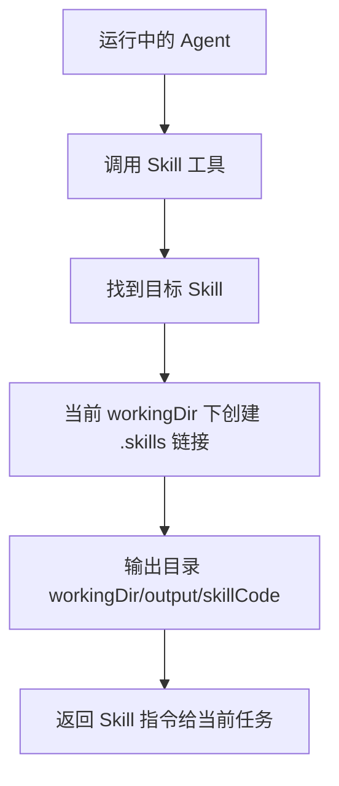

# E38：Skill 工具是在运行中的 Agent 里加载另一个 Skill

前面几节讲的是小林从首页打开一个 Skill 会话。现在看另一条路径：一个已经运行中的 Agent 也可以通过 Skill 工具加载某个 Skill 的说明。这不是打开 SkillDialog，也不是创建首页窗口，而是在当前 Agent 的工作目录里建立 Skill 引用，并把 Skill 指令返回给运行时使用。

本节阅读 [packages/core/src/lib/integrations/pi-agent/tools/skill-tools.ts](../../../../packages/core/src/lib/integrations/pi-agent/tools/skill-tools.ts)。

## 1. Skill 工具的语义不同于 SkillDialog

SkillDialog 的主线是：用户打开某个 Skill，系统为这个 Skill 创建一个会话。Skill 工具的主线是：一个 Agent 在执行任务时，需要借用另一个 Skill 的说明，于是调用工具把该 Skill 加载进当前上下文。

| 路径 | 谁触发 | 结果 |
| --- | --- | --- |
| SkillDialog | 用户点击入口 | 创建或恢复 `agentType: 'skill'` 会话 |
| Skill tool | Agent 运行中调用工具 | 在当前工作目录建立 `.skills/{skillCode}` 引用并返回 Skill 指令 |

这个区别决定了 E38 不能用来解释首页 Skill 会话，也不能用 E31-E37 替代工具调用路径。

## 2. 工具会先解析目标 Skill

源码较长，不能只看软链接部分。先看 [packages/core/src/lib/integrations/pi-agent/tools/skill-tools.ts 第 181—207 行](../../../../packages/core/src/lib/integrations/pi-agent/tools/skill-tools.ts#L181) 如何查找目标 Skill：

```ts
const skillUserSkillsDir = path.resolve(getDataRoot(), "skills");
const result = loadSkills({
  cwd: getDataRoot(),
  includeDefaults: false,
  skillPaths: existsSync(skillUserSkillsDir) ? [skillUserSkillsDir] : [],
});
const { skills } = result;

const targetSkill = skills.find(
  s => !s.systemManaged && (s.name === skillNameOrCode || s.code === skillNameOrCode)
);

if (!targetSkill) {
  const availableSkills = skills.map(s => s.name).join(", ");
  return {
    content: [{ type: "text", text: JSON.stringify({
      success: false,
      error: `Skill "${skillNameOrCode}" not found. Available skills: ${availableSkills}`,
    }) }],
  };
}
```

这段代码有一个与 E32 不同的边界：Skill 工具只从 `data/skills` 加载用户安装的技能，`includeDefaults: false`，并且过滤 `!s.systemManaged`。因此它不等于“列出所有系统内置 Skill”。如果小林在一个 Agent 里调用 `Skill` 工具想加载系统内置旅行 Skill，而这个 Skill 没有 materialize 到用户技能目录，工具可能找不到。

[packages/core/src/lib/integrations/pi-agent/tools/skill-tools.ts 第 209—224 行](../../../../packages/core/src/lib/integrations/pi-agent/tools/skill-tools.ts#L209) 随后确认 Skill 文件存在并读取内容：

```ts
const skillFilePath = targetSkill.filePath;
if (!existsSync(skillFilePath)) {
  return {
    content: [{ type: "text", text: JSON.stringify({
      success: false,
      error: `Skill file not found: ${skillFilePath}`,
    }) }],
  };
}

let skillContent = readFileSync(skillFilePath, "utf-8");
```

这说明“Skill 对象存在”和“Skill 文件还能读取”也是两道门。路径损坏、软链接断开或文件被删，都可能让工具在这里返回失败。

接着看 [packages/core/src/lib/integrations/pi-agent/tools/skill-tools.ts 第 225—236 行](../../../../packages/core/src/lib/integrations/pi-agent/tools/skill-tools.ts#L225) 的当前工作目录与软链接路径：

```ts
const originalBaseDir = targetSkill.baseDir;

const toolContext = getToolContext();
const workingDir = toolContext.workingDirectory || getDataRoot();

const skillCode = targetSkill.code || targetSkill.name;

const skillsDir = path.join(workingDir, ".skills");
const skillLinkPath = path.join(skillsDir, skillCode);
const resolvedBaseDir = existsSync(skillLinkPath) ? skillLinkPath : originalBaseDir;
```

这里的 `workingDir` 来自当前工具上下文，不一定是 Skill 的源目录。工具要在当前 Agent 工作目录下建立 `.skills/{skillCode}`，让这个 Skill 成为当前 Agent 可见的本地引用。

## 3. 软链接是持久化引用，不是复制产物

[packages/core/src/lib/integrations/pi-agent/tools/skill-tools.ts 第 238—250 行](../../../../packages/core/src/lib/integrations/pi-agent/tools/skill-tools.ts#L238) 会创建 `.skills` 目录和软链接：

```ts
try {
  if (!existsSync(skillsDir)) {
    mkdirSync(skillsDir, { recursive: true });
  }
  if (!existsSync(skillLinkPath)) {
    symlinkSync(originalBaseDir, skillLinkPath, "dir");
  }
} catch (error) {
  console.warn(`[Tool:Skill] Failed to create skill symlink:`, error);
}
```

这段代码说明，Skill 工具不会把目标 Skill 的所有内容复制到当前 Agent 目录，而是优先建立软链接。软链接失败也不会让工具直接失败，代码注释说明“软链接创建失败不影响技能执行，继续”。因此软链接是可持久化的便利引用，不是执行的唯一条件。

## 4. 输出目录在当前工作目录下

[packages/core/src/lib/integrations/pi-agent/tools/skill-tools.ts 第 252—258 行](../../../../packages/core/src/lib/integrations/pi-agent/tools/skill-tools.ts#L252) 构建输出目录：

```ts
const outputDir = path.join(workingDir, "output", skillCode);

const lines: string[] = [];
```

这与 SkillDialog 的 `outputDir` 不完全一样。SkillDialog 的输出目录来自 Skill 内容接口和 frontmatter；Skill 工具路径则把输出目录放在当前 Agent 工作目录的 `output/{skillCode}` 下。原因是工具调用发生在“某个 Agent 的任务内部”，产物应该跟随调用方工作空间，而不是固定写回目标 Skill 源目录。



图里的“当前 workingDir”是理解本节的关键。Skill 工具不是离开当前 Agent 另开一个 Skill 会话，而是在当前 Agent 的目录边界里借用一个 Skill。

## 5. 失败边界

| 情况 | 结果 | 教学含义 |
| --- | --- | --- |
| 找不到目标 Skill | 返回失败 JSON，并列出 available skills | 不是模型能力问题，是 Skill 解析问题 |
| Skill 对象存在但文件丢失 | 返回 `Skill file not found` | 注册信息和磁盘文件状态不一致 |
| 软链接创建失败 | 继续执行 | 软链接是便利引用，不是唯一执行条件 |
| 当前 workingDir 缺失 | 回退 `getDataRoot()` | 工具上下文不完整时仍有默认根 |
| 输出目录未创建或不可写 | 后续写产物可能失败 | 工具加载成功不等于产物写入成功 |

这里再次体现“测试结论要克制”：工具成功加载 Skill，不等于所有文件操作成功。

## 6. 与 SkillDialog 的边界对照

| 维度 | SkillDialog | Skill 工具 |
| --- | --- | --- |
| 会话身份 | `agentType: 'skill'` | 保持调用方 Agent 会话 |
| 工作目录 | 内容接口返回的 workingDir | 工具上下文 workingDir |
| 输出目录 | 内容接口或 frontmatter 解析 | `workingDir/output/{skillCode}` |
| 用户体验 | 打开一个 Skill 窗口 | Agent 内部按需加载能力 |
| 历史会话 | 按 `skill-${name}` 保存 | 跟随调用方会话 |

小林如果直接打开旅行 Skill，历史会保存在旅行 Skill 的项目范围；如果某个“项目助理 Agent”在内部调用旅行规划 Skill，历史仍属于项目助理 Agent 的会话。这是两条不同语义。

## 7. 测试证据与缺口

当前已有测试主要覆盖 core skill 加载、outputDir、launcher。`skill-tools.ts` 的软链接、输出目录和工具上下文行为需要更直接的单元测试。因此现有证据只能支持源码设计与已覆盖分支，不能证明工具路径完全可靠。

建议测试：

| Given | When | Then |
| --- | --- | --- |
| 当前 workingDir 存在，目标 Skill 存在 | 调用 Skill 工具 | 创建 `.skills/{skillCode}` 或在失败时继续返回指令 |
| 软链接创建失败 | 调用 Skill 工具 | 不应中断 Skill 内容返回 |
| 当前 workingDir 是项目目录 | 调用 Skill 工具 | outputDir 应落在项目目录的 `output/{skillCode}` |

## 8. 小实验 / 练习与口头验收

纸面推演：项目助理 Agent 的 workingDir 是 `/data/projects/p1`，它调用 `trip-planner` Skill。输出目录应在哪里？合格答案是 `/data/projects/p1/output/trip-planner`，而不是 `trip-planner` 的源目录，也不是首页 SkillDialog 的 `data/skills/trip-planner`。

口头验收：读者应能解释 SkillDialog 和 Skill 工具的最大区别：前者创建 Skill 会话，后者在已有 Agent 会话中加载另一个 Skill 的说明。

## 9. 本节小结

Skill 工具不是 SkillDialog 的内部实现。它服务于运行中的 Agent，让 Agent 在当前工作目录下引用另一个 Skill，并把输出目录放到调用方工作空间。理解这条路径，才能避免把“打开 Skill”与“Agent 内部调用 Skill”混为一谈。
