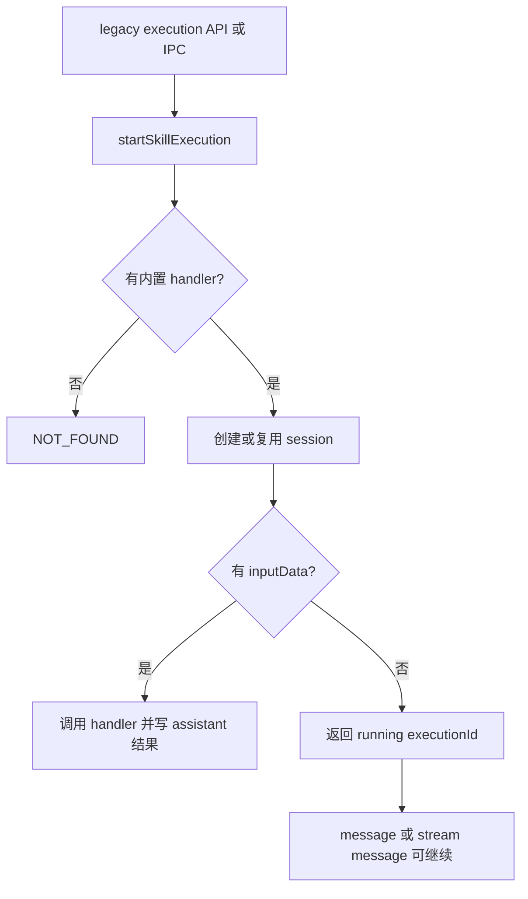

# E39：legacy execution API 是另一条 Skill 路径

源码里还有 `/api/skills/executions`、`message`、`timeline`、`complete` 等接口。初学者看到这些文件，很容易以为 SkillDialog 就是通过这些 execution API 完成对话。实际不是。SkillDialog 主线走 `usePiAgent` 会话；legacy execution API 是另一条路径，主要围绕内置 handler、executionId、timeline 和 execution message。

本节阅读 [packages/core/src/lib/features/skills/service.ts](../../../../packages/core/src/lib/features/skills/service.ts) 的 execution 部分、Web execution API routes，以及 [packages/desktop/src/main/services/skill-service.ts](../../../../packages/desktop/src/main/services/skill-service.ts) 的 IPC 映射。

## 1. Web execution route 只是进入 legacy service 的边界

[packages/web/src/app/api/skills/executions/route.ts 第 17—29 行](../../../../packages/web/src/app/api/skills/executions/route.ts#L17) 处理 start 请求：

```ts
export async function POST(request: NextRequest) {
  const body = (await request.json()) as SkillExecutionStartRequest;
  const result = await startSkillExecution(body);

  return NextResponse.json(
    {
      success: true,
      data: result.data,
      timestamp: new Date().toISOString(),
    },
    { status: result.status },
  );
}
```

这段 route 没有自己执行 Skill，也没有读取 `SKILL.md`。它只把 body 转成 `SkillExecutionStartRequest`，交给 core service 的 `startSkillExecution`。错误分支则把 `SkillServiceError.status` 映射为 HTTP 状态。这符合 API route 的边界：请求解析和响应映射在 app 层，业务逻辑在 core 层。

## 2. legacy start 会先找内置 handler

[packages/core/src/lib/features/skills/service.ts 第 561—577 行](../../../../packages/core/src/lib/features/skills/service.ts#L561) 的 `startSkillExecution`：

```ts
const skillName = request.skillName;
if (!skillName) {
  throw new SkillServiceError('INVALID_REQUEST', 'skillName is required', 400);
}

const skill = findSkill(skillName);
if (!skill) {
  throw new SkillServiceError('NOT_FOUND', `Skill "${skillName}" not found`, 404);
}

const loadedSkill = loadSkillHandler(skillName);
if (!loadedSkill) {
  throw new SkillServiceError('NOT_FOUND', `Skill "${skillName}" not found`, 404);
}
```

这里的关键是 `loadSkillHandler(skillName)`。它只认识少数内置 handler，例如 task-manager、info-query、ontology-editor。也就是说，并不是每个 `SKILL.md` 都能通过 legacy start 直接执行 handler。

## 3. 没有 session 时会创建 execution session

[packages/core/src/lib/features/skills/service.ts 第 579—600 行](../../../../packages/core/src/lib/features/skills/service.ts#L579)：

```ts
const inputData = resolveExecutionInput(request);
let sessionId = request.sessionId;

if (sessionId) {
  const existing = await agentSessionService.getSession(sessionId);
  if (!existing) {
    throw new SkillServiceError('INVALID_REQUEST', `Session "${sessionId}" not found`, 404);
  }
} else {
  const workingDirectory = resolveSkillWorkingDirectory(skill);
  const outputDirectory = resolveSkillOutputDir(skill);
  const newSession = await agentSessionService.createSession({
    projectId: `skill-${skillName}`,
    projectName: `Skill: ${loadedSkill.displayName || skillName}`,
    systemPrompt: `You are executing skill: ${loadedSkill.displayName || skillName}`,
    agentType: 'skill',
    projectContext: {
      currentPath: workingDirectory,
      outputDir: outputDirectory,
    },
  });
  sessionId = newSession.sessionId;
}
```

这段代码确实创建了 `agentType: 'skill'` 的 session，但它和 SkillDialog 创建会话的 prompt 不同。SkillDialog 会把完整 `SKILL.md` 正文、目录边界和运行规则拼入系统提示词；legacy start 这里的 `systemPrompt` 只是 `You are executing skill: ...`。

## 4. 有 inputData 时直接调用 handler

[packages/core/src/lib/features/skills/service.ts 第 633—670 行](../../../../packages/core/src/lib/features/skills/service.ts#L633)：

```ts
await agentSessionService.addMessage(sessionId, {
  role: 'system',
  content: `[Skill] Starting skill: ${skillName}`,
  metadata: {
    skillName,
    executionId,
    args: inputData,
  },
});

if (inputData) {
  const result = await loadedSkill.handler(skillContext);
  await agentSessionService.addMessage(sessionId, {
    role: 'assistant',
    content: result.message || (result.data ? JSON.stringify(result.data) : 'Skill executed successfully'),
    metadata: {
      skillName,
      executionId,
      success: result.success,
      complete: result.complete ?? true,
    },
  });
}
```

这更像一次“技能执行记录”：先写 system 起始消息，再调用 handler，再写 assistant 结果。它不是小林在 SkillDialog 里连续多轮和 Agent 对话的主路径。

## 5. execution message route 支持普通 JSON 和 SSE

[packages/web/src/app/api/skills/executions/[executionId]/message/route.ts 第 15—42 行](<../../../../packages/web/src/app/api/skills/executions/[executionId]/message/route.ts#L15>) 先读取 path 中的 `executionId` 和 body，然后检查 `Accept` 头：

```ts
const { executionId } = await params;
const body = await request.json();
const acceptHeader = request.headers.get('accept') || '';
const wantsStreaming = acceptHeader.includes('text/event-stream');

if (!wantsStreaming) {
  const result = await sendSkillExecutionMessage({
    executionId,
    sessionId: body.sessionId,
    content: body.content,
    role: body.role,
    metadata: body.metadata,
  });

  return NextResponse.json({ success: true, data: result.data }, { status: result.status });
}
```

如果请求不要求 SSE，它走 `sendSkillExecutionMessage`，返回一次 JSON 响应。若 `Accept` 包含 `text/event-stream`，[packages/web/src/app/api/skills/executions/[executionId]/message/route.ts 第 45—82 行](<../../../../packages/web/src/app/api/skills/executions/[executionId]/message/route.ts#L45>) 会创建 `ReadableStream`，调用 `streamSkillExecutionMessage`，并把事件写成 `data: ...\n\n`：

```ts
const stream = new ReadableStream<Uint8Array>({
  async start(controller) {
    await streamSkillExecutionMessage(
      { executionId, sessionId: body.sessionId, content: body.content },
      (event) => {
        controller.enqueue(encoder.encode(`data: ${JSON.stringify(event)}\n\n`));
      },
    );
    controller.close();
  },
});
```

这说明 legacy execution 自己也有流式分支，但它和 E13-E19 讲过的 Pi Agent 主会话流不是同一个 API。相同的是 SSE 帧形式；不同的是事件类型、请求路径和上层状态管理。

## 6. execution message 又会走 AgentManager

[packages/core/src/lib/features/skills/service.ts 第 771—810 行](../../../../packages/core/src/lib/features/skills/service.ts#L771) 的 `sendSkillExecutionMessage` 会把用户消息写入 session，然后调用 `agentManager.getOrCreateAgent`：

```ts
const updatedSession = await agentSessionService.addMessage(request.sessionId, {
  role: request.role || 'user',
  content: request.content,
  metadata: {
    ...request.metadata,
    executionId: request.executionId,
  },
});

const skillName = getMessageSkillName(session);
const agent = await agentManager.getOrCreateAgent(
  request.sessionId,
  session.projectContext.projectId,
  {
    systemPrompt: `You are executing skill: ${skillName}\n\nProcess user input and respond appropriately for the skill context.`,
    agentType: 'skill',
    agentBaseDir: session.projectContext.currentPath,
    outputDir: session.projectContext.outputDir,
  },
);
```

这条路径虽然也用 AgentManager，但 prompt 仍然是 legacy execution prompt，不是 SkillDialog 的完整 Skill prompt。两条路径的提示词合同不能合并理解。

## 7. timeline 和 complete route 读取 execution 进度

[packages/web/src/app/api/skills/executions/[executionId]/timeline/route.ts 第 16—35 行](<../../../../packages/web/src/app/api/skills/executions/[executionId]/timeline/route.ts#L16>) 从 query 读取 `sessionId`，再调用 `getSkillExecutionTimeline`：

```ts
const { executionId } = await params;
const { searchParams } = new URL(request.url);
const data = await getSkillExecutionTimeline({
  executionId,
  sessionId: searchParams.get('sessionId') ?? undefined,
});
```

这里的 `executionId` 来自 URL path，`sessionId` 来自 query。service 内部会根据 session messages 组装 timeline。换句话说，timeline 不是一个独立数据库表，而是从会话消息中推导出来的执行视图。

[packages/web/src/app/api/skills/executions/[executionId]/complete/route.ts 第 17—35 行](<../../../../packages/web/src/app/api/skills/executions/[executionId]/complete/route.ts#L17>) 则把 path 中的 `executionId` 合并进 body：

```ts
const { executionId } = await params;
const body = (await request.json()) as Omit<SkillExecutionCompleteRequest, 'executionId'>;
const data = await completeSkillExecution({
  ...body,
  executionId,
});
```

这说明 complete 的身份来自 path，补充状态来自 body。若 body 没有 `sessionId`，core service 会抛 `INVALID_REQUEST`。因此 complete 不是“只凭 executionId 结束”，仍依赖 session 范围。

## 8. 桌面 IPC 只是把 execution 暴露给 Electron

[packages/desktop/src/main/services/skill-service.ts 第 105—183 行](../../../../packages/desktop/src/main/services/skill-service.ts#L105) 注册了 execution start、complete、message、stream message 等 IPC handler：

```ts
ipcMain.handle(
  IPC_CHANNELS.SKILL_EXECUTION_START,
  async (_event, request) => {
    const result = await startSkillExecution(request);
    return {
      success: true,
      data: result.data,
      timestamp: new Date().toISOString(),
    };
  }
);
```

这说明 Electron 只是把 core service 暴露给桌面渲染进程。它没有改变 execution 的业务语义。



这张图和 SkillDialog 主线不同。SkillDialog 是“打开一个会话窗口”；legacy execution 是“围绕 executionId 的执行流程”。

## 9. 错误边界

| 情况 | 返回或风险 | 说明 |
| --- | --- | --- |
| `skillName` 缺失 | `INVALID_REQUEST` | execution 必须知道目标 Skill |
| 找不到 Skill 文件 | `NOT_FOUND` | 加载器没有找到 |
| 找到 Skill 但没有内置 handler | `NOT_FOUND` | legacy start 不支持所有 Skill |
| 有 sessionId 但 getSession 失败 | `INVALID_REQUEST` | 不能向不存在 session 写 execution |
| message route 没有 SSE Accept | 返回 JSON | 不是所有 execution message 都流式 |
| timeline 缺少 sessionId | service 抛 `INVALID_REQUEST` | timeline 需要会话消息作为来源 |
| complete 缺少 sessionId | service 抛 `INVALID_REQUEST` | 结束状态也要写回会话 |
| prompt 过短 | 能运行但能力弱 | 不是完整 SkillDialog prompt |

最后一行不是运行错误，而是语义差异。它提醒读者：不能用 execution API 的表现推断 SkillDialog 的 prompt 行为。

## 10. 测试证据与缺口

已有测试对 Skill 加载、目录、launcher 覆盖较多；legacy execution 的 handler start、message、timeline、stream message 需要更直接的测试才能证明端到端行为。现有证据只能说明源码中的边界和分支，不能把 legacy execution 扩大解释为所有 Skill 的主线能力。

建议测试：

| Given | When | Then |
| --- | --- | --- |
| 普通 `SKILL.md` 没有内置 handler | 调用 `startSkillExecution` | 返回 `NOT_FOUND` |
| task-manager 有 inputData | 调用 start | 写入 system 起始消息和 assistant 结果 |
| execution message 发送给已有 session | 调用 message | 使用 session 的 currentPath 和 outputDir 创建 Agent |
| message route 的 Accept 是 `text/event-stream` | 调用 message route | 返回 SSE stream 而不是 JSON |
| timeline 带 sessionId | 调用 timeline route | 从 session messages 生成 timeline |
| complete 缺少 sessionId | 调用 complete route | 返回 `INVALID_REQUEST` |

## 11. 小实验 / 练习与口头验收

纸面推演：一个新的 `trip-planner/SKILL.md` 能在 SkillDialog 打开，但没有在 `loadSkillHandler` 中注册 handler。它能通过 `startSkillExecution` 直接 handler 执行吗？合格答案是：不能。SkillDialog 读取 `SKILL.md` 作为会话提示词；legacy start 要求 `loadSkillHandler` 找到内置 handler。

口头验收：读者应能说出 legacy execution 与 SkillDialog 的四点区别：入口不同、prompt 构建不同、是否要求内置 handler 不同、message route 是否按 Accept 头分成 JSON 与 SSE 分支。

## 12. 本节小结

legacy execution API 是 Skill 相关源码的一部分，但不是 SkillDialog 主线。它围绕 executionId、内置 handler、execution message、SSE 分支、timeline 和 complete 运行。它应当作为一条独立兼容路径理解，不能被误当成所有 Skill 的执行机制。
