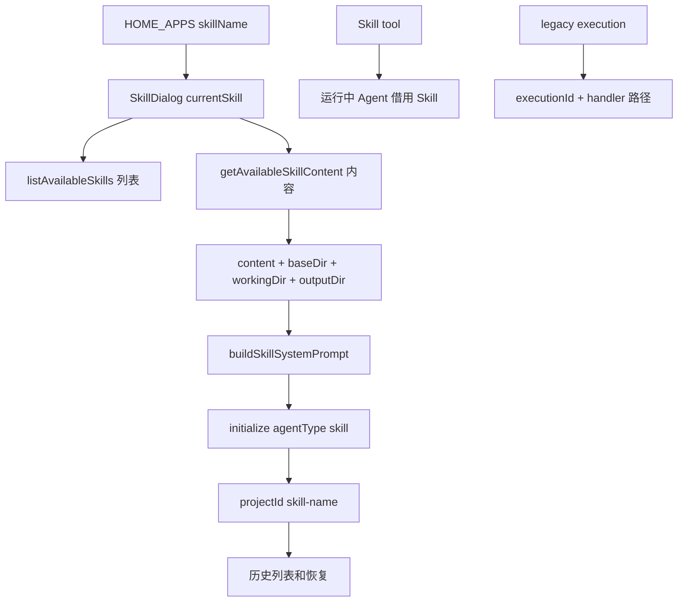

# E40：Skills 单元工作坊

本单元已经把 Skill 从首页入口、列表、`SKILL.md` 加载、Prompt 索引、内容接口、目录边界、会话初始化、历史会话、工具调用和 legacy execution 讲完。E40 不再引入大段新源码，而是把 E31-E39 的链路合在一起，让读者检查自己是否真的能从源码推导行为。

## 1. 一句话总图

小林打开毕业旅行 Skill 时，系统做的不是“执行一个按钮”，而是把一个 Skill 定义变成一个有会话、有目录、有提示词、有历史归属的 Pi Agent 运行时。



这张图有三条线：SkillDialog 主线、Skill tool 借用线、legacy execution 线。三条线都和 Skill 有关，但不能混成同一个机制。

## 2. 源码覆盖验收表

| 课程 | 必须能解释的源码 | 合格判断 |
| --- | --- | --- |
| E31 | [packages/web/src/config/homeApps.ts](../../../../packages/web/src/config/homeApps.ts)、[packages/web/src/app/page.tsx](../../../../packages/web/src/app/page.tsx)、[packages/web/src/services/AppWindowManager.ts](../../../../packages/web/src/services/AppWindowManager.ts)、[packages/web/src/components/skills/SkillDialog.tsx](../../../../packages/web/src/components/skills/SkillDialog.tsx) | 能说明卡片只是入口身份，并能追踪 `skillName` 如何进入 SkillDialog props 和窗口 metadata |
| E32 | [packages/core/src/lib/integrations/electron/services/skill.ts](../../../../packages/core/src/lib/integrations/electron/services/skill.ts)、[packages/web/src/app/api/skills/route.ts](../../../../packages/web/src/app/api/skills/route.ts)、[packages/core/src/lib/features/skills/service.ts](../../../../packages/core/src/lib/features/skills/service.ts) | 能说明列表经过 source、invisible 和 diagnostics 处理 |
| E33 | [packages/core/src/lib/integrations/pi-agent/core/skills.ts](../../../../packages/core/src/lib/integrations/pi-agent/core/skills.ts) | 能说明 `SKILL.md` 如何变成 `Skill` 对象 |
| E34 | [packages/core/src/lib/integrations/pi-agent/core/skills.ts 第 416 行](../../../../packages/core/src/lib/integrations/pi-agent/core/skills.ts#L416)、[packages/core/src/lib/integrations/pi-agent/core/skills.middleware.ts](../../../../packages/core/src/lib/integrations/pi-agent/core/skills.middleware.ts) | 能区分可用 Skill 索引和当前 Skill 正文 |
| E35 | [packages/core/src/lib/features/skills/service.ts 第 488 行](../../../../packages/core/src/lib/features/skills/service.ts#L488) | 能区分 `baseDir`、`workingDir`、`outputDir` |
| E36 | [packages/web/src/components/skills/SkillDialog.tsx 第 103 行](../../../../packages/web/src/components/skills/SkillDialog.tsx#L103)、[packages/web/src/components/skills/SkillDialog.tsx 第 470 行](../../../../packages/web/src/components/skills/SkillDialog.tsx#L470) | 能说明 Skill 正文怎样进入当前会话 |
| E37 | [packages/web/src/app/api/skill-sessions/route.ts](../../../../packages/web/src/app/api/skill-sessions/route.ts)、[packages/core/src/lib/features/skills/service.ts 第 542 行](../../../../packages/core/src/lib/features/skills/service.ts#L542) | 能说明 `skill-${name}` 为什么是历史范围 |
| E38 | [packages/core/src/lib/integrations/pi-agent/tools/skill-tools.ts](../../../../packages/core/src/lib/integrations/pi-agent/tools/skill-tools.ts) | 能说明运行中 Agent 调用 Skill 工具不等于打开 SkillDialog |
| E39 | [packages/core/src/lib/features/skills/service.ts 第 561 行](../../../../packages/core/src/lib/features/skills/service.ts#L561)、[packages/web/src/app/api/skills/executions/route.ts](../../../../packages/web/src/app/api/skills/executions/route.ts)、[packages/web/src/app/api/skills/executions/[executionId]/message/route.ts](<../../../../packages/web/src/app/api/skills/executions/[executionId]/message/route.ts>)、[packages/web/src/app/api/skills/executions/[executionId]/timeline/route.ts](<../../../../packages/web/src/app/api/skills/executions/[executionId]/timeline/route.ts>)、[packages/web/src/app/api/skills/executions/[executionId]/complete/route.ts](<../../../../packages/web/src/app/api/skills/executions/[executionId]/complete/route.ts>)、[packages/desktop/src/main/services/skill-service.ts](../../../../packages/desktop/src/main/services/skill-service.ts) | 能说明 legacy execution 是单独路径，并能区分 start、message、timeline、complete |

这张表不能只当目录清单使用。读者应能遮住右侧“合格判断”，只看左侧源码文件，就把行为推导出来。下面用四个最小源码窗口把主链重新串一次。

### 2.1 从首页入口到 SkillDialog

[packages/web/src/app/page.tsx 第 1194—1204 行](../../../../packages/web/src/app/page.tsx#L1194) 说明首页根据 `type: 'skill'` 和 `skillName` 调用 Skill 入口：

```tsx
if (app.type === 'skill' && isNonEmptyString(app.skillName)) {
  handleSkillLaunch(app.skillName, app.name);
  return;
}
```

这段代码只做一件事：确认卡片是 Skill 类型，然后把 `skillName` 交给 `handleSkillLaunch`。它没有读取 `SKILL.md`，也没有创建 Agent。读者如果在这里寻找“技能执行逻辑”，说明还没有把入口层和运行时层分开。

[packages/web/src/app/page.tsx 第 845—868 行](../../../../packages/web/src/app/page.tsx#L845) 则把入口身份放进窗口和 metadata：

```tsx
appWindowManager.openComponentWindow(SkillDialog, {
  skillName,
  initialMessage: defaultMessage,
}, {
  entryType: 'skill',
  entryId: skillName,
  projectId: `skill-${skillName}`,
});
```

这里开始出现三个后续会反复使用的字段：`skillName` 用于读取技能内容；`entryType` 和 `entryId` 用于恢复入口身份；`projectId` 用于会话归属。它们不是重复字段，而是分别服务于读取、恢复和隔离。

### 2.2 从 SKILL.md 到可运行内容

[packages/core/src/lib/features/skills/service.ts 第 488—513 行](../../../../packages/core/src/lib/features/skills/service.ts#L488) 是内容接口的核心：

```ts
export async function getSkillContent(
  request: SkillContentRequest
): Promise<SkillContentResponse> {
  const skills = await loadSkills();
  const skill = skills.find((s) => s.name === request.name || s.code === request.name);
  if (!skill) {
    throw new SkillServiceError('NOT_FOUND', `Skill not found: ${request.name}`, 404);
  }

  const { skill: materializedSkill, content, workingDir, outputDir } =
    await materializeSkillForContent(skill);

  return {
    name: materializedSkill.name,
    content,
    baseDir: materializedSkill.baseDir,
    workingDir,
    outputDir,
    systemManaged: materializedSkill.systemManaged,
  };
}
```

这一段把“文件定义”变成“运行材料”。对小林的毕业旅行 Skill 来说，前端需要的不只是正文 `content`，还包括源目录、工作目录和输出目录。缺少任何一个目录，后面构建系统提示词和上传路径都会变得不可靠。

### 2.3 从内容到当前会话的系统提示词

[packages/web/src/components/skills/SkillDialog.tsx 第 103—163 行](../../../../packages/web/src/components/skills/SkillDialog.tsx#L103) 的 `buildSkillSystemPrompt` 会把目录边界、Skill 正文和运行规则组合起来。核心形态可以简化为：

```tsx
const sections = [
  `技能源目录：${skillDir}`,
  `工作目录：${agentWorkDir}`,
  `产物输出目录：${resolvedOutputDir}`,
  stripFrontmatter(content),
  '运行时规则：所有产物写入输出目录',
];

return sections.join('\n\n');
```

这一步解释了为什么 Skill 不是“按钮功能”。按钮只提供入口；真正影响模型行为的是这里生成的系统提示词。模型之所以知道要按毕业旅行规划方式工作，是因为 `SKILL.md` 正文和目录规则进入了当前会话。

[packages/web/src/components/skills/SkillDialog.tsx 第 470 行附近](../../../../packages/web/src/components/skills/SkillDialog.tsx#L470) 随后把 prompt 传给初始化：

```tsx
await initialize({
  agentType: 'skill',
  projectId: `skill-${currentSkill}`,
  entryType: 'skill',
  entryId: currentSkill,
  systemPrompt,
});
```

这段代码把 E31、E35、E36、E37 连起来：同一个 `currentSkill` 既用于读取内容，也用于会话归属，还用于恢复入口身份。任何一个地方拼错，都会出现“能打开但历史不对”“能生成但目录不对”“能恢复但入口不对”等问题。

### 2.4 legacy execution 为什么不是主线

[packages/web/src/app/api/skills/executions/route.ts](../../../../packages/web/src/app/api/skills/executions/route.ts) 只是把请求转给 `startSkillExecution`：

```ts
const result = await startSkillExecution(body);
return NextResponse.json(result, { status: result.success ? 200 : result.error?.status ?? 500 });
```

而 [packages/core/src/lib/features/skills/service.ts 第 561 行](../../../../packages/core/src/lib/features/skills/service.ts#L561) 还会检查内置 handler：

```ts
const handler = loadSkillHandler(skill.name);
if (!handler) {
  throw new SkillServiceError('NOT_FOUND', `No execution handler found for skill: ${skill.name}`, 404);
}
```

这就是 E39 的边界：一个 Skill 能被 SkillDialog 打开，不代表它能走 legacy execution。前者依赖 `SKILL.md` 和 Pi Agent 会话；后者还要求服务端存在对应 handler。把这两条线混起来，会导致错误排查方向完全跑偏。

还有一类文件在本单元不作为主干精读，但必须明确去向：

| 文件 | 去向 | 说明 |
| --- | --- | --- |
| [packages/core/src/types/skill.ts](../../../../packages/core/src/types/skill.ts) | 背景类型 | 支撑通用 Skill 抽象，本单元只用到与会话链路相关的字段 |
| [packages/core/src/lib/features/services/skill-service.ts](../../../../packages/core/src/lib/features/services/skill-service.ts) | E32 背景补充 | 支撑缓存门面，不等同于内容接口主 service |
| [packages/web/src/components/skills/index.ts](../../../../packages/web/src/components/skills/index.ts)、[packages/core/src/lib/features/skills/index.ts](../../../../packages/core/src/lib/features/skills/index.ts) | 公共导出背景 | 不承载运行逻辑，只用于模块出口 |
| [packages/core/src/lib/features/skills/registry.ts](../../../../packages/core/src/lib/features/skills/registry.ts)、[packages/core/src/lib/features/skills/decision.ts](../../../../packages/core/src/lib/features/skills/decision.ts)、[packages/core/src/lib/features/skills/executor.ts](../../../../packages/core/src/lib/features/skills/executor.ts) | 后续功能型 Skill 路由/执行单元 | 不混入 SkillDialog 主线 |
| [packages/web/src/components/skills/SkillBrowser.tsx](../../../../packages/web/src/components/skills/SkillBrowser.tsx)、[packages/web/src/components/skills/SkillExecution.tsx](../../../../packages/web/src/components/skills/SkillExecution.tsx)、[packages/web/src/components/skills/skill-export-policy.ts](../../../../packages/web/src/components/skills/skill-export-policy.ts) | 后续 UI 与导出策略单元 | 本单元只讲 Skill 进入 Agent 会话 |
| [packages/web/src/app/api/user-skills/route.ts](../../../../packages/web/src/app/api/user-skills/route.ts) 与 [packages/web/src/app/api/user-skills/[id]/route.ts](<../../../../packages/web/src/app/api/user-skills/[id]/route.ts>) | 后续用户技能管理单元 | 属于技能管理 CRUD，不是会话运行时 |
| [packages/core/src/lib/integrations/pi-agent/skill-evolution.ts](../../../../packages/core/src/lib/integrations/pi-agent/skill-evolution.ts)、[packages/web/src/app/api/agent/skill-evolution/route.ts](../../../../packages/web/src/app/api/agent/skill-evolution/route.ts) | 后续技能演化单元 | 不属于本单元运行主链 |
| [packages/core/src/lib/integrations/pi-agent/project-agent/project-skill-provisioning.ts](../../../../packages/core/src/lib/integrations/pi-agent/project-agent/project-skill-provisioning.ts)、[packages/core/src/lib/integrations/pi-agent/role-agent/skill-resolver.ts](../../../../packages/core/src/lib/integrations/pi-agent/role-agent/skill-resolver.ts) | 后续 Part | Part E 不抢跑 RoleAgent、ProjectAgent |
| [packages/core/src/lib/features/skills/project-initialization/loader.ts](../../../../packages/core/src/lib/features/skills/project-initialization/loader.ts)、[packages/core/src/lib/features/skills/project-initialization/index.ts](../../../../packages/core/src/lib/features/skills/project-initialization/index.ts) | 后续项目初始化单元 | 项目访谈初始化不是本单元普通 Skill 会话主链 |
| 内置 Skill handlers 与测试 fixtures | 背景材料 | E39 只讲 legacy execution 要求 handler，不逐个讲内置 Skill 的业务逻辑 |

## 3. 三个常见误解

| 误解 | 正确理解 | 对应章节 |
| --- | --- | --- |
| Skill 就是首页按钮 | 首页按钮只是入口，Skill 能力来自 `SKILL.md` 和会话 prompt | E31、E36 |
| Skill 文件存在就一定可见 | 还要看 description、source、disable、diagnostics 和调用方过滤 | E32、E33 |
| 所有 Skill 都走 execution API | SkillDialog 主线走 Pi Agent 会话，legacy execution 只是一条旧式路径 | E36、E39 |

这些误解都来自把“入口、定义、运行时、执行接口”混成一个词。技术学习要把同一个词背后的对象拆开。

## 4. 纸面调试题

题目一：小林点击毕业旅行 Skill 后，窗口打开了，但显示空白技能说明。应该先查模型还是查内容接口？

合格答案：先查内容接口和 `getSkillContent`，确认 `skillName` 是否正确、`SKILL.md` 是否被找到、description 是否存在、systemManaged materialize 是否成功。模型还没开始回答，不能先怀疑模型。

题目二：Skill 能打开，但生成文件写到了模板目录。最可能是哪类边界没讲清？

合格答案：源目录和输出目录混淆。应检查 `baseDir`、`workingDir`、`outputDir`，尤其是 bundled Skill 是否把工作目录解析到 `data/skills/{code}`。

题目三：某个 Skill 在 SkillDialog 能打开，但 `startSkillExecution` 返回 `NOT_FOUND`。这是矛盾吗？

合格答案：不矛盾。SkillDialog 只需要能读取 `SKILL.md`；legacy execution start 还要求 `loadSkillHandler` 找到内置 handler。

## 5. Given/When/Then 验收

| Given | When | Then | 覆盖范围 |
| --- | --- | --- | --- |
| 首页卡片配置 `type: 'skill'` 和 `skillName` | 用户打开卡片 | SkillDialog 接收当前 Skill 名称 | 入口身份 |
| bundled Skill 有合法 `SKILL.md` | 请求技能内容 | 返回 content、baseDir、workingDir、outputDir | 内容和目录 |
| Skill 声明 `disable-model-invocation` | 格式化可用 Skill 索引 | 不进入 `<available_skills>` | Prompt 索引可见性 |
| Skill 会话已保存 | 请求 `skill-sessions?skillName=x` | 按 `skill-x` 列出历史 | 历史范围 |
| Agent 调用 Skill 工具 | 当前 workingDir 存在 | 在 `.skills` 下引用目标 Skill，输出目录跟随调用方 | 工具调用路径 |
| 普通 Skill 没有内置 handler | 调用 legacy start | 返回 `NOT_FOUND` | execution 边界 |

这些验收不是要求读者立即写测试，而是训练读者把行为拆成 Given、When、Then。只有能这样拆，才说明真正理解源码边界。

## 6. 测试证据与缺口

本单元引用的测试证据主要来自四类文件：

| 测试文件 | 能证明什么 | 不能证明什么 |
| --- | --- | --- |
| [packages/core/src/lib/integrations/pi-agent/__tests__/skills.test.ts](../../../../packages/core/src/lib/integrations/pi-agent/__tests__/skills.test.ts) | `SKILL.md` 加载、disabled Skill 过滤、Prompt 索引格式、部分路径解析 | 不能证明浏览器里点击首页卡片一定打开正确窗口 |
| [packages/core/src/lib/integrations/pi-agent/__tests__/skill-output-dir.test.ts](../../../../packages/core/src/lib/integrations/pi-agent/__tests__/skill-output-dir.test.ts) | bundled/project skill 的 `outputDir` 规则 | 不能证明每个真实 Skill 的 frontmatter 都声明正确 |
| [packages/core/src/lib/features/skills/__tests__/service.test.ts](../../../../packages/core/src/lib/features/skills/__tests__/service.test.ts) | 内容读取、materialize、service 层目录返回 | 不能证明 SkillDialog 组件交互完整 |
| [packages/core/src/lib/features/services/launcher/__tests__/skill-launcher.test.ts](../../../../packages/core/src/lib/features/services/launcher/__tests__/skill-launcher.test.ts) | launcher 路径下系统 prompt 包含 Skill 内容、输出目录替换等 | 不能等同于 SkillDialog 每个 effect 和恢复分支都被测过 |

因此，本单元的结论必须克制：源码阅读能证明设计链路；现有测试能证明部分 core 逻辑；但 UI 端到端、历史下拉点击恢复、legacy execution SSE 分支等还需要补更直接的测试。教学里如果把“有一些测试”说成“整条链路完全被测试覆盖”，就是不准确的。

为了让尚未被直接证明的链路具备自动化证据，至少还需要三组测试：

| 待补测试 | 建议覆盖点 |
| --- | --- |
| SkillDialog 组件测试 | 选中 Skill 后加载内容、构建 prompt、调用 initialize，并验证 `projectId = skill-${name}` |
| skill-sessions 端到端测试 | 已有历史能列出，点击历史能按 `entryType/entryId/projectId` 恢复 |
| legacy execution route 测试 | start/message/timeline/complete 四个 route 的成功、缺参、handler 缺失、SSE 分支 |

## 7. 用六个问题还原 Skill 的完整接入链

1. 首页卡片提供的是哪个 Skill 身份，真正的 `SKILL.md` 在哪里读取？
2. 多来源加载发生冲突时，哪个来源胜出，冲突如何进入 diagnostics？
3. 模型只拿到 Skill 索引时，怎样按 location 读取完整定义？
4. `baseDir`、`workingDir`、`outputDir` 分别控制哪一种读写行为？
5. SkillDialog 创建的会话为什么必须同时使用 `agentType: 'skill'` 与 `projectId: skill-${name}`？
6. Skill tool 和 legacy execution 为什么不能替代 SkillDialog 主线？

能回答这六个问题，并为每个答案指出生产源码和测试证据，才算真正掌握了 Skill 从定义文件到可恢复 Agent 会话的完整过程。

## 8. 本单元小结

Skills 单元的核心不是“怎样执行一个技能”，而是“一个 Skill 定义怎样被系统安全地接入 Agent 会话”。首页入口提供身份；加载器把 `SKILL.md` 变成 `Skill` 对象；内容接口返回正文和目录；SkillDialog 构建当前会话的系统提示词；历史会话按 `skill-${name}` 隔离；Skill tool 与 legacy execution 则是另外两条相关但不同的路径。
